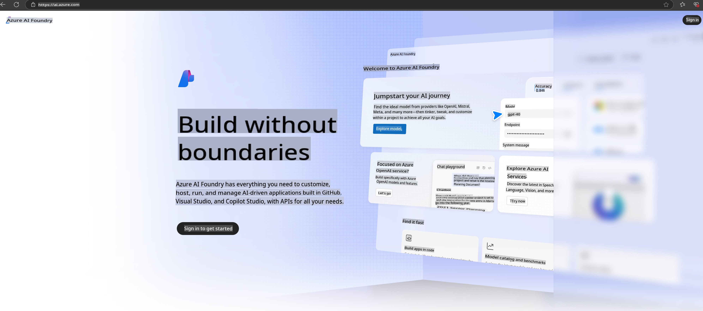

# **Using Phi-3 in Azure AI Foundry**

With the rise of Generative AI, we aim to leverage a unified platform to manage various LLMs and SLMs, integrate enterprise data, perform fine-tuning/RAG operations, and evaluate the impact of LLM and SLM integration on enterprise processes. This ensures a more effective implementation of generative AI applications. [Azure AI Foundry](https://ai.azure.com) serves as an enterprise-grade platform for generative AI applications.

Azure AI Foundry allows you to assess large language model (LLM) responses and orchestrate prompt-based application components using prompt flow to achieve better results. The platform is designed to scale proofs of concept into full production with ease, and its continuous monitoring and optimization features ensure long-term success.

Using a few simple steps, you can quickly deploy the Phi-3 model on Azure AI Foundry and then use the platform for Phi-3-related activities such as Playground/Chat, fine-tuning, evaluation, and more.

## **1. Preparation**

If you already have the [Azure Developer CLI](https://learn.microsoft.com/azure/developer/azure-developer-cli/overview?WT.mc_id=aiml-138114-kinfeylo) installed on your machine, setting up this template is as simple as running a command in a new directory.

## Manual Creation

Creating a Microsoft Azure AI Foundry project and hub is an excellent way to organize and manage your AI workflows. Follow this step-by-step guide to get started:

### Creating a Project in Azure AI Foundry

1. **Access Azure AI Foundry**: Log in to the Azure AI Foundry portal.
2. **Create a Project**:
   - If you're already in a project, click "Azure AI Foundry" at the top left to navigate to the Home page.
   - Click "+ Create project."
   - Enter a name for your project.
   - If you already have a hub, it will be selected by default. If you have access to multiple hubs, you can choose a different one from the dropdown menu. To create a new hub, click "Create new hub" and provide a name.
   - Click "Create."

### Creating a Hub in Azure AI Foundry

1. **Access Azure AI Foundry**: Log in with your Azure account.
2. **Create a Hub**:
   - Open the Management center from the left-hand menu.
   - Select "All resources," click the dropdown arrow next to "+ New project," and choose "+ New hub."
   - In the "Create a new hub" dialog, provide a name for your hub (e.g., contoso-hub) and adjust other fields as necessary.
   - Click "Next," review the details, and then click "Create."

For more detailed instructions, refer to the official [Microsoft documentation](https://learn.microsoft.com/azure/ai-studio/how-to/create-projects).

Once successfully created, you can access the studio you set up via [ai.azure.com](https://ai.azure.com/).

A single AI Foundry can host multiple projects. Make sure to create a project in AI Foundry as part of your preparation.

Refer to Azure AI Foundry [QuickStarts](https://learn.microsoft.com/azure/ai-studio/quickstarts/get-started-code) for additional guidance.

## **2. Deploy a Phi Model in Azure AI Foundry**

Click the Explore option within your project to access the Model Catalog, then select Phi-3.

Choose Phi-3-mini-4k-instruct.

Click 'Deploy' to deploy the Phi-3-mini-4k-instruct model.

> [!NOTE]
>
> You can configure the computing power during deployment.

## **3. Playground Chat with Phi in Azure AI Foundry**

Navigate to the deployment page, select Playground, and start chatting with Phi-3 in Azure AI Foundry.

## **4. Deploying the Model from Azure AI Foundry**

To deploy a model from the Azure Model Catalog, follow these steps:

- Log in to Azure AI Foundry.
- Select the model you wish to deploy from the Azure AI Foundry model catalog.
- On the model's Details page, click Deploy, then choose Serverless API with Azure AI Content Safety.
- Select the project where you want to deploy the model. To use the Serverless API feature, your workspace must be located in the East US 2 or Sweden Central region. You can customize the Deployment name.
- In the deployment wizard, review the Pricing and terms section to understand the associated costs and usage conditions.
- Click Deploy. Wait for the deployment to complete, after which you'll be redirected to the Deployments page.
- Click Open in playground to begin interacting with the model.
- To call the deployment and generate completions, return to the Deployments page, select the deployment, and note the endpoint's Target URL and Secret Key.
- You can always access the endpoint's details, URL, and access keys by navigating to the Build tab and selecting Deployments under the Components section.

> [!NOTE]
> Ensure your account has Azure AI Developer role permissions for the Resource Group to execute these steps.

## **5. Using the Phi API in Azure AI Foundry**

Access https://{Your project name}.region.inference.ml.azure.com/swagger.json through a GET request in Postman. Combine this with the Key to explore the available interfaces.

You can easily retrieve both the request parameters and the response parameters.

**Disclaimer**:  
This document has been translated using machine-based AI translation services. While we strive for accuracy, please note that automated translations may contain errors or inaccuracies. The original document in its native language should be regarded as the authoritative source. For critical information, professional human translation is recommended. We are not responsible for any misunderstandings or misinterpretations resulting from the use of this translation.