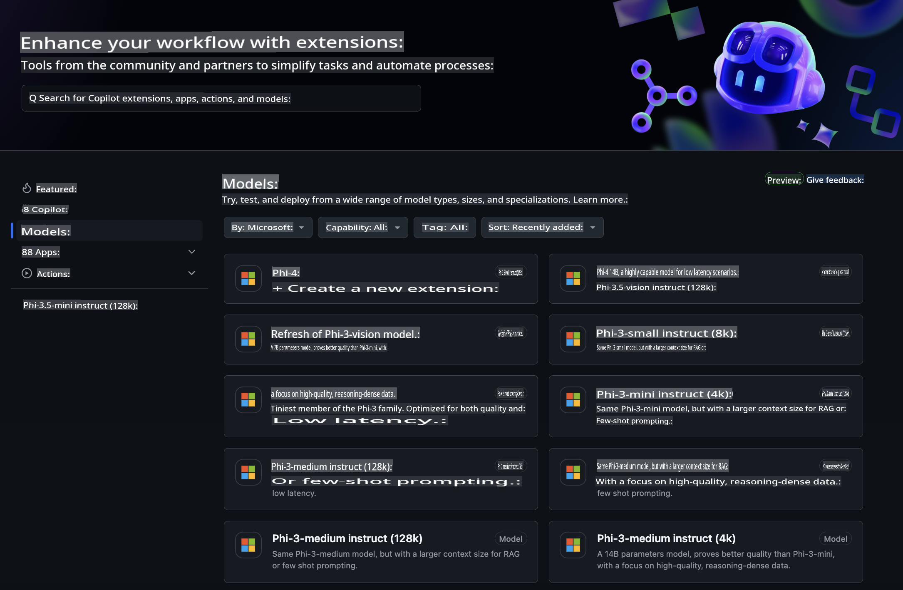
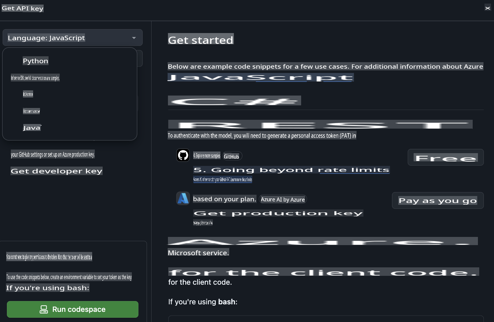
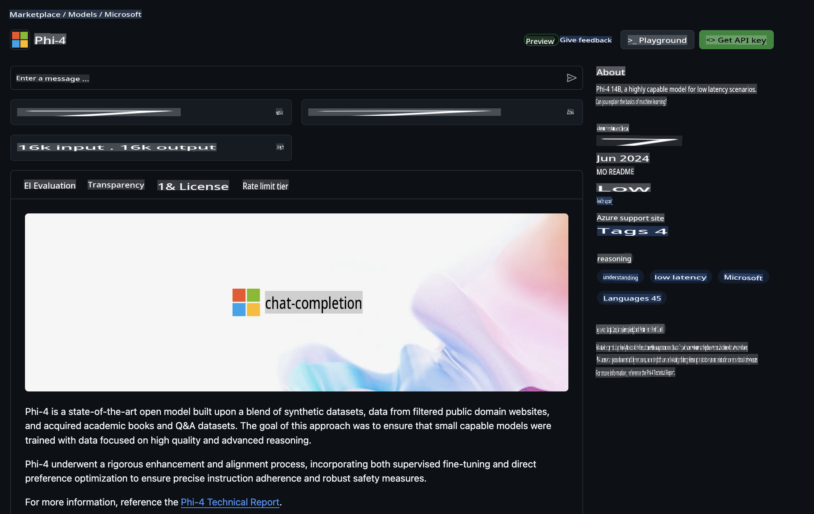

## GitHub Models - Limited Public Beta

Welcome to [GitHub Models](https://github.com/marketplace/models)! We’re excited for you to explore AI Models hosted on Azure AI.



For more details about the models available on GitHub Models, visit the [GitHub Model Marketplace](https://github.com/marketplace/models).

## Models Available

Each model comes with its own playground and sample code.


### Phi-3 Models in GitHub Model Catalog

[Phi-3-Medium-128k-Instruct](https://github.com/marketplace/models/azureml/Phi-3-medium-128k-instruct)

[Phi-3-medium-4k-instruct](https://github.com/marketplace/models/azureml/Phi-3-medium-4k-instruct)

[Phi-3-mini-128k-instruct](https://github.com/marketplace/models/azureml/Phi-3-mini-128k-instruct)

[Phi-3-mini-4k-instruct](https://github.com/marketplace/models/azureml/Phi-3-mini-4k-instruct)

[Phi-3-small-128k-instruct](https://github.com/marketplace/models/azureml/Phi-3-small-128k-instruct)

[Phi-3-small-8k-instruct](https://github.com/marketplace/models/azureml/Phi-3-small-8k-instruct)

## Getting Started

A few basic examples are ready for you to try. You can find them in the samples directory. If you’d like to dive straight into your preferred programming language, examples are available in:

- Python  
- JavaScript  
- cURL  

There’s also a dedicated Codespaces Environment to help you run the samples and models.



## Sample Code

Below are code snippets for some common use cases. For more details about the Azure AI Inference SDK, check out the full documentation and examples.

## Setup

1. Create a personal access token  
You don’t need to assign any permissions to the token. Keep in mind that the token will be sent to a Microsoft service.

To use the snippets below, set an environment variable with your token as the key for the client code.

If you’re using bash:  
```
export GITHUB_TOKEN="<your-github-token-goes-here>"
```  

If you’re using PowerShell:  
```
$Env:GITHUB_TOKEN="<your-github-token-goes-here>"
```  

If you’re using the Windows command prompt:  
```
set GITHUB_TOKEN=<your-github-token-goes-here>
```  

## Python Sample

### Install dependencies  
Install the Azure AI Inference SDK using pip (Requires: Python >=3.8):  

```
pip install azure-ai-inference
```  

### Run a basic code sample  
This example shows a basic call to the chat completion API. It uses the GitHub AI model inference endpoint and your GitHub token. The call is synchronous.  

```
import os
from azure.ai.inference import ChatCompletionsClient
from azure.ai.inference.models import SystemMessage, UserMessage
from azure.core.credentials import AzureKeyCredential

endpoint = "https://models.inference.ai.azure.com"
# Replace Model_Name 
model_name = "Phi-3-small-8k-instruct"
token = os.environ["GITHUB_TOKEN"]

client = ChatCompletionsClient(
    endpoint=endpoint,
    credential=AzureKeyCredential(token),
)

response = client.complete(
    messages=[
        SystemMessage(content="You are a helpful assistant."),
        UserMessage(content="What is the capital of France?"),
    ],
    model=model_name,
    temperature=1.,
    max_tokens=1000,
    top_p=1.
)

print(response.choices[0].message.content)
```  

### Run a multi-turn conversation  
This example demonstrates a multi-turn chat using the completion API. If you’re building a chat application, you’ll need to manage the conversation history and send the latest messages to the model.  

```
import os
from azure.ai.inference import ChatCompletionsClient
from azure.ai.inference.models import AssistantMessage, SystemMessage, UserMessage
from azure.core.credentials import AzureKeyCredential

token = os.environ["GITHUB_TOKEN"]
endpoint = "https://models.inference.ai.azure.com"
# Replace Model_Name
model_name = "Phi-3-small-8k-instruct"

client = ChatCompletionsClient(
    endpoint=endpoint,
    credential=AzureKeyCredential(token),
)

messages = [
    SystemMessage(content="You are a helpful assistant."),
    UserMessage(content="What is the capital of France?"),
    AssistantMessage(content="The capital of France is Paris."),
    UserMessage(content="What about Spain?"),
]

response = client.complete(messages=messages, model=model_name)

print(response.choices[0].message.content)
```  

### Stream the output  
For a smoother user experience, you can stream the model’s response so the first token appears quickly, reducing the wait for longer outputs.  

```
import os
from azure.ai.inference import ChatCompletionsClient
from azure.ai.inference.models import SystemMessage, UserMessage
from azure.core.credentials import AzureKeyCredential

token = os.environ["GITHUB_TOKEN"]
endpoint = "https://models.inference.ai.azure.com"
# Replace Model_Name
model_name = "Phi-3-small-8k-instruct"

client = ChatCompletionsClient(
    endpoint=endpoint,
    credential=AzureKeyCredential(token),
)

response = client.complete(
    stream=True,
    messages=[
        SystemMessage(content="You are a helpful assistant."),
        UserMessage(content="Give me 5 good reasons why I should exercise every day."),
    ],
    model=model_name,
)

for update in response:
    if update.choices:
        print(update.choices[0].delta.content or "", end="")

client.close()
```  

## JavaScript

### Install dependencies  
Install Node.js.  

Copy the following lines into a file named `package.json` in your project folder.  

```
{
  "type": "module",
  "dependencies": {
    "@azure-rest/ai-inference": "latest",
    "@azure/core-auth": "latest",
    "@azure/core-sse": "latest"
  }
}
```  

Note: @azure/core-sse is only required if you’re streaming chat completion responses.  

Open a terminal in this folder and run `npm install`.  

For each of the code snippets below, copy the content into a file named `sample.js` and run it using `node sample.js`.

### Run a basic code sample  
This example shows a basic call to the chat completion API. It uses the GitHub AI model inference endpoint and your GitHub token. The call is synchronous.  

```
import ModelClient from "@azure-rest/ai-inference";
import { AzureKeyCredential } from "@azure/core-auth";

const token = process.env["GITHUB_TOKEN"];
const endpoint = "https://models.inference.ai.azure.com";
// Update your modelname
const modelName = "Phi-3-small-8k-instruct";

export async function main() {

  const client = new ModelClient(endpoint, new AzureKeyCredential(token));

  const response = await client.path("/chat/completions").post({
    body: {
      messages: [
        { role:"system", content: "You are a helpful assistant." },
        { role:"user", content: "What is the capital of France?" }
      ],
      model: modelName,
      temperature: 1.,
      max_tokens: 1000,
      top_p: 1.
    }
  });

  if (response.status !== "200") {
    throw response.body.error;
  }
  console.log(response.body.choices[0].message.content);
}

main().catch((err) => {
  console.error("The sample encountered an error:", err);
});
```  

### Run a multi-turn conversation  
This example demonstrates a multi-turn chat using the completion API. If you’re building a chat application, you’ll need to manage the conversation history and send the latest messages to the model.  

```
import ModelClient from "@azure-rest/ai-inference";
import { AzureKeyCredential } from "@azure/core-auth";

const token = process.env["GITHUB_TOKEN"];
const endpoint = "https://models.inference.ai.azure.com";
// Update your modelname
const modelName = "Phi-3-small-8k-instruct";

export async function main() {

  const client = new ModelClient(endpoint, new AzureKeyCredential(token));

  const response = await client.path("/chat/completions").post({
    body: {
      messages: [
        { role: "system", content: "You are a helpful assistant." },
        { role: "user", content: "What is the capital of France?" },
        { role: "assistant", content: "The capital of France is Paris." },
        { role: "user", content: "What about Spain?" },
      ],
      model: modelName,
    }
  });

  if (response.status !== "200") {
    throw response.body.error;
  }

  for (const choice of response.body.choices) {
    console.log(choice.message.content);
  }
}

main().catch((err) => {
  console.error("The sample encountered an error:", err);
});
```  

### Stream the output  
For a smoother user experience, you can stream the model’s response so the first token appears quickly, reducing the wait for longer outputs.  

```
import ModelClient from "@azure-rest/ai-inference";
import { AzureKeyCredential } from "@azure/core-auth";
import { createSseStream } from "@azure/core-sse";

const token = process.env["GITHUB_TOKEN"];
const endpoint = "https://models.inference.ai.azure.com";
// Update your modelname
const modelName = "Phi-3-small-8k-instruct";

export async function main() {

  const client = new ModelClient(endpoint, new AzureKeyCredential(token));

  const response = await client.path("/chat/completions").post({
    body: {
      messages: [
        { role: "system", content: "You are a helpful assistant." },
        { role: "user", content: "Give me 5 good reasons why I should exercise every day." },
      ],
      model: modelName,
      stream: true
    }
  }).asNodeStream();

  const stream = response.body;
  if (!stream) {
    throw new Error("The response stream is undefined");
  }

  if (response.status !== "200") {
    stream.destroy();
    throw new Error(`Failed to get chat completions, http operation failed with ${response.status} code`);
  }

  const sseStream = createSseStream(stream);

  for await (const event of sseStream) {
    if (event.data === "[DONE]") {
      return;
    }
    for (const choice of (JSON.parse(event.data)).choices) {
        process.stdout.write(choice.delta?.content ?? ``);
    }
  }
}

main().catch((err) => {
  console.error("The sample encountered an error:", err);
});
```  

## REST

### Run a basic code sample  
Paste the following into a shell:  

```
curl -X POST "https://models.inference.ai.azure.com/chat/completions" \
    -H "Content-Type: application/json" \
    -H "Authorization: Bearer $GITHUB_TOKEN" \
    -d '{
        "messages": [
            {
                "role": "system",
                "content": "You are a helpful assistant."
            },
            {
                "role": "user",
                "content": "What is the capital of France?"
            }
        ],
        "model": "Phi-3-small-8k-instruct"
    }'
```  

### Run a multi-turn conversation  
Call the chat completion API and include the chat history:  

```
curl -X POST "https://models.inference.ai.azure.com/chat/completions" \
    -H "Content-Type: application/json" \
    -H "Authorization: Bearer $GITHUB_TOKEN" \
    -d '{
        "messages": [
            {
                "role": "system",
                "content": "You are a helpful assistant."
            },
            {
                "role": "user",
                "content": "What is the capital of France?"
            },
            {
                "role": "assistant",
                "content": "The capital of France is Paris."
            },
            {
                "role": "user",
                "content": "What about Spain?"
            }
        ],
        "model": "Phi-3-small-8k-instruct"
    }'
```  

### Stream the output  
This example shows how to call the endpoint and stream the response.  

```
curl -X POST "https://models.inference.ai.azure.com/chat/completions" \
    -H "Content-Type: application/json" \
    -H "Authorization: Bearer $GITHUB_TOKEN" \
    -d '{
        "messages": [
            {
                "role": "system",
                "content": "You are a helpful assistant."
            },
            {
                "role": "user",
                "content": "Give me 5 good reasons why I should exercise every day."
            }
        ],
        "stream": true,
        "model": "Phi-3-small-8k-instruct"
    }'
```  

## FREE Usage and Rate Limits for GitHub Models



The [rate limits for the playground and free API usage](https://docs.github.com/en/github-models/prototyping-with-ai-models#rate-limits) are designed to help you experiment with models and prototype your AI application. For more extensive usage or to scale your application, you’ll need to provision resources through an Azure account and authenticate using those credentials instead of your GitHub personal access token. No other changes to your code are required. Use this link to learn how to go beyond the free tier limits in Azure AI.

### Disclosures

Keep in mind that when interacting with a model, you are experimenting with AI, so mistakes in the content are possible.

This feature is subject to various limitations (such as requests per minute, requests per day, tokens per request, and concurrent requests) and is not intended for production use.

GitHub Models utilizes Azure AI Content Safety. These filters cannot be disabled as part of the GitHub Models experience. If you decide to use models through a paid service, you can configure content filters to meet your specific needs.

This service is governed by GitHub’s Pre-release Terms.

**Disclaimer**:  
This document has been translated using machine-based AI translation services. While we strive for accuracy, please note that automated translations may contain errors or inaccuracies. The original document in its native language should be regarded as the authoritative source. For critical information, professional human translation is recommended. We are not responsible for any misunderstandings or misinterpretations resulting from the use of this translation.