# Fine-tuning Phi-3 with Azure AI Foundry

Let's dive into how to fine-tune Microsoft's Phi-3 Mini language model using Azure AI Foundry. Fine-tuning enables you to adapt Phi-3 Mini for specific tasks, making it more effective and context-aware.

## Considerations

- **Capabilities:** Which models support fine-tuning? What new capabilities can be added to the base model?
- **Cost:** What is the pricing structure for fine-tuning?
- **Customizability:** To what extent can the base model be modified, and in what ways?
- **Convenience:** How straightforward is the fine-tuning process? Will I need to write custom code or provide my own computing resources?
- **Safety:** Fine-tuned models can pose safety risks—are safeguards in place to minimize potential harm?

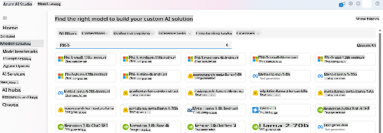

## Preparation for Fine-Tuning

### Prerequisites

> [!NOTE]  
> For Phi-3 family models, the pay-as-you-go fine-tuning option is only available for hubs created in **East US 2** regions.

- An Azure subscription. If you don't have one, create a [paid Azure account](https://azure.microsoft.com/pricing/purchase-options/pay-as-you-go) to get started.

- An [AI Foundry project](https://ai.azure.com?WT.mc_id=aiml-138114-kinfeylo).
- Azure role-based access controls (Azure RBAC) are required to grant permissions for operations in Azure AI Foundry. To complete the steps in this guide, your user account must have the __Azure AI Developer role__ assigned to the resource group.

### Subscription Provider Registration

Ensure your subscription is registered with the `Microsoft.Network` resource provider.

1. Sign in to the [Azure portal](https://portal.azure.com).
2. Select **Subscriptions** from the left-hand menu.
3. Choose the subscription you want to use.
4. Navigate to **AI project settings** > **Resource providers**.
5. Confirm that **Microsoft.Network** is listed as a resource provider. If not, add it.

### Data Preparation

Prepare your training and validation datasets to fine-tune the model. These datasets should include input-output examples that reflect how you want the model to perform.

Ensure that all training examples are formatted correctly for inference. To fine-tune models effectively, use a balanced and diverse dataset.

This means maintaining data variety, covering different scenarios, and periodically refining the dataset to reflect real-world use cases. This approach leads to more accurate and well-rounded model responses.

Different model types require specific training data formats.

### Chat Completion

The training and validation data **must** be formatted as a JSON Lines (JSONL) document. For `Phi-3-mini-128k-instruct`, the fine-tuning dataset must follow the conversational format used by the Chat completions API.

### Example File Format

```json
    {"messages": [{"role": "system", "content": "You are an Xbox customer support agent whose primary goal is to help users with issues they are experiencing with their Xbox devices. You are friendly and concise. You only provide factual answers to queries, and do not provide answers that are not related to Xbox."}, {"role": "user", "content": "Is Xbox better than PlayStation?"}, {"role": "assistant", "content": "I apologize, but I cannot provide personal opinions. My primary job is to assist you with any issues related to your Xbox device. Do you have any Xbox-related issues that need addressing?"}]}
    {"messages": [{"role": "system", "content": "You are an Xbox customer support agent whose primary goal is to help users with issues they are experiencing with their Xbox devices. You are friendly and concise. You only provide factual answers to queries, and do not provide answers that are not related to Xbox."}, {"role": "user", "content": "Can I play PC games on my Xbox?"}, {"role": "assistant", "content": "While Xbox consoles don't natively support PC games, they can play an array of Xbox games, many of which are also available on PC. Can I assist you with finding games compatible with your Xbox device?"}]}
    {"messages": [{"role": "system", "content": "You are an Xbox customer support agent whose primary goal is to help users with issues they are experiencing with their Xbox devices. You are friendly and concise. You only provide factual answers to queries, and do not provide answers that are not related to Xbox."}, {"role": "user", "content": "I'm having trouble connecting my Xbox to the Wi-Fi."}, {"role": "assistant", "content": "No worries, let's go through the network settings on your Xbox. Can you please tell me what happens when you try to connect it to the Wi-Fi?"}]}
```

The supported file type is JSON Lines. Files are uploaded to the default datastore and made available in your project.

## Fine-Tuning Phi-3 with Azure AI Foundry

Azure AI Foundry allows you to customize large language models for your specific datasets through fine-tuning. This process offers significant benefits, such as improved customization, task optimization, better performance, cost savings, reduced latency, and tailored outputs.

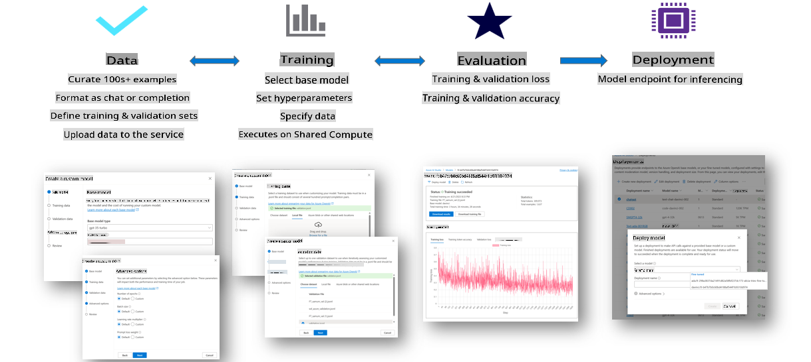

### Create a New Project

1. Sign in to [Azure AI Foundry](https://ai.azure.com).

2. Click **+New project** to create a new project in Azure AI Foundry.

    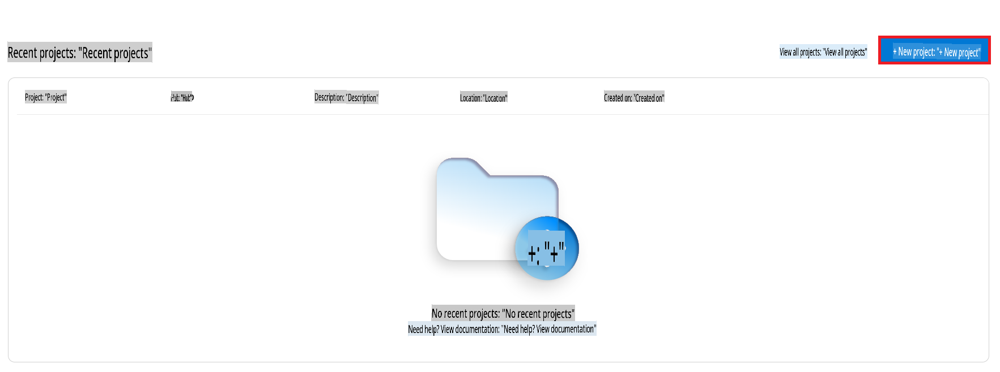

3. Complete the following steps:

    - Enter a unique **Hub name**.
    - Select the **Hub** to use (or create a new one if necessary).

    

4. To create a new hub, follow these steps:

    - Enter a unique **Hub name**.
    - Select your Azure **Subscription**.
    - Choose the **Resource group** (or create a new one if needed).
    - Select the desired **Location**.
    - Connect to **Azure AI Services** (or create a new connection if needed).
    - Skip connecting to **Azure AI Search** by selecting **Skip connecting**.

    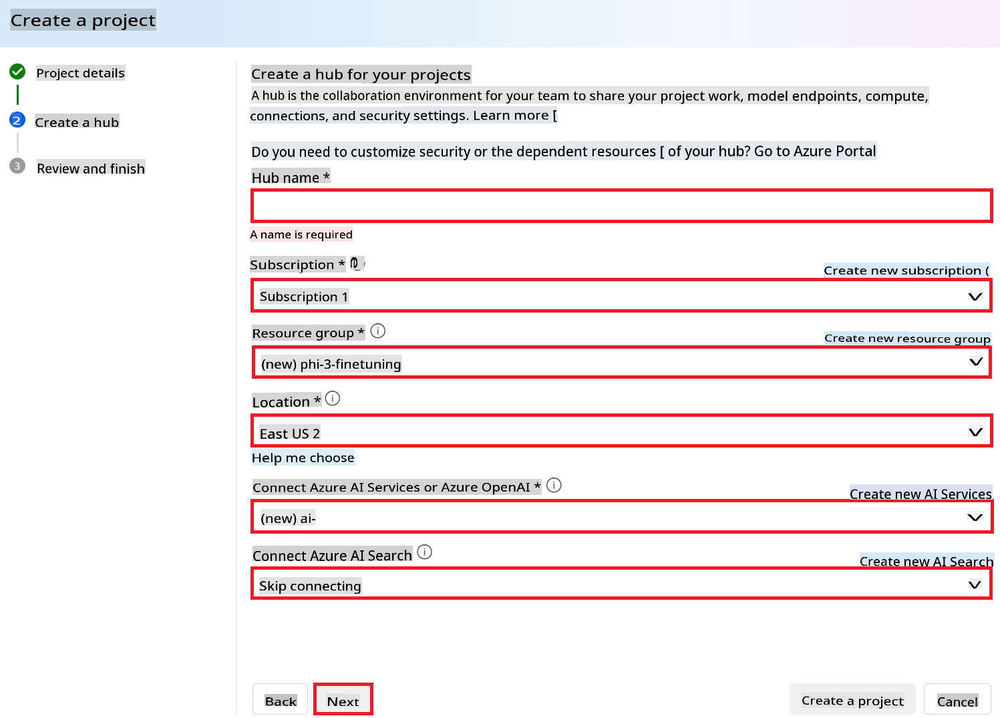

5. Click **Next**.  
6. Select **Create a project**.

### Data Preparation

Before fine-tuning, gather or create a dataset relevant to your task, such as chat instructions, Q&A pairs, or other text data. Clean and preprocess the data by removing noise, handling missing values, and tokenizing the text.

### Fine-Tune Phi-3 Models in Azure AI Foundry

> [!NOTE]  
> Fine-tuning of Phi-3 models is currently supported only in projects located in East US 2.

1. Go to the **Model catalog** tab on the left.

2. Search for *phi-3* in the **search bar** and select the Phi-3 model you want to use.

    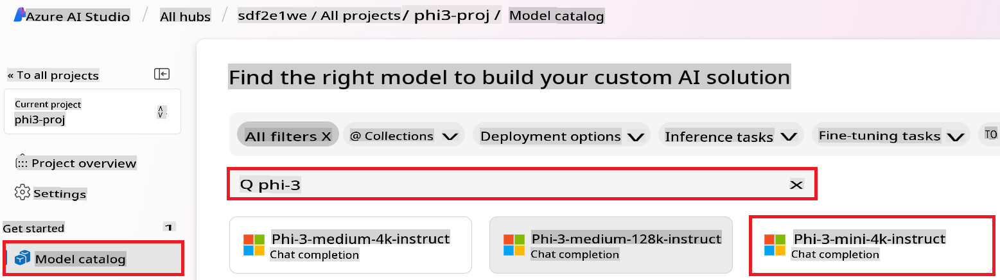

3. Click **Fine-tune**.

    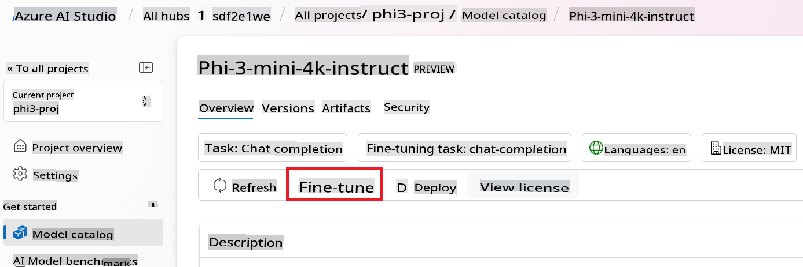

4. Enter a unique **Fine-tuned model name**.

    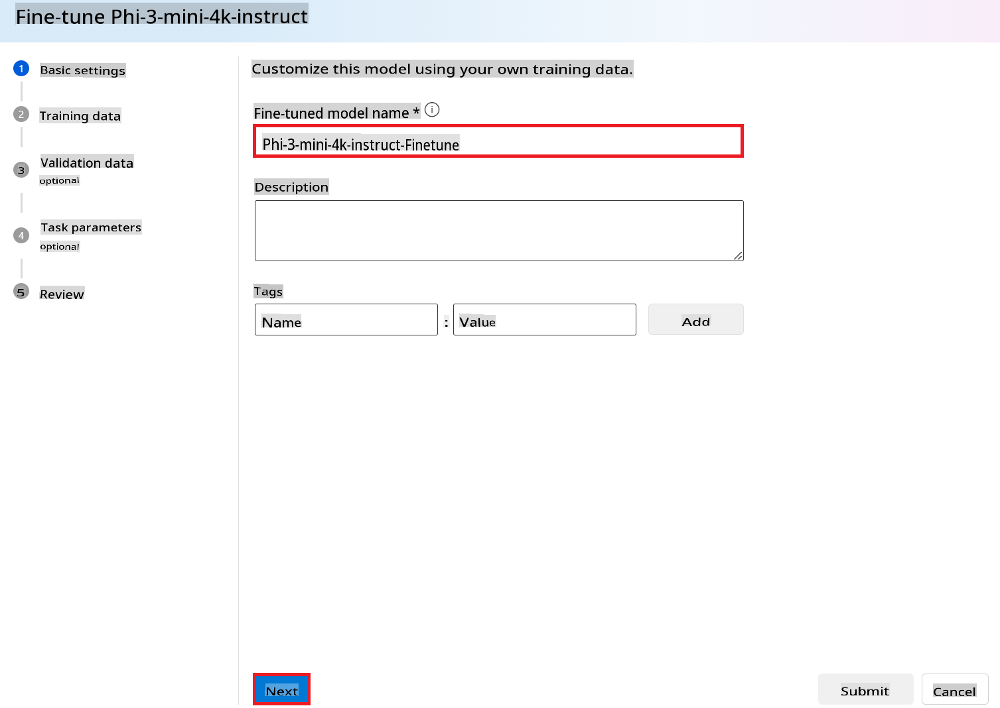

5. Click **Next**.

6. Complete the following steps:

    - Set the **Task type** to **Chat completion**.
    - Select the **Training data** to use. You can upload it via Azure AI Foundry or from your local environment.

    

7. Click **Next**.

8. Upload the **Validation data** or choose **Automatic split of training data**.

    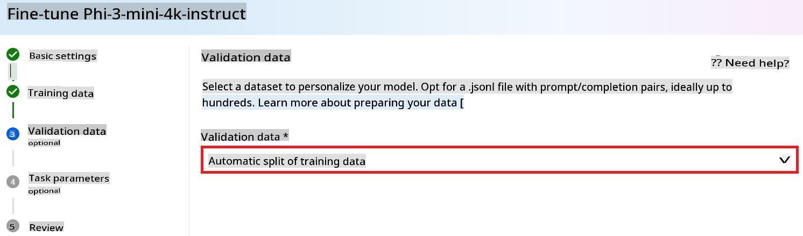

9. Click **Next**.

10. Configure the following settings:

    - Select the **Batch size multiplier**.
    - Set the **Learning rate**.
    - Specify the number of **Epochs**.

    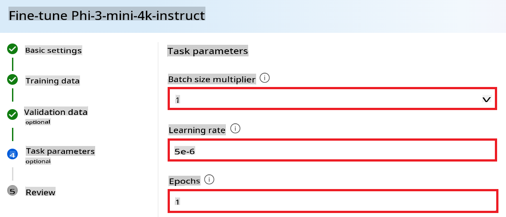

11. Click **Submit** to begin the fine-tuning process.

    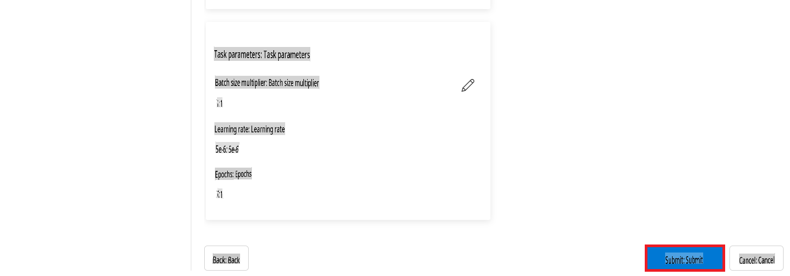

12. Once fine-tuning is complete, the status will change to **Completed**, as shown below. You can now deploy the model and use it in your application, playground, or prompt flow. For more details, refer to [How to deploy Phi-3 family of small language models with Azure AI Foundry](https://learn.microsoft.com/azure/ai-studio/how-to/deploy-models-phi-3?tabs=phi-3-5&pivots=programming-language-python).

    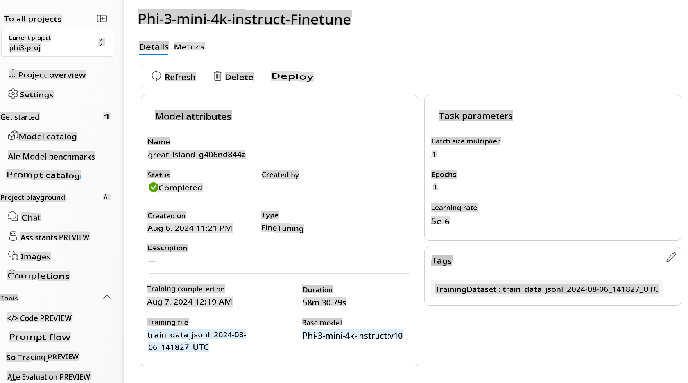

> [!NOTE]  
> For more detailed guidance on fine-tuning Phi-3, visit [Fine-tune Phi-3 models in Azure AI Foundry](https://learn.microsoft.com/azure/ai-studio/how-to/fine-tune-phi-3?tabs=phi-3-mini).

## Cleaning Up Fine-Tuned Models

You can delete a fine-tuned model from the fine-tuning model list in [Azure AI Foundry](https://ai.azure.com) or from the model details page. Select the fine-tuned model to delete from the Fine-tuning page, then click the Delete button.

> [!NOTE]  
> You cannot delete a custom model if it has an active deployment. First, delete the model deployment before removing the custom model.

## Cost and Quotas

### Cost and Quota Considerations for Phi-3 Models Fine-Tuned as a Service

Phi models fine-tuned as a service are offered by Microsoft and integrated with Azure AI Foundry. Pricing details are available under the Pricing and terms tab when [deploying](https://learn.microsoft.com/azure/ai-studio/how-to/deploy-models-phi-3?tabs=phi-3-5&pivots=programming-language-python) or fine-tuning the models.

## Content Filtering

Models deployed as a service with pay-as-you-go pricing are protected by Azure AI Content Safety. When deployed to real-time endpoints, you can opt out of this feature. With Azure AI Content Safety enabled, both prompts and completions are processed through classification models to detect and prevent harmful content. This system identifies and mitigates specific categories of harmful input and output. Learn more about [Azure AI Content Safety](https://learn.microsoft.com/azure/ai-studio/concepts/content-filtering).

**Fine-Tuning Configuration**

- **Hyperparameters:** Define parameters like learning rate, batch size, and number of training epochs.

**Loss Function**

Choose an appropriate loss function for your task (e.g., cross-entropy).

**Optimizer**

Select an optimizer (e.g., Adam) to update gradients during training.

**Fine-Tuning Process**

- **Load Pre-Trained Model:** Load the Phi-3 Mini checkpoint.
- **Add Custom Layers:** Add task-specific layers (e.g., a classification head for chat instructions).

**Train the Model**  
Fine-tune the model with your dataset. Monitor progress and adjust hyperparameters as necessary.

**Evaluation and Validation**

- **Validation Set:** Split your dataset into training and validation sets.
- **Evaluate Performance:** Use metrics like accuracy, F1-score, or perplexity to measure performance.

## Save Fine-Tuned Model

- **Checkpoint:** Save the fine-tuned model checkpoint for future use.

## Deployment

- **Deploy as a Web Service:** Deploy your fine-tuned model as a web service in Azure AI Foundry.
- **Test the Endpoint:** Run test queries to verify functionality.

## Iterate and Improve

- **Iterate:** If results are unsatisfactory, adjust hyperparameters, add more data, or extend training epochs.
- **Monitor and Refine:** Continuously monitor the model and make improvements as needed.

## Customize and Extend

- **Custom Tasks:** Phi-3 Mini can be fine-tuned for various tasks beyond chat instructions. Explore other possibilities!
- **Experiment:** Try different architectures, layer combinations, and techniques to boost performance.

> [!NOTE]  
> Fine-tuning is an iterative process. Experiment, learn, and refine your model to achieve the best results for your specific needs!

**Disclaimer**:  
This document has been translated using machine-based AI translation services. While we strive for accuracy, please be aware that automated translations may contain errors or inaccuracies. The original document in its native language should be considered the authoritative source. For critical information, professional human translation is recommended. We are not liable for any misunderstandings or misinterpretations arising from the use of this translation.