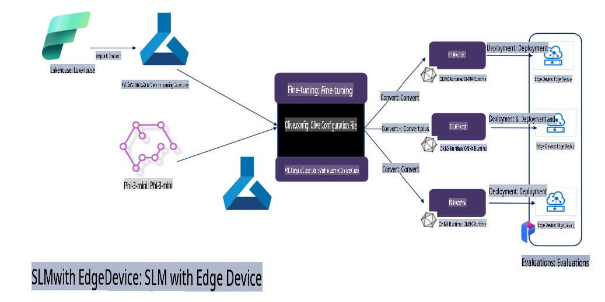

# **Fine-tuning Phi-3 with Microsoft Olive**

[Olive](https://github.com/microsoft/OLive?WT.mc_id=aiml-138114-kinfeylo) is a user-friendly, hardware-aware model optimization tool that integrates leading techniques in model compression, optimization, and compilation.

It simplifies the process of optimizing machine learning models, ensuring they utilize specific hardware architectures as efficiently as possible.

Whether you're developing for cloud-based applications or edge devices, Olive allows you to optimize your models seamlessly and effectively.

## Key Features:
- Olive consolidates and automates optimization techniques tailored to specific hardware targets.
- Since no single optimization technique fits all scenarios, Olive supports extensibility, enabling experts to incorporate their own innovations.

## Reduce Engineering Effort:
- Developers often need to familiarize themselves with multiple hardware vendor-specific toolchains to prepare and optimize trained models for deployment.
- Olive eliminates this complexity by automating optimization techniques for the target hardware.

## Ready-to-Use End-to-End Optimization Solution:

By integrating and fine-tuning various techniques, Olive provides a comprehensive solution for end-to-end optimization.
It takes constraints like accuracy and latency into account while optimizing models.

## Using Microsoft Olive for Fine-Tuning

Microsoft Olive is an easy-to-use open-source model optimization tool that supports both fine-tuning and inference in the realm of generative AI. With simple configurations and the use of open-source small language models alongside runtime environments (AzureML / local GPU, CPU, DirectML), you can automatically optimize models for fine-tuning or inference and determine the best model for deployment to the cloud or edge devices. This enables enterprises to build their own industry-specific models both on-premises and in the cloud.


## Phi-3 Fine-Tuning with Microsoft Olive 



## Phi-3 Olive Sample Code and Example
In this example, you will use Olive to:

- Fine-tune a LoRA adapter to classify phrases into categories like Sad, Joy, Fear, and Surprise.
- Merge the adapter weights into the base model.
- Optimize and quantize the model to int4.

[Sample Code](../../code/03.Finetuning/olive-ort-example/README.md)

### Setting Up Microsoft Olive

Installing Microsoft Olive is straightforward and supports installation for CPU, GPU, DirectML, and Azure ML.

```bash
pip install olive-ai
```

If you want to run an ONNX model on a CPU, use:

```bash
pip install olive-ai[cpu]
```

For running an ONNX model on a GPU, use:

```python
pip install olive-ai[gpu]
```

To use Azure ML, use:

```python
pip install git+https://github.com/microsoft/Olive#egg=olive-ai[azureml]
```

**Note**
OS Requirement: Ubuntu 20.04 / 22.04 

### **Microsoft Olive's Config.json**

After installation, you can configure various model-specific settings through the config file, including data, computation, training, deployment, and model generation.

**1. Data**

Microsoft Olive supports training on both local and cloud data, configurable via the settings.

*Local Data Settings*

You can easily specify the dataset for fine-tuning, usually in JSON format, and adapt it using a data template. Adjustments will depend on the model's requirements (e.g., adapt it to the format needed by Microsoft Phi-3-mini. For other models, refer to their respective fine-tuning format requirements).

```json

    "data_configs": [
        {
            "name": "dataset_default_train",
            "type": "HuggingfaceContainer",
            "load_dataset_config": {
                "params": {
                    "data_name": "json", 
                    "data_files":"dataset/dataset-classification.json",
                    "split": "train"
                }
            },
            "pre_process_data_config": {
                "params": {
                    "dataset_type": "corpus",
                    "text_cols": [
                            "phrase",
                            "tone"
                    ],
                    "text_template": "### Text: {phrase}\n### The tone is:\n{tone}",
                    "corpus_strategy": "join",
                    "source_max_len": 2048,
                    "pad_to_max_len": false,
                    "use_attention_mask": false
                }
            }
        }
    ],
```

**Cloud Data Source Settings**

By linking the datastore in Azure AI Studio/Azure Machine Learning Service, you can connect to cloud-based data. Different data sources can be introduced to Azure AI Studio/Azure Machine Learning Service via Microsoft Fabric and Azure Data to support fine-tuning.

```json

    "data_configs": [
        {
            "name": "dataset_default_train",
            "type": "HuggingfaceContainer",
            "load_dataset_config": {
                "params": {
                    "data_name": "json", 
                    "data_files": {
                        "type": "azureml_datastore",
                        "config": {
                            "azureml_client": {
                                "subscription_id": "Your Azure Subscrition ID",
                                "resource_group": "Your Azure Resource Group",
                                "workspace_name": "Your Azure ML Workspaces name"
                            },
                            "datastore_name": "workspaceblobstore",
                            "relative_path": "Your train_data.json Azure ML Location"
                        }
                    },
                    "split": "train"
                }
            },
            "pre_process_data_config": {
                "params": {
                    "dataset_type": "corpus",
                    "text_cols": [
                            "Question",
                            "Best Answer"
                    ],
                    "text_template": "<|user|>\n{Question}<|end|>\n<|assistant|>\n{Best Answer}\n<|end|>",
                    "corpus_strategy": "join",
                    "source_max_len": 2048,
                    "pad_to_max_len": false,
                    "use_attention_mask": false
                }
            }
        }
    ],
    
```

**2. Computing Configuration**

For local usage, you can rely on local data resources. If Azure AI Studio/Azure Machine Learning Service resources are needed, configure the relevant Azure parameters, compute name, etc.

```json

    "systems": {
        "aml": {
            "type": "AzureML",
            "config": {
                "accelerators": ["gpu"],
                "hf_token": true,
                "aml_compute": "Your Azure AI Studio / Azure Machine Learning Service Compute Name",
                "aml_docker_config": {
                    "base_image": "Your Azure AI Studio / Azure Machine Learning Service docker",
                    "conda_file_path": "conda.yaml"
                }
            }
        },
        "azure_arc": {
            "type": "AzureML",
            "config": {
                "accelerators": ["gpu"],
                "aml_compute": "Your Azure AI Studio / Azure Machine Learning Service Compute Name",
                "aml_docker_config": {
                    "base_image": "Your Azure AI Studio / Azure Machine Learning Service docker",
                    "conda_file_path": "conda.yaml"
                }
            }
        }
    },
```

***Note***

Since Azure AI Studio/Azure Machine Learning Service runs via a container, the required environment must be set up. This is configured in the conda.yaml environment file.

```yaml

name: project_environment
channels:
  - defaults
dependencies:
  - python=3.8.13
  - pip=22.3.1
  - pip:
      - einops
      - accelerate
      - azure-keyvault-secrets
      - azure-identity
      - bitsandbytes
      - datasets
      - huggingface_hub
      - peft
      - scipy
      - sentencepiece
      - torch>=2.2.0
      - transformers
      - git+https://github.com/microsoft/Olive@jiapli/mlflow_loading_fix#egg=olive-ai[gpu]
      - --extra-index-url https://aiinfra.pkgs.visualstudio.com/PublicPackages/_packaging/ORT-Nightly/pypi/simple/ 
      - ort-nightly-gpu==1.18.0.dev20240307004
      - --extra-index-url https://aiinfra.pkgs.visualstudio.com/PublicPackages/_packaging/onnxruntime-genai/pypi/simple/
      - onnxruntime-genai-cuda

    

```

**3. Choosing Your SLM**

You can directly use models from Hugging Face or combine them with the Model Catalog in Azure AI Studio/Azure Machine Learning to select the desired model. In the example below, we use Microsoft Phi-3-mini.

If the model is available locally, use this method:

```json

    "input_model":{
        "type": "PyTorchModel",
        "config": {
            "hf_config": {
                "model_name": "model-cache/microsoft/phi-3-mini",
                "task": "text-generation",
                "model_loading_args": {
                    "trust_remote_code": true
                }
            }
        }
    },
```

For models from Azure AI Studio/Azure Machine Learning Service, use this method:

```json

    "input_model":{
        "type": "PyTorchModel",
        "config": {
            "model_path": {
                "type": "azureml_registry_model",
                "config": {
                    "name": "microsoft/Phi-3-mini-4k-instruct",
                    "registry_name": "azureml-msr",
                    "version": "11"
                }
            },
             "model_file_format": "PyTorch.MLflow",
             "hf_config": {
                "model_name": "microsoft/Phi-3-mini-4k-instruct",
                "task": "text-generation",
                "from_pretrained_args": {
                    "trust_remote_code": true
                }
            }
        }
    },
```

**Note:**
When integrating with Azure AI Studio/Azure Machine Learning Service, ensure the correct version number and naming conventions for the model.

All models on Azure must be set to PyTorch.MLflow.

You will need a Hugging Face account and must bind its key to the Key value in Azure AI Studio/Azure Machine Learning.

**4. Algorithm**

Microsoft Olive includes well-packaged LoRA and QLoRA fine-tuning algorithms. You only need to configure a few parameters. Below is an example using QLoRA.

```json
        "lora": {
            "type": "LoRA",
            "config": {
                "target_modules": [
                    "o_proj",
                    "qkv_proj"
                ],
                "double_quant": true,
                "lora_r": 64,
                "lora_alpha": 64,
                "lora_dropout": 0.1,
                "train_data_config": "dataset_default_train",
                "eval_dataset_size": 0.3,
                "training_args": {
                    "seed": 0,
                    "data_seed": 42,
                    "per_device_train_batch_size": 1,
                    "per_device_eval_batch_size": 1,
                    "gradient_accumulation_steps": 4,
                    "gradient_checkpointing": false,
                    "learning_rate": 0.0001,
                    "num_train_epochs": 3,
                    "max_steps": 10,
                    "logging_steps": 10,
                    "evaluation_strategy": "steps",
                    "eval_steps": 187,
                    "group_by_length": true,
                    "adam_beta2": 0.999,
                    "max_grad_norm": 0.3
                }
            }
        },
```

For quantization conversion, the main branch of Microsoft Olive already supports the onnxruntime-genai method. Configure it based on your requirements:

1. Merge adapter weights into the base model.
2. Convert the model to an ONNX model with the desired precision using ModelBuilder.

For example, converting to quantized INT4:

```json

        "merge_adapter_weights": {
            "type": "MergeAdapterWeights"
        },
        "builder": {
            "type": "ModelBuilder",
            "config": {
                "precision": "int4"
            }
        }
```

**Note** 
- QLoRA does not currently support ONNXRuntime-genai quantization conversion.
- The steps above are optional and can be adjusted based on your needs. You can skip certain steps or use the algorithm directly without fine-tuning. Lastly, you must configure the relevant engines.

```json

    "engine": {
        "log_severity_level": 0,
        "host": "aml",
        "target": "aml",
        "search_strategy": false,
        "execution_providers": ["CUDAExecutionProvider"],
        "cache_dir": "../model-cache/models/phi3-finetuned/cache",
        "output_dir" : "../model-cache/models/phi3-finetuned"
    }
```

**5. Finalizing Fine-Tuning**

Run the following command in the directory containing olive-config.json:

```bash
olive run --config olive-config.json  
```

**Disclaimer**:  
This document has been translated using machine-based AI translation services. While we strive for accuracy, please be aware that automated translations may contain errors or inaccuracies. The original document in its native language should be considered the authoritative source. For critical information, professional human translation is recommended. We are not liable for any misunderstandings or misinterpretations arising from the use of this translation.