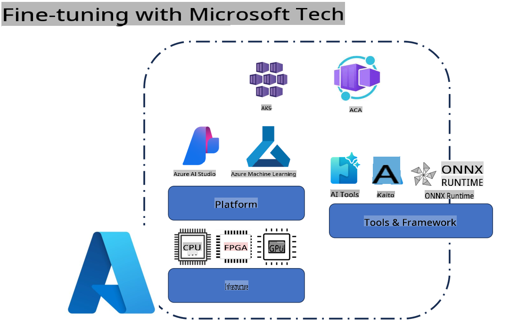
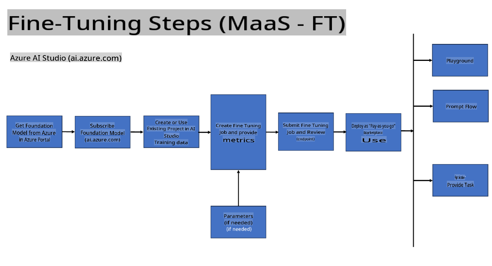
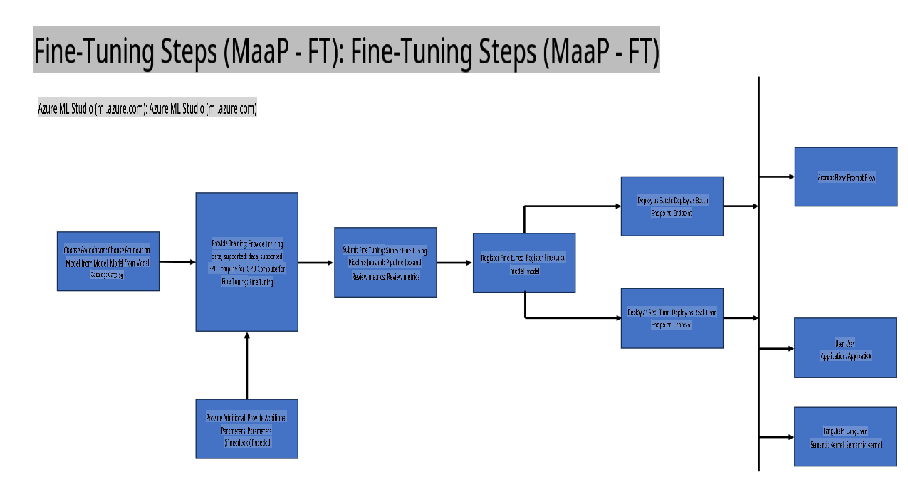
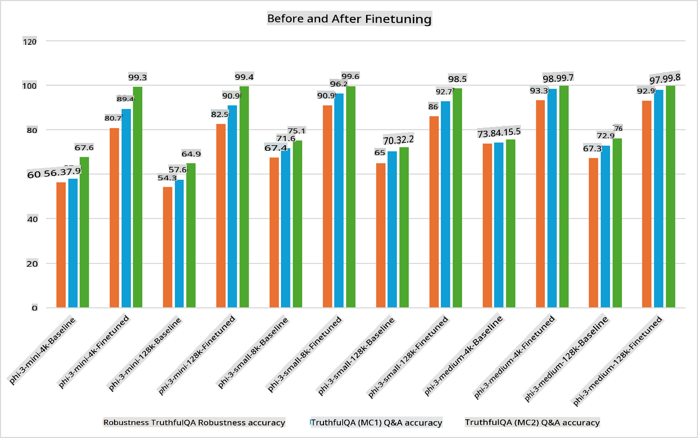

## Fine Tuning Scenarios

**Platform** This includes various technologies such as Azure AI Foundry, Azure Machine Learning, AI Tools, Kaito, and ONNX Runtime. 

**Infrastructure** This encompasses the CPU and FPGA, which are critical for the fine-tuning process. Below are the icons representing each of these technologies.

**Tools & Framework** This includes ONNX Runtime and ONNX Runtime. Below are the icons representing these technologies.
[Insert icons for ONNX Runtime and ONNX Runtime]

The fine-tuning process with Microsoft technologies leverages a variety of components and tools. By understanding and utilizing these technologies, we can fine-tune applications effectively and build superior solutions.

## Model as Service

Fine-tune the model using hosted fine-tuning without needing to set up or manage computing resources.

Serverless fine-tuning is available for Phi-3-mini and Phi-3-medium models, allowing developers to quickly and easily customize models for cloud and edge scenarios without needing to provision compute. Additionally, we’ve announced that Phi-3-small is now accessible via our Models-as-a-Service offering, enabling developers to start AI development with ease, without worrying about managing the underlying infrastructure.

## Model as a Platform 

Users manage their own compute resources to fine-tune their models.

[Fine Tuning Sample](https://github.com/Azure/azureml-examples/blob/main/sdk/python/foundation-models/system/finetune/chat-completion/chat-completion.ipynb)

## Fine Tuning Scenarios 

| | | | | | | |
|-|-|-|-|-|-|-|
|Scenario|LoRA|QLoRA|PEFT|DeepSpeed|ZeRO|DORA|
|Adapting pre-trained LLMs to specific tasks or domains|Yes|Yes|Yes|Yes|Yes|Yes|
|Fine-tuning for NLP tasks such as text classification, named entity recognition, and machine translation|Yes|Yes|Yes|Yes|Yes|Yes|
|Fine-tuning for QA tasks|Yes|Yes|Yes|Yes|Yes|Yes|
|Fine-tuning for generating human-like responses in chatbots|Yes|Yes|Yes|Yes|Yes|Yes|
|Fine-tuning for generating music, art, or other forms of creativity|Yes|Yes|Yes|Yes|Yes|Yes|
|Reducing computational and financial costs|Yes|Yes|No|Yes|Yes|No|
|Reducing memory usage|No|Yes|No|Yes|Yes|Yes|
|Using fewer parameters for efficient finetuning|No|Yes|Yes|No|No|Yes|
|Memory-efficient form of data parallelism that gives access to the aggregate GPU memory of all the GPU devices available|No|No|No|Yes|Yes|Yes|

## Fine Tuning Performance Examples

**Disclaimer**:  
This document has been translated using machine-based AI translation services. While we strive for accuracy, please note that automated translations may contain errors or inaccuracies. The original document in its native language should be regarded as the authoritative source. For critical information, professional human translation is recommended. We are not responsible for any misunderstandings or misinterpretations resulting from the use of this translation.