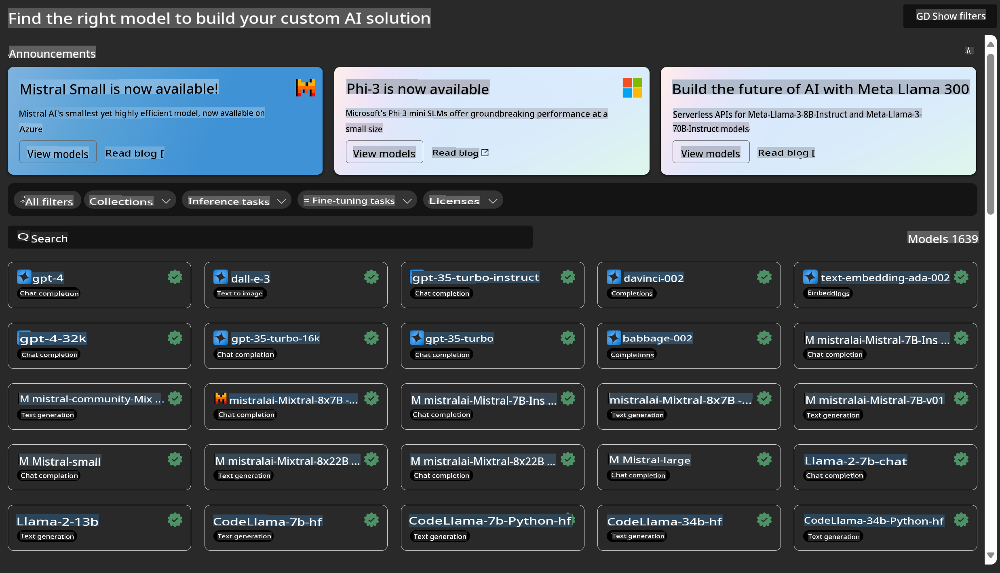
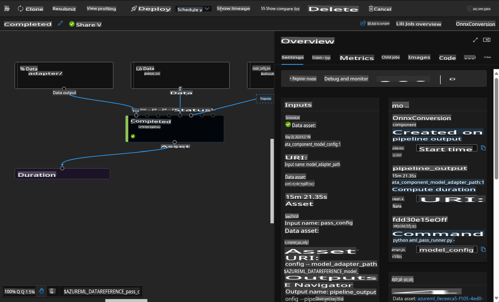

# **Introduction to Azure Machine Learning Service**

[Azure Machine Learning](https://ml.azure.com?WT.mc_id=aiml-138114-kinfeylo) is a cloud service designed to streamline and manage the machine learning (ML) project lifecycle.

ML practitioners, data scientists, and engineers can incorporate it into their daily workflows to:

- Train and deploy models.
- Manage machine learning operations (MLOps).
- Build models directly in Azure Machine Learning or use models from open-source platforms like PyTorch, TensorFlow, or scikit-learn.
- Utilize MLOps tools to monitor, retrain, and redeploy models as needed.

## Who Can Benefit from Azure Machine Learning?

**Data Scientists and ML Engineers**

They can leverage tools to accelerate and automate their daily workflows.  
Azure ML offers features for fairness, explainability, tracking, and auditability.

**Application Developers**

They can seamlessly integrate models into applications or services.

**Platform Developers**

They have access to powerful tools supported by durable Azure Resource Manager APIs, enabling the creation of advanced ML tools.

**Enterprises**

Enterprises operating in the Microsoft Azure cloud gain the advantage of familiar security protocols and role-based access control.  
They can set up projects to regulate access to sensitive data and specific operations.

## Boosting Team Productivity
ML projects often require a multidisciplinary team to develop and maintain them effectively.

Azure ML provides tools that allow you to:
- Collaborate with your team using shared notebooks, compute resources, serverless compute, data, and environments.
- Build models with fairness, explainability, tracking, and auditability to meet lineage and compliance requirements.
- Deploy ML models quickly and efficiently at scale, and manage them with robust MLOps capabilities.
- Run machine learning workloads anywhere, benefiting from built-in governance, security, and compliance.

## Cross-Compatible Platform Tools

Every member of an ML team can use their preferred tools to complete tasks.  
Whether you're conducting rapid experiments, hyperparameter tuning, building pipelines, or managing inferences, you can work with familiar interfaces such as:
- Azure Machine Learning Studio
- Python SDK (v2)
- Azure CLI (v2)
- Azure Resource Manager REST APIs

As you refine models and collaborate throughout the development cycle, you can share and access assets, resources, and metrics within the Azure Machine Learning studio interface.

## **LLM/SLM in Azure ML**

Azure ML has introduced several LLM/SLM-related features, integrating LLMOps and SLMOps to establish an enterprise-wide generative AI technology platform.

### **Model Catalog**

Enterprise users can deploy various models tailored to specific business scenarios through the Model Catalog, offering Model as Service capabilities for developers and users to access.

The Model Catalog in Azure Machine Learning studio serves as a central hub for discovering and utilizing diverse models to build Generative AI applications. It includes hundreds of models from providers like Azure OpenAI service, Mistral, Meta, Cohere, Nvidia, Hugging Face, and Microsoft-trained models. Models from non-Microsoft providers are classified as Non-Microsoft Products under Microsoft's Product Terms and are governed by the terms provided with the model.

### **Job Pipeline**

A machine learning pipeline breaks down a complete ML task into a multistep workflow. Each step is a manageable component that can be independently developed, optimized, configured, and automated. Steps are connected through well-defined interfaces, and the Azure Machine Learning pipeline service automatically orchestrates dependencies between pipeline steps.

When fine-tuning SLM/LLM, pipelines can manage data, training, and generation processes efficiently.

### **Prompt Flow**

#### Benefits of Using Azure Machine Learning Prompt Flow
Azure Machine Learning prompt flow offers numerous advantages, enabling users to transition from idea generation to experimentation and ultimately to production-ready LLM-based applications:

**Prompt Engineering Agility**

- **Interactive Authoring Experience**: Azure Machine Learning prompt flow provides a visual representation of the flow's structure, making it easier for users to understand and navigate their projects. It also offers a notebook-like coding environment for efficient development and debugging of flows.
- **Variants for Prompt Tuning**: Users can create and compare multiple prompt variants, facilitating iterative refinement.
- **Evaluation**: Built-in evaluation flows allow users to assess the quality and effectiveness of their prompts and flows.
- **Comprehensive Resources**: The platform includes a library of built-in tools, samples, and templates to inspire creativity and speed up development.

**Enterprise Readiness for LLM-Based Applications**

- **Collaboration**: Azure Machine Learning prompt flow supports team collaboration, enabling multiple users to work on prompt engineering projects, share knowledge, and maintain version control.
- **All-in-One Platform**: The prompt flow streamlines the entire prompt engineering process—from development and evaluation to deployment and monitoring. Users can deploy their flows as Azure Machine Learning endpoints and monitor performance in real-time to ensure optimal operation and continuous improvement.
- **Enterprise-Grade Solutions**: Prompt flow leverages Azure Machine Learning's robust enterprise solutions, offering a secure, scalable, and reliable foundation for development, experimentation, and deployment.

With Azure Machine Learning prompt flow, users can enhance their prompt engineering capabilities, collaborate effectively, and take advantage of enterprise-level solutions for successful LLM-based application development and deployment.

By combining the computing power, data, and various components of Azure ML, enterprise developers can effortlessly build their own artificial intelligence applications.

**Disclaimer**:  
This document has been translated using machine-based AI translation services. While we strive for accuracy, please be aware that automated translations may contain errors or inaccuracies. The original document in its native language should be considered the authoritative source. For critical information, professional human translation is recommended. We are not liable for any misunderstandings or misinterpretations arising from the use of this translation.