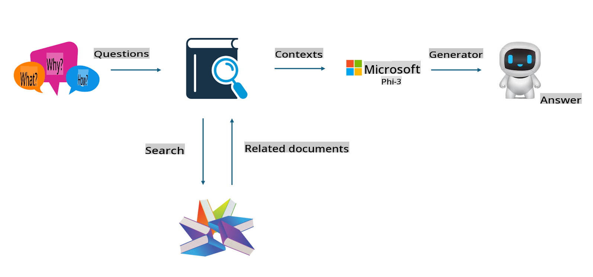
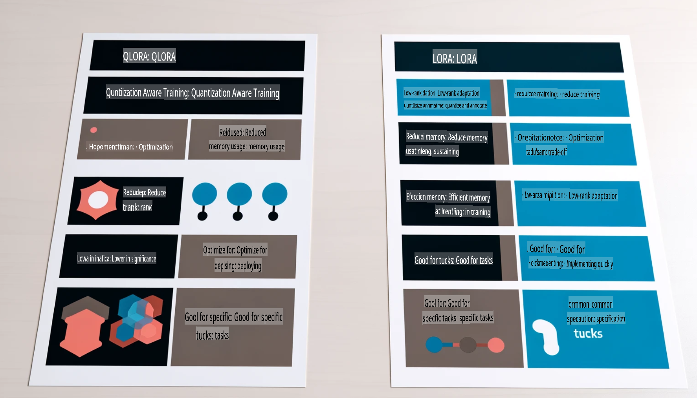

# **Let Phi-3 Become an Industry Expert**

To integrate the Phi-3 model into an industry, it's necessary to enhance it with industry-specific business data. There are two main approaches for this: RAG (Retrieval Augmented Generation) and Fine-Tuning.

## **RAG vs Fine-Tuning**

### **Retrieval Augmented Generation**

RAG combines data retrieval with text generation. The enterprise's structured and unstructured data is stored in a vector database. When searching for relevant information, the system retrieves summaries and related content to create a context. This context is then used alongside the text generation capabilities of LLM/SLM to produce the output.

### **Fine-Tuning**

Fine-tuning involves refining an existing model. It doesn’t require starting from scratch with the model algorithm, but it does demand a continuous accumulation of data. If precise terminology and specialized language are required for industry applications, fine-tuning is the better option. However, if the data changes frequently, fine-tuning can become cumbersome.

### **How to Choose**

1. If the response requires external data integration, RAG is the ideal choice.

2. For delivering consistent and precise industry-specific knowledge, fine-tuning is more suitable. While RAG focuses on retrieving relevant content, it may not always capture specialized nuances.

3. Fine-tuning requires a high-quality dataset. If the dataset is small or limited in scope, the impact will be minimal. RAG, on the other hand, offers more flexibility.

4. Fine-tuning operates as a "black box," making it challenging to understand its internal workings. Conversely, RAG provides greater transparency by making it easier to trace the source of data, which helps in mitigating hallucinations or errors.

### **Scenarios**

1. For vertical industries requiring specific professional jargon and expressions, ***Fine-tuning*** is the optimal choice.

2. For a QA system that synthesizes knowledge from various sources, ***RAG*** is the best fit.

3. For automating business workflows, a combination of ***RAG + Fine-tuning*** works best.

## **How to Use RAG**

A vector database stores data in mathematical form, enabling machine learning models to better retain prior inputs. This makes it possible to use machine learning for applications like search, recommendations, and text generation. Instead of relying on exact matches, vector databases identify data based on similarity metrics, allowing models to understand the context.

The vector database is crucial for implementing RAG. Data can be transformed into vector storage using vector models like text-embedding-3 or jina-ai-embedding.

Learn more about creating RAG applications [https://github.com/microsoft/Phi-3CookBook](https://github.com/microsoft/Phi-3CookBook?WT.mc_id=aiml-138114-kinfeylo)

## **How to Use Fine-Tuning**

Common algorithms for Fine-Tuning include Lora and QLora. Which one should you choose?  
- [Learn More with this sample notebook](../../../../code/04.Finetuning/Phi_3_Inference_Finetuning.ipynb)  
- [Example of Python FineTuning Sample](../../../../code/04.Finetuning/FineTrainingScript.py)

### **Lora and QLora**

LoRA (Low-Rank Adaptation) and QLoRA (Quantized Low-Rank Adaptation) are techniques for fine-tuning large language models (LLMs) using Parameter Efficient Fine Tuning (PEFT). PEFT methods are designed to make training more efficient than traditional techniques.  

LoRA is a standalone fine-tuning method that reduces memory usage by applying a low-rank approximation to the weight update matrix. It allows for faster training while maintaining performance close to traditional fine-tuning methods.  

QLoRA builds on LoRA by incorporating quantization techniques to further reduce memory usage. It quantizes the pre-trained model's weight parameters to 4-bit precision, making it even more memory efficient than LoRA. However, QLoRA is approximately 30% slower to train due to additional quantization and dequantization steps.  

QLoRA uses LoRA as a complementary method to correct errors introduced by quantization. It enables fine-tuning of massive models with billions of parameters on relatively small and widely available GPUs. For instance, QLoRA can fine-tune a 70B parameter model requiring 36 GPUs with only 2.

**Disclaimer**:  
This document has been translated using machine-based AI translation services. While we strive for accuracy, please note that automated translations may contain errors or inaccuracies. The original document in its native language should be regarded as the authoritative source. For critical information, professional human translation is recommended. We are not responsible for any misunderstandings or misinterpretations resulting from the use of this translation.