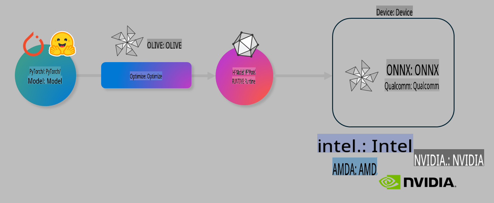

# Lab. Optimize AI models for on-device inference

## Introduction 

> [!IMPORTANT]
> This lab requires an **Nvidia A10 or A100 GPU** with associated drivers and CUDA toolkit (version 12+) installed.

> [!NOTE]
> This is a **35-minute** lab that will give you a hands-on introduction to the core concepts of optimizing models for on-device inference using OLIVE.

## Learning Objectives

By the end of this lab, you will be able to use OLIVE to:

- Quantize an AI Model using the AWQ quantization method.
- Fine-tune an AI model for a specific task.
- Generate LoRA adapters (fine-tuned model) for efficient on-device inference on the ONNX Runtime.

### What is Olive

Olive (*O*NNX *live*) is a model optimization toolkit with accompanying CLI that enables you to ship models for the ONNX runtime +++https://onnxruntime.ai+++ with quality and performance.



The input to Olive is typically a PyTorch or Hugging Face model and the output is an optimized ONNX model that is executed on a device (deployment target) running the ONNX runtime. Olive will optimize the model for the deployment target's AI accelerator (NPU, GPU, CPU) provided by a hardware vendor such as Qualcomm, AMD, Nvidia or Intel.

Olive executes a *workflow*, which is an ordered sequence of individual model optimization tasks called *passes* - example passes include: model compression, graph capture, quantization, graph optimization. Each pass has a set of parameters that can be tuned to achieve the best metrics, say accuracy and latency, that are evaluated by the respective evaluator. Olive employs a search strategy that uses a search algorithm to auto-tune each pass one by one or set of passes together.

#### Benefits of Olive

- **Reduce frustration and time** of trial-and-error manual experimentation with different techniques for graph optimization, compression and quantization. Define your quality and performance constraints and let Olive automatically find the best model for you.
- **40+ built-in model optimization components** covering cutting edge techniques in quantization, compression, graph optimization and finetuning.
- **Easy-to-use CLI** for common model optimization tasks. For example, olive quantize, olive auto-opt, olive finetune.
- Model packaging and deployment built-in.
- Supports generating models for **Multi LoRA serving**.
- Construct workflows using YAML/JSON to orchestrate model optimization and deployment tasks.
- **Hugging Face** and **Azure AI** Integration.
- Built-in **caching** mechanism to **save costs**.

## Lab Instructions
> [!NOTE]
> Please ensure you have provisioned your Azure AI Hub and Project and set up your A100 compute as per Lab 1.

### Step 0: Connect to your Azure AI Compute

You'll connect to the Azure AI compute using the remote feature in **VS Code.** 

1. Open your **VS Code** desktop application:
1. Open the **command palette** using  **Shift+Ctrl+P**
1. In the command palette search for **AzureML - remote: Connect to compute instance in New Window**.
1. Follow the on-screen instructions to connect to the Compute. This will involve selecting your Azure Subscription, Resource Group, Project, and Compute name you set up in Lab 1.
1. Once you're connected to your Azure ML Compute node, this will be displayed in the **bottom left of Visual Code** `><Azure ML: Compute Name`

### Step 1: Clone this repo

In VS Code, you can open a new terminal with **Ctrl+J** and clone this repo:

In the terminal, you should see the prompt

```
azureuser@computername:~/cloudfiles/code$ 
```
Clone the solution 

```bash
cd ~/localfiles
git clone https://github.com/microsoft/phi-3cookbook.git
```

### Step 2: Open Folder in VS Code

To open VS Code in the relevant folder, execute the following command in the terminal, which will open a new window:

```bash
code phi-3cookbook/code/04.Finetuning/Olive-lab
```

Alternatively, you can open the folder by selecting **File** > **Open Folder**. 

### Step 3: Dependencies

Open a terminal window in VS Code in your Azure AI Compute Instance (tip: **Ctrl+J**) and execute the following commands to install the dependencies:

```bash
conda create -n olive-ai python=3.11 -y
conda activate olive-ai
pip install -r requirements.txt
az extension remove -n azure-cli-ml
az extension add -n ml
```

> [!NOTE]
> It will take ~5 minutes to install all the dependencies.

In this lab, you'll download and upload models to the Azure AI Model catalog. To access the model catalog, you'll need to log in to Azure using:

```bash
az login
```

> [!NOTE]
> At login time, you'll be asked to select your subscription. Ensure you set the subscription to the one provided for this lab.

### Step 4: Execute Olive commands 

Open a terminal window in VS Code in your Azure AI Compute Instance (tip: **Ctrl+J**) and ensure the `olive-ai` conda environment is activated:

```bash
conda activate olive-ai
```

Next, execute the following Olive commands in the command line.

1. **Inspect the data:** In this example, you're going to fine-tune the Phi-3.5-Mini model so that it is specialized in answering travel-related questions. The code below displays the first few records of the dataset, which are in JSON lines format:
   
    ```bash
    head data/data_sample_travel.jsonl
    ```
1. **Quantize the model:** Before training the model, first quantize it with the following command that uses a technique called Active Aware Quantization (AWQ) +++https://arxiv.org/abs/2306.00978+++. AWQ quantizes the weights of a model by considering the activations produced during inference. This means that the quantization process takes into account the actual data distribution in the activations, leading to better preservation of model accuracy compared to traditional weight quantization methods.
    
    ```bash
    olive quantize \
       --model_name_or_path microsoft/Phi-3.5-mini-instruct \
       --trust_remote_code \
       --algorithm awq \
       --output_path models/phi/awq \
       --log_level 1
    ```
    
    It takes **~8 minutes** to complete the AWQ quantization, which will **reduce the model size from ~7.5GB to ~2.5GB**.
   
   In this lab, we're showing you how to input models from Hugging Face (for example: `microsoft/Phi-3.5-mini-instruct`). However, Olive also allows you to input models from the Azure AI catalog by updating the `model_name_or_path` argument to an Azure AI asset ID (for example:  `azureml://registries/azureml/models/Phi-3.5-mini-instruct/versions/4`). 

1. **Train the model:** Next, the `olive finetune` command fine-tunes the quantized model. Quantizing the model *before* fine-tuning instead of afterwards gives better accuracy as the fine-tuning process recovers some of the loss from the quantization.
    
    ```bash
    olive finetune \
        --method lora \
        --model_name_or_path models/phi/awq \
        --data_files "data/data_sample_travel.jsonl" \
        --data_name "json" \
        --text_template "<|user|>\n{prompt}<|end|>\n<|assistant|>\n{response}<|end|>" \
        --max_steps 100 \
        --output_path ./models/phi/ft \
        --log_level 1
    ```
    
    It takes **~6 minutes** to complete the fine-tuning (with 100 steps).

1. **Optimize:** With the model trained, you now optimize the model using Olive's `auto-opt` command, which will capture the ONNX graph and automatically perform a number of optimizations to improve the model performance for CPU by compressing the model and doing fusions. It should be noted, that you can also optimize for other devices such as NPU or GPU by just updating the `--device` and `--provider` arguments - but for the purposes of this lab, we'll use CPU.

    ```bash
    olive auto-opt \
       --model_name_or_path models/phi/ft/model \
       --adapter_path models/phi/ft/adapter \
       --device cpu \
       --provider CPUExecutionProvider \
       --use_ort_genai \
       --output_path models/phi/onnx-ao \
       --log_level 1
    ```
    
    It takes **~5 minutes** to complete the optimization.

### Step 5: Model inference quick test

To test the model's inference, create a Python file in your folder called **app.py** and copy-and-paste the following code:

```python
import onnxruntime_genai as og
import numpy as np

print("loading model and adapters...", end="", flush=True)
model = og.Model("models/phi/onnx-ao/model")
adapters = og.Adapters(model)
adapters.load("models/phi/onnx-ao/model/adapter_weights.onnx_adapter", "travel")
print("DONE!")

tokenizer = og.Tokenizer(model)
tokenizer_stream = tokenizer.create_stream()

params = og.GeneratorParams(model)
params.set_search_options(max_length=100, past_present_share_buffer=False)
user_input = "what is the best thing to see in chicago"
params.input_ids = tokenizer.encode(f"<|user|>\n{user_input}<|end|>\n<|assistant|>\n")

generator = og.Generator(model, params)

generator.set_active_adapter(adapters, "travel")

print(f"{user_input}")

while not generator.is_done():
    generator.compute_logits()
    generator.generate_next_token()

    new_token = generator.get_next_tokens()[0]
    print(tokenizer_stream.decode(new_token), end='', flush=True)

print("\n")
```

Execute the code using:

```bash
python app.py
```

### Step 6: Upload model to Azure AI

Uploading the model to an Azure AI model repository makes the model sharable with other members of your development team and also handles version control of the model. To upload the model, run the following command:

> [!NOTE]
> Update the `{}` placeholders with the name of your resource group and Azure AI Project Name. 

To find your resource group `"resourceGroup"` and Azure AI Project name, then run the following command 

```
az ml workspace show
```

Or by going to +++ai.azure.com+++ and selecting **management center** > **project** > **overview**.

Update the `{}` placeholders with the name of your resource group and Azure AI Project Name.

```bash
az ml model create \
    --name ft-for-travel \
    --version 1 \
    --path ./models/phi/onnx-ao \
    --resource-group {RESOURCE_GROUP_NAME} \
    --workspace-name {PROJECT_NAME}
```
You can then see your uploaded model and deploy it at https://ml.azure.com/model/list

**Disclaimer**:  
This document has been translated using machine-based AI translation services. While we strive for accuracy, please note that automated translations may contain errors or inaccuracies. The original document in its native language should be regarded as the authoritative source. For critical information, professional human translation is recommended. We are not responsible for any misunderstandings or misinterpretations resulting from the use of this translation.