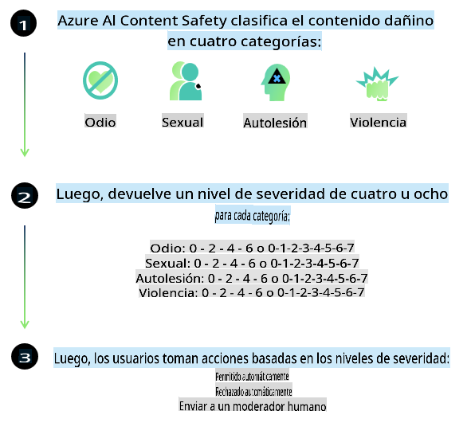
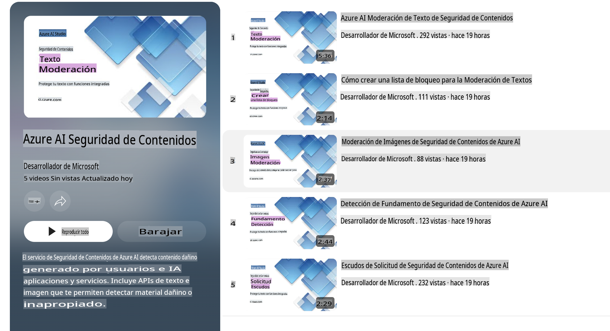

# Seguridad de IA para modelos Phi-3
La familia de modelos Phi-3 se desarrolló de acuerdo con el [Estándar de IA Responsable de Microsoft](https://query.prod.cms.rt.microsoft.com/cms/api/am/binary/RE5cmFl), que es un conjunto de requisitos a nivel de la empresa basado en los siguientes seis principios: responsabilidad, transparencia, equidad, fiabilidad y seguridad, privacidad y seguridad, e inclusión que forman los [principios de IA Responsable de Microsoft](https://www.microsoft.com/ai/responsible-ai).

Al igual que los modelos Phi-3 anteriores, se adoptó un enfoque de evaluación y post-entrenamiento de seguridad multifacético, con medidas adicionales para tener en cuenta las capacidades multilingües de esta versión. Nuestro enfoque para el entrenamiento y las evaluaciones de seguridad, incluidas las pruebas en múltiples idiomas y categorías de riesgo, se describe en el [Documento de Post-Entrenamiento de Seguridad de Phi-3](https://arxiv.org/abs/2407.13833). Aunque los modelos Phi-3 se benefician de este enfoque, los desarrolladores deben aplicar las mejores prácticas de IA responsable, incluyendo mapear, medir y mitigar los riesgos asociados con su caso de uso específico y contexto cultural y lingüístico.

## Mejores Prácticas

Al igual que otros modelos, la familia de modelos Phi puede comportarse de maneras que sean injustas, poco fiables u ofensivas.

Algunos de los comportamientos limitantes de SLM y LLM que debes tener en cuenta incluyen:

- **Calidad del Servicio:** Los modelos Phi están entrenados principalmente en texto en inglés. Los idiomas distintos del inglés experimentarán un peor rendimiento. Las variedades del inglés con menor representación en los datos de entrenamiento podrían experimentar un peor rendimiento que el inglés americano estándar.
- **Representación de Daños y Perpetuación de Estereotipos:** Estos modelos pueden sobre-representar o infra-representar grupos de personas, borrar la representación de algunos grupos o reforzar estereotipos degradantes o negativos. A pesar del post-entrenamiento de seguridad, estas limitaciones aún pueden estar presentes debido a los diferentes niveles de representación de diferentes grupos o la prevalencia de ejemplos de estereotipos negativos en los datos de entrenamiento que reflejan patrones del mundo real y sesgos sociales.
- **Contenido Inapropiado u Ofensivo:** Estos modelos pueden producir otros tipos de contenido inapropiado u ofensivo, lo que puede hacer que no sea apropiado desplegarlos en contextos sensibles sin mitigaciones adicionales que sean específicas para el caso de uso.
- **Fiabilidad de la Información:** Los modelos de lenguaje pueden generar contenido sin sentido o fabricar contenido que podría sonar razonable pero es inexacto o desactualizado.
- **Alcance Limitado para el Código:** La mayoría de los datos de entrenamiento de Phi-3 están basados en Python y utilizan paquetes comunes como "typing, math, random, collections, datetime, itertools". Si el modelo genera scripts de Python que utilizan otros paquetes o scripts en otros lenguajes, recomendamos encarecidamente que los usuarios verifiquen manualmente todos los usos de API.

Los desarrolladores deben aplicar las mejores prácticas de IA responsable y son responsables de garantizar que un caso de uso específico cumpla con las leyes y regulaciones pertinentes (por ejemplo, privacidad, comercio, etc.).

## Consideraciones de IA Responsable

Al igual que otros modelos de lenguaje, los modelos de la serie Phi pueden comportarse de maneras que sean injustas, poco fiables u ofensivas. Algunos de los comportamientos limitantes que debes tener en cuenta incluyen:

**Calidad del Servicio:** Los modelos Phi están entrenados principalmente en texto en inglés. Los idiomas distintos del inglés experimentarán un peor rendimiento. Las variedades del inglés con menor representación en los datos de entrenamiento podrían experimentar un peor rendimiento que el inglés americano estándar.

**Representación de Daños y Perpetuación de Estereotipos:** Estos modelos pueden sobre-representar o infra-representar grupos de personas, borrar la representación de algunos grupos o reforzar estereotipos degradantes o negativos. A pesar del post-entrenamiento de seguridad, estas limitaciones aún pueden estar presentes debido a los diferentes niveles de representación de diferentes grupos o la prevalencia de ejemplos de estereotipos negativos en los datos de entrenamiento que reflejan patrones del mundo real y sesgos sociales.

**Contenido Inapropiado u Ofensivo:** Estos modelos pueden producir otros tipos de contenido inapropiado u ofensivo, lo que puede hacer que no sea apropiado desplegarlos en contextos sensibles sin mitigaciones adicionales que sean específicas para el caso de uso.
**Fiabilidad de la Información:** Los modelos de lenguaje pueden generar contenido sin sentido o fabricar contenido que podría sonar razonable pero es inexacto o desactualizado.

**Alcance Limitado para el Código:** La mayoría de los datos de entrenamiento de Phi-3 están basados en Python y utilizan paquetes comunes como "typing, math, random, collections, datetime, itertools". Si el modelo genera scripts de Python que utilizan otros paquetes o scripts en otros lenguajes, recomendamos encarecidamente que los usuarios verifiquen manualmente todos los usos de API.

Los desarrolladores deben aplicar las mejores prácticas de IA responsable y son responsables de garantizar que un caso de uso específico cumpla con las leyes y regulaciones pertinentes (por ejemplo, privacidad, comercio, etc.). Áreas importantes a considerar incluyen:

**Asignación:** Los modelos pueden no ser adecuados para escenarios que podrían tener un impacto consecuente en el estatus legal o la asignación de recursos u oportunidades de vida (por ejemplo, vivienda, empleo, crédito, etc.) sin evaluaciones adicionales y técnicas adicionales de des-biasing.

**Escenarios de Alto Riesgo:** Los desarrolladores deben evaluar la idoneidad de usar modelos en escenarios de alto riesgo donde los resultados injustos, poco fiables u ofensivos podrían ser extremadamente costosos o causar daño. Esto incluye proporcionar asesoramiento en dominios sensibles o de expertos donde la precisión y fiabilidad son críticas (por ejemplo, asesoramiento legal o de salud). Se deben implementar salvaguardas adicionales a nivel de aplicación según el contexto de despliegue.

**Desinformación:** Los modelos pueden producir información inexacta. Los desarrolladores deben seguir las mejores prácticas de transparencia e informar a los usuarios finales que están interactuando con un sistema de IA. A nivel de aplicación, los desarrolladores pueden construir mecanismos de retroalimentación y tuberías para fundamentar las respuestas en información contextual específica del caso de uso, una técnica conocida como Generación Aumentada por Recuperación (RAG).

**Generación de Contenido Dañino:** Los desarrolladores deben evaluar los resultados para su contexto y usar clasificadores de seguridad disponibles o soluciones personalizadas apropiadas para su caso de uso.

**Uso indebido:** Otras formas de uso indebido, como fraude, spam o producción de malware, pueden ser posibles, y los desarrolladores deben asegurarse de que sus aplicaciones no violen las leyes y regulaciones aplicables.

### Ajuste fino y Seguridad de Contenidos de IA

Después de ajustar un modelo, recomendamos encarecidamente aprovechar las medidas de [Seguridad de Contenidos de IA de Azure](https://learn.microsoft.com/azure/ai-services/content-safety/overview) para monitorear el contenido generado por los modelos, identificar y bloquear posibles riesgos, amenazas y problemas de calidad.

[Seguridad de Contenidos de IA de Azure](https://learn.microsoft.com/azure/ai-services/content-safety/overview) admite tanto contenido de texto como de imagen. Puede desplegarse en la nube, en contenedores desconectados y en dispositivos de borde/embebidos.

## Resumen de Seguridad de Contenidos de IA de Azure

La Seguridad de Contenidos de IA de Azure no es una solución única para todos; puede personalizarse para alinearse con las políticas específicas de las empresas. Además, sus modelos multilingües le permiten entender múltiples idiomas simultáneamente.

- **Seguridad de Contenidos de IA de Azure**
- **Microsoft Developer**
- **5 videos**

El servicio de Seguridad de Contenidos de IA de Azure detecta contenido dañino generado por usuarios y por IA en aplicaciones y servicios. Incluye APIs de texto e imagen que permiten detectar material dañino o inapropiado.

[Lista de Reproducción de Seguridad de Contenidos de IA](https://www.youtube.com/playlist?list=PLlrxD0HtieHjaQ9bJjyp1T7FeCbmVcPkQ)

**Descargo de responsabilidad**:
Este documento ha sido traducido utilizando servicios de traducción automática basados en IA. Si bien nos esforzamos por lograr precisión, tenga en cuenta que las traducciones automáticas pueden contener errores o imprecisiones. El documento original en su idioma nativo debe considerarse la fuente autorizada. Para información crítica, se recomienda la traducción humana profesional. No somos responsables de ningún malentendido o interpretación errónea que surja del uso de esta traducción.