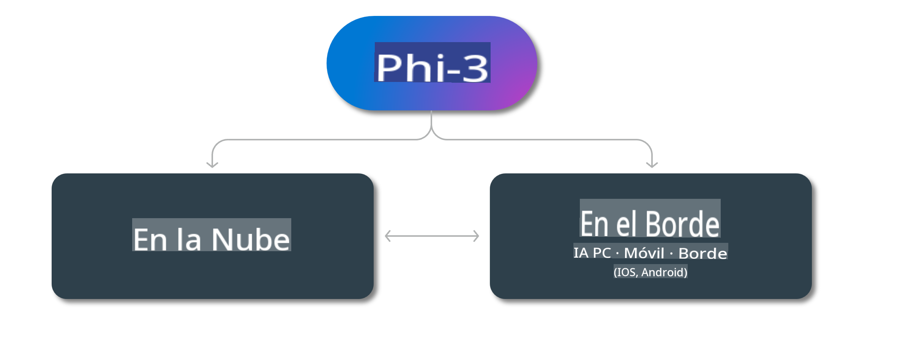

# Modelos Phi-3 y Disponibilidad en distintas plataformas

## Escenarios Edge y Cloud

## Disponibilidad de Modelos y Recursos

| | | | | | | | | |
|-|-|-|-|-|-|-|-|-|
|Modelo|Entrada|Longitud del Contenido|Azure AI (MaaS)|Azure ML (MaaP)|ONNX|Hugging Face|Ollama|Nvidia NIM|
|Phi-3-vision-128k-instruct|Texto+Imagen|128k|[Playground y Despliegue](https://ai.azure.com/explore/models/Phi-3-vision-128k-instruct/version/2/registry/azureml)|[Playground, Despliegue y Ajuste Fino](https://ml.azure.com/registries/azureml/models/Phi-3-vision-128k-instruct/version/2)|[CUDA](https://huggingface.co/microsoft/Phi-3-vision-128k-instruct-onnx-cuda/tree/main),[CPU](https://huggingface.co/microsoft/Phi-3-vision-128k-instruct-onnx-cpu/tree/main), [DirectML](https://huggingface.co/microsoft/Phi-3-vision-128k-instruct-onnx-directml/tree/main)|[Descargar](https://huggingface.co/microsoft/Phi-3-vision-128k-instruct)|-NA-|[APIs NIM](https://build.nvidia.com/microsoft/phi-3-vision-128k-instruct)|
|Phi-3-mini-4k-instruct|Texto|4k|[Playground y Despliegue](https://aka.ms/phi3-mini-4k-azure-ml)|[Playground, Despliegue](https://aka.ms/phi3-mini-4k-azure-ml) y Ajuste Fino|[CUDA](https://huggingface.co/microsoft/Phi-3-mini-4k-instruct-onnx), [Web](https://huggingface.co/microsoft/Phi-3-mini-4k-instruct-onnx)|[Playground y Descargar](https://huggingface.co/chat/models/microsoft/Phi-3-mini-4k-instruct)|[GGUF](https://huggingface.co/microsoft/Phi-3-mini-4k-instruct-gguf)|[APIs NIM](https://build.nvidia.com/microsoft/phi-3-mini-4k)|
|Phi-3-mini-128k-instruct|Texto|128k|[Playground y Despliegue](https://ai.azure.com/explore/models/Phi-3-mini-128k-instruct/version/9/registry/azureml)|[Playground, Despliegue](https://ai.azure.com/explore/models/Phi-3-mini-128k-instruct/version/9/registry/azureml) y Ajuste Fino|[CUDA](https://huggingface.co/microsoft/Phi-3-mini-128k-instruct-onnx)|[Descargar](https://huggingface.co/microsoft/Phi-3-mini-128k-instruct-onnx)|-NA-|[APIs NIM](https://build.nvidia.com/microsoft/phi-3-mini)|
|Phi-3-small-8k-instruct|Texto|8k|[Playground y Despliegue](https://ml.azure.com/registries/azureml/models/Phi-3-small-8k-instruct/version/2)|[Playground, Despliegue](https://ai.azure.com/explore/models/Phi-3-small-8k-instruct/version/2/registry/azureml) y Ajuste Fino|[CUDA](https://huggingface.co/microsoft/Phi-3-small-8k-instruct-onnx-cuda)|[Descargar](https://huggingface.co/microsoft/Phi-3-small-8k-instruct-onnx-cuda)|-NA-|[APIs NIM](https://build.nvidia.com/microsoft/phi-3-small-8k-instruct?docker=false)|
|Phi-3-small-128k-instruct|Texto|128k|[Playground y Despliegue](https://ai.azure.com/explore/models/Phi-3-small-128k-instruct/version/2/registry/azureml)|[Playground, Despliegue](https://ml.azure.com/registries/azureml/models/Phi-3-small-128k-instruct/version/2) y Ajuste Fino|[CUDA](https://huggingface.co/microsoft/Phi-3-small-128k-instruct-onnx-cuda)|[Descargar](https://huggingface.co/microsoft/Phi-3-small-128k-instruct)|-NA-|[APIs NIM](https://build.nvidia.com/microsoft/phi-3-small-128k-instruct?docker=false)|
|Phi-3-medium-4k-instruct|Texto|4k|[Playground & Deployment](https://huggingface.co/microsoft/Phi-3-medium-4k-instruct)|[Playground, Deployment](https://ml.azure.com/registries/azureml/models/Phi-3-medium-4k-instruct/version/2) & Fine-tuning|[CUDA](https://huggingface.co/microsoft/Phi-3-medium-4k-instruct-onnx-cuda/tree/main), [CPU](https://huggingface.co/microsoft/Phi-3-medium-4k-instruct-onnx-cpu/tree/main), [DirectML](https://huggingface.co/microsoft/Phi-3-medium-4k-instruct-onnx-directml/tree/main)|[Descargar](https://huggingface.co/microsoft/Phi-3-medium-4k-instruct)|-NA-|[NIM APIs](https://build.nvidia.com/microsoft/phi-3-medium-4k-instruct?docker=false)|
|Phi-3-medium-128k-instruct|Texto|128k|[Playground & Deployment](https://ai.azure.com/explore/models/Phi-3-medium-128k-instruct/version/2)|[Playground, Deployment](https://ml.azure.com/registries/azureml/models/Phi-3-medium-128k-instruct/version/2) & Fine-tuning|[CUDA](https://huggingface.co/microsoft/Phi-3-medium-128k-instruct-onnx-cuda/tree/main), [CPU](https://huggingface.co/microsoft/Phi-3-medium-128k-instruct-onnx-cpu/tree/main), [DirectML](https://huggingface.co/microsoft/Phi-3-medium-128k-instruct-onnx-directml/tree/main)|[Descargar](https://huggingface.co/microsoft/Phi-3-medium-128k-instruct)|-NA-|-NA-|

Aviso legal: La traducción fue realizada a partir del original por un modelo de inteligencia artificial y puede no ser perfecta. Por favor, revise el resultado y haga las correcciones necesarias.