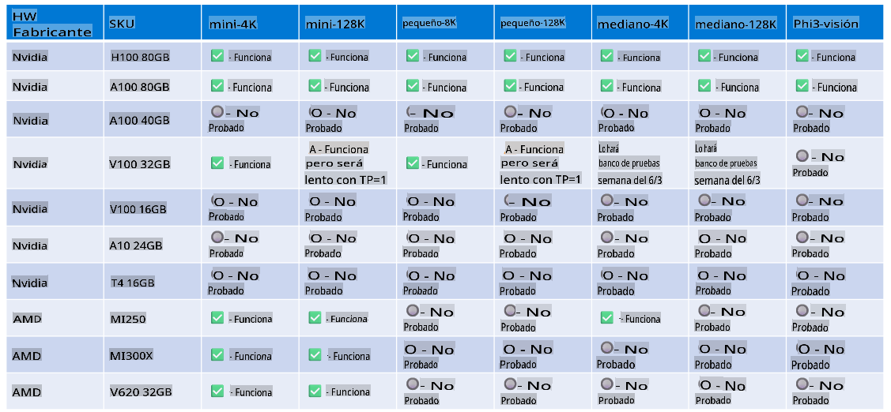

# Soporte de Hardware Phi-3

Microsoft Phi-3 ha sido optimizado para ONNX Runtime y soporta Windows DirectML. Funciona bien en varios tipos de hardware, incluidos GPUs, CPUs e incluso dispositivos móviles.

## Hardware del Dispositivo
Específicamente, el hardware soportado incluye:

- GPU SKU: RTX 4090 (DirectML)
- GPU SKU: 1 A100 80GB (CUDA)
- CPU SKU: Standard F64s v2 (64 vCPUs, 128 GiB de memoria)

## SKU Móvil

- Android - Samsung Galaxy S21
- Apple iPhone 14 o superior Procesador A16/A17

## Especificación de Hardware Phi-3

- Configuración Mínima Requerida.
- Windows: GPU compatible con DirectX 12 y un mínimo de 4GB de RAM combinada

CUDA: GPU NVIDIA con capacidad de cómputo >= 7.02



## Ejecutando onnxruntime en múltiples GPUs

Los modelos ONNX actualmente disponibles para Phi-3 son solo para 1 GPU. Es posible soportar múltiples GPUs para el modelo Phi-3, pero ORT con 2 GPUs no garantiza que proporcionará más rendimiento en comparación con 2 instancias de ort.

En [Build 2024 el equipo de GenAI ONNX](https://youtu.be/WLW4SE8M9i8?si=EtG04UwDvcjunyfC) anunció que habilitaron instancias múltiples en lugar de múltiples GPUs para los modelos Phi.

Actualmente, esto te permite ejecutar una instancia de onnxruntime o onnxruntime-genai con la variable de entorno CUDA_VISIBLE_DEVICES de esta manera.

```Python
CUDA_VISIBLE_DEVICES=0 python infer.py
CUDA_VISIBLE_DEVICES=1 python infer.py
```

Siéntete libre de explorar Phi-3 más a fondo en [Azure AI Studio](https://ai.azure.com)

**Descargo de responsabilidad**:
Este documento ha sido traducido utilizando servicios de traducción automática basados en IA. Aunque nos esforzamos por lograr precisión, tenga en cuenta que las traducciones automatizadas pueden contener errores o inexactitudes. El documento original en su idioma nativo debe considerarse la fuente autorizada. Para información crítica, se recomienda la traducción profesional humana. No somos responsables de ningún malentendido o interpretación errónea que surja del uso de esta traducción.