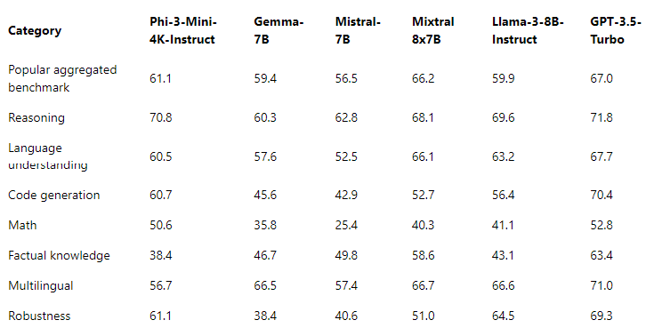
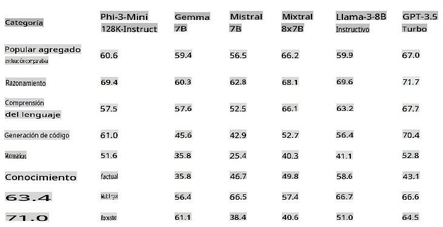
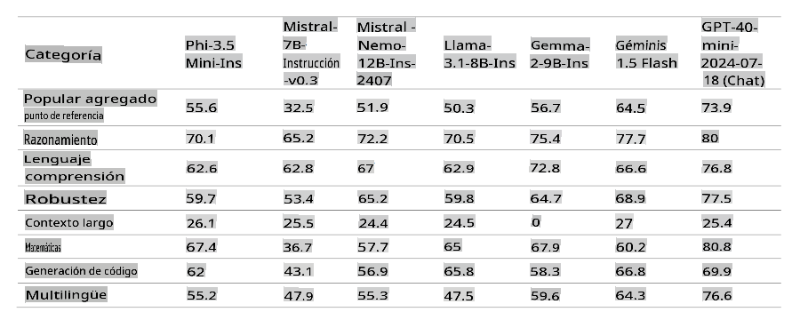
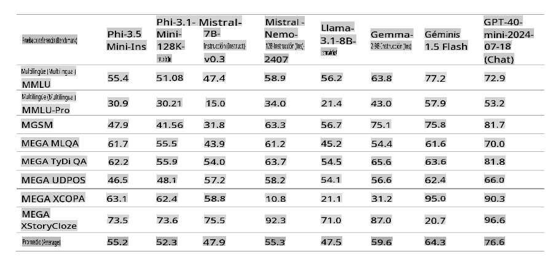
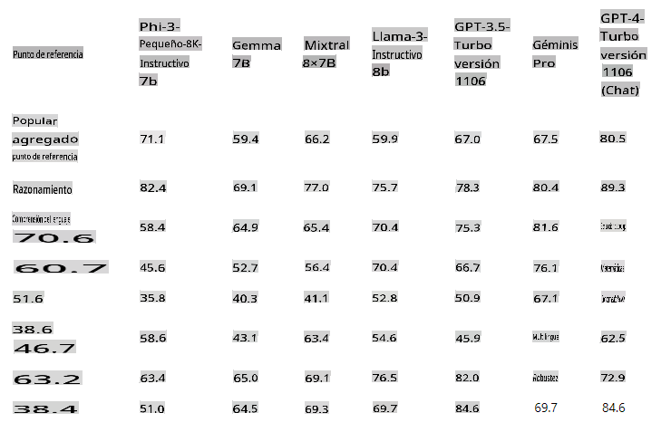
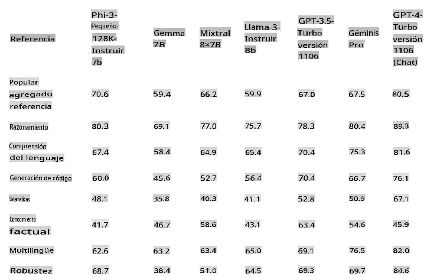
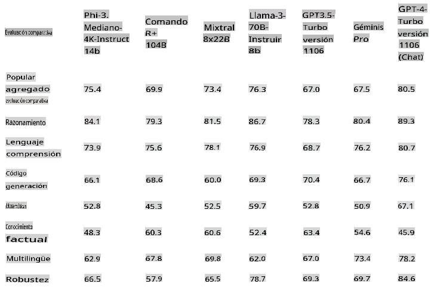
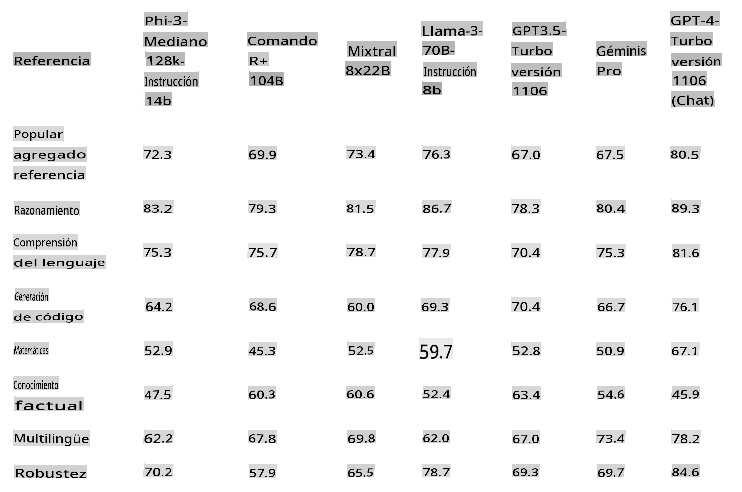
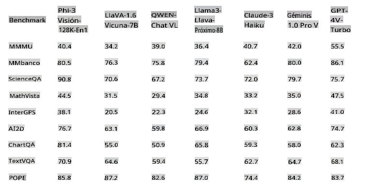
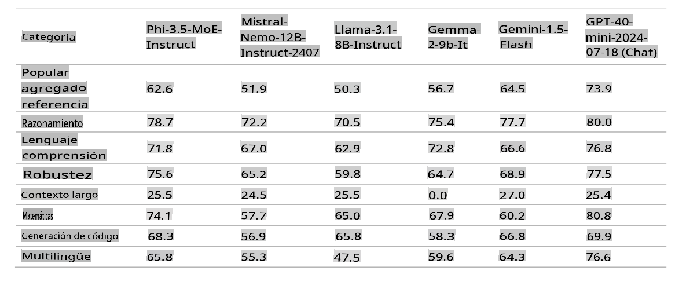

# Familia Phi-3 de Microsoft

Los modelos Phi-3 son los Modelos de Lenguaje Pequeño (SLMs) más capaces y rentables disponibles, superando a modelos de su mismo tamaño y al siguiente tamaño en una variedad de benchmarks de lenguaje, razonamiento, codificación y matemáticas. Esta versión amplía la selección de modelos de alta calidad para los clientes, ofreciendo más opciones prácticas para componer y construir aplicaciones de IA generativa.

La Familia Phi-3 incluye versiones mini, pequeña, mediana y de visión, entrenadas con diferentes cantidades de parámetros para servir a varios escenarios de aplicación. Cada modelo está ajustado para instrucciones y desarrollado de acuerdo con los estándares de IA Responsable, seguridad y protección de Microsoft para garantizar que esté listo para usarse de inmediato. Phi-3-mini supera a modelos el doble de su tamaño, y Phi-3-pequeño y Phi-3-mediano superan a modelos mucho más grandes, incluyendo GPT-3.5T.

## Ejemplo de Tareas de Phi-3

| | |
|-|-|
|Tareas|Phi-3|
|Tareas de Lenguaje|Sí|
|Matemáticas y Razonamiento|Sí|
|Codificación|Sí|
|Llamada de Funciones|No|
|Auto Orquestación (Asistente)|No|
|Modelos de Embedding Dedicados|No|

## Phi-3-mini

Phi-3-mini, un modelo de lenguaje con 3.8 mil millones de parámetros, está disponible en [Microsoft Azure AI Studio](https://ai.azure.com/explore/models?selectedCollection=phi), [Hugging Face](https://huggingface.co/collections/microsoft/phi-3-6626e15e9585a200d2d761e3) y [Ollama](https://ollama.com/library/phi3). Ofrece dos longitudes de contexto: [128K](https://ai.azure.com/explore/models/Phi-3-mini-128k-instruct/version/9/registry/azureml) y [4K](https://ai.azure.com/explore/models/Phi-3-mini-4k-instruct/version/9/registry/azureml).

Phi-3-mini es un modelo de lenguaje basado en Transformer con 3.8 mil millones de parámetros. Fue entrenado utilizando datos de alta calidad que contienen información educativa útil, complementados con nuevas fuentes de datos que consisten en varios textos sintéticos de NLP y conjuntos de datos de chat internos y externos, lo que mejora significativamente las capacidades de chat. Además, Phi-3-mini ha sido afinado para chat después del preentrenamiento a través de afinado supervisado (SFT) y Optimización de Preferencia Directa (DPO). Después de este post-entrenamiento, Phi-3-mini ha demostrado mejoras significativas en varias capacidades, particularmente en alineación, robustez y seguridad. El modelo es parte de la familia Phi-3 y viene en la versión mini con dos variantes, 4K y 128K, que representan la longitud del contexto (en tokens) que puede soportar.

## Phi-3.5-mini-instruct 

[Phi-3.5 mini](https://ai.azure.com/explore/models/Phi-3.5-mini-instruct/version/1/registry/azureml) es un modelo ligero y de última generación construido sobre los conjuntos de datos utilizados para Phi-3: datos sintéticos y sitios web públicos filtrados, con un enfoque en datos de muy alta calidad y densos en razonamiento. El modelo pertenece a la familia de modelos Phi-3 y soporta una longitud de contexto de 128K tokens. El modelo pasó por un riguroso proceso de mejora, incorporando afinado supervisado, optimización de política proximal y optimización de preferencia directa para asegurar una adherencia precisa a las instrucciones y robustas medidas de seguridad.

Phi-3.5 Mini tiene 3.8 mil millones de parámetros y es un modelo Transformer de decodificador denso que utiliza el mismo tokenizador que Phi-3 Mini.

En general, el modelo con solo 3.8 mil millones de parámetros logra un nivel similar de comprensión del lenguaje multilingüe y capacidad de razonamiento que modelos mucho más grandes. Sin embargo, todavía está fundamentalmente limitado por su tamaño para ciertas tareas. El modelo simplemente no tiene la capacidad de almacenar demasiados conocimientos fácticos, por lo tanto, los usuarios pueden experimentar incorrecciones fácticas. Sin embargo, creemos que tal debilidad puede resolverse al aumentar Phi-3.5 con un motor de búsqueda, particularmente cuando se usa el modelo en configuraciones RAG.

### Soporte de Lenguaje 

La tabla a continuación destaca la capacidad multilingüe del Phi-3 en los conjuntos de datos multilingües MMLU, MEGA y MMLU-pro. En general, observamos que incluso con solo 3.8 mil millones de parámetros activos, el modelo es muy competitivo en tareas multilingües en comparación con otros modelos con muchos más parámetros activos.

## Phi-3-small

Phi-3-small, un modelo de lenguaje con 7 mil millones de parámetros, disponible en dos longitudes de contexto [128K](https://ai.azure.com/explore/models/Phi-3-small-128k-instruct/version/2/registry/azureml) y [8K](https://ai.azure.com/explore/models/Phi-3-small-8k-instruct/version/2/registry/azureml), supera a GPT-3.5T en una variedad de benchmarks de lenguaje, razonamiento, codificación y matemáticas.

Phi-3-small es un modelo de lenguaje basado en Transformer con 7 mil millones de parámetros. Fue entrenado utilizando datos de alta calidad que contienen información educativa útil, complementados con nuevas fuentes de datos que consisten en varios textos sintéticos de NLP y conjuntos de datos de chat internos y externos, lo que mejora significativamente las capacidades de chat. Además, Phi-3-small ha sido afinado para chat después del preentrenamiento a través de afinado supervisado (SFT) y Optimización de Preferencia Directa (DPO). Después de este post-entrenamiento, Phi-3-small ha mostrado mejoras significativas en varias capacidades, particularmente en alineación, robustez y seguridad. Phi-3-small también ha sido entrenado más intensivamente en conjuntos de datos multilingües en comparación con Phi-3-Mini. La familia de modelos ofrece dos variantes, 8K y 128K, que representan la longitud del contexto (en tokens) que puede soportar.

## Phi-3-medium

Phi-3-medium, un modelo de lenguaje con 14 mil millones de parámetros, disponible en dos longitudes de contexto [128K](https://ai.azure.com/explore/models/Phi-3-medium-128k-instruct/version/2/registry/azureml) y [4K](https://ai.azure.com/explore/models/Phi-3-medium-4k-instruct/version/2/registry/azureml), continúa la tendencia superando a Gemini 1.0 Pro.

Phi-3-medium es un modelo de lenguaje basado en Transformer con 14 mil millones de parámetros. Fue entrenado utilizando datos de alta calidad que contienen información educativa útil, complementados con nuevas fuentes de datos que consisten en varios textos sintéticos de NLP y conjuntos de datos de chat internos y externos, lo que mejora significativamente las capacidades de chat. Además, Phi-3-medium ha sido afinado para chat después del preentrenamiento a través de afinado supervisado (SFT) y Optimización de Preferencia Directa (DPO). Después de este post-entrenamiento, Phi-3-medium ha exhibido mejoras significativas en varias capacidades, particularmente en alineación, robustez y seguridad. La familia de modelos ofrece dos variantes, 4K y 128K, que representan la longitud del contexto (en tokens) que puede soportar.

[!NOTE]
Recomendamos cambiar a Phi-3.5-MoE como una mejora de Phi-3-medium ya que el modelo MoE es mucho mejor y más rentable.

## Phi-3-vision

El [Phi-3-vision](https://ai.azure.com/explore/models/Phi-3-vision-128k-instruct/version/2/registry/azureml), un modelo multimodal de 4.2 mil millones de parámetros con capacidades de lenguaje y visión, supera a modelos más grandes como Claude-3 Haiku y Gemini 1.0 Pro V en tareas generales de razonamiento visual, OCR y comprensión de tablas y gráficos.

Phi-3-vision es el primer modelo multimodal en la familia Phi-3, uniendo texto e imágenes. Phi-3-vision se puede usar para razonar sobre imágenes del mundo real y extraer y razonar sobre texto de imágenes. También ha sido optimizado para la comprensión de gráficos y diagramas y se puede usar para generar insights y responder preguntas. Phi-3-vision se basa en las capacidades de lenguaje de Phi-3-mini, continuando con una alta calidad de razonamiento en lenguaje e imágenes en un tamaño pequeño.

## Phi-3.5-vision

[Phi-3.5 Vision](https://ai.azure.com/explore/models/Phi-3.5-vision-instruct/version/1/registry/azureml) es un modelo multimodal ligero y de última generación construido sobre conjuntos de datos que incluyen datos sintéticos y sitios web públicos filtrados, con un enfoque en datos de muy alta calidad y densos en razonamiento tanto en texto como en visión. El modelo pertenece a la familia de modelos Phi-3, y la versión multimodal viene con una longitud de contexto de 128K tokens que puede soportar. El modelo pasó por un riguroso proceso de mejora, incorporando afinado supervisado y optimización de preferencia directa para asegurar una adherencia precisa a las instrucciones y robustas medidas de seguridad.

Phi-3.5 Vision tiene 4.2 mil millones de parámetros y contiene un codificador de imágenes, conector, proyector y el modelo de lenguaje Phi-3 Mini.

El modelo está destinado para un uso comercial y de investigación amplio en inglés. El modelo proporciona usos para sistemas de IA de propósito general y aplicaciones con capacidades de entrada visual y de texto que requieren:
1) entornos con restricciones de memoria/cómputo.
2) escenarios con límites de latencia.
3) comprensión general de imágenes.
4) OCR
5) comprensión de gráficos y tablas.
6) comparación de múltiples imágenes.
7) resumen de múltiples imágenes o clips de video.

El modelo Phi-3.5-vision está diseñado para acelerar la investigación sobre modelos de lenguaje y multimodales eficientes, para su uso como un bloque de construcción para características impulsadas por IA generativa.

## Phi-3.5-MoE

[Phi-3.5 MoE](https://ai.azure.com/explore/models/Phi-3.5-MoE-instruct/version/1/registry/azureml) es un modelo ligero y de última generación construido sobre conjuntos de datos utilizados para Phi-3: datos sintéticos y documentos públicos filtrados, con un enfoque en datos de muy alta calidad y densos en razonamiento. El modelo soporta multilingüismo y viene con una longitud de contexto de 128K tokens. El modelo pasó por un riguroso proceso de mejora, incorporando afinado supervisado, optimización de política proximal y optimización de preferencia directa para asegurar una adherencia precisa a las instrucciones y robustas medidas de seguridad.

Phi-3 MoE tiene 16x3.8 mil millones de parámetros con 6.6 mil millones de parámetros activos cuando se usan 2 expertos. El modelo es un modelo Transformer de decodificador solo de mezcla de expertos que utiliza el tokenizador con un tamaño de vocabulario de 32,064.

El modelo está destinado para un uso comercial y de investigación amplio en inglés. El modelo proporciona usos para sistemas de IA de propósito general y aplicaciones que requieren:

1) entornos con restricciones de memoria/cómputo.
2) escenarios con límites de latencia.
3) fuerte razonamiento (especialmente matemáticas y lógica).

El modelo MoE está diseñado para acelerar la investigación sobre modelos de lenguaje y multimodales, para su uso como un bloque de construcción para características impulsadas por IA generativa y requiere recursos de cómputo adicionales.

> [!NOTE]
>
> Los modelos Phi-3 no se desempeñan tan bien en benchmarks de conocimientos fácticos (como TriviaQA) ya que el tamaño más pequeño del modelo resulta en menos capacidad para retener hechos.

## Phi Silica

Estamos introduciendo Phi Silica, que está construido a partir de la serie de modelos Phi y está diseñado específicamente para los NPUs en PCs Copilot+. Windows es la primera plataforma en tener un modelo de lenguaje pequeño (SLM) de última generación construido a medida para el NPU y que se envía de serie. La API Phi Silica junto con OCR, Studio Effects, Live Captions y Recall User Activity APIs estarán disponibles en la Biblioteca de Windows Copilot en junio. Más APIs como Vector Embedding, RAG API y Text Summarization estarán disponibles más adelante.

## **Encuentra todos los modelos Phi-3** 

- [Azure AI](https://ai.azure.com/explore/models?selectedCollection=phi)
- [Hugging Face](https://huggingface.co/collections/microsoft/phi-3-6626e15e9585a200d2d761e3) 

## Modelos ONNX

La diferencia principal entre los dos modelos ONNX, “cpu-int4-rtn-block-32” y “cpu-int4-rtn-block-32-acc-level-4”, es el nivel de precisión. El modelo con “acc-level-4” está diseñado para equilibrar la latencia frente a la precisión, con una pequeña compensación en precisión para un mejor rendimiento, lo cual podría ser particularmente adecuado para dispositivos móviles.

## Ejemplo de Selección de Modelo

| | | | |
|-|-|-|-|
|Necesidad del Cliente|Tarea|Comenzar con|Más Detalles|
|Necesita un modelo que simplemente resuma un hilo de mensajes|Resumen de Conversaciones|Modelo de texto Phi-3|El factor decisivo aquí es que el cliente tiene una tarea de lenguaje bien definida y directa|
|Una aplicación gratuita de tutor de matemáticas para niños|Matemáticas y Razonamiento|Modelos de texto Phi-3|Debido a que la aplicación es gratuita, los clientes quieren una solución que no les cueste de manera recurrente|
|Cámara de Patrulla Autónoma|Análisis de Visión|Phi-Vision|Necesita una solución que pueda funcionar en el borde sin internet|
|Quiere construir un agente de reservas de viajes basado en IA|Necesita planificación compleja, llamada de funciones y orquestación|Modelos GPT|Necesita capacidad para planificar, llamar APIs para reunir información y ejecutar|
|Quiere construir un copiloto para sus empleados|RAG, múltiples dominios, complejo y abierto|Modelos GPT|Escenario abierto, necesita un conocimiento más amplio del mundo, por lo tanto, un modelo más grande es más adecuado|

Aviso legal: La traducción fue realizada a partir del original por un modelo de IA y puede no ser perfecta. 
Por favor, revise el resultado y haga las correcciones necesarias.