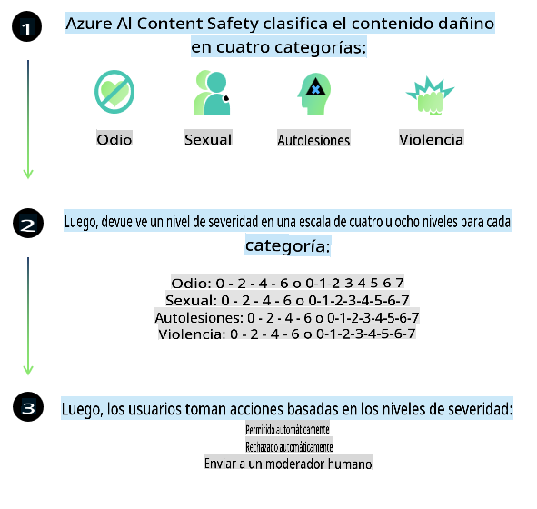
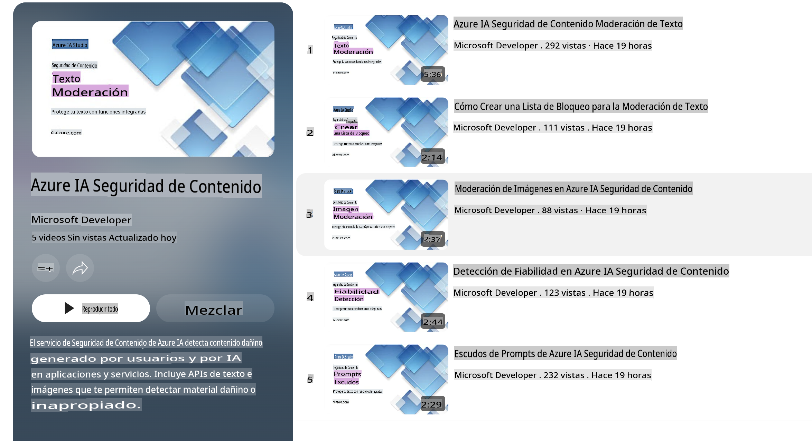

# Seguridad de la IA para modelos Phi

La familia de modelos Phi fue desarrollada en conformidad con el [Estándar de IA Responsable de Microsoft](https://query.prod.cms.rt.microsoft.com/cms/api/am/binary/RE5cmFl), un conjunto de requisitos a nivel empresarial basado en los siguientes seis principios: responsabilidad, transparencia, equidad, confiabilidad y seguridad, privacidad y protección, e inclusión, que forman los [principios de IA Responsable de Microsoft](https://www.microsoft.com/ai/responsible-ai). 

Al igual que los modelos Phi anteriores, se adoptó un enfoque multifacético de evaluación de seguridad y post-entrenamiento de seguridad, con medidas adicionales para tener en cuenta las capacidades multilingües de esta versión. Nuestro enfoque para el entrenamiento y las evaluaciones de seguridad, incluyendo pruebas en múltiples idiomas y categorías de riesgo, se describe en el [Documento de Post-entrenamiento de Seguridad de Phi](https://arxiv.org/abs/2407.13833). Aunque los modelos Phi se benefician de este enfoque, los desarrolladores deben aplicar las mejores prácticas de IA Responsable, incluyendo mapear, medir y mitigar los riesgos asociados con su caso de uso específico y su contexto cultural y lingüístico.

## Mejores prácticas

Al igual que otros modelos, la familia de modelos Phi puede comportarse de maneras que sean injustas, poco confiables u ofensivas.

Algunos de los comportamientos limitantes de los SLM y LLM que debes tener en cuenta incluyen:

- **Calidad del servicio:** Los modelos Phi están entrenados principalmente con texto en inglés. Los idiomas distintos del inglés tendrán un peor rendimiento. Las variedades del inglés con menor representación en los datos de entrenamiento pueden experimentar un rendimiento inferior en comparación con el inglés estadounidense estándar.
- **Representación de daños y perpetuación de estereotipos:** Estos modelos pueden sobre-representar o sub-representar a ciertos grupos de personas, borrar la representación de algunos grupos o reforzar estereotipos negativos o degradantes. A pesar del post-entrenamiento de seguridad, estas limitaciones pueden seguir presentes debido a los diferentes niveles de representación de distintos grupos o a la prevalencia de ejemplos de estereotipos negativos en los datos de entrenamiento que reflejan patrones reales y sesgos sociales.
- **Contenido inapropiado u ofensivo:** Estos modelos pueden generar otros tipos de contenido inapropiado u ofensivo, lo que podría hacerlos inadecuados para contextos sensibles sin mitigaciones adicionales específicas para el caso de uso.
- **Confiabilidad de la información:** Los modelos de lenguaje pueden generar contenido sin sentido o fabricar información que podría sonar razonable pero que es inexacta o desactualizada.
- **Alcance limitado para código:** La mayoría de los datos de entrenamiento de Phi-3 están basados en Python y utilizan paquetes comunes como "typing, math, random, collections, datetime, itertools". Si el modelo genera scripts en Python que utilizan otros paquetes o scripts en otros lenguajes, recomendamos encarecidamente que los usuarios verifiquen manualmente todos los usos de las API.

Los desarrolladores deben aplicar las mejores prácticas de IA Responsable y son responsables de garantizar que un caso de uso específico cumpla con las leyes y regulaciones pertinentes (por ejemplo, privacidad, comercio, etc.).

## Consideraciones de IA Responsable

Al igual que otros modelos de lenguaje, los modelos de la serie Phi pueden comportarse de maneras que sean injustas, poco confiables u ofensivas. Algunos de los comportamientos limitantes que se deben tener en cuenta incluyen:

**Calidad del servicio:** Los modelos Phi están entrenados principalmente con texto en inglés. Los idiomas distintos del inglés tendrán un peor rendimiento. Las variedades del inglés con menor representación en los datos de entrenamiento pueden experimentar un rendimiento inferior en comparación con el inglés estadounidense estándar.

**Representación de daños y perpetuación de estereotipos:** Estos modelos pueden sobre-representar o sub-representar a ciertos grupos de personas, borrar la representación de algunos grupos o reforzar estereotipos negativos o degradantes. A pesar del post-entrenamiento de seguridad, estas limitaciones pueden seguir presentes debido a los diferentes niveles de representación de distintos grupos o a la prevalencia de ejemplos de estereotipos negativos en los datos de entrenamiento que reflejan patrones reales y sesgos sociales.

**Contenido inapropiado u ofensivo:** Estos modelos pueden generar otros tipos de contenido inapropiado u ofensivo, lo que podría hacerlos inadecuados para contextos sensibles sin mitigaciones adicionales específicas para el caso de uso.

**Confiabilidad de la información:** Los modelos de lenguaje pueden generar contenido sin sentido o fabricar información que podría sonar razonable pero que es inexacta o desactualizada.

**Alcance limitado para código:** La mayoría de los datos de entrenamiento de Phi-3 están basados en Python y utilizan paquetes comunes como "typing, math, random, collections, datetime, itertools". Si el modelo genera scripts en Python que utilizan otros paquetes o scripts en otros lenguajes, recomendamos encarecidamente que los usuarios verifiquen manualmente todos los usos de las API.

Los desarrolladores deben aplicar las mejores prácticas de IA Responsable y son responsables de garantizar que un caso de uso específico cumpla con las leyes y regulaciones pertinentes (por ejemplo, privacidad, comercio, etc.). Las áreas importantes a considerar incluyen:

**Asignación:** Los modelos pueden no ser adecuados para escenarios que puedan tener un impacto significativo en el estado legal o la asignación de recursos u oportunidades de vida (por ejemplo, vivienda, empleo, crédito, etc.) sin evaluaciones adicionales y técnicas de des-sesgo.

**Escenarios de alto riesgo:** Los desarrolladores deben evaluar la idoneidad de usar modelos en escenarios de alto riesgo donde resultados injustos, poco confiables u ofensivos podrían ser extremadamente costosos o causar daño. Esto incluye proporcionar asesoramiento en dominios sensibles o especializados donde la precisión y la confiabilidad son críticas (por ejemplo, asesoramiento legal o de salud). Deben implementarse salvaguardas adicionales a nivel de la aplicación según el contexto de implementación.

**Desinformación:** Los modelos pueden producir información inexacta. Los desarrolladores deben seguir las mejores prácticas de transparencia e informar a los usuarios finales que están interactuando con un sistema de IA. A nivel de la aplicación, los desarrolladores pueden construir mecanismos de retroalimentación y pipelines para fundamentar las respuestas en información contextual específica para el caso de uso, una técnica conocida como Generación Aumentada por Recuperación (RAG).

**Generación de contenido dañino:** Los desarrolladores deben evaluar los resultados en función de su contexto y utilizar clasificadores de seguridad disponibles o soluciones personalizadas adecuadas para su caso de uso.

**Uso indebido:** Otras formas de uso indebido, como fraude, spam o producción de malware, pueden ser posibles, y los desarrolladores deben garantizar que sus aplicaciones no violen leyes y regulaciones aplicables.

### Ajuste fino y seguridad del contenido generado por IA

Después de ajustar un modelo, recomendamos encarecidamente aprovechar las medidas de [Azure AI Content Safety](https://learn.microsoft.com/azure/ai-services/content-safety/overview) para monitorear el contenido generado por los modelos, identificar y bloquear posibles riesgos, amenazas y problemas de calidad.

[Azure AI Content Safety](https://learn.microsoft.com/azure/ai-services/content-safety/overview) admite tanto contenido de texto como de imágenes. Puede implementarse en la nube, contenedores desconectados y en dispositivos edge/embebidos.

## Descripción general de Azure AI Content Safety

Azure AI Content Safety no es una solución única para todos; puede personalizarse para alinearse con las políticas específicas de las empresas. Además, sus modelos multilingües le permiten comprender varios idiomas simultáneamente.

- **Azure AI Content Safety**
- **Microsoft Developer**
- **5 videos**

El servicio Azure AI Content Safety detecta contenido dañino generado por usuarios y por IA en aplicaciones y servicios. Incluye API de texto e imágenes que permiten detectar material dañino o inapropiado.

[Lista de reproducción de AI Content Safety](https://www.youtube.com/playlist?list=PLlrxD0HtieHjaQ9bJjyp1T7FeCbmVcPkQ)

**Descargo de responsabilidad**:  
Este documento ha sido traducido utilizando servicios de traducción automatizada basados en inteligencia artificial. Si bien nos esforzamos por garantizar la precisión, tenga en cuenta que las traducciones automáticas pueden contener errores o imprecisiones. El documento original en su idioma nativo debe considerarse la fuente autorizada. Para información crítica, se recomienda una traducción profesional realizada por humanos. No nos hacemos responsables de malentendidos o interpretaciones erróneas que puedan surgir del uso de esta traducción.