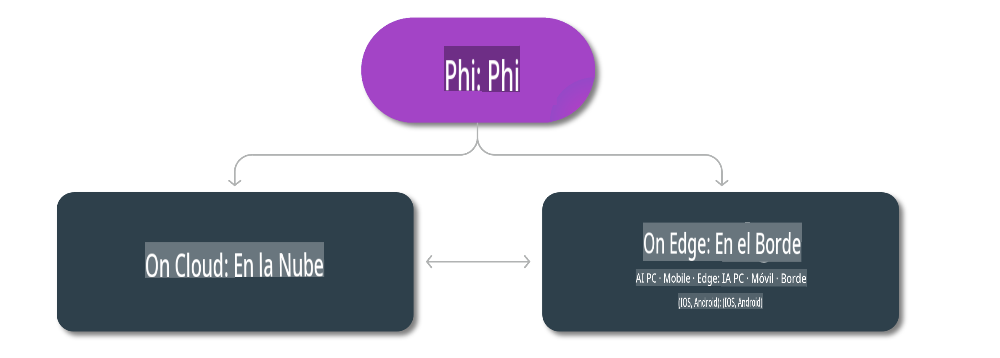

# Modelos Phi y Disponibilidad en plataformas

## Escenarios de Edge y Nube

## Disponibilidad de Modelos y Recursos

| | | | | | | | | |
|-|-|-|-|-|-|-|-|-|
|Modelo|Entrada|Longitud de Contenido|Azure AI (MaaS)|Azure ML (MaaP)|ONNX|Hugging Face|Ollama|Nvidia NIM|
|Phi-3-vision-128k-instruct|Texto+Imagen|128k|[Playground y Despliegue](https://ai.azure.com/explore/models/Phi-3-vision-128k-instruct/version/2/registry/azureml)|[Playground, Despliegue y Ajuste Fino](https://ml.azure.com/registries/azureml/models/Phi-3-vision-128k-instruct/version/2)|[CUDA](https://huggingface.co/microsoft/Phi-3-vision-128k-instruct-onnx-cuda/tree/main),[CPU](https://huggingface.co/microsoft/Phi-3-vision-128k-instruct-onnx-cpu/tree/main), [DirectML](https://huggingface.co/microsoft/Phi-3-vision-128k-instruct-onnx-directml/tree/main)|[Descargar](https://huggingface.co/microsoft/Phi-3-vision-128k-instruct)|-NA-|[APIs NIM](https://build.nvidia.com/microsoft/phi-3-vision-128k-instruct)|
|Phi-3-mini-4k-instruct|Texto|4k|[Playground y Despliegue](https://aka.ms/phi3-mini-4k-azure-ml)|[Playground, Despliegue](https://aka.ms/phi3-mini-4k-azure-ml) y Ajuste Fino|[CUDA](https://huggingface.co/microsoft/Phi-3-mini-4k-instruct-onnx), [Web](https://huggingface.co/microsoft/Phi-3-mini-4k-instruct-onnx)|[Playground y Descargar](https://huggingface.co/chat/models/microsoft/Phi-3-mini-4k-instruct)|[GGUF](https://huggingface.co/microsoft/Phi-3-mini-4k-instruct-gguf)|[APIs NIM](https://build.nvidia.com/microsoft/phi-3-mini-4k)|
|Phi-3-mini-128k-instruct|Texto|128k|[Playground y Despliegue](https://ai.azure.com/explore/models/Phi-3-mini-128k-instruct/version/9/registry/azureml)|[Playground, Despliegue](https://ai.azure.com/explore/models/Phi-3-mini-128k-instruct/version/9/registry/azureml) y Ajuste Fino|[CUDA](https://huggingface.co/microsoft/Phi-3-mini-128k-instruct-onnx)|[Descargar](https://huggingface.co/microsoft/Phi-3-mini-128k-instruct-onnx)|-NA-|[APIs NIM](https://build.nvidia.com/microsoft/phi-3-mini)|
|Phi-3-small-8k-instruct|Texto|8k|[Playground y Despliegue](https://ml.azure.com/registries/azureml/models/Phi-3-small-8k-instruct/version/2)|[Playground, Despliegue](https://ai.azure.com/explore/models/Phi-3-small-8k-instruct/version/2/registry/azureml) y Ajuste Fino|[CUDA](https://huggingface.co/microsoft/Phi-3-small-8k-instruct-onnx-cuda)|[Descargar](https://huggingface.co/microsoft/Phi-3-small-8k-instruct-onnx-cuda)|-NA-|[APIs NIM](https://build.nvidia.com/microsoft/phi-3-small-8k-instruct?docker=false)|
|Phi-3-small-128k-instruct|Texto|128k|[Playground y Despliegue](https://ai.azure.com/explore/models/Phi-3-small-128k-instruct/version/2/registry/azureml)|[Playground, Despliegue](https://ml.azure.com/registries/azureml/models/Phi-3-small-128k-instruct/version/2) y Ajuste Fino|[CUDA](https://huggingface.co/microsoft/Phi-3-medium-128k-instruct-onnx-cuda)|[Descargar](https://huggingface.co/microsoft/Phi-3-small-128k-instruct)|-NA-|[APIs NIM](https://build.nvidia.com/microsoft/phi-3-small-128k-instruct?docker=false)|
|Phi-3-medium-4k-instruct|Texto|4k|[Playground y Despliegue](https://huggingface.co/microsoft/Phi-3-medium-4k-instruct)|[Playground, Despliegue](https://ml.azure.com/registries/azureml/models/Phi-3-medium-4k-instruct/version/2) y Ajuste fino|[CUDA](https://huggingface.co/microsoft/Phi-3-medium-4k-instruct-onnx-cuda/tree/main), [CPU](https://huggingface.co/microsoft/Phi-3-medium-4k-instruct-onnx-cpu/tree/main), [DirectML](https://huggingface.co/microsoft/Phi-3-medium-4k-instruct-onnx-directml/tree/main)|[Descargar](https://huggingface.co/microsoft/Phi-3-medium-4k-instruct)|-NA-|[APIs de NIM](https://build.nvidia.com/microsoft/phi-3-medium-4k-instruct?docker=false)|
|Phi-3-medium-128k-instruct|Texto|128k|[Playground y Despliegue](https://ai.azure.com/explore/models/Phi-3-medium-128k-instruct/version/2)|[Playground, Despliegue](https://ml.azure.com/registries/azureml/models/Phi-3-medium-128k-instruct/version/2) y Ajuste fino|[CUDA](https://huggingface.co/microsoft/Phi-3-medium-128k-instruct-onnx-cuda/tree/main), [CPU](https://huggingface.co/microsoft/Phi-3-medium-128k-instruct-onnx-cpu/tree/main), [DirectML](https://huggingface.co/microsoft/Phi-3-medium-128k-instruct-onnx-directml/tree/main)|[Descargar](https://huggingface.co/microsoft/Phi-3-medium-128k-instruct)|-NA-|-NA-|

**Descargo de responsabilidad**:  
Este documento ha sido traducido utilizando servicios de traducción automática basados en inteligencia artificial. Si bien nos esforzamos por garantizar la precisión, tenga en cuenta que las traducciones automatizadas pueden contener errores o imprecisiones. El documento original en su idioma nativo debe considerarse la fuente autorizada. Para información crítica, se recomienda una traducción profesional realizada por humanos. No nos hacemos responsables de malentendidos o interpretaciones erróneas que puedan surgir del uso de esta traducción.