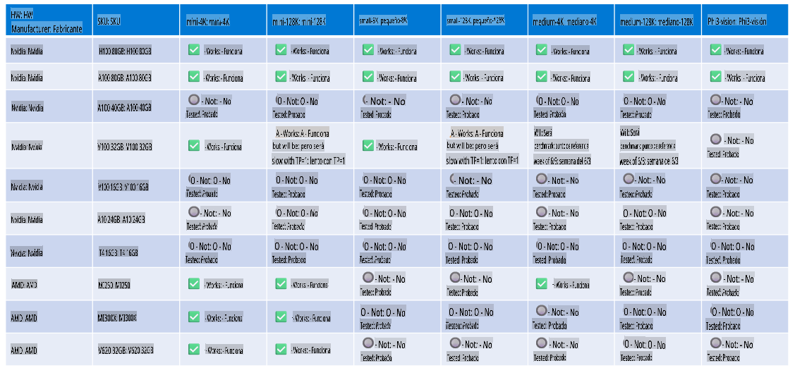

# Soporte de Hardware para Phi

Microsoft Phi ha sido optimizado para ONNX Runtime y es compatible con Windows DirectML. Funciona bien en varios tipos de hardware, incluidos GPUs, CPUs e incluso dispositivos móviles.

## Hardware del Dispositivo
Específicamente, el hardware compatible incluye:

- GPU SKU: RTX 4090 (DirectML)
- GPU SKU: 1 A100 80GB (CUDA)
- CPU SKU: Standard F64s v2 (64 vCPUs, 128 GiB de memoria)

## SKU Móvil

- Android - Samsung Galaxy S21
- Apple iPhone 14 o superior con procesador A16/A17

## Especificación de Hardware para Phi

- Configuración mínima requerida.
- Windows: GPU compatible con DirectX 12 y un mínimo de 4GB de RAM combinada

CUDA: GPU NVIDIA con Compute Capability >= 7.02



## Ejecutar onnxruntime en múltiples GPUs

Actualmente, los modelos ONNX de Phi disponibles son solo para 1 GPU. Es posible habilitar soporte para múltiples GPUs en el modelo Phi, pero ORT con 2 GPUs no garantiza un mayor rendimiento en comparación con ejecutar 2 instancias de ORT. Por favor, consulta [ONNX Runtime](https://onnxruntime.ai/) para las últimas actualizaciones.

En [Build 2024, el equipo de GenAI ONNX](https://youtu.be/WLW4SE8M9i8?si=EtG04UwDvcjunyfC) anunció que habían habilitado instancias múltiples en lugar de múltiples GPUs para los modelos Phi.

Actualmente, esto te permite ejecutar una instancia de onnxruntime o onnxruntime-genai utilizando la variable de entorno CUDA_VISIBLE_DEVICES de la siguiente manera:

```Python
CUDA_VISIBLE_DEVICES=0 python infer.py
CUDA_VISIBLE_DEVICES=1 python infer.py
```

Siéntete libre de explorar más sobre Phi en [Azure AI Foundry](https://ai.azure.com)

**Descargo de responsabilidad**:  
Este documento ha sido traducido utilizando servicios de traducción automática basados en inteligencia artificial. Si bien nos esforzamos por lograr precisión, tenga en cuenta que las traducciones automatizadas pueden contener errores o imprecisiones. El documento original en su idioma nativo debe considerarse como la fuente autorizada. Para información crítica, se recomienda una traducción profesional realizada por humanos. No nos hacemos responsables de malentendidos o interpretaciones erróneas que puedan surgir del uso de esta traducción.