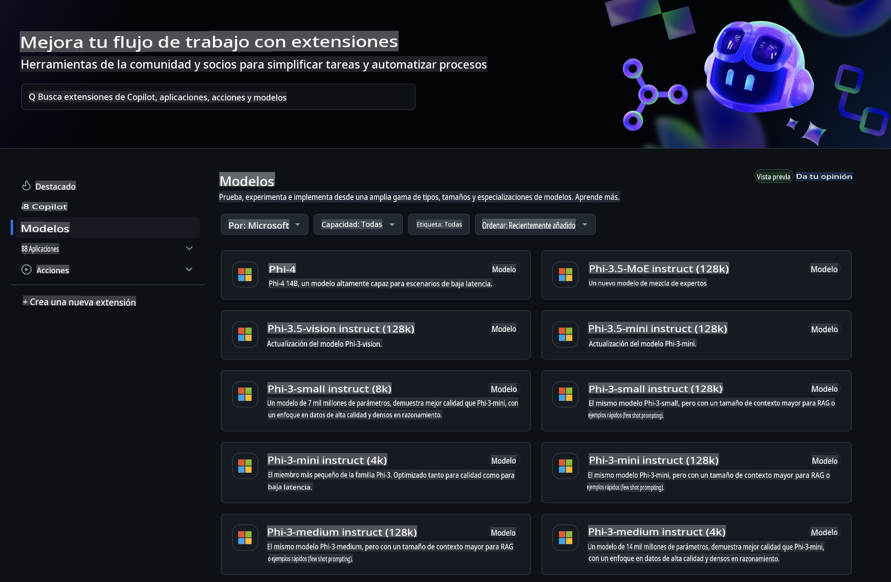
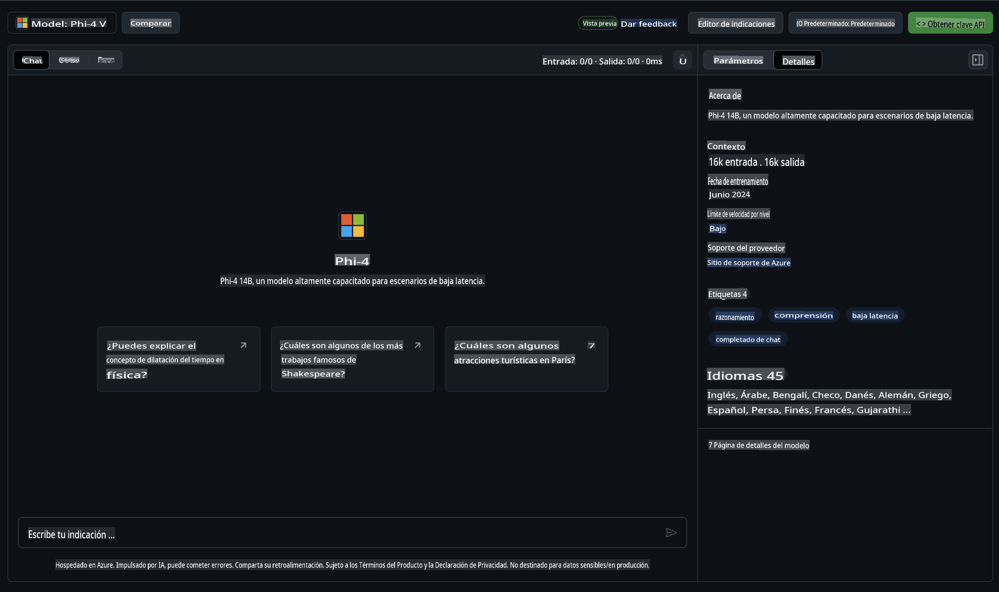
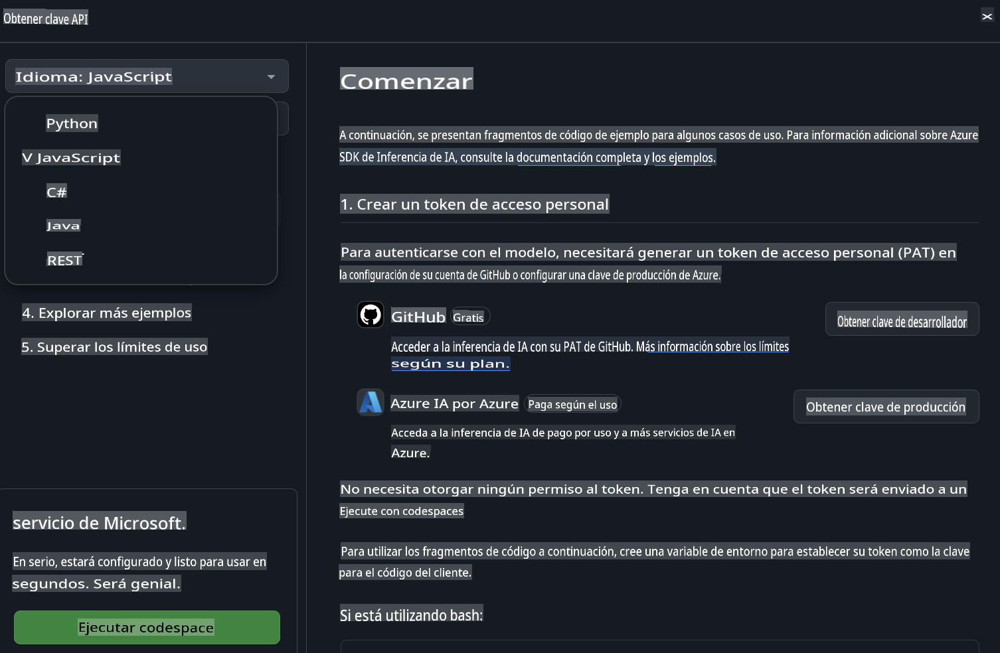
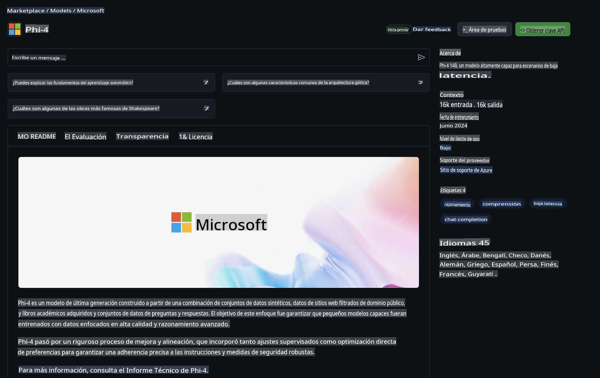

## Familia Phi en Modelos de GitHub

¡Bienvenido a [Modelos de GitHub](https://github.com/marketplace/models)! Tenemos todo listo para que explores los Modelos de IA alojados en Azure AI.



Para obtener más información sobre los modelos disponibles en Modelos de GitHub, consulta el [Marketplace de Modelos de GitHub](https://github.com/marketplace/models).

## Modelos Disponibles

Cada modelo tiene un espacio interactivo dedicado y código de muestra.



### Familia Phi en el Catálogo de Modelos de GitHub

- [Phi-4](https://github.com/marketplace/models/azureml/Phi-4)

- [Phi-3.5-MoE instruct (128k)](https://github.com/marketplace/models/azureml/Phi-3-5-MoE-instruct)

- [Phi-3.5-vision instruct (128k)](https://github.com/marketplace/models/azureml/Phi-3-5-vision-instruct)

- [Phi-3.5-mini instruct (128k)](https://github.com/marketplace/models/azureml/Phi-3-5-mini-instruct)

- [Phi-3-Medium-128k-Instruct](https://github.com/marketplace/models/azureml/Phi-3-medium-128k-instruct)

- [Phi-3-medium-4k-instruct](https://github.com/marketplace/models/azureml/Phi-3-medium-4k-instruct)

- [Phi-3-mini-128k-instruct](https://github.com/marketplace/models/azureml/Phi-3-mini-128k-instruct)

- [Phi-3-mini-4k-instruct](https://github.com/marketplace/models/azureml/Phi-3-mini-4k-instruct)

- [Phi-3-small-128k-instruct](https://github.com/marketplace/models/azureml/Phi-3-small-128k-instruct)

- [Phi-3-small-8k-instruct](https://github.com/marketplace/models/azureml/Phi-3-small-8k-instruct)

## Comenzando

Hay algunos ejemplos básicos listos para que los ejecutes. Puedes encontrarlos en el directorio de muestras. Si prefieres ir directamente a tu lenguaje favorito, los ejemplos están disponibles en los siguientes lenguajes:

- Python
- JavaScript
- C#
- Java
- cURL

También hay un entorno dedicado de Codespaces para ejecutar las muestras y modelos.



## Código de Ejemplo

A continuación, se presentan fragmentos de código de ejemplo para algunos casos de uso. Para obtener información adicional sobre el SDK de Inferencia de Azure AI, consulta la documentación completa y los ejemplos.

## Configuración

1. Crear un token de acceso personal  
No necesitas otorgar permisos al token. Ten en cuenta que el token será enviado a un servicio de Microsoft.

Para usar los fragmentos de código a continuación, crea una variable de entorno para establecer tu token como la clave para el código del cliente.

Si estás usando bash:  
```
export GITHUB_TOKEN="<your-github-token-goes-here>"
```  
Si estás en powershell:  

```
$Env:GITHUB_TOKEN="<your-github-token-goes-here>"
```  

Si estás usando el símbolo del sistema de Windows:  

```
set GITHUB_TOKEN=<your-github-token-goes-here>
```  

## Ejemplo en Python

### Instalar dependencias  
Instala el SDK de Inferencia de Azure AI usando pip (Requiere: Python >=3.8):  

```
pip install azure-ai-inference
```  

### Ejecutar un ejemplo básico de código  

Este ejemplo demuestra una llamada básica a la API de finalización de chat. Utiliza el endpoint de inferencia del modelo de IA de GitHub y tu token de GitHub. La llamada es síncrona.  

```python
import os
from azure.ai.inference import ChatCompletionsClient
from azure.ai.inference.models import SystemMessage, UserMessage
from azure.core.credentials import AzureKeyCredential

endpoint = "https://models.inference.ai.azure.com"
model_name = "Phi-4"
token = os.environ["GITHUB_TOKEN"]

client = ChatCompletionsClient(
    endpoint=endpoint,
    credential=AzureKeyCredential(token),
)

response = client.complete(
    messages=[
        UserMessage(content="I have $20,000 in my savings account, where I receive a 4% profit per year and payments twice a year. Can you please tell me how long it will take for me to become a millionaire? Also, can you please explain the math step by step as if you were explaining it to an uneducated person?"),
    ],
    temperature=0.4,
    top_p=1.0,
    max_tokens=2048,
    model=model_name
)

print(response.choices[0].message.content)
```  

### Ejecutar una conversación de múltiples turnos  

Este ejemplo muestra una conversación de múltiples turnos con la API de finalización de chat. Cuando uses el modelo para una aplicación de chat, necesitarás gestionar el historial de esa conversación y enviar los mensajes más recientes al modelo.  

```
import os
from azure.ai.inference import ChatCompletionsClient
from azure.ai.inference.models import AssistantMessage, SystemMessage, UserMessage
from azure.core.credentials import AzureKeyCredential

token = os.environ["GITHUB_TOKEN"]
endpoint = "https://models.inference.ai.azure.com"
# Replace Model_Name
model_name = "Phi-4"

client = ChatCompletionsClient(
    endpoint=endpoint,
    credential=AzureKeyCredential(token),
)

messages = [
    SystemMessage(content="You are a helpful assistant."),
    UserMessage(content="What is the capital of France?"),
    AssistantMessage(content="The capital of France is Paris."),
    UserMessage(content="What about Spain?"),
]

response = client.complete(messages=messages, model=model_name)

print(response.choices[0].message.content)
```  

### Transmitir la salida  

Para una mejor experiencia de usuario, querrás transmitir la respuesta del modelo para que el primer token aparezca rápidamente y evitar esperar respuestas largas.  

```
import os
from azure.ai.inference import ChatCompletionsClient
from azure.ai.inference.models import SystemMessage, UserMessage
from azure.core.credentials import AzureKeyCredential

token = os.environ["GITHUB_TOKEN"]
endpoint = "https://models.inference.ai.azure.com"
# Replace Model_Name
model_name = "Phi-4"

client = ChatCompletionsClient(
    endpoint=endpoint,
    credential=AzureKeyCredential(token),
)

response = client.complete(
    stream=True,
    messages=[
        SystemMessage(content="You are a helpful assistant."),
        UserMessage(content="Give me 5 good reasons why I should exercise every day."),
    ],
    model=model_name,
)

for update in response:
    if update.choices:
        print(update.choices[0].delta.content or "", end="")

client.close()
```  

## Uso GRATUITO y Límites de Tasa para Modelos de GitHub



Los [límites de tasa para el espacio interactivo y el uso gratuito de la API](https://docs.github.com/en/github-models/prototyping-with-ai-models#rate-limits) están diseñados para ayudarte a experimentar con modelos y prototipar tu aplicación de IA. Para un uso que exceda esos límites y para escalar tu aplicación, debes aprovisionar recursos desde una cuenta de Azure y autenticarte desde allí en lugar de usar tu token de acceso personal de GitHub. No necesitas cambiar nada más en tu código. Usa este enlace para descubrir cómo superar los límites del nivel gratuito en Azure AI.

### Declaraciones

Recuerda que al interactuar con un modelo estás experimentando con IA, por lo que pueden ocurrir errores en el contenido.

La funcionalidad está sujeta a varios límites (incluyendo solicitudes por minuto, solicitudes por día, tokens por solicitud y solicitudes concurrentes) y no está diseñada para casos de uso en producción.

Modelos de GitHub utiliza Azure AI Content Safety. Estos filtros no se pueden desactivar como parte de la experiencia de Modelos de GitHub. Si decides emplear modelos a través de un servicio de pago, configura los filtros de contenido según tus necesidades.

Este servicio está bajo los Términos de Pre-lanzamiento de GitHub.

**Descargo de responsabilidad**:  
Este documento ha sido traducido utilizando servicios de traducción basados en inteligencia artificial. Si bien nos esforzamos por lograr precisión, tenga en cuenta que las traducciones automatizadas pueden contener errores o imprecisiones. El documento original en su idioma nativo debe considerarse como la fuente autorizada. Para información crítica, se recomienda una traducción profesional realizada por humanos. No nos hacemos responsables por malentendidos o interpretaciones erróneas derivadas del uso de esta traducción.