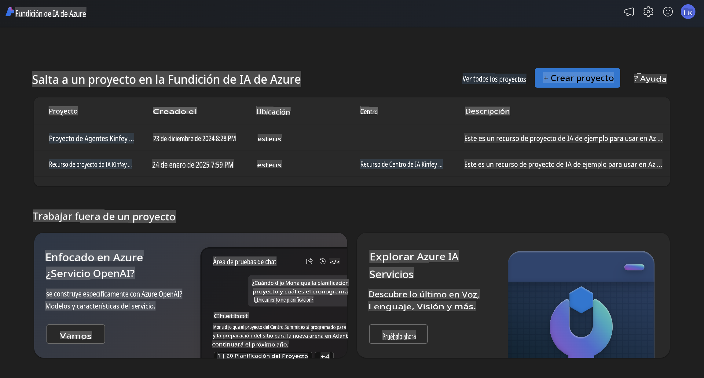
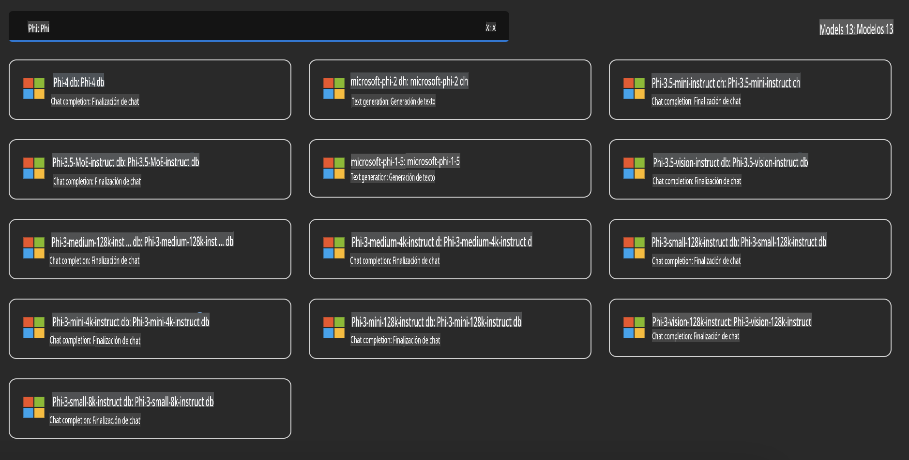
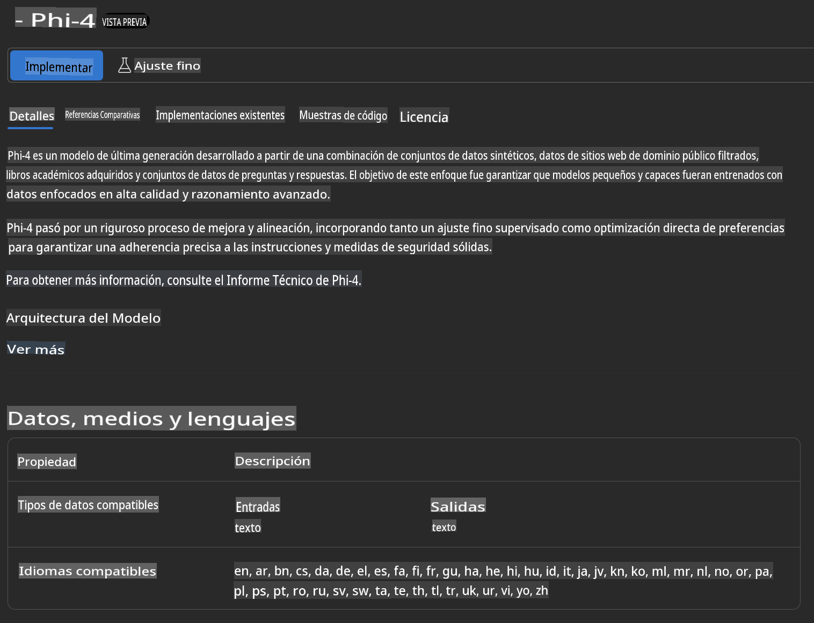
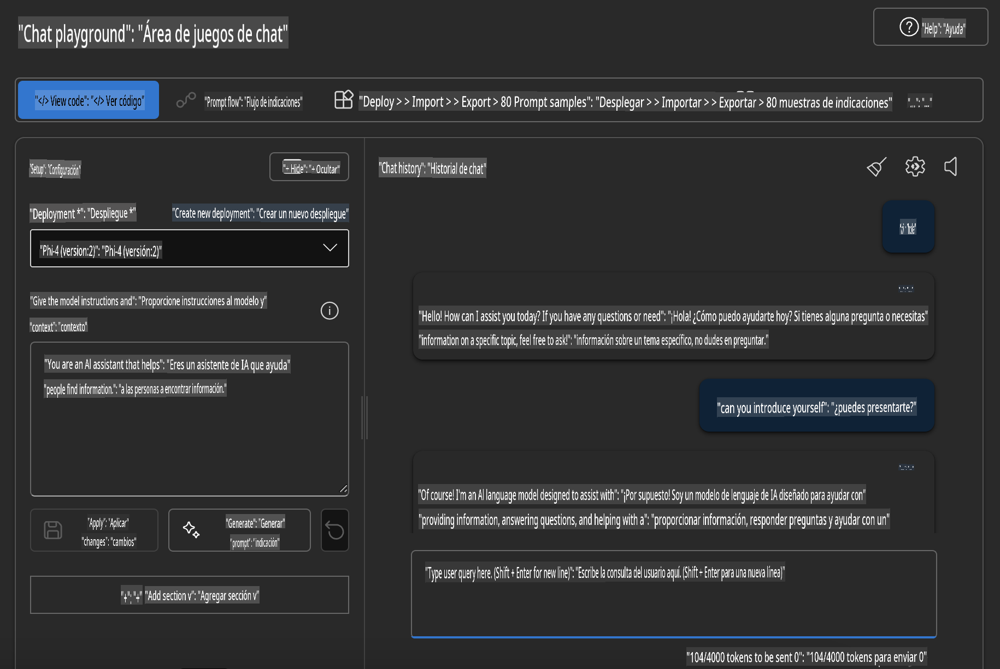

## Familia Phi en Azure AI Foundry

[Azure AI Foundry](https://ai.azure.com) es una plataforma confiable que permite a los desarrolladores impulsar la innovación y dar forma al futuro con IA de manera segura, protegida y responsable.

[Azure AI Foundry](https://ai.azure.com) está diseñada para que los desarrolladores puedan:

- Crear aplicaciones de IA generativa en una plataforma de nivel empresarial.
- Explorar, construir, probar y desplegar utilizando herramientas de IA de vanguardia y modelos de aprendizaje automático, fundamentados en prácticas responsables de IA.
- Colaborar con un equipo durante todo el ciclo de vida del desarrollo de aplicaciones.

Con Azure AI Foundry, puedes explorar una amplia variedad de modelos, servicios y capacidades, y comenzar a construir aplicaciones de IA que mejor se adapten a tus objetivos. La plataforma Azure AI Foundry facilita la escalabilidad para transformar pruebas de concepto en aplicaciones de producción completas con facilidad. El monitoreo continuo y la refinación apoyan el éxito a largo plazo.



Además de usar el servicio Azure AOAI en Azure AI Foundry, también puedes utilizar modelos de terceros en el Catálogo de Modelos de Azure AI Foundry. Esta es una buena opción si deseas usar Azure AI Foundry como tu plataforma de soluciones de IA.

Podemos desplegar rápidamente los Modelos de la Familia Phi a través del Catálogo de Modelos en Azure AI Foundry.



### **Desplegar Phi-4 en Azure AI Foundry**



### **Probar Phi-4 en Azure AI Foundry Playground**



### **Ejecutar código Python para llamar a Azure AI Foundry Phi-4**

```python

import os  
import base64
from openai import AzureOpenAI  
from azure.identity import DefaultAzureCredential, get_bearer_token_provider  
        
endpoint = os.getenv("ENDPOINT_URL", "Your Azure AOAI Service Endpoint")  
deployment = os.getenv("DEPLOYMENT_NAME", "Phi-4")  
      
token_provider = get_bearer_token_provider(  
    DefaultAzureCredential(),  
    "https://cognitiveservices.azure.com/.default"  
)  
  
client = AzureOpenAI(  
    azure_endpoint=endpoint,  
    azure_ad_token_provider=token_provider,  
    api_version="2024-05-01-preview",  
)  
  

chat_prompt = [
    {
        "role": "system",
        "content": "You are an AI assistant that helps people find information."
    },
    {
        "role": "user",
        "content": "can you introduce yourself"
    }
] 
    
# Include speech result if speech is enabled  
messages = chat_prompt 

completion = client.chat.completions.create(  
    model=deployment,  
    messages=messages,
    max_tokens=800,  
    temperature=0.7,  
    top_p=0.95,  
    frequency_penalty=0,  
    presence_penalty=0,
    stop=None,  
    stream=False  
)  
  
print(completion.to_json())  

```

**Descargo de responsabilidad**:  
Este documento ha sido traducido utilizando servicios de traducción automática basados en inteligencia artificial. Si bien nos esforzamos por garantizar la precisión, tenga en cuenta que las traducciones automáticas pueden contener errores o imprecisiones. El documento original en su idioma nativo debe considerarse como la fuente autorizada. Para información crítica, se recomienda una traducción profesional realizada por humanos. No nos hacemos responsables de malentendidos o interpretaciones erróneas que puedan surgir del uso de esta traducción.