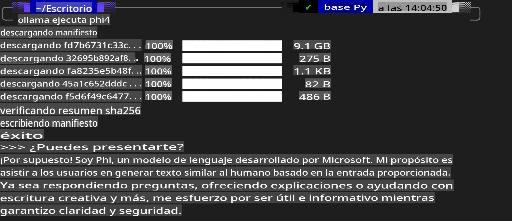
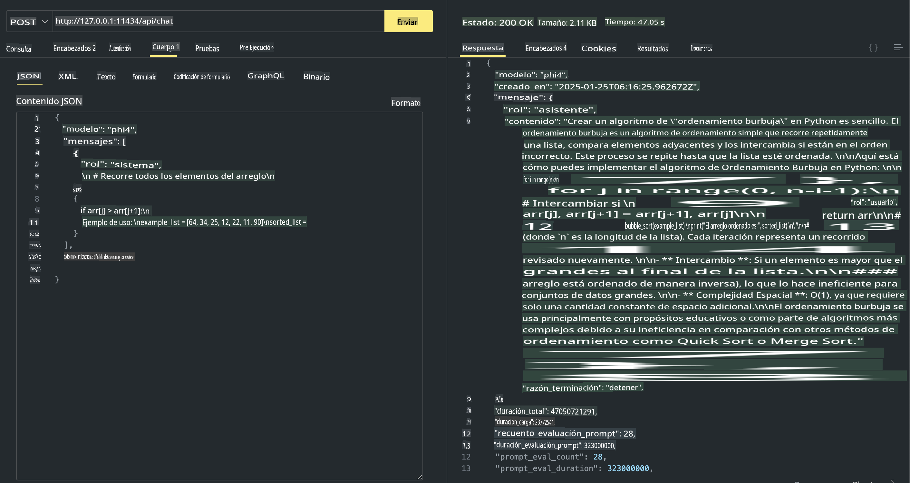

## Familia Phi en Ollama

[Ollama](https://ollama.com) permite que más personas desplieguen directamente LLM o SLM de código abierto mediante scripts sencillos, y también puede construir APIs para ayudar en escenarios de aplicaciones locales de Copilot.

## **1. Instalación**

Ollama es compatible con Windows, macOS y Linux. Puedes instalar Ollama a través de este enlace ([https://ollama.com/download](https://ollama.com/download)). Después de instalarlo con éxito, puedes usar directamente el script de Ollama para llamar a Phi-3 desde una ventana de terminal. Puedes ver todas las [bibliotecas disponibles en Ollama](https://ollama.com/library). Si abres este repositorio en un Codespace, ya tendrá Ollama instalado.

```bash

ollama run phi4

```

> [!NOTE]
> El modelo se descargará la primera vez que lo ejecutes. Por supuesto, también puedes especificar directamente el modelo Phi-4 descargado. Tomamos WSL como ejemplo para ejecutar el comando. Una vez que el modelo se haya descargado con éxito, podrás interactuar directamente en el terminal.



## **2. Llamar a la API phi-4 desde Ollama**

Si deseas llamar a la API Phi-4 generada por Ollama, puedes usar este comando en el terminal para iniciar el servidor Ollama.

```bash

ollama serve

```

> [!NOTE]
> Si estás usando macOS o Linux, ten en cuenta que podrías encontrarte con el siguiente error **"Error: listen tcp 127.0.0.1:11434: bind: address already in use"**. Este error puede aparecer al ejecutar el comando. Puedes ignorar este error, ya que típicamente indica que el servidor ya está en ejecución, o puedes detener y reiniciar Ollama:

**macOS**

```bash

brew services restart ollama

```

**Linux**

```bash

sudo systemctl stop ollama

```

Ollama admite dos APIs: generate y chat. Puedes llamar a la API del modelo proporcionada por Ollama según tus necesidades, enviando solicitudes al servicio local que se ejecuta en el puerto 11434.

**Chat**

```bash

curl http://127.0.0.1:11434/api/chat -d '{
  "model": "phi3",
  "messages": [
    {
      "role": "system",
      "content": "Your are a python developer."
    },
    {
      "role": "user",
      "content": "Help me generate a bubble algorithm"
    }
  ],
  "stream": false
  
}'

This is the result in Postman



## Additional Resources

Check the list of available models in Ollama in [their library](https://ollama.com/library).

Pull your model from the Ollama server using this command

```bash
ollama pull phi4
```

Run the model using this command

```bash
ollama run phi4
```

***Note:*** Visit this link [https://github.com/ollama/ollama/blob/main/docs/api.md](https://github.com/ollama/ollama/blob/main/docs/api.md) to learn more

## Calling Ollama from Python

You can use `requests` or `urllib3` to make requests to the local server endpoints used above. However, a popular way to use Ollama in Python is via the [openai](https://pypi.org/project/openai/) SDK, since Ollama provides OpenAI-compatible server endpoints as well.

Here is an example for phi3-mini:

```python
import openai

client = openai.OpenAI(
    base_url="http://localhost:11434/v1",
    api_key="nokeyneeded",
)

response = client.chat.completions.create(
    model="phi4",
    temperature=0.7,
    n=1,
    messages=[
        {"role": "system", "content": "Eres un asistente útil."},
        {"role": "user", "content": "Escribe un haiku sobre un gato hambriento"},
    ],
)

print("Respuesta:")
print(response.choices[0].message.content)
```

## Calling Ollama from JavaScript 

```javascript
// Ejemplo de resumen de un archivo con Phi-4
script({
    model: "ollama:phi4",
    title: "Resumen con Phi-4",
    system: ["system"],
})

// Ejemplo de resumen
const file = def("FILE", env.files)
$`Resume ${file} en un solo párrafo.`
```

## Calling Ollama from C#

Create a new C# Console application and add the following NuGet package:

```bash
dotnet add package Microsoft.SemanticKernel --version 1.34.0
```

Then replace this code in the `Program.cs` file

```csharp
using Microsoft.SemanticKernel;
using Microsoft.SemanticKernel.ChatCompletion;

// agregar servicio de chat completion utilizando el endpoint del servidor local de Ollama
#pragma warning disable SKEXP0001, SKEXP0003, SKEXP0010, SKEXP0011, SKEXP0050, SKEXP0052
builder.AddOpenAIChatCompletion(
    modelId: "phi4",
    endpoint: new Uri("http://localhost:11434/"),
    apiKey: "non required");

// invocar un prompt simple al servicio de chat
string prompt = "Escribe un chiste sobre gatitos";
var response = await kernel.InvokePromptAsync(prompt);
Console.WriteLine(response.GetValue<string>());
```

Run the app with the command:

```bash
dotnet run
```

**Descargo de responsabilidad**:  
Este documento ha sido traducido utilizando servicios de traducción automática basados en inteligencia artificial. Si bien nos esforzamos por lograr precisión, tenga en cuenta que las traducciones automatizadas pueden contener errores o imprecisiones. El documento original en su idioma nativo debe considerarse la fuente autorizada. Para información crítica, se recomienda una traducción profesional realizada por humanos. No nos hacemos responsables de malentendidos o interpretaciones erróneas que puedan surgir del uso de esta traducción.