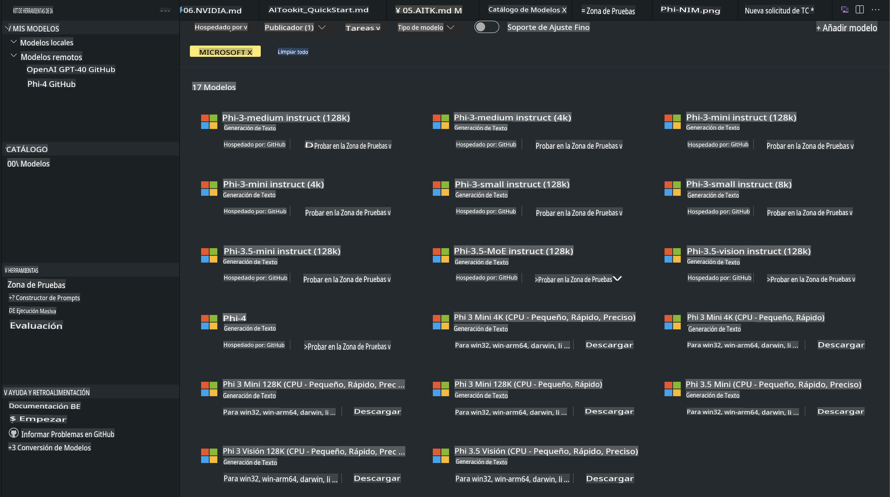
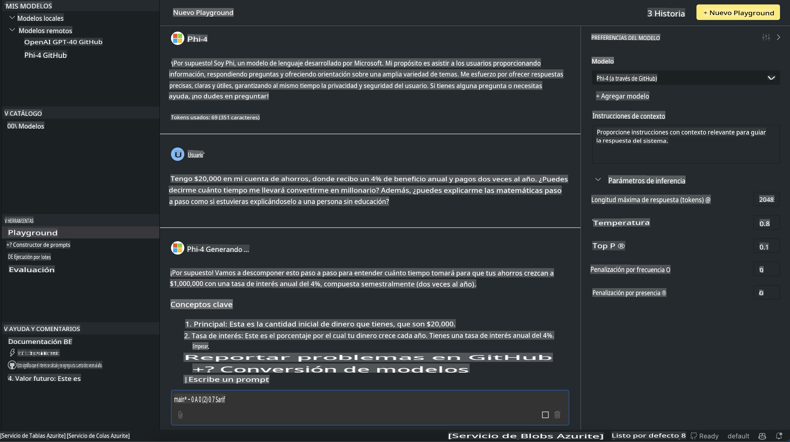

# Familia Phi en AITK

[AI Toolkit para VS Code](https://marketplace.visualstudio.com/items?itemName=ms-windows-ai-studio.windows-ai-studio) simplifica el desarrollo de aplicaciones de inteligencia artificial generativa al reunir herramientas de desarrollo de IA de vanguardia y modelos del Catálogo de Modelos de Azure AI Foundry y otros catálogos como Hugging Face. Podrás explorar el catálogo de modelos de IA impulsado por GitHub Models y los Catálogos de Modelos de Azure AI Foundry, descargarlos localmente o de forma remota, ajustarlos, probarlos y usarlos en tu aplicación.

La versión preliminar de AI Toolkit se ejecutará localmente. La inferencia local o el ajuste fino dependen del modelo que selecciones; es posible que necesites una GPU como una GPU NVIDIA CUDA. También puedes ejecutar modelos de GitHub directamente con AITK.

## Comenzando

[Aprende más sobre cómo instalar el Subsistema de Windows para Linux](https://learn.microsoft.com/windows/wsl/install?WT.mc_id=aiml-137032-kinfeylo)

y [cómo cambiar la distribución predeterminada](https://learn.microsoft.com/windows/wsl/install#change-the-default-linux-distribution-installed).

[Repositorio GitHub de AI Toolkit](https://github.com/microsoft/vscode-ai-toolkit/)

- Windows, Linux, macOS
  
- Para el ajuste fino en Windows y Linux, necesitarás una GPU Nvidia. Además, **Windows** requiere el subsistema de Linux con la distribución Ubuntu 18.4 o superior. [Aprende más sobre cómo instalar el Subsistema de Windows para Linux](https://learn.microsoft.com/windows/wsl/install) y [cómo cambiar la distribución predeterminada](https://learn.microsoft.com/windows/wsl/install#change-the-default-linux-distribution-installed).

### Instalar AI Toolkit

AI Toolkit se distribuye como una [Extensión de Visual Studio Code](https://code.visualstudio.com/docs/setup/additional-components#_vs-code-extensions), por lo que primero necesitas instalar [VS Code](https://code.visualstudio.com/docs/setup/windows?WT.mc_id=aiml-137032-kinfeylo) y luego descargar AI Toolkit desde el [Marketplace de VS](https://marketplace.visualstudio.com/items?itemName=ms-windows-ai-studio.windows-ai-studio).  
[AI Toolkit está disponible en el Visual Studio Marketplace](https://marketplace.visualstudio.com/items?itemName=ms-windows-ai-studio.windows-ai-studio) y se puede instalar como cualquier otra extensión de VS Code.

Si no estás familiarizado con la instalación de extensiones en VS Code, sigue estos pasos:

### Iniciar sesión

1. En la Barra de Actividad de VS Code selecciona **Extensiones**.  
2. En la barra de búsqueda de Extensiones escribe "AI Toolkit".  
3. Selecciona "AI Toolkit para Visual Studio Code".  
4. Selecciona **Instalar**.

¡Ahora estás listo para usar la extensión!

Se te pedirá que inicies sesión en GitHub, así que haz clic en "Permitir" para continuar. Serás redirigido a la página de inicio de sesión de GitHub.

Por favor, inicia sesión y sigue los pasos del proceso. Después de completarlo con éxito, serás redirigido a VS Code.

Una vez que la extensión esté instalada, verás el ícono de AI Toolkit aparecer en tu Barra de Actividad.

¡Exploremos las acciones disponibles!

### Acciones disponibles

La barra lateral principal de AI Toolkit está organizada en:

- **Modelos**  
- **Recursos**  
- **Playground**  
- **Ajuste fino**  
- **Evaluación**

Estas opciones están disponibles en la sección Recursos. Para comenzar, selecciona **Catálogo de Modelos**.

### Descargar un modelo del catálogo

Al iniciar AI Toolkit desde la barra lateral de VS Code, puedes seleccionar entre las siguientes opciones:



- Encuentra un modelo compatible en el **Catálogo de Modelos** y descárgalo localmente.  
- Prueba la inferencia del modelo en el **Model Playground**.  
- Ajusta el modelo local o remotamente en **Model Fine-tuning**.  
- Implementa modelos ajustados en la nube mediante el Command Palette de AI Toolkit.  
- Evalúa modelos.

> [!NOTE]
>
> **GPU Vs CPU**
>
> Notarás que las tarjetas de modelo muestran el tamaño del modelo, la plataforma y el tipo de acelerador (CPU, GPU). Para un rendimiento optimizado en **dispositivos Windows que tengan al menos una GPU**, selecciona versiones de modelos que solo apunten a Windows.
>
> Esto asegura que tengas un modelo optimizado para el acelerador DirectML.
>
> Los nombres de los modelos tienen el formato:
>
> - `{model_name}-{accelerator}-{quantization}-{format}`.
>
>Para verificar si tienes una GPU en tu dispositivo Windows, abre **Administrador de Tareas** y luego selecciona la pestaña **Rendimiento**. Si tienes GPU(s), aparecerán listadas con nombres como "GPU 0" o "GPU 1".

### Ejecutar el modelo en el playground

Después de configurar todos los parámetros, haz clic en **Generar Proyecto**.

Una vez que tu modelo haya sido descargado, selecciona **Load in Playground** en la tarjeta del modelo dentro del catálogo:

- Inicia la descarga del modelo.  
- Instala todos los requisitos previos y dependencias.  
- Crea un espacio de trabajo en VS Code.  



### Usar la API REST en tu aplicación

AI Toolkit incluye un servidor web local de API REST **en el puerto 5272** que utiliza el [formato de completado de chat de OpenAI](https://platform.openai.com/docs/api-reference/chat/create).

Esto te permite probar tu aplicación localmente sin depender de un servicio de modelos de IA en la nube. Por ejemplo, el siguiente archivo JSON muestra cómo configurar el cuerpo de la solicitud:

```json
{
    "model": "Phi-4",
    "messages": [
        {
            "role": "user",
            "content": "what is the golden ratio?"
        }
    ],
    "temperature": 0.7,
    "top_p": 1,
    "top_k": 10,
    "max_tokens": 100,
    "stream": true
}
```

Puedes probar la API REST usando (por ejemplo) [Postman](https://www.postman.com/) o la utilidad CURL (Client URL):

```bash
curl -vX POST http://127.0.0.1:5272/v1/chat/completions -H 'Content-Type: application/json' -d @body.json
```

### Usar la biblioteca cliente de OpenAI para Python

```python
from openai import OpenAI

client = OpenAI(
    base_url="http://127.0.0.1:5272/v1/", 
    api_key="x" # required for the API but not used
)

chat_completion = client.chat.completions.create(
    messages=[
        {
            "role": "user",
            "content": "what is the golden ratio?",
        }
    ],
    model="Phi-4",
)

print(chat_completion.choices[0].message.content)
```

### Usar la biblioteca cliente de Azure OpenAI para .NET

Agrega la [biblioteca cliente de Azure OpenAI para .NET](https://www.nuget.org/packages/Azure.AI.OpenAI/) a tu proyecto utilizando NuGet:

```bash
dotnet add {project_name} package Azure.AI.OpenAI --version 1.0.0-beta.17
```

Agrega un archivo C# llamado **OverridePolicy.cs** a tu proyecto y pega el siguiente código:

```csharp
// OverridePolicy.cs
using Azure.Core.Pipeline;
using Azure.Core;

internal partial class OverrideRequestUriPolicy(Uri overrideUri)
    : HttpPipelineSynchronousPolicy
{
    private readonly Uri _overrideUri = overrideUri;

    public override void OnSendingRequest(HttpMessage message)
    {
        message.Request.Uri.Reset(_overrideUri);
    }
}
```

Luego, pega el siguiente código en tu archivo **Program.cs**:

```csharp
// Program.cs
using Azure.AI.OpenAI;

Uri localhostUri = new("http://localhost:5272/v1/chat/completions");

OpenAIClientOptions clientOptions = new();
clientOptions.AddPolicy(
    new OverrideRequestUriPolicy(localhostUri),
    Azure.Core.HttpPipelinePosition.BeforeTransport);
OpenAIClient client = new(openAIApiKey: "unused", clientOptions);

ChatCompletionsOptions options = new()
{
    DeploymentName = "Phi-4",
    Messages =
    {
        new ChatRequestSystemMessage("You are a helpful assistant. Be brief and succinct."),
        new ChatRequestUserMessage("What is the golden ratio?"),
    }
};

StreamingResponse<StreamingChatCompletionsUpdate> streamingChatResponse
    = await client.GetChatCompletionsStreamingAsync(options);

await foreach (StreamingChatCompletionsUpdate chatChunk in streamingChatResponse)
{
    Console.Write(chatChunk.ContentUpdate);
}
```

## Ajuste fino con AI Toolkit

- Comienza con el descubrimiento de modelos y el playground.  
- Ajuste fino de modelos e inferencia utilizando recursos de cómputo locales.  
- Ajuste fino e inferencia remotos utilizando recursos de Azure.  

[Ajuste fino con AI Toolkit](../../03.FineTuning/Finetuning_VSCodeaitoolkit.md)

## Recursos de preguntas frecuentes de AI Toolkit

Consulta nuestra [página de preguntas y respuestas](https://github.com/microsoft/vscode-ai-toolkit/blob/main/archive/QA.md) para los problemas más comunes y sus soluciones.

**Descargo de responsabilidad**:  
Este documento ha sido traducido utilizando servicios de traducción automática basados en inteligencia artificial. Si bien nos esforzamos por garantizar la precisión, tenga en cuenta que las traducciones automatizadas pueden contener errores o imprecisiones. El documento original en su idioma nativo debe considerarse la fuente autorizada. Para información crítica, se recomienda una traducción profesional realizada por humanos. No nos hacemos responsables de malentendidos o interpretaciones erróneas que puedan surgir del uso de esta traducción.