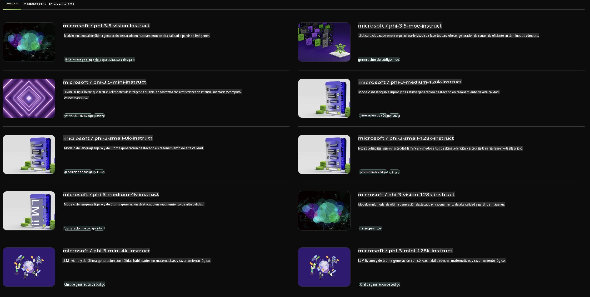

## Familia Phi en NVIDIA NIM

NVIDIA NIM es un conjunto de microservicios fáciles de usar diseñados para acelerar el despliegue de modelos de IA generativa en la nube, centros de datos y estaciones de trabajo. Los NIM están categorizados por familia de modelos y por modelo individual. Por ejemplo, NVIDIA NIM para modelos de lenguaje extenso (LLMs) lleva el poder de los LLMs más avanzados a aplicaciones empresariales, ofreciendo capacidades incomparables de procesamiento y comprensión del lenguaje natural.

NIM facilita que los equipos de TI y DevOps alojen modelos de lenguaje extenso (LLMs) en sus propios entornos gestionados, al mismo tiempo que proporciona a los desarrolladores APIs estándar de la industria que les permiten construir copilotos, chatbots y asistentes de IA potentes que pueden transformar sus negocios. Aprovechando la avanzada aceleración de GPU de NVIDIA y un despliegue escalable, NIM ofrece el camino más rápido hacia la inferencia con un rendimiento inigualable.

Puedes utilizar NVIDIA NIM para realizar inferencias con los modelos de la Familia Phi.



### **Ejemplos - Phi-3-Vision en NVIDIA NIM**

Imagina que tienes una imagen (`demo.png`) y quieres generar código en Python que procese esta imagen y guarde una nueva versión de ella (`phi-3-vision.jpg`). 

El código anterior automatiza este proceso mediante:

1. Configuración del entorno y las configuraciones necesarias.
2. Creación de un prompt que instruya al modelo a generar el código Python requerido.
3. Envío del prompt al modelo y recopilación del código generado.
4. Extracción y ejecución del código generado.
5. Visualización de las imágenes original y procesada.

Este enfoque aprovecha el poder de la IA para automatizar tareas de procesamiento de imágenes, haciéndolas más fáciles y rápidas de lograr.

[Solución de Código de Ejemplo](../../../../../code/06.E2E/E2E_Nvidia_NIM_Phi3_Vision.ipynb)

Desglosemos lo que hace todo el código paso a paso:

1. **Instalar el Paquete Requerido**:
    ```python
    !pip install langchain_nvidia_ai_endpoints -U
    ```
    Este comando instala el paquete `langchain_nvidia_ai_endpoints`, asegurando que sea la última versión.

2. **Importar los Módulos Necesarios**:
    ```python
    from langchain_nvidia_ai_endpoints import ChatNVIDIA
    import getpass
    import os
    import base64
    ```
    Estas importaciones traen los módulos necesarios para interactuar con los endpoints de NVIDIA AI, manejar contraseñas de forma segura, interactuar con el sistema operativo y codificar/decodificar datos en formato base64.

3. **Configurar la Clave de API**:
    ```python
    if not os.getenv("NVIDIA_API_KEY"):
        os.environ["NVIDIA_API_KEY"] = getpass.getpass("Enter your NVIDIA API key: ")
    ```
    Este código verifica si la variable de entorno `NVIDIA_API_KEY` está configurada. Si no, solicita al usuario que ingrese su clave de API de forma segura.

4. **Definir el Modelo y la Ruta de la Imagen**:
    ```python
    model = 'microsoft/phi-3-vision-128k-instruct'
    chat = ChatNVIDIA(model=model)
    img_path = './imgs/demo.png'
    ```
    Esto establece el modelo a utilizar, crea una instancia de `ChatNVIDIA` con el modelo especificado y define la ruta del archivo de imagen.

5. **Crear el Prompt de Texto**:
    ```python
    text = "Please create Python code for image, and use plt to save the new picture under imgs/ and name it phi-3-vision.jpg."
    ```
    Esto define un prompt de texto que instruye al modelo a generar código Python para procesar una imagen.

6. **Codificar la Imagen en Base64**:
    ```python
    with open(img_path, "rb") as f:
        image_b64 = base64.b64encode(f.read()).decode()
    image = f''
    ```
    Este código lee el archivo de imagen, lo codifica en base64 y crea una etiqueta HTML de imagen con los datos codificados.

7. **Combinar Texto e Imagen en un Prompt**:
    ```python
    prompt = f"{text} {image}"
    ```
    Esto combina el prompt de texto y la etiqueta HTML de la imagen en una sola cadena.

8. **Generar Código Usando ChatNVIDIA**:
    ```python
    code = ""
    for chunk in chat.stream(prompt):
        print(chunk.content, end="")
        code += chunk.content
    ```
    Este código envía el prompt al modelo `ChatNVIDIA` model and collects the generated code in chunks, printing and appending each chunk to the `code` string.

9. **Extraer Código Python del Contenido Generado**:
    ```python
    begin = code.index('```python') + 9
    code = code[begin:]
    end = code.index('```')
    code = code[:end]
    ```
    Esto extrae el código Python real del contenido generado eliminando el formato markdown.

10. **Ejecutar el Código Generado**:
    ```python
    import subprocess
    result = subprocess.run(["python", "-c", code], capture_output=True)
    ```
    Esto ejecuta el código Python extraído como un subproceso y captura su salida.

11. **Mostrar las Imágenes**:
    ```python
    from IPython.display import Image, display
    display(Image(filename='./imgs/phi-3-vision.jpg'))
    display(Image(filename='./imgs/demo.png'))
    ```
    Estas líneas muestran las imágenes utilizando el módulo `IPython.display`.

**Descargo de responsabilidad**:  
Este documento ha sido traducido utilizando servicios de traducción automática basados en inteligencia artificial. Si bien nos esforzamos por lograr precisión, tenga en cuenta que las traducciones automatizadas pueden contener errores o imprecisiones. El documento original en su idioma nativo debe considerarse la fuente autorizada. Para información crítica, se recomienda una traducción profesional realizada por humanos. No nos hacemos responsables de malentendidos o interpretaciones erróneas que puedan surgir del uso de esta traducción.