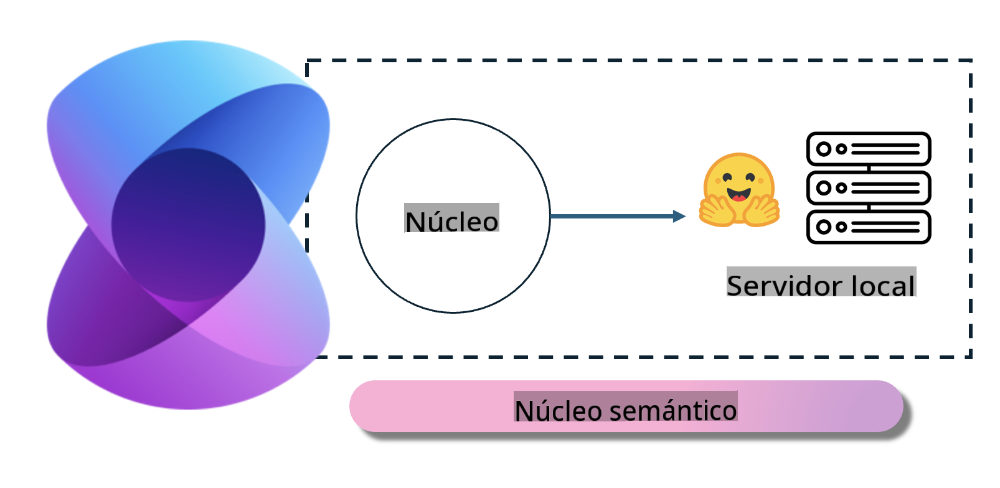
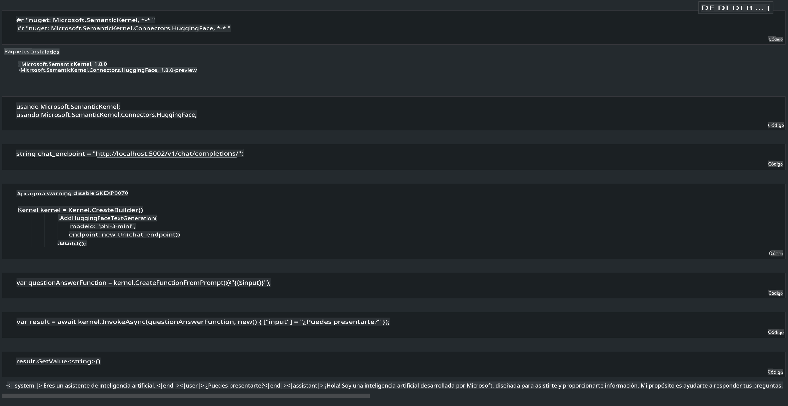

# **Inferencia de Phi-3 en un Servidor Local**

Podemos desplegar Phi-3 en un servidor local. Los usuarios pueden elegir las soluciones de [Ollama](https://ollama.com) o [LM Studio](https://llamaedge.com), o pueden escribir su propio código. Puedes conectar los servicios locales de Phi-3 a través de [Semantic Kernel](https://github.com/microsoft/semantic-kernel?WT.mc_id=aiml-138114-kinfeylo) o [Langchain](https://www.langchain.com/) para construir aplicaciones tipo Copilot.

## **Usar Semantic Kernel para acceder a Phi-3-mini**

En la aplicación Copilot, creamos aplicaciones utilizando Semantic Kernel o LangChain. Este tipo de marco de trabajo es generalmente compatible con Azure OpenAI Service / modelos de OpenAI, y también puede soportar modelos de código abierto en Hugging Face y modelos locales. ¿Qué debemos hacer si queremos usar Semantic Kernel para acceder a Phi-3-mini? Usando .NET como ejemplo, podemos combinarlo con el conector de Hugging Face en Semantic Kernel. Por defecto, puede corresponder al id del modelo en Hugging Face (la primera vez que lo uses, el modelo se descargará desde Hugging Face, lo cual toma bastante tiempo). También puedes conectarte al servicio local configurado. Entre ambas opciones, recomendamos usar esta última porque ofrece un mayor grado de autonomía, especialmente en aplicaciones empresariales.

Como se muestra en la figura, acceder a servicios locales a través de Semantic Kernel permite conectar fácilmente al servidor de modelo Phi-3-mini configurado por ti mismo. Aquí está el resultado de ejecución:

***Código de ejemplo*** https://github.com/kinfey/Phi3MiniSamples/tree/main/semantickernel

**Descargo de responsabilidad**:  
Este documento ha sido traducido utilizando servicios de traducción automática basados en inteligencia artificial. Si bien nos esforzamos por garantizar la precisión, tenga en cuenta que las traducciones automáticas pueden contener errores o imprecisiones. El documento original en su idioma nativo debe considerarse como la fuente autorizada. Para información crítica, se recomienda una traducción profesional realizada por humanos. No nos hacemos responsables de malentendidos o interpretaciones erróneas que puedan surgir del uso de esta traducción.