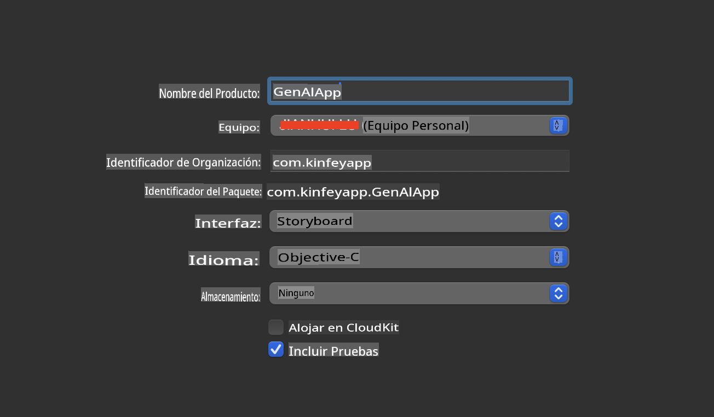
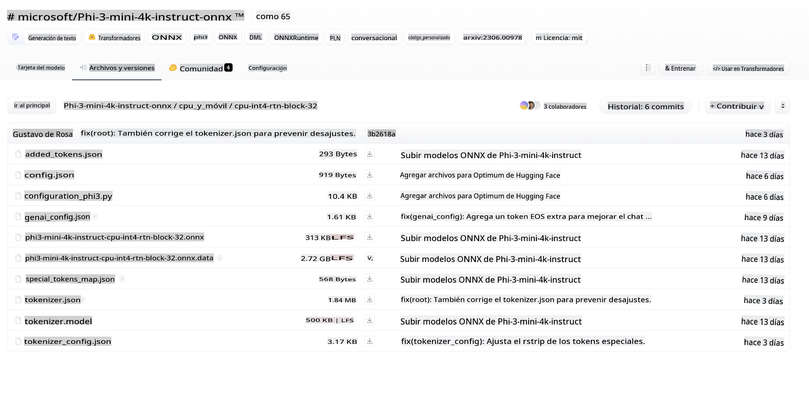
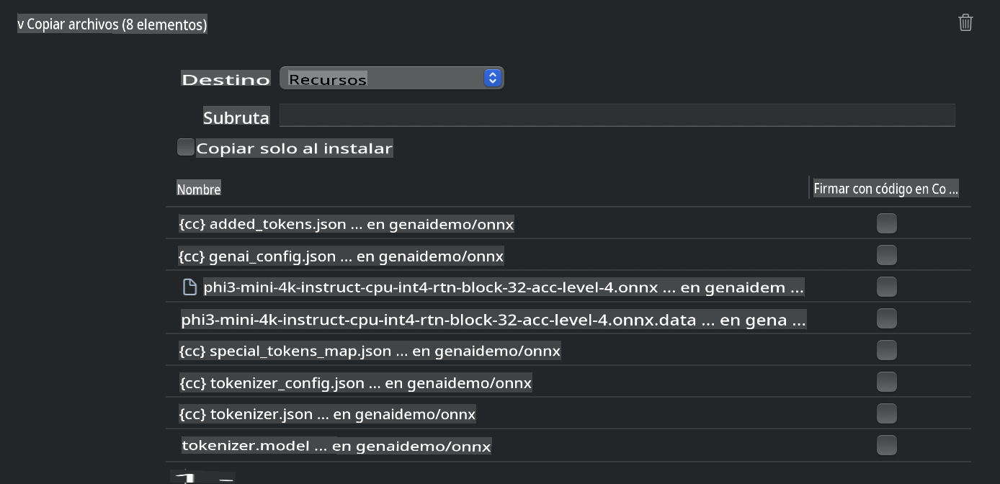
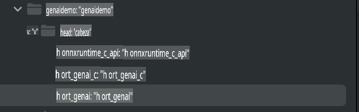
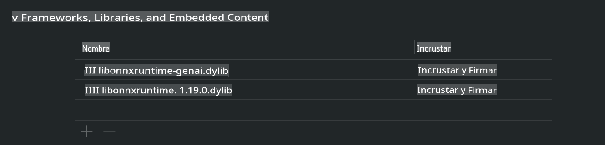
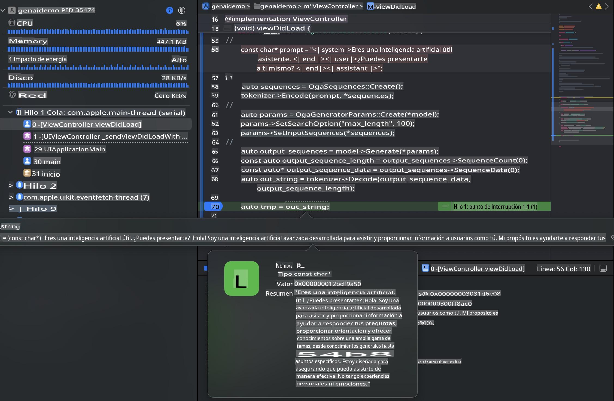

# **Inferencia de Phi-3 en iOS**

Phi-3-mini es una nueva serie de modelos de Microsoft que permite el despliegue de Modelos de Lenguaje Extenso (LLMs) en dispositivos de borde y dispositivos IoT. Phi-3-mini está disponible para implementaciones en iOS, Android y dispositivos de borde, lo que permite desplegar IA generativa en entornos BYOD. El siguiente ejemplo demuestra cómo implementar Phi-3-mini en iOS.

## **1. Preparación**

- **a.** macOS 14+
- **b.** Xcode 15+
- **c.** iOS SDK 17.x (iPhone 14 A16 o superior)
- **d.** Instalar Python 3.10+ (se recomienda Conda)
- **e.** Instalar la biblioteca de Python: `python-flatbuffers`
- **f.** Instalar CMake

### Semantic Kernel e Inferencia

Semantic Kernel es un marco de aplicaciones que te permite crear aplicaciones compatibles con Azure OpenAI Service, modelos de OpenAI e incluso modelos locales. Acceder a servicios locales a través de Semantic Kernel facilita la integración con tu servidor de modelos Phi-3-mini autohospedado.

### Llamadas a Modelos Cuantizados con Ollama o LlamaEdge

Muchos usuarios prefieren usar modelos cuantizados para ejecutarlos localmente. [Ollama](https://ollama.com) y [LlamaEdge](https://llamaedge.com) permiten a los usuarios llamar a diferentes modelos cuantizados:

#### **Ollama**

Puedes ejecutar `ollama run phi3` directamente o configurarlo sin conexión. Crea un Modelfile con la ruta a tu archivo `gguf`. Código de ejemplo para ejecutar el modelo cuantizado Phi-3-mini:

```gguf
FROM {Add your gguf file path}
TEMPLATE \"\"\"<|user|> .Prompt<|end|> <|assistant|>\"\"\"
PARAMETER stop <|end|>
PARAMETER num_ctx 4096
```

#### **LlamaEdge**

Si deseas usar `gguf` tanto en la nube como en dispositivos de borde simultáneamente, LlamaEdge es una excelente opción.

## **2. Compilación de ONNX Runtime para iOS**

```bash

git clone https://github.com/microsoft/onnxruntime.git

cd onnxruntime

./build.sh --build_shared_lib --ios --skip_tests --parallel --build_dir ./build_ios --ios --apple_sysroot iphoneos --osx_arch arm64 --apple_deploy_target 17.5 --cmake_generator Xcode --config Release

cd ../

```

### **Aviso**

- **a.** Antes de compilar, asegúrate de que Xcode esté correctamente configurado y configúralo como el directorio de desarrollador activo en el terminal:

    ```bash
    sudo xcode-select -switch /Applications/Xcode.app/Contents/Developer
    ```

- **b.** ONNX Runtime necesita ser compilado para diferentes plataformas. Para iOS, puedes compilar para `arm64` or `x86_64`.

- **c.** Se recomienda usar la última versión de iOS SDK para la compilación. Sin embargo, también puedes usar una versión anterior si necesitas compatibilidad con SDKs previos.

## **3. Compilación de IA Generativa con ONNX Runtime para iOS**

> **Nota:** Debido a que la IA Generativa con ONNX Runtime está en vista previa, ten en cuenta posibles cambios.

```bash

git clone https://github.com/microsoft/onnxruntime-genai
 
cd onnxruntime-genai
 
mkdir ort
 
cd ort
 
mkdir include
 
mkdir lib
 
cd ../
 
cp ../onnxruntime/include/onnxruntime/core/session/onnxruntime_c_api.h ort/include
 
cp ../onnxruntime/build_ios/Release/Release-iphoneos/libonnxruntime*.dylib* ort/lib
 
export OPENCV_SKIP_XCODEBUILD_FORCE_TRYCOMPILE_DEBUG=1
 
python3 build.py --parallel --build_dir ./build_ios --ios --ios_sysroot iphoneos --ios_arch arm64 --ios_deployment_target 17.5 --cmake_generator Xcode --cmake_extra_defines CMAKE_XCODE_ATTRIBUTE_CODE_SIGNING_ALLOWED=NO

```

## **4. Crear una aplicación App en Xcode**

Elegí Objective-C como el método de desarrollo de la App, porque al usar IA Generativa con la API de ONNX Runtime en C++, Objective-C es más compatible. Por supuesto, también puedes realizar las llamadas relacionadas a través de un puente con Swift.



## **5. Copiar el modelo cuantizado INT4 de ONNX al proyecto de la aplicación App**

Necesitamos importar el modelo de cuantización INT4 en formato ONNX, el cual debe descargarse primero.



Después de descargarlo, debes añadirlo al directorio Resources del proyecto en Xcode.



## **6. Añadir la API de C++ en ViewControllers**

> **Aviso:**

- **a.** Agrega los archivos de encabezado C++ correspondientes al proyecto.

  

- **b.** Incluye `onnxruntime-genai` dynamic library in Xcode.

  

- **c.** Use the C Samples code for testing. You can also add additional features like ChatUI for more functionality.

- **d.** Since you need to use C++ in your project, rename `ViewController.m` to `ViewController.mm` para habilitar el soporte de Objective-C++.

```objc

    NSString *llmPath = [[NSBundle mainBundle] resourcePath];
    char const *modelPath = llmPath.cString;

    auto model =  OgaModel::Create(modelPath);

    auto tokenizer = OgaTokenizer::Create(*model);

    const char* prompt = "<|system|>You are a helpful AI assistant.<|end|><|user|>Can you introduce yourself?<|end|><|assistant|>";

    auto sequences = OgaSequences::Create();
    tokenizer->Encode(prompt, *sequences);

    auto params = OgaGeneratorParams::Create(*model);
    params->SetSearchOption("max_length", 100);
    params->SetInputSequences(*sequences);

    auto output_sequences = model->Generate(*params);
    const auto output_sequence_length = output_sequences->SequenceCount(0);
    const auto* output_sequence_data = output_sequences->SequenceData(0);
    auto out_string = tokenizer->Decode(output_sequence_data, output_sequence_length);
    
    auto tmp = out_string;

```

## **7. Ejecutar la Aplicación**

Una vez que la configuración esté completa, puedes ejecutar la aplicación para ver los resultados de la inferencia del modelo Phi-3-mini.



Para más código de ejemplo e instrucciones detalladas, visita el [repositorio de Ejemplos de Phi-3 Mini](https://github.com/Azure-Samples/Phi-3MiniSamples/tree/main/ios).

**Descargo de responsabilidad**:  
Este documento ha sido traducido utilizando servicios de traducción automática basados en inteligencia artificial. Si bien nos esforzamos por lograr precisión, tenga en cuenta que las traducciones automáticas pueden contener errores o imprecisiones. El documento original en su idioma nativo debe considerarse la fuente autorizada. Para información crítica, se recomienda una traducción profesional realizada por humanos. No nos hacemos responsables de malentendidos o interpretaciones erróneas que surjan del uso de esta traducción.