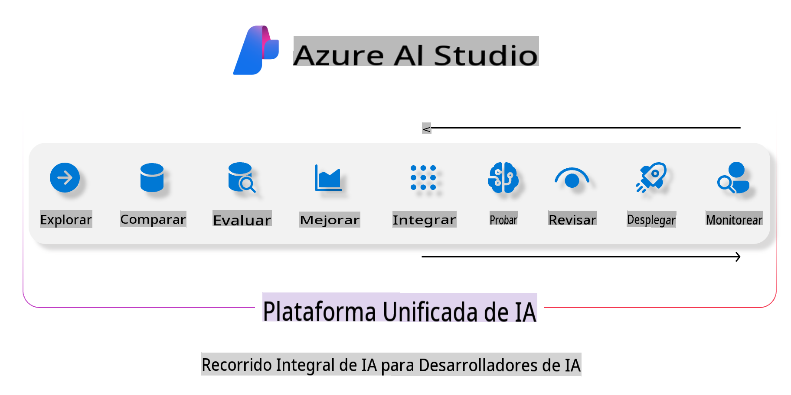
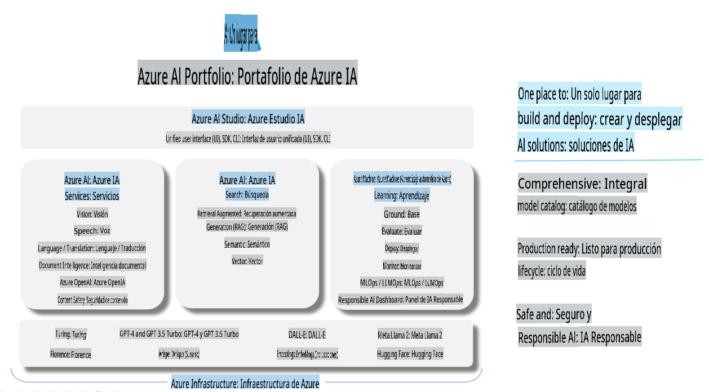

# **Uso de Azure AI Foundry para evaluación**

Cómo evaluar tu aplicación de inteligencia artificial generativa utilizando [Azure AI Foundry](https://ai.azure.com?WT.mc_id=aiml-138114-kinfeylo). Ya sea que estés evaluando conversaciones de un solo turno o de varios turnos, Azure AI Foundry proporciona herramientas para evaluar el rendimiento y la seguridad del modelo.

## Cómo evaluar aplicaciones de IA generativa con Azure AI Foundry
Para obtener instrucciones más detalladas, consulta la [Documentación de Azure AI Foundry](https://learn.microsoft.com/azure/ai-studio/how-to/evaluate-generative-ai-app?WT.mc_id=aiml-138114-kinfeylo).

Aquí están los pasos para comenzar:

## Evaluación de modelos de IA generativa en Azure AI Foundry

**Requisitos previos**

- Un conjunto de datos de prueba en formato CSV o JSON.
- Un modelo de IA generativa desplegado (como Phi-3, GPT 3.5, GPT 4 o modelos Davinci).
- Un entorno de ejecución con una instancia de cómputo para realizar la evaluación.

## Métricas de evaluación integradas

Azure AI Foundry te permite evaluar tanto conversaciones de un solo turno como complejas conversaciones de varios turnos.  
Para escenarios de Recuperación Aumentada con Generación (RAG), donde el modelo se basa en datos específicos, puedes evaluar el rendimiento utilizando métricas de evaluación integradas.  
Además, puedes evaluar escenarios generales de preguntas y respuestas de un solo turno (no-RAG).

## Creación de una ejecución de evaluación

Desde la interfaz de usuario de Azure AI Foundry, navega a la página de Evaluación o a la página de Flujo de Prompt.  
Sigue el asistente de creación de evaluación para configurar una ejecución de evaluación. Proporciona un nombre opcional para tu evaluación.  
Selecciona el escenario que se alinea con los objetivos de tu aplicación.  
Elige una o más métricas de evaluación para analizar la salida del modelo.

## Flujo de evaluación personalizado (opcional)

Para mayor flexibilidad, puedes establecer un flujo de evaluación personalizado. Personaliza el proceso de evaluación según tus necesidades específicas.

## Visualización de resultados

Después de ejecutar la evaluación, registra, visualiza y analiza métricas detalladas de evaluación en Azure AI Foundry. Obtén información sobre las capacidades y limitaciones de tu aplicación.

**Nota** Azure AI Foundry se encuentra actualmente en vista previa pública, por lo que se recomienda usarlo para propósitos de experimentación y desarrollo. Para cargas de trabajo en producción, considera otras opciones. Explora la [documentación oficial de AI Foundry](https://learn.microsoft.com/azure/ai-studio/?WT.mc_id=aiml-138114-kinfeylo) para obtener más detalles e instrucciones paso a paso.

**Descargo de responsabilidad**:  
Este documento ha sido traducido utilizando servicios de traducción automática basados en inteligencia artificial. Si bien nos esforzamos por lograr precisión, tenga en cuenta que las traducciones automáticas pueden contener errores o imprecisiones. El documento original en su idioma nativo debe considerarse como la fuente autorizada. Para información crítica, se recomienda una traducción profesional realizada por humanos. No nos hacemos responsables de malentendidos o interpretaciones erróneas que puedan surgir del uso de esta traducción.