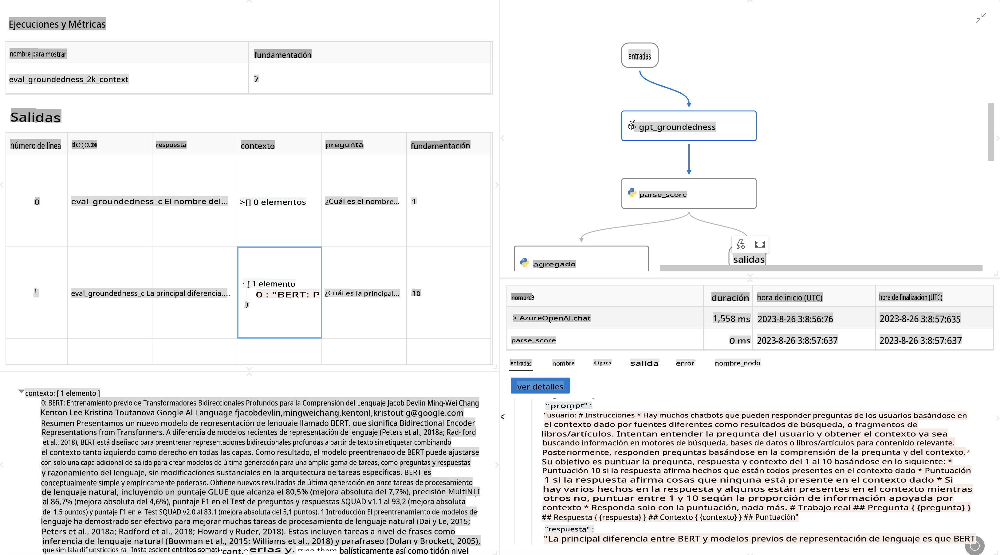

# **Introducción a Promptflow**

[Microsoft Prompt Flow](https://microsoft.github.io/promptflow/index.html?WT.mc_id=aiml-138114-kinfeylo) es una herramienta visual de automatización de flujos de trabajo que permite a los usuarios crear flujos automatizados utilizando plantillas predefinidas y conectores personalizados. Está diseñada para que desarrolladores y analistas de negocio puedan construir rápidamente procesos automatizados para tareas como la gestión de datos, la colaboración y la optimización de procesos. Con Prompt Flow, los usuarios pueden conectar fácilmente diferentes servicios, aplicaciones y sistemas, y automatizar procesos empresariales complejos.

Microsoft Prompt Flow está diseñado para optimizar el ciclo de desarrollo de extremo a extremo de aplicaciones de IA impulsadas por Modelos de Lenguaje de Gran Escala (LLMs). Ya sea que estés ideando, prototipando, probando, evaluando o implementando aplicaciones basadas en LLM, Prompt Flow simplifica el proceso y te permite construir aplicaciones con calidad de producción.

## Estas son las características clave y beneficios de usar Microsoft Prompt Flow:

**Experiencia de Autoría Interactiva**

Prompt Flow proporciona una representación visual de la estructura de tu flujo, facilitando la comprensión y navegación de tus proyectos.  
Ofrece una experiencia de codificación tipo cuaderno para un desarrollo y depuración de flujos más eficiente.

**Variantes y Ajuste de Prompts**

Crea y compara múltiples variantes de prompts para facilitar un proceso iterativo de refinamiento. Evalúa el rendimiento de diferentes prompts y elige los más efectivos.

**Flujos de Evaluación Integrados**

Evalúa la calidad y efectividad de tus prompts y flujos utilizando herramientas de evaluación integradas.  
Comprende qué tan bien están funcionando tus aplicaciones basadas en LLM.

**Recursos Integrales**

Prompt Flow incluye una biblioteca de herramientas, ejemplos y plantillas integradas. Estos recursos sirven como punto de partida para el desarrollo, inspiran creatividad y aceleran el proceso.

**Colaboración y Preparación Empresarial**

Facilita la colaboración en equipo permitiendo que varios usuarios trabajen juntos en proyectos de ingeniería de prompts.  
Mantén el control de versiones y comparte conocimientos de manera efectiva. Optimiza todo el proceso de ingeniería de prompts, desde el desarrollo y evaluación hasta la implementación y monitoreo.

## Evaluación en Prompt Flow 

En Microsoft Prompt Flow, la evaluación desempeña un papel crucial al medir el rendimiento de tus modelos de IA. Exploremos cómo puedes personalizar flujos y métricas de evaluación dentro de Prompt Flow:

**Entendiendo la Evaluación en Prompt Flow**

En Prompt Flow, un flujo representa una secuencia de nodos que procesan entradas y generan salidas. Los flujos de evaluación son un tipo especial de flujos diseñados para evaluar el rendimiento de una ejecución basada en criterios y objetivos específicos.

**Características clave de los flujos de evaluación**

Generalmente se ejecutan después del flujo que está siendo probado, utilizando sus salidas.  
Calculan puntuaciones o métricas para medir el rendimiento del flujo probado. Las métricas pueden incluir precisión, puntuaciones de relevancia u otras medidas relevantes.

### Personalizando Flujos de Evaluación

**Definiendo Entradas**

Los flujos de evaluación necesitan recibir las salidas de la ejecución que se está probando. Define entradas de manera similar a los flujos estándar.  
Por ejemplo, si estás evaluando un flujo de preguntas y respuestas, nombra una entrada como "respuesta". Si evalúas un flujo de clasificación, nombra una entrada como "categoría". También podrían ser necesarias entradas de referencia (como etiquetas reales).

**Salidas y Métricas**

Los flujos de evaluación generan resultados que miden el rendimiento del flujo probado. Las métricas pueden calcularse utilizando Python o LLM (Modelos de Lenguaje de Gran Escala). Utiliza la función log_metric() para registrar métricas relevantes.

**Usando Flujos de Evaluación Personalizados**

Desarrolla tu propio flujo de evaluación adaptado a tus tareas y objetivos específicos.  
Personaliza las métricas según tus metas de evaluación.  
Aplica este flujo de evaluación personalizado a ejecuciones por lotes para pruebas a gran escala.

## Métodos de Evaluación Integrados

Prompt Flow también ofrece métodos de evaluación integrados.  
Puedes enviar ejecuciones por lotes y utilizar estos métodos para evaluar qué tan bien funciona tu flujo con grandes conjuntos de datos.  
Consulta los resultados de evaluación, compara métricas e itera según sea necesario.  
Recuerda, la evaluación es esencial para garantizar que tus modelos de IA cumplan con los criterios y objetivos deseados. Consulta la documentación oficial para obtener instrucciones detalladas sobre cómo desarrollar y usar flujos de evaluación en Microsoft Prompt Flow.

En resumen, Microsoft Prompt Flow permite a los desarrolladores crear aplicaciones LLM de alta calidad al simplificar la ingeniería de prompts y proporcionar un entorno de desarrollo robusto. Si trabajas con LLMs, Prompt Flow es una herramienta valiosa para explorar. Consulta los [Documentos de Evaluación de Prompt Flow](https://learn.microsoft.com/azure/machine-learning/prompt-flow/how-to-develop-an-evaluation-flow?view=azureml-api-2?WT.mc_id=aiml-138114-kinfeylo) para obtener instrucciones detalladas sobre cómo desarrollar y usar flujos de evaluación en Microsoft Prompt Flow.

**Descargo de responsabilidad**:  
Este documento ha sido traducido utilizando servicios de traducción automática basados en inteligencia artificial. Si bien nos esforzamos por lograr precisión, tenga en cuenta que las traducciones automatizadas pueden contener errores o inexactitudes. El documento original en su idioma nativo debe considerarse como la fuente autorizada. Para información crítica, se recomienda una traducción profesional realizada por humanos. No nos hacemos responsables por malentendidos o interpretaciones erróneas que puedan surgir del uso de esta traducción.