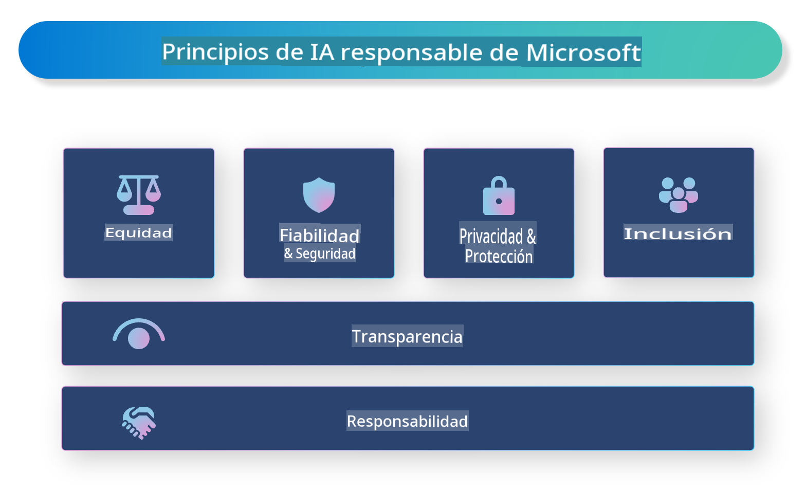

# **Introducción a la IA Responsable**

[Microsoft Responsible AI](https://www.microsoft.com/ai/responsible-ai?WT.mc_id=aiml-138114-kinfeylo) es una iniciativa que busca ayudar a desarrolladores y organizaciones a construir sistemas de IA que sean transparentes, confiables y responsables. La iniciativa proporciona orientación y recursos para desarrollar soluciones de IA responsable que se alineen con principios éticos, como la privacidad, la equidad y la transparencia. También exploraremos algunos de los desafíos y las mejores prácticas asociadas con la creación de sistemas de IA responsable.

## Descripción general de Microsoft Responsible AI

**Principios éticos**

Microsoft Responsible AI se guía por un conjunto de principios éticos, como la privacidad, la equidad, la transparencia, la responsabilidad y la seguridad. Estos principios están diseñados para garantizar que los sistemas de IA se desarrollen de manera ética y responsable.

**IA transparente**

Microsoft Responsible AI enfatiza la importancia de la transparencia en los sistemas de IA. Esto incluye proporcionar explicaciones claras de cómo funcionan los modelos de IA, así como garantizar que las fuentes de datos y los algoritmos sean accesibles públicamente.

**IA responsable**

[Microsoft Responsible AI](https://www.microsoft.com/ai/responsible-ai?WT.mc_id=aiml-138114-kinfeylo) promueve el desarrollo de sistemas de IA responsables, que puedan ofrecer información sobre cómo los modelos de IA toman decisiones. Esto puede ayudar a los usuarios a comprender y confiar en los resultados de los sistemas de IA.

**Inclusión**

Los sistemas de IA deben diseñarse para beneficiar a todos. Microsoft busca crear IA inclusiva que considere diversas perspectivas y evite sesgos o discriminación.

**Confiabilidad y seguridad**

Garantizar que los sistemas de IA sean confiables y seguros es fundamental. Microsoft se centra en construir modelos robustos que funcionen de manera consistente y eviten resultados perjudiciales.

**Equidad en la IA**

Microsoft Responsible AI reconoce que los sistemas de IA pueden perpetuar sesgos si se entrenan con datos o algoritmos sesgados. La iniciativa proporciona orientación para desarrollar sistemas de IA justos que no discriminen por factores como raza, género o edad.

**Privacidad y seguridad**

Microsoft Responsible AI subraya la importancia de proteger la privacidad del usuario y la seguridad de los datos en los sistemas de IA. Esto incluye implementar cifrado sólido de datos y controles de acceso, así como auditar regularmente los sistemas de IA para detectar vulnerabilidades.

**Responsabilidad y compromiso**

Microsoft Responsible AI promueve la responsabilidad y el compromiso en el desarrollo y la implementación de la IA. Esto incluye garantizar que los desarrolladores y las organizaciones sean conscientes de los riesgos potenciales asociados con los sistemas de IA y tomen medidas para mitigarlos.

## Mejores prácticas para construir sistemas de IA responsable

**Desarrollar modelos de IA utilizando conjuntos de datos diversos**

Para evitar sesgos en los sistemas de IA, es importante utilizar conjuntos de datos diversos que representen una variedad de perspectivas y experiencias.

**Usar técnicas de IA explicable**

Las técnicas de IA explicable pueden ayudar a los usuarios a entender cómo los modelos de IA toman decisiones, lo que puede aumentar la confianza en el sistema.

**Auditar regularmente los sistemas de IA en busca de vulnerabilidades**

Las auditorías regulares de los sistemas de IA pueden ayudar a identificar riesgos y vulnerabilidades que necesitan ser abordados.

**Implementar cifrado de datos sólido y controles de acceso**

El cifrado de datos y los controles de acceso pueden ayudar a proteger la privacidad y la seguridad del usuario en los sistemas de IA.

**Seguir principios éticos en el desarrollo de la IA**

Seguir principios éticos, como la equidad, la transparencia y la responsabilidad, puede ayudar a generar confianza en los sistemas de IA y garantizar que se desarrollen de manera responsable.

## Uso de AI Foundry para IA Responsable

[Azure AI Foundry](https://ai.azure.com?WT.mc_id=aiml-138114-kinfeylo) es una plataforma poderosa que permite a desarrolladores y organizaciones crear rápidamente aplicaciones inteligentes, avanzadas, listas para el mercado y responsables. A continuación, se presentan algunas características y capacidades clave de Azure AI Foundry:

**APIs y modelos listos para usar**

Azure AI Foundry proporciona APIs y modelos preconstruidos y personalizables. Estos cubren una amplia gama de tareas de IA, incluyendo IA generativa, procesamiento de lenguaje natural para conversaciones, búsqueda, monitoreo, traducción, voz, visión y toma de decisiones.

**Prompt Flow**

Prompt Flow en Azure AI Foundry te permite crear experiencias de IA conversacional. Facilita el diseño y la gestión de flujos conversacionales, haciendo más sencillo construir chatbots, asistentes virtuales y otras aplicaciones interactivas.

**Generación Aumentada por Recuperación (RAG)**

RAG es una técnica que combina enfoques basados en recuperación y generación. Mejora la calidad de las respuestas generadas aprovechando tanto el conocimiento preexistente (recuperación) como la generación creativa (generación).

**Métricas de evaluación y monitoreo para IA generativa**

Azure AI Foundry ofrece herramientas para evaluar y monitorear modelos de IA generativa. Puedes evaluar su rendimiento, equidad y otras métricas importantes para garantizar un despliegue responsable. Además, si has creado un tablero, puedes usar la interfaz sin código en Azure Machine Learning Studio para personalizar y generar un Responsible AI Dashboard y un scorecard asociado basado en las bibliotecas de Python del [Responsible AI Toolbox](https://responsibleaitoolbox.ai/?WT.mc_id=aiml-138114-kinfeylo). Este scorecard te ayuda a compartir conocimientos clave relacionados con la equidad, la importancia de las características y otras consideraciones de implementación responsable con partes interesadas técnicas y no técnicas.

Para usar AI Foundry con IA responsable, puedes seguir estas mejores prácticas:

**Definir el problema y los objetivos de tu sistema de IA**

Antes de comenzar el proceso de desarrollo, es importante definir claramente el problema u objetivo que tu sistema de IA busca resolver. Esto te ayudará a identificar los datos, algoritmos y recursos necesarios para construir un modelo efectivo.

**Recopilar y preprocesar datos relevantes**

La calidad y cantidad de los datos utilizados en el entrenamiento de un sistema de IA pueden tener un impacto significativo en su rendimiento. Por lo tanto, es importante recopilar datos relevantes, limpiarlos, preprocesarlos y asegurarse de que sean representativos de la población o problema que se desea abordar.

**Elegir evaluaciones apropiadas**

Existen varios algoritmos de evaluación disponibles. Es importante elegir el más adecuado según tus datos y problema.

**Evaluar e interpretar el modelo**

Una vez que hayas construido un modelo de IA, es importante evaluar su rendimiento utilizando métricas apropiadas e interpretar los resultados de manera transparente. Esto te ayudará a identificar sesgos o limitaciones en el modelo y realizar mejoras cuando sea necesario.

**Garantizar transparencia y explicabilidad**

Los sistemas de IA deben ser transparentes y explicables para que los usuarios puedan entender cómo funcionan y cómo se toman las decisiones. Esto es especialmente importante para aplicaciones que tienen impactos significativos en la vida de las personas, como la salud, las finanzas y los sistemas legales.

**Monitorear y actualizar el modelo**

Los sistemas de IA deben ser monitoreados y actualizados continuamente para garantizar que sigan siendo precisos y efectivos con el tiempo. Esto requiere mantenimiento, pruebas y reentrenamiento constantes del modelo.

En conclusión, Microsoft Responsible AI es una iniciativa que busca ayudar a desarrolladores y organizaciones a construir sistemas de IA que sean transparentes, confiables y responsables. Recuerda que la implementación de IA responsable es crucial, y Azure AI Foundry busca hacerlo práctico para las organizaciones. Siguiendo principios éticos y mejores prácticas, podemos garantizar que los sistemas de IA se desarrollen e implementen de manera responsable y beneficien a la sociedad en su conjunto.

**Descargo de responsabilidad**:  
Este documento ha sido traducido utilizando servicios de traducción automática basados en inteligencia artificial. Si bien nos esforzamos por lograr precisión, tenga en cuenta que las traducciones automatizadas pueden contener errores o imprecisiones. El documento original en su idioma nativo debe considerarse como la fuente autorizada. Para información crítica, se recomienda una traducción profesional realizada por humanos. No nos hacemos responsables de malentendidos o interpretaciones erróneas que surjan del uso de esta traducción.