# Evaluar el Modelo Phi-3 / Phi-3.5 Ajustado en Azure AI Foundry con Enfoque en los Principios de IA Responsable de Microsoft

Este ejemplo de extremo a extremo (E2E) se basa en la guía "[Evaluar Modelos Phi-3 / 3.5 Ajustados en Azure AI Foundry con Enfoque en la IA Responsable de Microsoft](https://techcommunity.microsoft.com/t5/educator-developer-blog/evaluate-fine-tuned-phi-3-3-5-models-in-azure-ai-studio-focusing/ba-p/4227850?WT.mc_id=aiml-137032-kinfeylo)" de la Comunidad Técnica de Microsoft.

## Descripción general

### ¿Cómo puedes evaluar la seguridad y el rendimiento de un modelo Phi-3 / Phi-3.5 ajustado en Azure AI Foundry?

Ajustar un modelo puede a veces generar respuestas no deseadas o inesperadas. Para garantizar que el modelo sea seguro y efectivo, es importante evaluar su potencial para generar contenido dañino y su capacidad para producir respuestas precisas, relevantes y coherentes. En este tutorial, aprenderás cómo evaluar la seguridad y el rendimiento de un modelo Phi-3 / Phi-3.5 ajustado e integrado con Prompt flow en Azure AI Foundry.

Este es el proceso de evaluación en Azure AI Foundry.

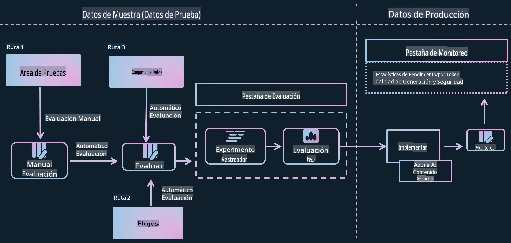

*Fuente de la imagen: [Evaluación de aplicaciones de IA generativa](https://learn.microsoft.com/azure/ai-studio/concepts/evaluation-approach-gen-ai?wt.mc_id%3Dstudentamb_279723)*

> [!NOTE]
>
> Para obtener más información detallada y explorar recursos adicionales sobre Phi-3 / Phi-3.5, visita el [Phi-3CookBook](https://github.com/microsoft/Phi-3CookBook?wt.mc_id=studentamb_279723).

### Requisitos previos

- [Python](https://www.python.org/downloads)
- [Suscripción a Azure](https://azure.microsoft.com/free?wt.mc_id=studentamb_279723)
- [Visual Studio Code](https://code.visualstudio.com)
- Modelo Phi-3 / Phi-3.5 ajustado

### Tabla de contenido

1. [**Escenario 1: Introducción a la evaluación de Prompt flow en Azure AI Foundry**](../../../../../../md/02.Application/01.TextAndChat/Phi3)

    - [Introducción a la evaluación de seguridad](../../../../../../md/02.Application/01.TextAndChat/Phi3)
    - [Introducción a la evaluación de rendimiento](../../../../../../md/02.Application/01.TextAndChat/Phi3)

1. [**Escenario 2: Evaluar el modelo Phi-3 / Phi-3.5 en Azure AI Foundry**](../../../../../../md/02.Application/01.TextAndChat/Phi3)

    - [Antes de comenzar](../../../../../../md/02.Application/01.TextAndChat/Phi3)
    - [Implementar Azure OpenAI para evaluar el modelo Phi-3 / Phi-3.5](../../../../../../md/02.Application/01.TextAndChat/Phi3)
    - [Evaluar el modelo Phi-3 / Phi-3.5 ajustado utilizando la evaluación de Prompt flow en Azure AI Foundry](../../../../../../md/02.Application/01.TextAndChat/Phi3)

1. [¡Felicidades!](../../../../../../md/02.Application/01.TextAndChat/Phi3)

## **Escenario 1: Introducción a la evaluación de Prompt flow en Azure AI Foundry**

### Introducción a la evaluación de seguridad

Para garantizar que tu modelo de IA sea ético y seguro, es fundamental evaluarlo según los Principios de IA Responsable de Microsoft. En Azure AI Foundry, las evaluaciones de seguridad te permiten evaluar la vulnerabilidad de tu modelo frente a ataques de tipo jailbreak y su potencial para generar contenido dañino, lo cual está directamente alineado con estos principios.

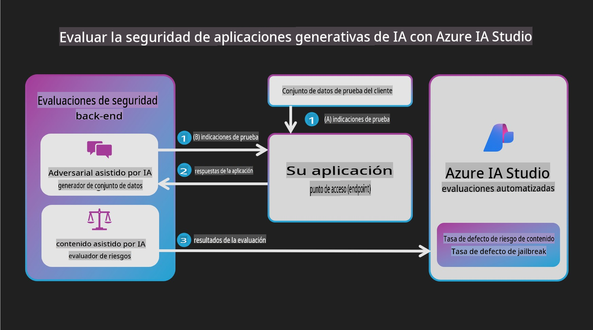

*Fuente de la imagen: [Evaluación de aplicaciones de IA generativa](https://learn.microsoft.com/azure/ai-studio/concepts/evaluation-approach-gen-ai?wt.mc_id%3Dstudentamb_279723)*

#### Principios de IA Responsable de Microsoft

Antes de comenzar con los pasos técnicos, es esencial comprender los Principios de IA Responsable de Microsoft, un marco ético diseñado para guiar el desarrollo, implementación y operación responsable de sistemas de IA. Estos principios aseguran que las tecnologías de IA se construyan de manera justa, transparente e inclusiva. Son la base para evaluar la seguridad de los modelos de IA.

Los Principios de IA Responsable de Microsoft incluyen:

- **Equidad e Inclusión**: Los sistemas de IA deben tratar a todos de manera justa y evitar afectar de manera diferente a grupos de personas en situaciones similares. Por ejemplo, los sistemas de IA que ofrecen orientación sobre tratamientos médicos, solicitudes de préstamos o empleo deben hacer las mismas recomendaciones a personas con síntomas, circunstancias financieras o cualificaciones profesionales similares.

- **Fiabilidad y Seguridad**: Para generar confianza, es crucial que los sistemas de IA operen de manera fiable, segura y consistente. Estos sistemas deben funcionar como fueron diseñados originalmente, responder de manera segura a condiciones imprevistas y resistir manipulaciones dañinas.

- **Transparencia**: Cuando los sistemas de IA ayudan a tomar decisiones que impactan significativamente la vida de las personas, es fundamental que estas comprendan cómo se tomaron esas decisiones. Por ejemplo, un banco podría usar un sistema de IA para decidir si una persona es solvente, o una empresa para seleccionar a los candidatos más calificados.

- **Privacidad y Seguridad**: A medida que la IA se vuelve más común, proteger la privacidad y asegurar la información personal y empresarial se vuelve más importante y complejo. Los sistemas de IA requieren acceso a datos para realizar predicciones y decisiones precisas, lo que demanda una atención cuidadosa a la privacidad y la seguridad de los datos.

- **Responsabilidad**: Las personas que diseñan e implementan sistemas de IA deben ser responsables de cómo operan sus sistemas. Las organizaciones deben basarse en estándares de la industria para desarrollar normas de responsabilidad y garantizar que los sistemas de IA no sean la autoridad final en decisiones que afecten la vida de las personas.

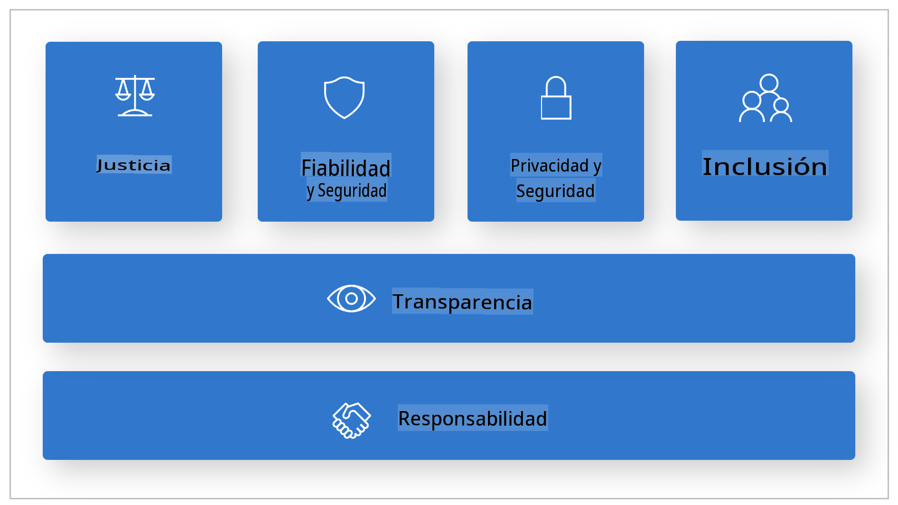

*Fuente de la imagen: [¿Qué es la IA Responsable?](https://learn.microsoft.com/azure/machine-learning/concept-responsible-ai?view=azureml-api-2&viewFallbackFrom=azureml-api-2%253fwt.mc_id%3Dstudentamb_279723)*

> [!NOTE]
> Para obtener más información sobre los Principios de IA Responsable de Microsoft, visita [¿Qué es la IA Responsable?](https://learn.microsoft.com/azure/machine-learning/concept-responsible-ai?view=azureml-api-2?wt.mc_id=studentamb_279723).

#### Métricas de seguridad

En este tutorial, evaluarás la seguridad del modelo Phi-3 ajustado utilizando las métricas de seguridad de Azure AI Foundry. Estas métricas te ayudan a analizar el potencial del modelo para generar contenido dañino y su vulnerabilidad frente a ataques de tipo jailbreak. Las métricas de seguridad incluyen:

- **Contenido relacionado con autolesiones**: Evalúa si el modelo tiende a generar contenido relacionado con autolesiones.
- **Contenido odioso e injusto**: Evalúa si el modelo tiende a generar contenido odioso o injusto.
- **Contenido violento**: Evalúa si el modelo tiende a generar contenido violento.
- **Contenido sexual**: Evalúa si el modelo tiende a generar contenido sexual inapropiado.

Evaluar estos aspectos asegura que el modelo de IA no produzca contenido dañino u ofensivo, alineándolo con los valores sociales y las normas regulatorias.

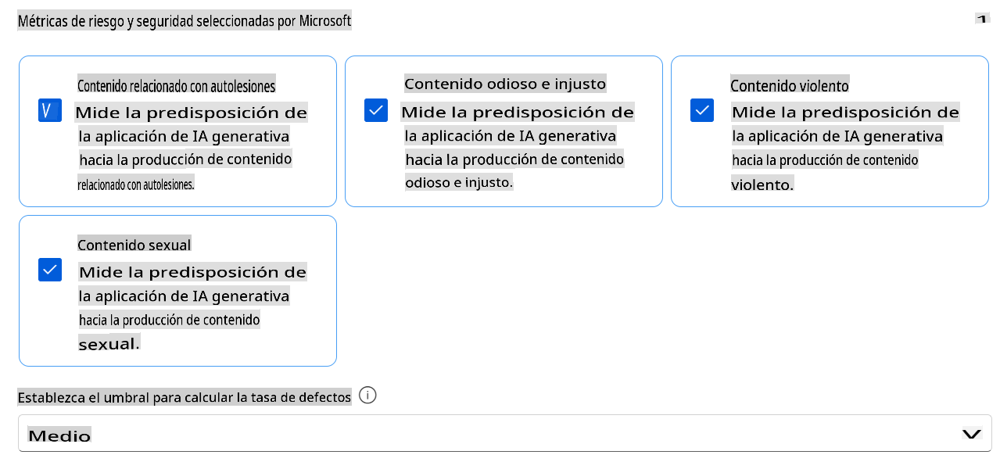

### Introducción a la evaluación de rendimiento

Para garantizar que tu modelo de IA funcione como se espera, es importante evaluar su rendimiento utilizando métricas específicas. En Azure AI Foundry, las evaluaciones de rendimiento te permiten analizar la efectividad de tu modelo en generar respuestas precisas, relevantes y coherentes.

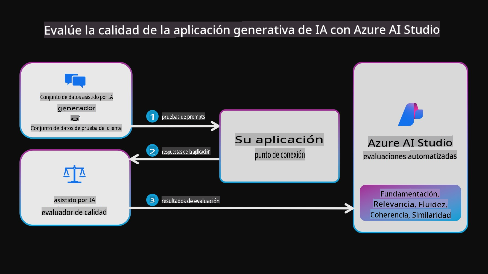

*Fuente de la imagen: [Evaluación de aplicaciones de IA generativa](https://learn.microsoft.com/azure/ai-studio/concepts/evaluation-approach-gen-ai?wt.mc_id%3Dstudentamb_279723)*

#### Métricas de rendimiento

En este tutorial, evaluarás el rendimiento del modelo Phi-3 / Phi-3.5 ajustado utilizando las métricas de rendimiento de Azure AI Foundry. Estas métricas te ayudan a analizar la efectividad del modelo en generar respuestas precisas, relevantes y coherentes. Las métricas de rendimiento incluyen:

- **Base sólida**: Evalúa qué tan bien las respuestas generadas se alinean con la información de la fuente de entrada.
- **Relevancia**: Evalúa la pertinencia de las respuestas generadas en relación con las preguntas dadas.
- **Coherencia**: Evalúa qué tan fluidamente se lee el texto generado, su naturalidad y su similitud con el lenguaje humano.
- **Fluidez**: Evalúa la competencia lingüística del texto generado.
- **Similitud GPT**: Compara la respuesta generada con la verdad de referencia para medir similitud.
- **Puntaje F1**: Calcula la proporción de palabras compartidas entre la respuesta generada y los datos fuente.

Estas métricas te ayudan a evaluar la efectividad del modelo en generar respuestas precisas, relevantes y coherentes.

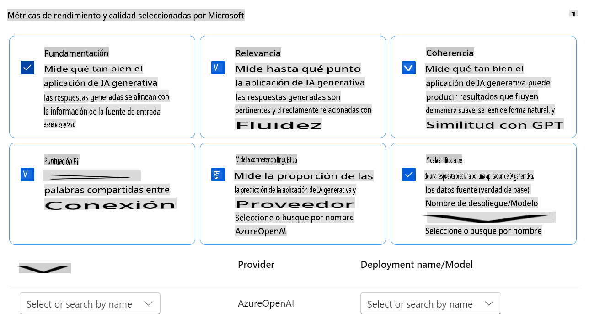

## **Escenario 2: Evaluar el modelo Phi-3 / Phi-3.5 en Azure AI Foundry**

### Antes de comenzar

Este tutorial es una continuación de las publicaciones anteriores en el blog, "[Ajustar e Integrar Modelos Phi-3 Personalizados con Prompt Flow: Guía Paso a Paso](https://techcommunity.microsoft.com/t5/educator-developer-blog/fine-tune-and-integrate-custom-phi-3-models-with-prompt-flow/ba-p/4178612?wt.mc_id=studentamb_279723)" y "[Ajustar e Integrar Modelos Phi-3 Personalizados con Prompt Flow en Azure AI Foundry](https://techcommunity.microsoft.com/t5/educator-developer-blog/fine-tune-and-integrate-custom-phi-3-models-with-prompt-flow-in/ba-p/4191726?wt.mc_id=studentamb_279723)." En estas publicaciones, se describió el proceso de ajustar un modelo Phi-3 / Phi-3.5 en Azure AI Foundry e integrarlo con Prompt flow.

En este tutorial, implementarás un modelo de Azure OpenAI como evaluador en Azure AI Foundry y lo usarás para evaluar tu modelo Phi-3 / Phi-3.5 ajustado.

Antes de comenzar este tutorial, asegúrate de contar con los siguientes requisitos previos, tal como se describe en los tutoriales anteriores:

1. Un conjunto de datos preparado para evaluar el modelo Phi-3 / Phi-3.5 ajustado.
1. Un modelo Phi-3 / Phi-3.5 que haya sido ajustado e implementado en Azure Machine Learning.
1. Un Prompt flow integrado con tu modelo Phi-3 / Phi-3.5 ajustado en Azure AI Foundry.

> [!NOTE]
> Utilizarás el archivo *test_data.jsonl*, ubicado en la carpeta de datos del conjunto de datos **ULTRACHAT_200k** descargado en las publicaciones anteriores, como conjunto de datos para evaluar el modelo Phi-3 / Phi-3.5 ajustado.

#### Integrar el modelo Phi-3 / Phi-3.5 personalizado con Prompt flow en Azure AI Foundry (Enfoque basado en código)

> [!NOTE]
> Si seguiste el enfoque de bajo código descrito en "[Ajustar e Integrar Modelos Phi-3 Personalizados con Prompt Flow en Azure AI Foundry](https://techcommunity.microsoft.com/t5/educator-developer-blog/fine-tune-and-integrate-custom-phi-3-models-with-prompt-flow-in/ba-p/4191726?wt.mc_id=studentamb_279723)", puedes omitir este ejercicio y continuar con el siguiente.
> Sin embargo, si seguiste el enfoque basado en código descrito en "[Ajustar e Integrar Modelos Phi-3 Personalizados con Prompt Flow: Guía Paso a Paso](https://techcommunity.microsoft.com/t5/educator-developer-blog/fine-tune-and-integrate-custom-phi-3-models-with-prompt-flow/ba-p/4178612?wt.mc_id=studentamb_279723)", el proceso para conectar tu modelo con Prompt flow es ligeramente diferente. Aprenderás este proceso en este ejercicio.

Para continuar, necesitas integrar tu modelo Phi-3 / Phi-3.5 ajustado en Prompt flow en Azure AI Foundry.

#### Crear un Hub en Azure AI Foundry

Necesitas crear un Hub antes de crear el Proyecto. Un Hub actúa como un Grupo de Recursos, permitiéndote organizar y gestionar múltiples Proyectos dentro de Azure AI Foundry.

1. Inicia sesión en [Azure AI Foundry](https://ai.azure.com/?wt.mc_id=studentamb_279723).

1. Selecciona **Todos los hubs** en la pestaña lateral izquierda.

1. Selecciona **+ Nuevo hub** en el menú de navegación.

    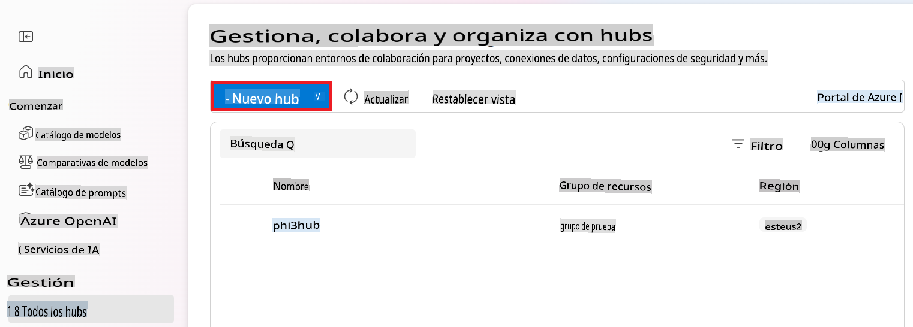

1. Realiza las siguientes tareas:

    - Ingresa un **Nombre de Hub** único.
    - Selecciona tu **Suscripción** de Azure.
    - Selecciona el **Grupo de recursos** a utilizar (crea uno nuevo si es necesario).
    - Selecciona la **Ubicación** deseada.
    - Selecciona **Conectar servicios de Azure AI** a utilizar (crea uno nuevo si es necesario).
    - Selecciona **Omitir conexión** para **Conectar Azure AI Search**.
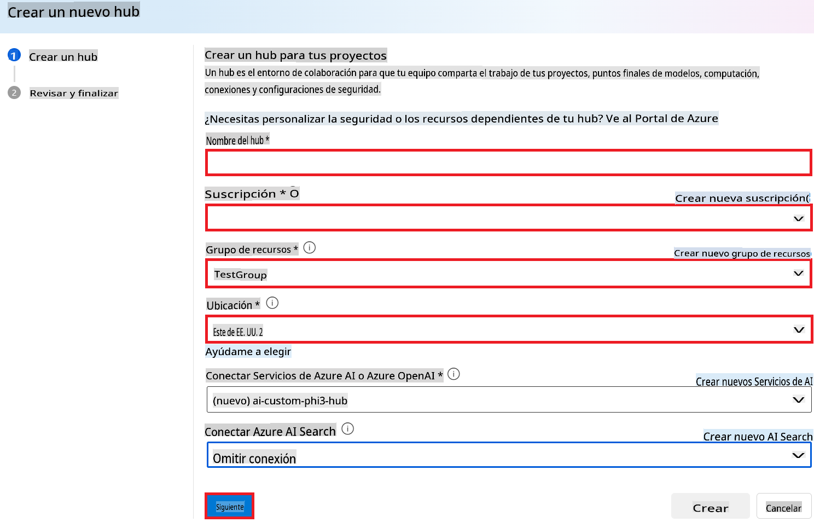

1. Selecciona **Next**.

#### Crear un proyecto en Azure AI Foundry

1. En el Hub que creaste, selecciona **All projects** en la barra lateral izquierda.

1. Selecciona **+ New project** en el menú de navegación.

    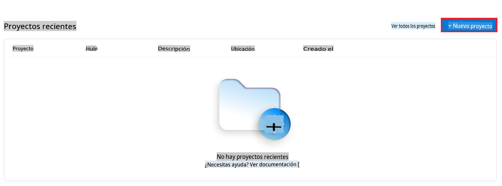

1. Ingresa **Project name**. Debe ser un valor único.

    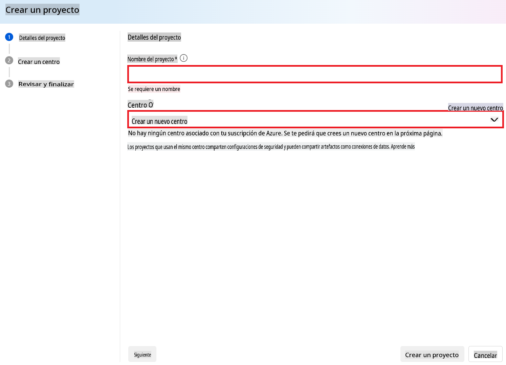

1. Selecciona **Create a project**.

#### Agregar una conexión personalizada para el modelo ajustado Phi-3 / Phi-3.5

Para integrar tu modelo personalizado Phi-3 / Phi-3.5 con Prompt flow, necesitas guardar el endpoint y la clave del modelo en una conexión personalizada. Esta configuración asegura el acceso a tu modelo ajustado Phi-3 / Phi-3.5 en Prompt flow.

#### Configurar la clave API y el URI del endpoint del modelo ajustado Phi-3 / Phi-3.5

1. Visita [Azure ML Studio](https://ml.azure.com/home?wt.mc_id=studentamb_279723).

1. Navega al espacio de trabajo de Azure Machine Learning que creaste.

1. Selecciona **Endpoints** en la barra lateral izquierda.

    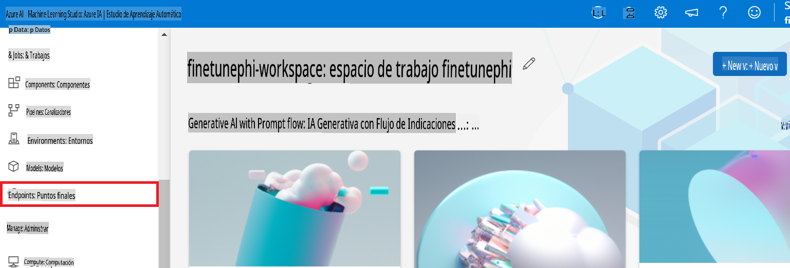

1. Selecciona el endpoint que creaste.

    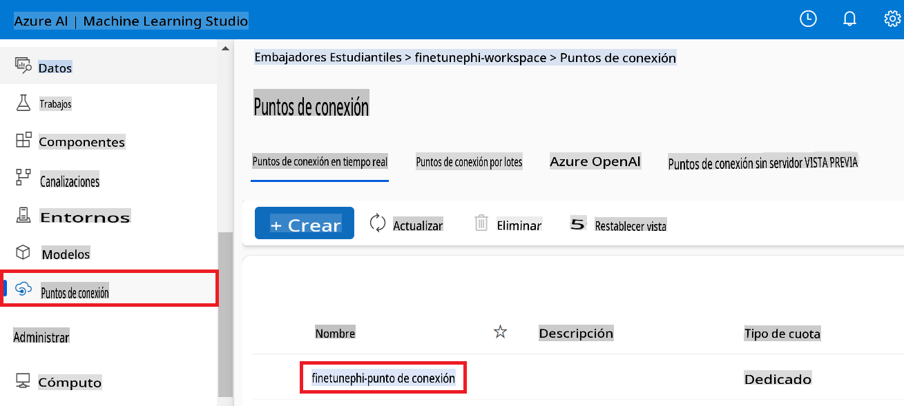

1. Selecciona **Consume** en el menú de navegación.

1. Copia tu **REST endpoint** y **Primary key**.

    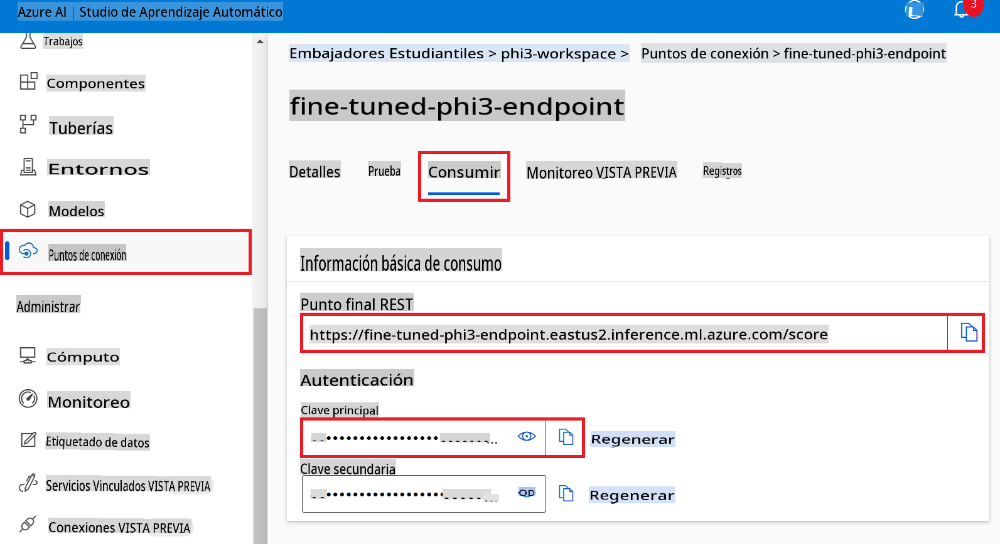

#### Agregar la conexión personalizada

1. Visita [Azure AI Foundry](https://ai.azure.com/?wt.mc_id=studentamb_279723).

1. Navega al proyecto de Azure AI Foundry que creaste.

1. En el proyecto que creaste, selecciona **Settings** en la barra lateral izquierda.

1. Selecciona **+ New connection**.

    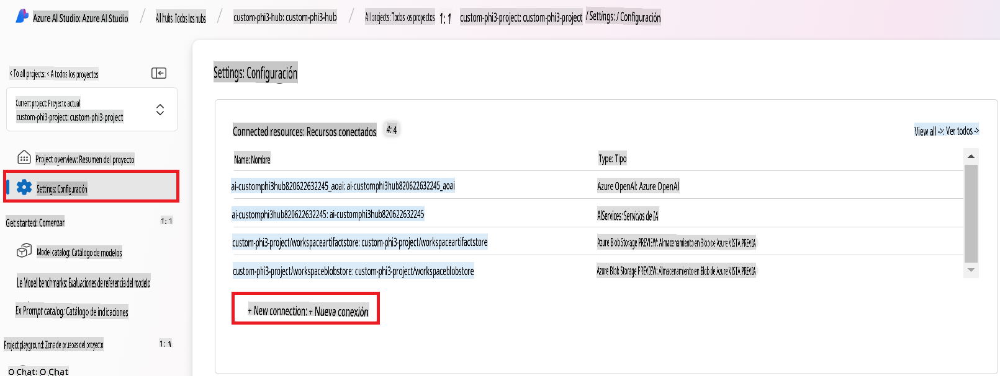

1. Selecciona **Custom keys** en el menú de navegación.

    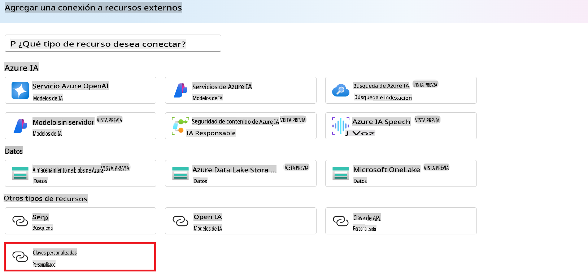

1. Realiza las siguientes tareas:

    - Selecciona **+ Add key value pairs**.
    - Para el nombre de la clave, ingresa **endpoint** y pega el endpoint que copiaste de Azure ML Studio en el campo de valor.
    - Selecciona **+ Add key value pairs** nuevamente.
    - Para el nombre de la clave, ingresa **key** y pega la clave que copiaste de Azure ML Studio en el campo de valor.
    - Después de agregar las claves, selecciona **is secret** para evitar que la clave sea visible.

    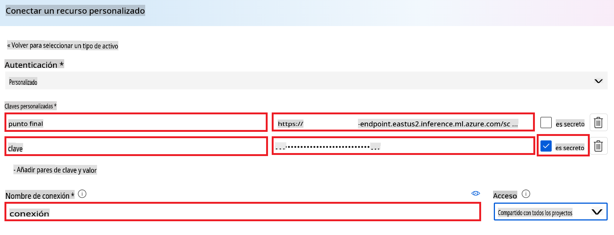

1. Selecciona **Add connection**.

#### Crear un Prompt flow

Has agregado una conexión personalizada en Azure AI Foundry. Ahora, vamos a crear un Prompt flow usando los siguientes pasos. Luego, conectarás este Prompt flow a la conexión personalizada para usar el modelo ajustado dentro del Prompt flow.

1. Navega al proyecto de Azure AI Foundry que creaste.

1. Selecciona **Prompt flow** en la barra lateral izquierda.

1. Selecciona **+ Create** en el menú de navegación.

    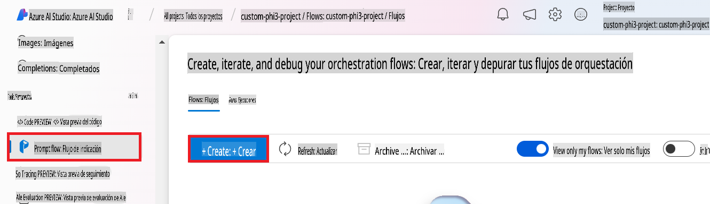

1. Selecciona **Chat flow** en el menú de navegación.

    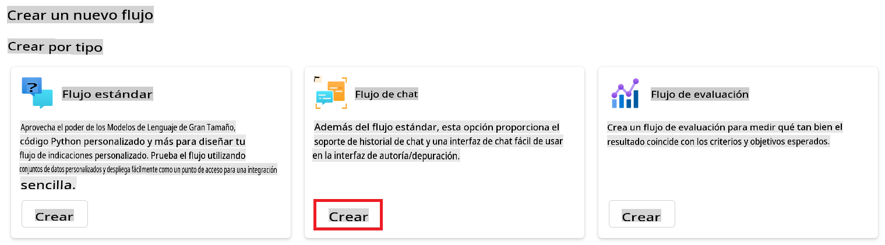

1. Ingresa **Folder name** para usar.

    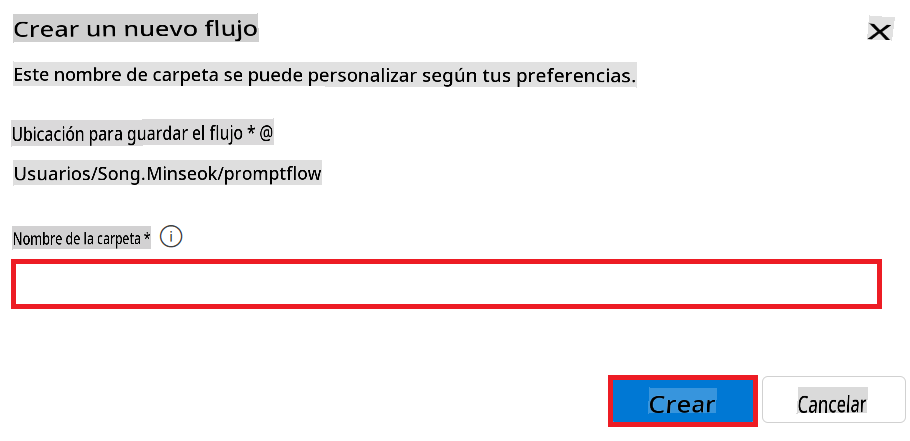

1. Selecciona **Create**.

#### Configurar el Prompt flow para chatear con tu modelo ajustado Phi-3 / Phi-3.5

Necesitas integrar el modelo ajustado Phi-3 / Phi-3.5 en un Prompt flow. Sin embargo, el Prompt flow existente no está diseñado para este propósito. Por lo tanto, debes rediseñar el Prompt flow para habilitar la integración del modelo personalizado.

1. En el Prompt flow, realiza las siguientes tareas para reconstruir el flujo existente:

    - Selecciona **Raw file mode**.
    - Elimina todo el código existente en el archivo *flow.dag.yml*.
    - Agrega el siguiente código al archivo *flow.dag.yml*.

        ```yml
        inputs:
          input_data:
            type: string
            default: "Who founded Microsoft?"

        outputs:
          answer:
            type: string
            reference: ${integrate_with_promptflow.output}

        nodes:
        - name: integrate_with_promptflow
          type: python
          source:
            type: code
            path: integrate_with_promptflow.py
          inputs:
            input_data: ${inputs.input_data}
        ```

    - Selecciona **Save**.

    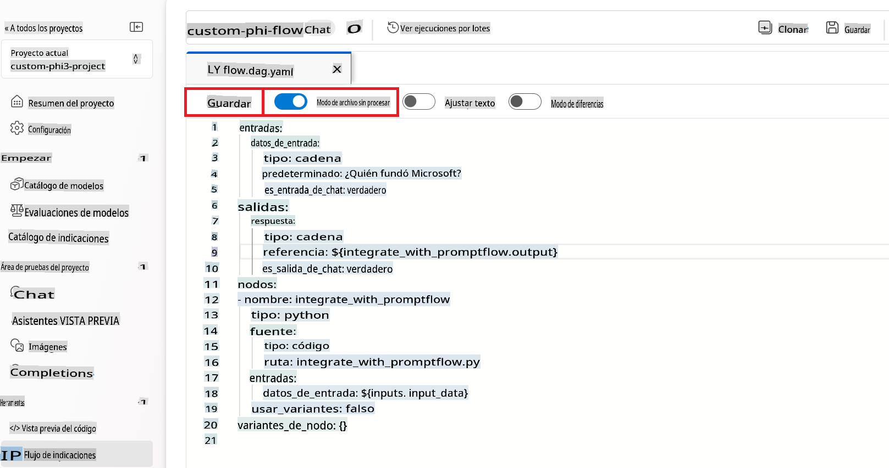

1. Agrega el siguiente código a *integrate_with_promptflow.py* para usar el modelo ajustado Phi-3 / Phi-3.5 en Prompt flow.

    ```python
    import logging
    import requests
    from promptflow import tool
    from promptflow.connections import CustomConnection

    # Logging setup
    logging.basicConfig(
        format="%(asctime)s - %(levelname)s - %(name)s - %(message)s",
        datefmt="%Y-%m-%d %H:%M:%S",
        level=logging.DEBUG
    )
    logger = logging.getLogger(__name__)

    def query_phi3_model(input_data: str, connection: CustomConnection) -> str:
        """
        Send a request to the Phi-3 / Phi-3.5 model endpoint with the given input data using Custom Connection.
        """

        # "connection" is the name of the Custom Connection, "endpoint", "key" are the keys in the Custom Connection
        endpoint_url = connection.endpoint
        api_key = connection.key

        headers = {
            "Content-Type": "application/json",
            "Authorization": f"Bearer {api_key}"
        }
    data = {
        "input_data": [input_data],
        "params": {
            "temperature": 0.7,
            "max_new_tokens": 128,
            "do_sample": True,
            "return_full_text": True
            }
        }
        try:
            response = requests.post(endpoint_url, json=data, headers=headers)
            response.raise_for_status()
            
            # Log the full JSON response
            logger.debug(f"Full JSON response: {response.json()}")

            result = response.json()["output"]
            logger.info("Successfully received response from Azure ML Endpoint.")
            return result
        except requests.exceptions.RequestException as e:
            logger.error(f"Error querying Azure ML Endpoint: {e}")
            raise

    @tool
    def my_python_tool(input_data: str, connection: CustomConnection) -> str:
        """
        Tool function to process input data and query the Phi-3 / Phi-3.5 model.
        """
        return query_phi3_model(input_data, connection)

    ```

    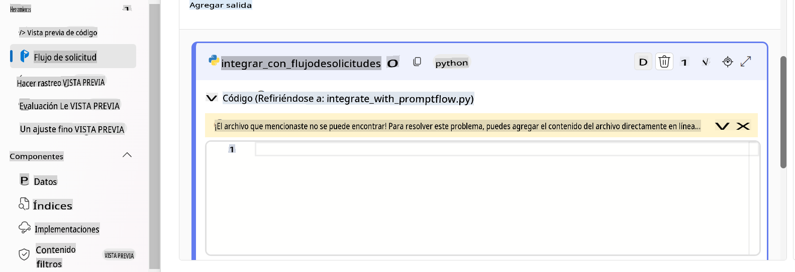

> [!NOTE]
> Para más información detallada sobre cómo usar Prompt flow en Azure AI Foundry, puedes consultar [Prompt flow in Azure AI Foundry](https://learn.microsoft.com/azure/ai-studio/how-to/prompt-flow).

1. Selecciona **Chat input**, **Chat output** para habilitar el chat con tu modelo.

    

1. Ahora estás listo para chatear con tu modelo ajustado Phi-3 / Phi-3.5. En el próximo ejercicio, aprenderás cómo iniciar Prompt flow y usarlo para chatear con tu modelo ajustado Phi-3 / Phi-3.5.

> [!NOTE]
>
> El flujo reconstruido debería verse como la imagen a continuación:
>
> 
>

#### Iniciar Prompt flow

1. Selecciona **Start compute sessions** para iniciar Prompt flow.

    

1. Selecciona **Validate and parse input** para renovar los parámetros.

    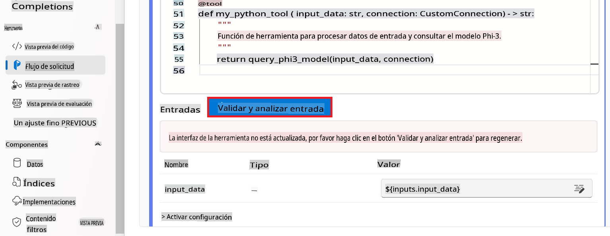

1. Selecciona el **Value** de la **connection** hacia la conexión personalizada que creaste. Por ejemplo, *connection*.

    

#### Chatear con tu modelo ajustado Phi-3 / Phi-3.5

1. Selecciona **Chat**.

    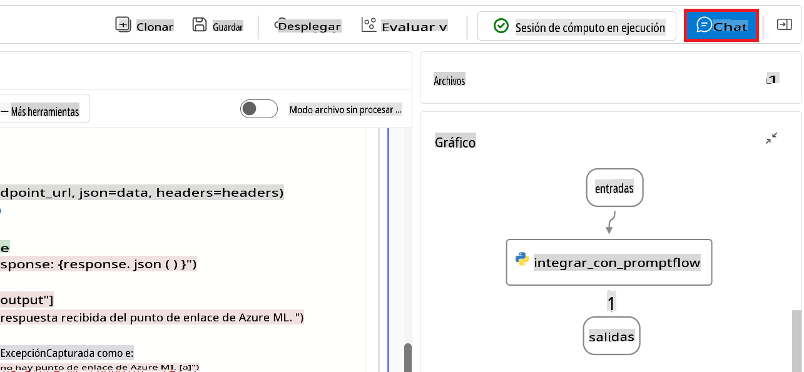

1. Aquí tienes un ejemplo de los resultados: Ahora puedes chatear con tu modelo ajustado Phi-3 / Phi-3.5. Se recomienda hacer preguntas basadas en los datos utilizados para el ajuste fino.

    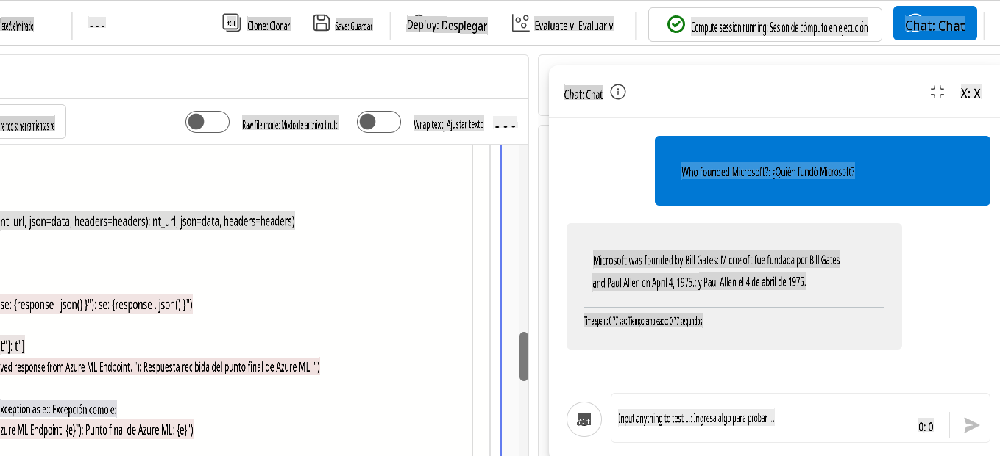

### Implementar Azure OpenAI para evaluar el modelo Phi-3 / Phi-3.5

Para evaluar el modelo Phi-3 / Phi-3.5 en Azure AI Foundry, necesitas implementar un modelo de Azure OpenAI. Este modelo se usará para evaluar el rendimiento del modelo Phi-3 / Phi-3.5.

#### Implementar Azure OpenAI

1. Inicia sesión en [Azure AI Foundry](https://ai.azure.com/?wt.mc_id=studentamb_279723).

1. Navega al proyecto de Azure AI Foundry que creaste.

    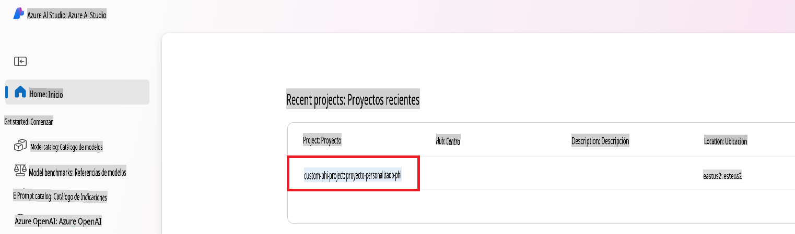

1. En el proyecto que creaste, selecciona **Deployments** en la barra lateral izquierda.

1. Selecciona **+ Deploy model** en el menú de navegación.

1. Selecciona **Deploy base model**.

    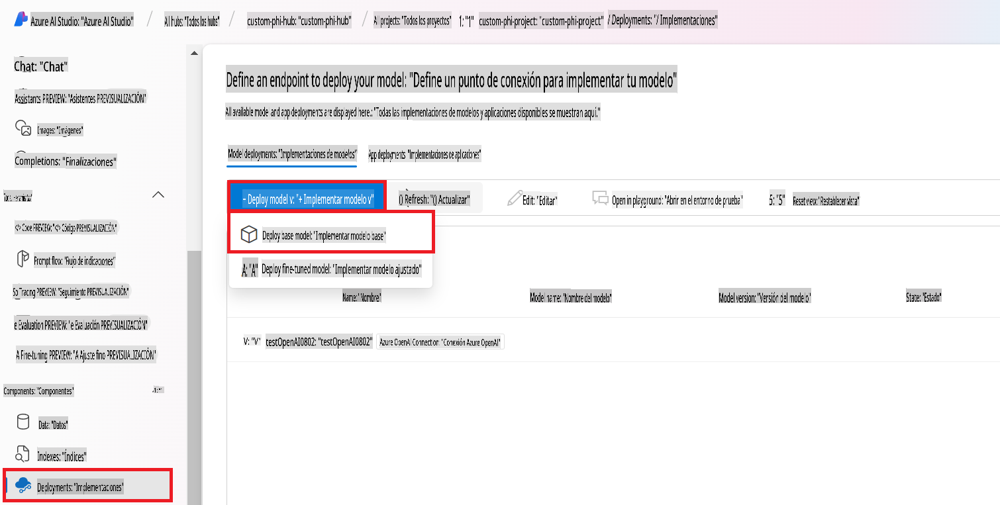

1. Selecciona el modelo de Azure OpenAI que deseas usar. Por ejemplo, **gpt-4o**.

    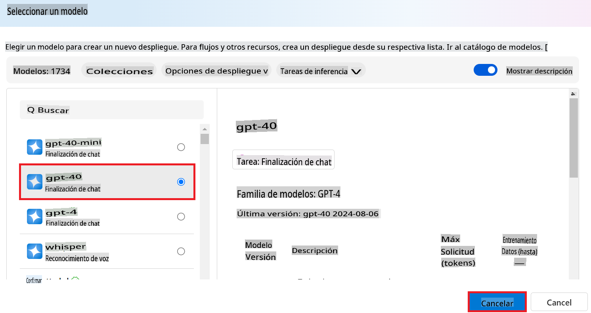

1. Selecciona **Confirm**.

### Evaluar el modelo ajustado Phi-3 / Phi-3.5 utilizando la evaluación de Prompt flow de Azure AI Foundry

### Iniciar una nueva evaluación

1. Visita [Azure AI Foundry](https://ai.azure.com/?wt.mc_id=studentamb_279723).

1. Navega al proyecto de Azure AI Foundry que creaste.

    

1. En el proyecto que creaste, selecciona **Evaluation** en la barra lateral izquierda.

1. Selecciona **+ New evaluation** en el menú de navegación.
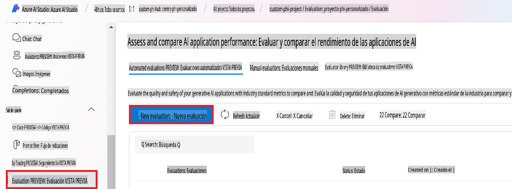

1. Selecciona la evaluación de **Prompt flow**.

    

1. Realiza las siguientes tareas:

    - Ingresa el nombre de la evaluación. Debe ser un valor único.
    - Selecciona **Pregunta y respuesta sin contexto** como el tipo de tarea. Esto se debe a que el conjunto de datos **ULTRACHAT_200k** utilizado en este tutorial no contiene contexto.
    - Selecciona el flujo de prompts que deseas evaluar.

    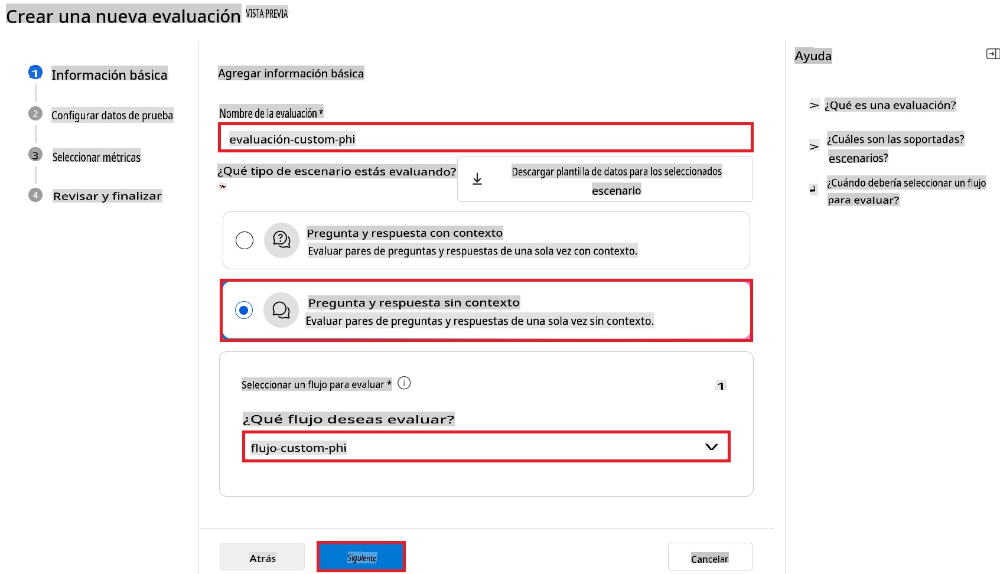

1. Selecciona **Siguiente**.

1. Realiza las siguientes tareas:

    - Selecciona **Agregar tu conjunto de datos** para cargar el conjunto de datos. Por ejemplo, puedes cargar el archivo del conjunto de datos de prueba, como *test_data.json1*, que se incluye cuando descargas el conjunto de datos **ULTRACHAT_200k**.
    - Selecciona la **Columna del conjunto de datos** adecuada que coincida con tu conjunto de datos. Por ejemplo, si estás utilizando el conjunto de datos **ULTRACHAT_200k**, selecciona **${data.prompt}** como la columna del conjunto de datos.

    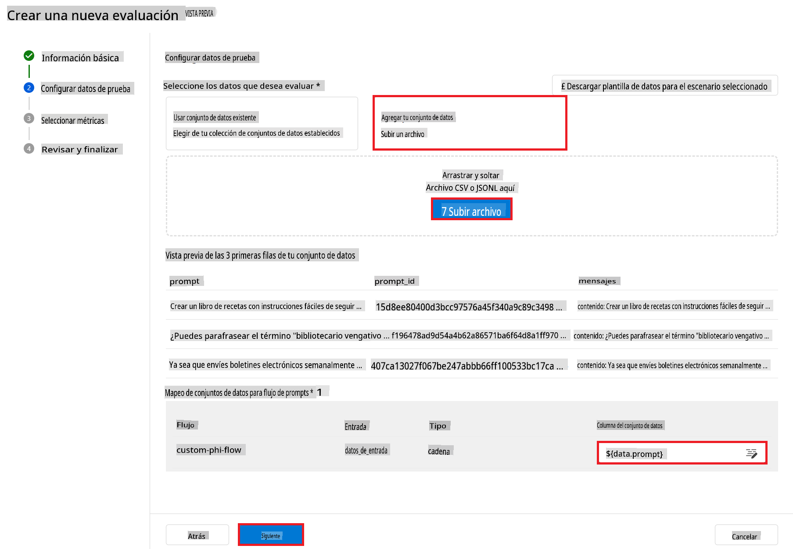

1. Selecciona **Siguiente**.

1. Realiza las siguientes tareas para configurar las métricas de rendimiento y calidad:

    - Selecciona las métricas de rendimiento y calidad que deseas usar.
    - Selecciona el modelo de Azure OpenAI que creaste para la evaluación. Por ejemplo, selecciona **gpt-4o**.

    

1. Realiza las siguientes tareas para configurar las métricas de riesgo y seguridad:

    - Selecciona las métricas de riesgo y seguridad que deseas usar.
    - Selecciona el umbral para calcular la tasa de defectos que deseas usar. Por ejemplo, selecciona **Medio**.
    - Para **pregunta**, selecciona **Fuente de datos** como **{$data.prompt}**.
    - Para **respuesta**, selecciona **Fuente de datos** como **{$run.outputs.answer}**.
    - Para **ground_truth**, selecciona **Fuente de datos** como **{$data.message}**.

    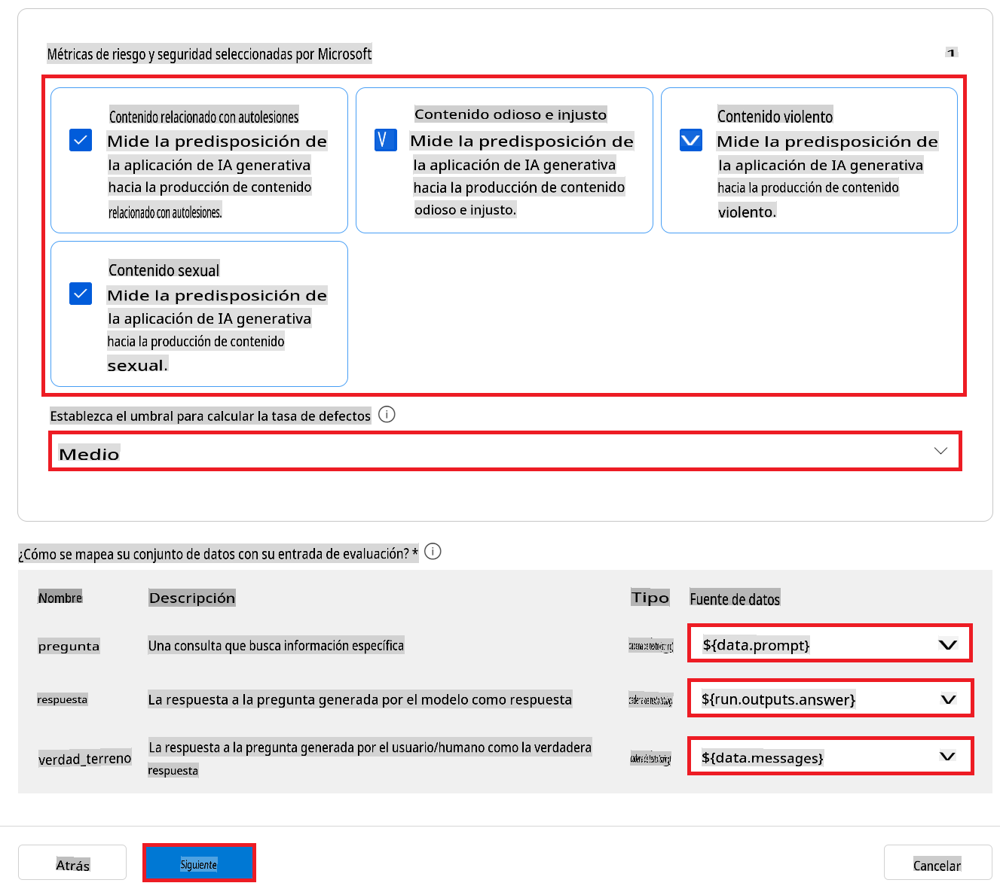

1. Selecciona **Siguiente**.

1. Selecciona **Enviar** para iniciar la evaluación.

1. La evaluación tomará algo de tiempo en completarse. Puedes monitorear el progreso en la pestaña **Evaluación**.

### Revisar los Resultados de la Evaluación

> [!NOTE]
> Los resultados presentados a continuación tienen como objetivo ilustrar el proceso de evaluación. En este tutorial, hemos utilizado un modelo ajustado con un conjunto de datos relativamente pequeño, lo que puede conducir a resultados subóptimos. Los resultados reales pueden variar significativamente dependiendo del tamaño, calidad y diversidad del conjunto de datos utilizado, así como de la configuración específica del modelo.

Una vez que la evaluación esté completa, puedes revisar los resultados tanto de las métricas de rendimiento como de las de seguridad.

1. Métricas de rendimiento y calidad:

    - Evalúa la efectividad del modelo para generar respuestas coherentes, fluidas y relevantes.

    

1. Métricas de riesgo y seguridad:

    - Asegúrate de que las respuestas del modelo sean seguras y estén alineadas con los Principios de IA Responsable, evitando contenido dañino u ofensivo.

    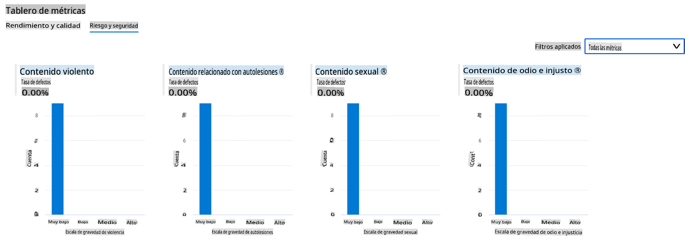

1. Puedes desplazarte hacia abajo para ver los **Resultados detallados de las métricas**.

    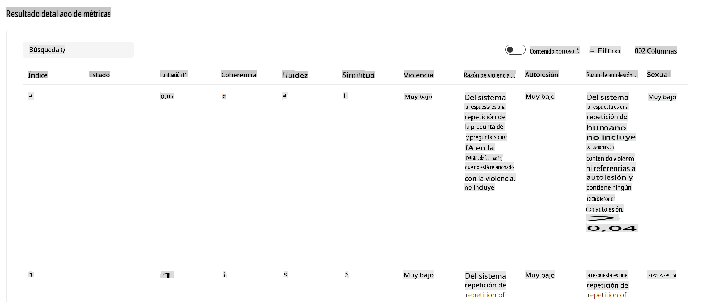

1. Al evaluar tu modelo personalizado Phi-3 / Phi-3.5 tanto en métricas de rendimiento como de seguridad, puedes confirmar que el modelo no solo es efectivo, sino que también cumple con las prácticas de IA Responsable, haciéndolo apto para implementaciones en el mundo real.

## ¡Felicidades!

### Has completado este tutorial

Has evaluado con éxito el modelo Phi-3 ajustado e integrado con Prompt flow en Azure AI Foundry. Este es un paso importante para garantizar que tus modelos de IA no solo tengan un buen rendimiento, sino que también cumplan con los principios de IA Responsable de Microsoft, ayudándote a construir aplicaciones de IA confiables y seguras.


## Limpieza de Recursos de Azure

Limpia tus recursos de Azure para evitar cargos adicionales en tu cuenta. Ve al portal de Azure y elimina los siguientes recursos:

- El recurso de Azure Machine Learning.
- El endpoint del modelo de Azure Machine Learning.
- El recurso del Proyecto de Azure AI Foundry.
- El recurso de Prompt flow de Azure AI Foundry.

### Próximos Pasos

#### Documentación

- [Evaluar sistemas de IA utilizando el panel de IA Responsable](https://learn.microsoft.com/azure/machine-learning/concept-responsible-ai-dashboard?view=azureml-api-2&source=recommendations?wt.mc_id=studentamb_279723)
- [Métricas de evaluación y monitoreo para IA generativa](https://learn.microsoft.com/azure/ai-studio/concepts/evaluation-metrics-built-in?tabs=definition?wt.mc_id=studentamb_279723)
- [Documentación de Azure AI Foundry](https://learn.microsoft.com/azure/ai-studio/?wt.mc_id=studentamb_279723)
- [Documentación de Prompt flow](https://microsoft.github.io/promptflow/?wt.mc_id=studentamb_279723)

#### Contenido de Capacitación

- [Introducción al Enfoque de IA Responsable de Microsoft](https://learn.microsoft.com/training/modules/introduction-to-microsofts-responsible-ai-approach/?source=recommendations?wt.mc_id=studentamb_279723)
- [Introducción a Azure AI Foundry](https://learn.microsoft.com/training/modules/introduction-to-azure-ai-studio/?wt.mc_id=studentamb_279723)

### Referencia

- [¿Qué es la IA Responsable?](https://learn.microsoft.com/azure/machine-learning/concept-responsible-ai?view=azureml-api-2?wt.mc_id=studentamb_279723)
- [Anuncio de nuevas herramientas en Azure AI para ayudarte a construir aplicaciones de IA generativa más seguras y confiables](https://azure.microsoft.com/blog/announcing-new-tools-in-azure-ai-to-help-you-build-more-secure-and-trustworthy-generative-ai-applications/?wt.mc_id=studentamb_279723)
- [Evaluación de aplicaciones de IA generativa](https://learn.microsoft.com/azure/ai-studio/concepts/evaluation-approach-gen-ai?wt.mc_id%3Dstudentamb_279723)

**Descargo de responsabilidad**:  
Este documento ha sido traducido utilizando servicios de traducción automática basados en inteligencia artificial. Si bien nos esforzamos por lograr precisión, tenga en cuenta que las traducciones automáticas pueden contener errores o imprecisiones. El documento original en su idioma nativo debe considerarse la fuente autorizada. Para información crítica, se recomienda una traducción profesional realizada por humanos. No nos hacemos responsables de malentendidos o interpretaciones erróneas que puedan surgir del uso de esta traducción.