# Ajustar y Configurar modelos personalizados Phi-3 con Prompt flow

Este ejemplo de extremo a extremo (E2E) está basado en la guía "[Fine-Tune and Integrate Custom Phi-3 Models with Prompt Flow: Step-by-Step Guide](https://techcommunity.microsoft.com/t5/educator-developer-blog/fine-tune-and-integrate-custom-phi-3-models-with-prompt-flow/ba-p/4178612?WT.mc_id=aiml-137032-kinfeylo)" de la Comunidad Técnica de Microsoft. Introduce los procesos de ajuste fino, implementación e integración de modelos personalizados Phi-3 con Prompt flow.

## Descripción general

En este ejemplo E2E, aprenderás cómo ajustar el modelo Phi-3 e integrarlo con Prompt flow. Aprovechando Azure Machine Learning y Prompt flow, establecerás un flujo de trabajo para implementar y utilizar modelos de IA personalizados. Este ejemplo E2E se divide en tres escenarios:

**Escenario 1: Configurar recursos de Azure y preparar para el ajuste fino**

**Escenario 2: Ajustar el modelo Phi-3 e implementarlo en Azure Machine Learning Studio**

**Escenario 3: Integrar con Prompt flow y chatear con tu modelo personalizado**

Aquí tienes una descripción general de este ejemplo E2E.

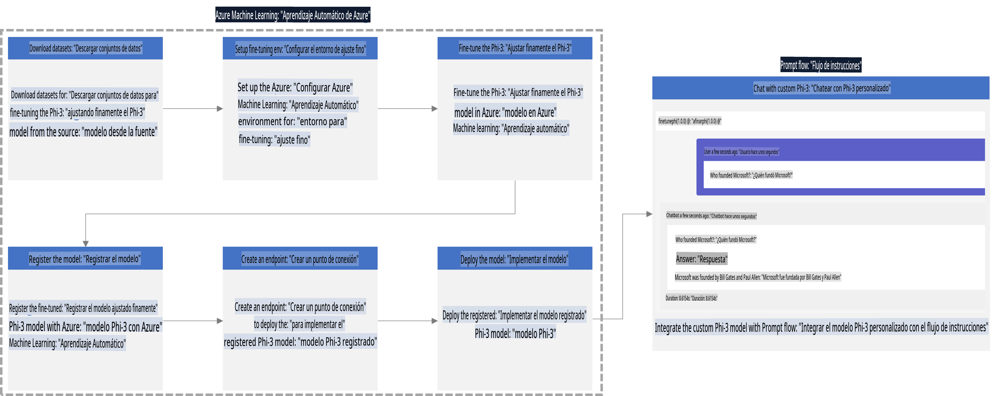

### Tabla de Contenidos

1. **[Escenario 1: Configurar recursos de Azure y preparar para el ajuste fino](../../../../../../md/02.Application/01.TextAndChat/Phi3)**
    - [Crear un espacio de trabajo de Azure Machine Learning](../../../../../../md/02.Application/01.TextAndChat/Phi3)
    - [Solicitar cuotas de GPU en la suscripción de Azure](../../../../../../md/02.Application/01.TextAndChat/Phi3)
    - [Agregar asignación de roles](../../../../../../md/02.Application/01.TextAndChat/Phi3)
    - [Configurar el proyecto](../../../../../../md/02.Application/01.TextAndChat/Phi3)
    - [Preparar el conjunto de datos para el ajuste fino](../../../../../../md/02.Application/01.TextAndChat/Phi3)

1. **[Escenario 2: Ajustar el modelo Phi-3 e implementarlo en Azure Machine Learning Studio](../../../../../../md/02.Application/01.TextAndChat/Phi3)**
    - [Configurar Azure CLI](../../../../../../md/02.Application/01.TextAndChat/Phi3)
    - [Ajustar el modelo Phi-3](../../../../../../md/02.Application/01.TextAndChat/Phi3)
    - [Implementar el modelo ajustado](../../../../../../md/02.Application/01.TextAndChat/Phi3)

1. **[Escenario 3: Integrar con Prompt flow y chatear con tu modelo personalizado](../../../../../../md/02.Application/01.TextAndChat/Phi3)**
    - [Integrar el modelo Phi-3 personalizado con Prompt flow](../../../../../../md/02.Application/01.TextAndChat/Phi3)
    - [Chatear con tu modelo personalizado](../../../../../../md/02.Application/01.TextAndChat/Phi3)

## Escenario 1: Configurar recursos de Azure y preparar para el ajuste fino

### Crear un espacio de trabajo de Azure Machine Learning

1. Escribe *azure machine learning* en la **barra de búsqueda** en la parte superior de la página del portal y selecciona **Azure Machine Learning** de las opciones que aparecen.

    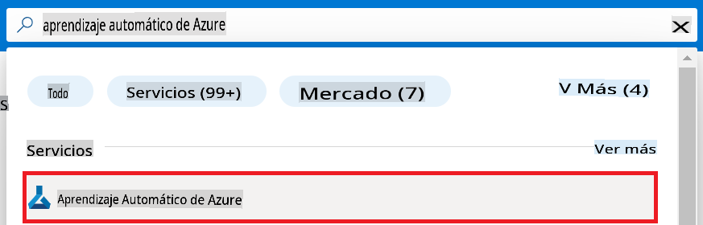

1. Selecciona **+ Crear** en el menú de navegación.

1. Selecciona **Nuevo espacio de trabajo** en el menú de navegación.

    

1. Realiza las siguientes tareas:

    - Selecciona tu **Suscripción de Azure**.
    - Selecciona el **Grupo de recursos** que usarás (crea uno nuevo si es necesario).
    - Introduce un **Nombre para el espacio de trabajo**. Debe ser un valor único.
    - Selecciona la **Región** que deseas utilizar.
    - Selecciona la **Cuenta de almacenamiento** que usarás (crea una nueva si es necesario).
    - Selecciona el **Key vault** que usarás (crea uno nuevo si es necesario).
    - Selecciona **Application insights** que usarás (crea uno nuevo si es necesario).
    - Selecciona el **Registro de contenedores** que usarás (crea uno nuevo si es necesario).

    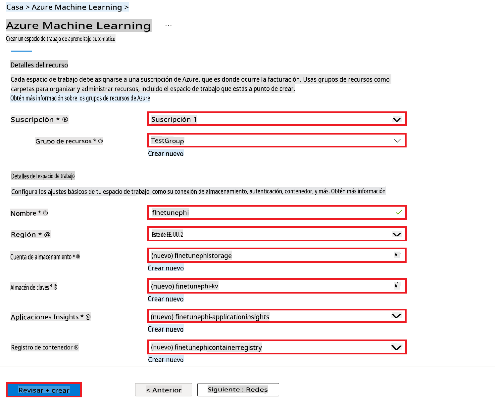

1. Selecciona **Revisar + Crear**.

1. Selecciona **Crear**.

### Solicitar cuotas de GPU en la suscripción de Azure

En este ejemplo E2E, usarás la GPU *Standard_NC24ads_A100_v4* para el ajuste fino, lo que requiere una solicitud de cuota, y la CPU *Standard_E4s_v3* para la implementación, que no requiere una solicitud de cuota.

> [!NOTE]
>
> Solo las suscripciones de tipo Pago por Uso (Pay-As-You-Go) son elegibles para la asignación de GPU; las suscripciones de beneficios no son compatibles actualmente.
>
> Para quienes usan suscripciones de beneficios (como Visual Studio Enterprise Subscription) o desean probar rápidamente el proceso de ajuste fino e implementación, este tutorial también proporciona orientación para ajustar con un conjunto de datos mínimo utilizando una CPU. Sin embargo, es importante tener en cuenta que los resultados del ajuste fino son significativamente mejores al usar una GPU con conjuntos de datos más grandes.

1. Visita [Azure ML Studio](https://ml.azure.com/home?wt.mc_id=studentamb_279723).

1. Realiza las siguientes tareas para solicitar la cuota *Standard NCADSA100v4 Family*:

    - Selecciona **Cuota** en la pestaña lateral izquierda.
    - Selecciona la **Familia de máquinas virtuales** que deseas usar. Por ejemplo, selecciona **Standard NCADSA100v4 Family Cluster Dedicated vCPUs**, que incluye la GPU *Standard_NC24ads_A100_v4*.
    - Selecciona **Solicitar cuota** en el menú de navegación.

        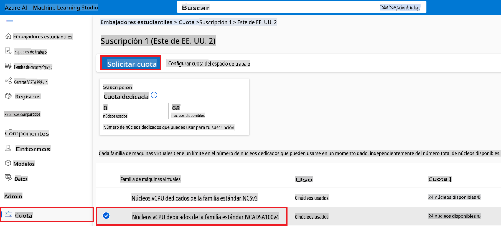

    - En la página de Solicitar cuota, introduce el **Nuevo límite de núcleos** que deseas usar. Por ejemplo, 24.
    - En la página de Solicitar cuota, selecciona **Enviar** para solicitar la cuota de GPU.

> [!NOTE]
> Puedes seleccionar la GPU o CPU adecuada para tus necesidades consultando el documento [Tamaños de Máquinas Virtuales en Azure](https://learn.microsoft.com/azure/virtual-machines/sizes/overview?tabs=breakdownseries%2Cgeneralsizelist%2Ccomputesizelist%2Cmemorysizelist%2Cstoragesizelist%2Cgpusizelist%2Cfpgasizelist%2Chpcsizelist).

### Agregar asignación de roles

Para ajustar y desplegar tus modelos, primero debes crear una Identidad Administrada Asignada por el Usuario (UAI) y asignarle los permisos adecuados. Esta UAI se usará para la autenticación durante la implementación.

#### Crear una Identidad Administrada Asignada por el Usuario (UAI)

1. Escribe *managed identities* en la **barra de búsqueda** en la parte superior de la página del portal y selecciona **Identidades Administradas** de las opciones que aparecen.

    

1. Selecciona **+ Crear**.

    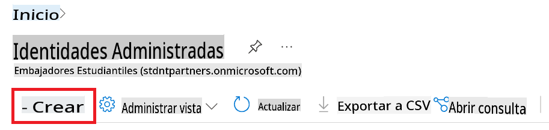

1. Realiza las siguientes tareas:

    - Selecciona tu **Suscripción de Azure**.
    - Selecciona el **Grupo de recursos** que usarás (crea uno nuevo si es necesario).
    - Selecciona la **Región** que deseas utilizar.
    - Introduce el **Nombre**. Debe ser un valor único.

1. Selecciona **Revisar + Crear**.

1. Selecciona **+ Crear**.

#### Agregar asignación de rol de Colaborador a la Identidad Administrada

1. Navega al recurso de Identidad Administrada que creaste.

1. Selecciona **Asignaciones de roles de Azure** en la pestaña lateral izquierda.

1. Selecciona **+Agregar asignación de rol** en el menú de navegación.

1. En la página de Agregar asignación de rol, realiza las siguientes tareas:
    - Selecciona el **Ámbito** como **Grupo de recursos**.
    - Selecciona tu **Suscripción de Azure**.
    - Selecciona el **Grupo de recursos** que usarás.
    - Selecciona el **Rol** como **Colaborador**.

    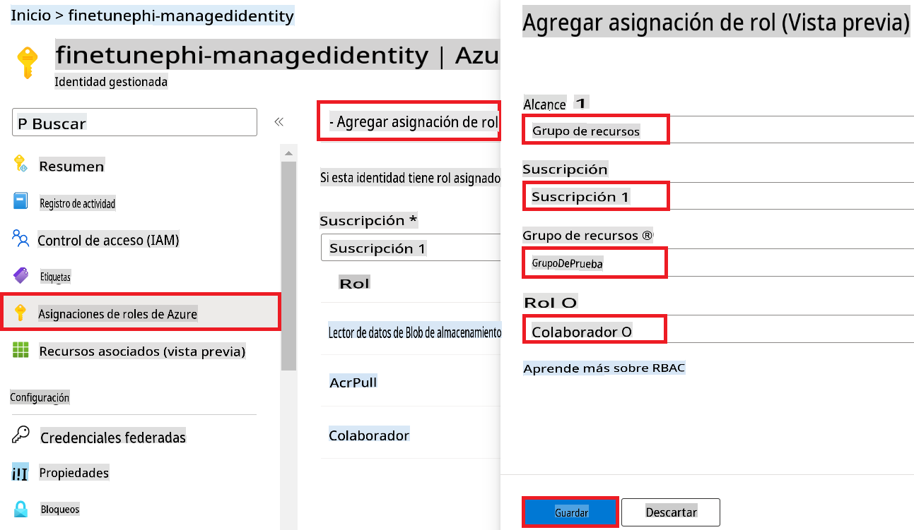

1. Selecciona **Guardar**.

#### Agregar asignación de rol de Lector de Datos de Blob de Almacenamiento a la Identidad Administrada

1. Escribe *storage accounts* en la **barra de búsqueda** en la parte superior de la página del portal y selecciona **Cuentas de almacenamiento** de las opciones que aparecen.

    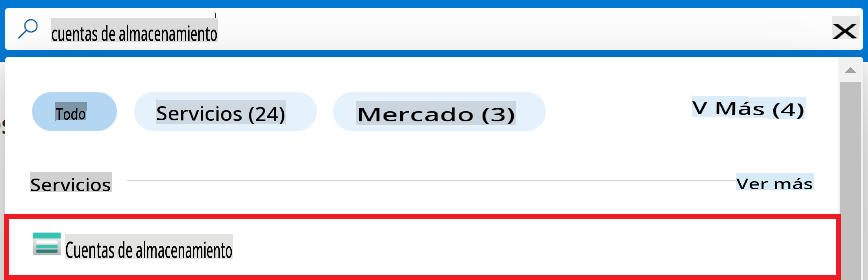

1. Selecciona la cuenta de almacenamiento asociada con el espacio de trabajo de Azure Machine Learning que creaste. Por ejemplo, *finetunephistorage*.

1. Realiza las siguientes tareas para navegar a la página de Agregar asignación de rol:

    - Navega a la cuenta de almacenamiento de Azure que creaste.
    - Selecciona **Control de acceso (IAM)** en la pestaña lateral izquierda.
    - Selecciona **+ Agregar** en el menú de navegación.
    - Selecciona **Agregar asignación de rol** en el menú de navegación.

    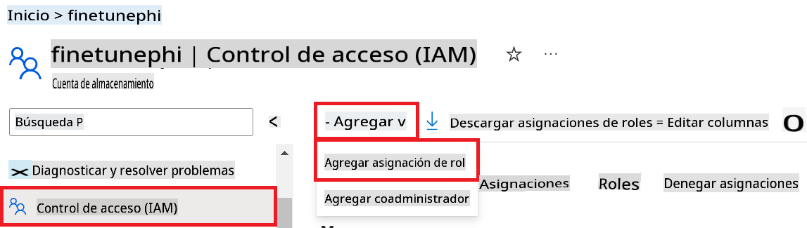

1. En la página de Agregar asignación de rol, realiza las siguientes tareas:

    - En la página de Rol, escribe *Lector de Datos de Blob de Almacenamiento* en la **barra de búsqueda** y selecciona **Lector de Datos de Blob de Almacenamiento** de las opciones que aparecen.
    - En la página de Rol, selecciona **Siguiente**.
    - En la página de Miembros, selecciona **Asignar acceso a** **Identidad Administrada**.
    - En la página de Miembros, selecciona **+ Seleccionar miembros**.
    - En la página Seleccionar identidades administradas, selecciona tu **Suscripción de Azure**.
    - En la página Seleccionar identidades administradas, selecciona la **Identidad Administrada** que creaste. Por ejemplo, *finetunephi-managedidentity*.
    - En la página Seleccionar identidades administradas, selecciona **Seleccionar**.

    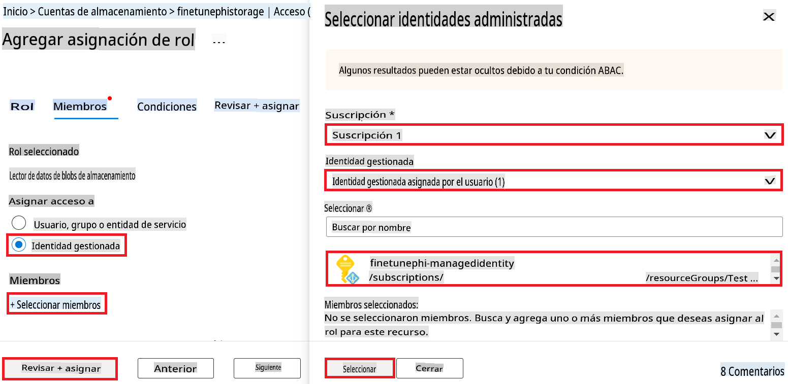

1. Selecciona **Revisar + Asignar**.

#### Agregar asignación de rol de AcrPull a la Identidad Administrada

1. Escribe *container registries* en la **barra de búsqueda** en la parte superior de la página del portal y selecciona **Registros de contenedores** de las opciones que aparecen.

    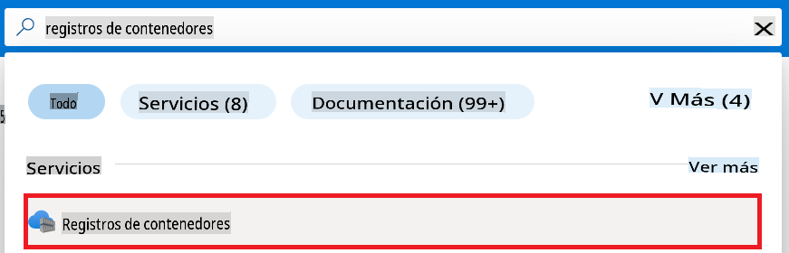

1. Selecciona el registro de contenedores asociado con el espacio de trabajo de Azure Machine Learning. Por ejemplo, *finetunephicontainerregistries*

1. Realiza las siguientes tareas para navegar a la página de Agregar asignación de rol:

    - Selecciona **Control de acceso (IAM)** en la pestaña lateral izquierda.
    - Selecciona **+ Agregar** en el menú de navegación.
    - Selecciona **Agregar asignación de rol** en el menú de navegación.

1. En la página de Agregar asignación de rol, realiza las siguientes tareas:

    - En la página de Rol, escribe *AcrPull* en la **barra de búsqueda** y selecciona **AcrPull** de las opciones que aparecen.
    - En la página de Rol, selecciona **Siguiente**.
    - En la página de Miembros, selecciona **Asignar acceso a** **Identidad Administrada**.
    - En la página de Miembros, selecciona **+ Seleccionar miembros**.
    - En la página Seleccionar identidades administradas, selecciona tu **Suscripción de Azure**.
    - En la página Seleccionar identidades administradas, selecciona la **Identidad Administrada** que creaste. Por ejemplo, *finetunephi-managedidentity*.
    - En la página Seleccionar identidades administradas, selecciona **Seleccionar**.
    - Selecciona **Revisar + Asignar**.

### Configurar el proyecto

Ahora, crearás una carpeta para trabajar y configurarás un entorno virtual para desarrollar un programa que interactúe con los usuarios y use el historial de chats almacenado en Azure Cosmos DB para informar sus respuestas.

#### Crear una carpeta para trabajar dentro de ella

1. Abre una ventana de terminal y escribe el siguiente comando para crear una carpeta llamada *finetune-phi* en la ruta predeterminada.

    ```console
    mkdir finetune-phi
    ```

1. Escribe el siguiente comando en tu terminal para navegar a la carpeta *finetune-phi* que creaste.

    ```console
    cd finetune-phi
    ```

#### Crear un entorno virtual

1. Escribe el siguiente comando en tu terminal para crear un entorno virtual llamado *.venv*.

    ```console
    python -m venv .venv
    ```

1. Escribe el siguiente comando en tu terminal para activar el entorno virtual.

    ```console
    .venv\Scripts\activate.bat
    ```

> [!NOTE]
>
> Si funcionó, deberías ver *(.venv)* antes del símbolo del sistema.

#### Instalar los paquetes necesarios

1. Escribe los siguientes comandos en tu terminal para instalar los paquetes necesarios.

    ```console
    pip install datasets==2.19.1
    pip install transformers==4.41.1
    pip install azure-ai-ml==1.16.0
    pip install torch==2.3.1
    pip install trl==0.9.4
    pip install promptflow==1.12.0
    ```

#### Crear archivos del proyecto

En este ejercicio, crearás los archivos esenciales para nuestro proyecto. Estos archivos incluyen scripts para descargar el conjunto de datos, configurar el entorno de Azure Machine Learning, ajustar el modelo Phi-3 e implementar el modelo ajustado. También crearás un archivo *conda.yml* para configurar el entorno de ajuste fino.

En este ejercicio, harás lo siguiente:

- Crear un archivo *download_dataset.py* para descargar el conjunto de datos.
- Crear un archivo *setup_ml.py* para configurar el entorno de Azure Machine Learning.
- Crear un archivo *fine_tune.py* en la carpeta *finetuning_dir* para ajustar el modelo Phi-3 utilizando el conjunto de datos.
- Crear un archivo *conda.yml* para configurar el entorno de ajuste fino.
- Crear un archivo *deploy_model.py* para implementar el modelo ajustado.
- Crear un archivo *integrate_with_promptflow.py* para integrar el modelo ajustado y ejecutarlo utilizando Prompt flow.
- Crear un archivo *flow.dag.yml* para configurar la estructura del flujo de trabajo para Prompt flow.
- Crear un archivo *config.py* para ingresar la información de Azure.

> [!NOTE]
>
> Estructura completa de la carpeta:
>
> ```text
> └── YourUserName
> .    └── finetune-phi
> .        ├── finetuning_dir
> .        │      └── fine_tune.py
> .        ├── conda.yml
> .        ├── config.py
> .        ├── deploy_model.py
> .        ├── download_dataset.py
> .        ├── flow.dag.yml
> .        ├── integrate_with_promptflow.py
> .        └── setup_ml.py
> ```

1. Abre **Visual Studio Code**.

1. Selecciona **Archivo** en la barra de menú.

1. Selecciona **Abrir carpeta**.

1. Selecciona la carpeta *finetune-phi* que creaste, ubicada en *C:\Users\tuNombreDeUsuario\finetune-phi*.

    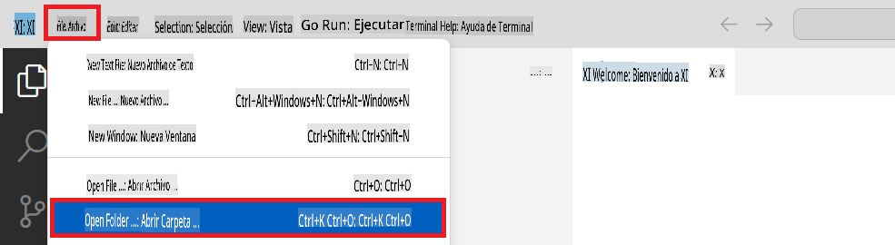

1. En el panel izquierdo de Visual Studio Code, haz clic derecho y selecciona **Nuevo archivo** para crear un nuevo archivo llamado *download_dataset.py*.

1. En el panel izquierdo de Visual Studio Code, haz clic derecho y selecciona **Nuevo archivo** para crear un nuevo archivo llamado *setup_ml.py*.

1. En el panel izquierdo de Visual Studio Code, haz clic derecho y selecciona **Nuevo archivo** para crear un nuevo archivo llamado *deploy_model.py*.

    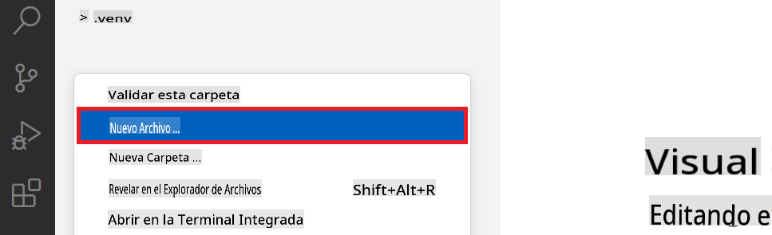

1. En el panel izquierdo de Visual Studio Code, haz clic derecho y selecciona **Nueva carpeta** para crear una nueva carpeta llamada *finetuning_dir*.

1. En la carpeta *finetuning_dir*, crea un nuevo archivo llamado *fine_tune.py*.

#### Crear y Configurar el archivo *conda.yml*

1. En el panel izquierdo de Visual Studio Code, haz clic derecho y selecciona **Nuevo archivo** para crear un nuevo archivo llamado *conda.yml*.

1. Agrega el siguiente código al archivo *conda.yml* para configurar el entorno de ajuste fino para el modelo Phi-3.

    ```yml
    name: phi-3-training-env
    channels:
      - defaults
      - conda-forge
    dependencies:
      - python=3.10
      - pip
      - numpy<2.0
      - pip:
          - torch==2.4.0
          - torchvision==0.19.0
          - trl==0.8.6
          - transformers==4.41
          - datasets==2.21.0
          - azureml-core==1.57.0
          - azure-storage-blob==12.19.0
          - azure-ai-ml==1.16
          - azure-identity==1.17.1
          - accelerate==0.33.0
          - mlflow==2.15.1
          - azureml-mlflow==1.57.0
    ```

#### Crear y Configurar el archivo *config.py*

1. En el panel izquierdo de Visual Studio Code, haz clic derecho y selecciona **Nuevo archivo** para crear un nuevo archivo llamado *config.py*.

1. Agrega el siguiente código al archivo *config.py* para incluir tu información de Azure.

    ```python
    # Azure settings
    AZURE_SUBSCRIPTION_ID = "your_subscription_id"
    AZURE_RESOURCE_GROUP_NAME = "your_resource_group_name" # "TestGroup"

    # Azure Machine Learning settings
    AZURE_ML_WORKSPACE_NAME = "your_workspace_name" # "finetunephi-workspace"

    # Azure Managed Identity settings
    AZURE_MANAGED_IDENTITY_CLIENT_ID = "your_azure_managed_identity_client_id"
    AZURE_MANAGED_IDENTITY_NAME = "your_azure_managed_identity_name" # "finetunephi-mangedidentity"
    AZURE_MANAGED_IDENTITY_RESOURCE_ID = f"/subscriptions/{AZURE_SUBSCRIPTION_ID}/resourceGroups/{AZURE_RESOURCE_GROUP_NAME}/providers/Microsoft.ManagedIdentity/userAssignedIdentities/{AZURE_MANAGED_IDENTITY_NAME}"

    # Dataset file paths
    TRAIN_DATA_PATH = "data/train_data.jsonl"
    TEST_DATA_PATH = "data/test_data.jsonl"

    # Fine-tuned model settings
    AZURE_MODEL_NAME = "your_fine_tuned_model_name" # "finetune-phi-model"
    AZURE_ENDPOINT_NAME = "your_fine_tuned_model_endpoint_name" # "finetune-phi-endpoint"
    AZURE_DEPLOYMENT_NAME = "your_fine_tuned_model_deployment_name" # "finetune-phi-deployment"

    AZURE_ML_API_KEY = "your_fine_tuned_model_api_key"
    AZURE_ML_ENDPOINT = "your_fine_tuned_model_endpoint_uri" # "https://{your-endpoint-name}.{your-region}.inference.ml.azure.com/score"
    ```

#### Agregar variables de entorno de Azure

1. Realiza las siguientes tareas para agregar el ID de la suscripción de Azure:

    - Escribe *subscriptions* en la **barra de búsqueda** en la parte superior de la página del portal y selecciona **Suscripciones** de las opciones que aparecen.
    - Selecciona la suscripción de Azure que estás utilizando actualmente.
    - Copia y pega tu ID de suscripción en el archivo *config.py*.


1. Realiza las siguientes tareas para agregar el Nombre del Espacio de Trabajo de Azure:

    - Navega al recurso de Azure Machine Learning que creaste.
    - Copia y pega el nombre de tu cuenta en el archivo *config.py*.

    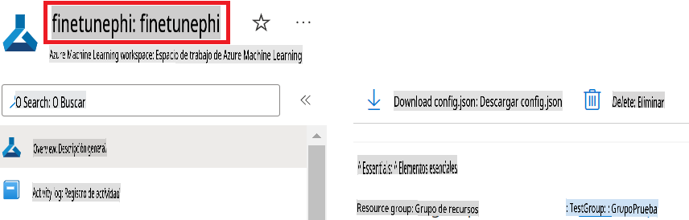

1. Realiza las siguientes tareas para agregar el Nombre del Grupo de Recursos de Azure:

    - Navega al recurso de Azure Machine Learning que creaste.
    - Copia y pega el Nombre del Grupo de Recursos de Azure en el archivo *config.py*.

    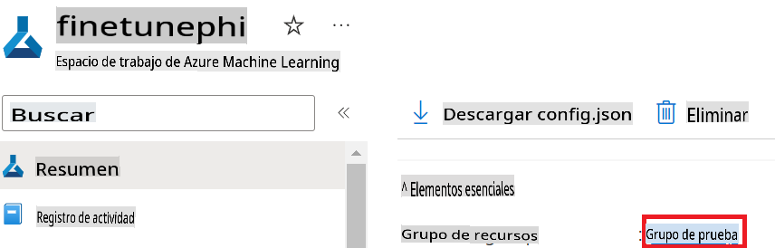

2. Realiza las siguientes tareas para agregar el nombre de la Identidad Administrada de Azure:

    - Navega al recurso de Identidades Administradas que creaste.
    - Copia y pega el nombre de la Identidad Administrada de Azure en el archivo *config.py*.

    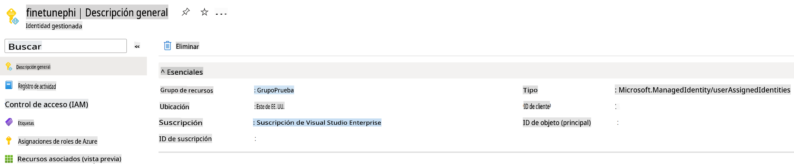

### Preparar el conjunto de datos para ajuste fino

En este ejercicio, ejecutarás el archivo *download_dataset.py* para descargar los conjuntos de datos *ULTRACHAT_200k* a tu entorno local. Luego, usarás estos conjuntos de datos para ajustar el modelo Phi-3 en Azure Machine Learning.

#### Descarga tu conjunto de datos usando *download_dataset.py*

1. Abre el archivo *download_dataset.py* en Visual Studio Code.

1. Agrega el siguiente código al archivo *download_dataset.py*.

    ```python
    import json
    import os
    from datasets import load_dataset
    from config import (
        TRAIN_DATA_PATH,
        TEST_DATA_PATH)

    def load_and_split_dataset(dataset_name, config_name, split_ratio):
        """
        Load and split a dataset.
        """
        # Load the dataset with the specified name, configuration, and split ratio
        dataset = load_dataset(dataset_name, config_name, split=split_ratio)
        print(f"Original dataset size: {len(dataset)}")
        
        # Split the dataset into train and test sets (80% train, 20% test)
        split_dataset = dataset.train_test_split(test_size=0.2)
        print(f"Train dataset size: {len(split_dataset['train'])}")
        print(f"Test dataset size: {len(split_dataset['test'])}")
        
        return split_dataset

    def save_dataset_to_jsonl(dataset, filepath):
        """
        Save a dataset to a JSONL file.
        """
        # Create the directory if it does not exist
        os.makedirs(os.path.dirname(filepath), exist_ok=True)
        
        # Open the file in write mode
        with open(filepath, 'w', encoding='utf-8') as f:
            # Iterate over each record in the dataset
            for record in dataset:
                # Dump the record as a JSON object and write it to the file
                json.dump(record, f)
                # Write a newline character to separate records
                f.write('\n')
        
        print(f"Dataset saved to {filepath}")

    def main():
        """
        Main function to load, split, and save the dataset.
        """
        # Load and split the ULTRACHAT_200k dataset with a specific configuration and split ratio
        dataset = load_and_split_dataset("HuggingFaceH4/ultrachat_200k", 'default', 'train_sft[:1%]')
        
        # Extract the train and test datasets from the split
        train_dataset = dataset['train']
        test_dataset = dataset['test']

        # Save the train dataset to a JSONL file
        save_dataset_to_jsonl(train_dataset, TRAIN_DATA_PATH)
        
        # Save the test dataset to a separate JSONL file
        save_dataset_to_jsonl(test_dataset, TEST_DATA_PATH)

    if __name__ == "__main__":
        main()

    ```

> [!TIP]
>
> **Guía para ajuste fino con un conjunto de datos mínimo usando una CPU**
>
> Si deseas usar una CPU para el ajuste fino, este enfoque es ideal para quienes tienen suscripciones de beneficios (como la suscripción de Visual Studio Enterprise) o para probar rápidamente el proceso de ajuste fino y despliegue.
>
> Reemplaza `dataset = load_and_split_dataset("HuggingFaceH4/ultrachat_200k", 'default', 'train_sft[:1%]')` with `dataset = load_and_split_dataset("HuggingFaceH4/ultrachat_200k", 'default', 'train_sft[:10]')`
>

1. Escribe el siguiente comando en tu terminal para ejecutar el script y descargar el conjunto de datos a tu entorno local.

    ```console
    python download_data.py
    ```

1. Verifica que los conjuntos de datos se hayan guardado correctamente en tu directorio local *finetune-phi/data*.

> [!NOTE]
>
> **Tamaño del conjunto de datos y tiempo de ajuste fino**
>
> En este ejemplo de extremo a extremo (E2E), solo utilizas el 1% del conjunto de datos (`train_sft[:1%]`). Esto reduce significativamente la cantidad de datos, acelerando los procesos de carga y ajuste fino. Puedes ajustar el porcentaje para encontrar el equilibrio adecuado entre el tiempo de entrenamiento y el rendimiento del modelo. Usar un subconjunto más pequeño del conjunto de datos reduce el tiempo necesario para el ajuste fino, haciendo que el proceso sea más manejable para un ejemplo E2E.

## Escenario 2: Ajustar el modelo Phi-3 y Desplegar en Azure Machine Learning Studio

### Configurar Azure CLI

Necesitas configurar Azure CLI para autenticar tu entorno. Azure CLI te permite administrar recursos de Azure directamente desde la línea de comandos y proporciona las credenciales necesarias para que Azure Machine Learning acceda a estos recursos. Para comenzar, instala [Azure CLI](https://learn.microsoft.com/cli/azure/install-azure-cli).

1. Abre una ventana de terminal y escribe el siguiente comando para iniciar sesión en tu cuenta de Azure.

    ```console
    az login
    ```

1. Selecciona tu cuenta de Azure para usar.

1. Selecciona tu suscripción de Azure para usar.

    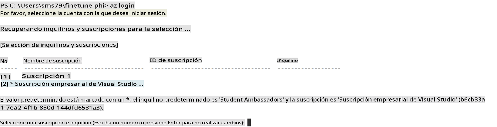

> [!TIP]
>
> Si tienes problemas para iniciar sesión en Azure, intenta usar un código de dispositivo. Abre una ventana de terminal y escribe el siguiente comando para iniciar sesión en tu cuenta de Azure:
>
> ```console
> az login --use-device-code
> ```
>

### Ajustar el modelo Phi-3

En este ejercicio, ajustarás el modelo Phi-3 usando el conjunto de datos proporcionado. Primero, definirás el proceso de ajuste fino en el archivo *fine_tune.py*. Luego, configurarás el entorno de Azure Machine Learning e iniciarás el proceso de ajuste fino ejecutando el archivo *setup_ml.py*. Este script garantiza que el ajuste fino se realice dentro del entorno de Azure Machine Learning.

Al ejecutar *setup_ml.py*, iniciarás el proceso de ajuste fino en el entorno de Azure Machine Learning.

#### Agregar código al archivo *fine_tune.py*

1. Navega a la carpeta *finetuning_dir* y abre el archivo *fine_tune.py* en Visual Studio Code.

1. Agrega el siguiente código al archivo *fine_tune.py*.

    ```python
    import argparse
    import sys
    import logging
    import os
    from datasets import load_dataset
    import torch
    import mlflow
    from transformers import AutoModelForCausalLM, AutoTokenizer, TrainingArguments
    from trl import SFTTrainer

    # To avoid the INVALID_PARAMETER_VALUE error in MLflow, disable MLflow integration
    os.environ["DISABLE_MLFLOW_INTEGRATION"] = "True"

    # Logging setup
    logging.basicConfig(
        format="%(asctime)s - %(levelname)s - %(name)s - %(message)s",
        datefmt="%Y-%m-%d %H:%M:%S",
        handlers=[logging.StreamHandler(sys.stdout)],
        level=logging.WARNING
    )
    logger = logging.getLogger(__name__)

    def initialize_model_and_tokenizer(model_name, model_kwargs):
        """
        Initialize the model and tokenizer with the given pretrained model name and arguments.
        """
        model = AutoModelForCausalLM.from_pretrained(model_name, **model_kwargs)
        tokenizer = AutoTokenizer.from_pretrained(model_name)
        tokenizer.model_max_length = 2048
        tokenizer.pad_token = tokenizer.unk_token
        tokenizer.pad_token_id = tokenizer.convert_tokens_to_ids(tokenizer.pad_token)
        tokenizer.padding_side = 'right'
        return model, tokenizer

    def apply_chat_template(example, tokenizer):
        """
        Apply a chat template to tokenize messages in the example.
        """
        messages = example["messages"]
        if messages[0]["role"] != "system":
            messages.insert(0, {"role": "system", "content": ""})
        example["text"] = tokenizer.apply_chat_template(
            messages, tokenize=False, add_generation_prompt=False
        )
        return example

    def load_and_preprocess_data(train_filepath, test_filepath, tokenizer):
        """
        Load and preprocess the dataset.
        """
        train_dataset = load_dataset('json', data_files=train_filepath, split='train')
        test_dataset = load_dataset('json', data_files=test_filepath, split='train')
        column_names = list(train_dataset.features)

        train_dataset = train_dataset.map(
            apply_chat_template,
            fn_kwargs={"tokenizer": tokenizer},
            num_proc=10,
            remove_columns=column_names,
            desc="Applying chat template to train dataset",
        )

        test_dataset = test_dataset.map(
            apply_chat_template,
            fn_kwargs={"tokenizer": tokenizer},
            num_proc=10,
            remove_columns=column_names,
            desc="Applying chat template to test dataset",
        )

        return train_dataset, test_dataset

    def train_and_evaluate_model(train_dataset, test_dataset, model, tokenizer, output_dir):
        """
        Train and evaluate the model.
        """
        training_args = TrainingArguments(
            bf16=True,
            do_eval=True,
            output_dir=output_dir,
            eval_strategy="epoch",
            learning_rate=5.0e-06,
            logging_steps=20,
            lr_scheduler_type="cosine",
            num_train_epochs=3,
            overwrite_output_dir=True,
            per_device_eval_batch_size=4,
            per_device_train_batch_size=4,
            remove_unused_columns=True,
            save_steps=500,
            seed=0,
            gradient_checkpointing=True,
            gradient_accumulation_steps=1,
            warmup_ratio=0.2,
        )

        trainer = SFTTrainer(
            model=model,
            args=training_args,
            train_dataset=train_dataset,
            eval_dataset=test_dataset,
            max_seq_length=2048,
            dataset_text_field="text",
            tokenizer=tokenizer,
            packing=True
        )

        train_result = trainer.train()
        trainer.log_metrics("train", train_result.metrics)

        mlflow.transformers.log_model(
            transformers_model={"model": trainer.model, "tokenizer": tokenizer},
            artifact_path=output_dir,
        )

        tokenizer.padding_side = 'left'
        eval_metrics = trainer.evaluate()
        eval_metrics["eval_samples"] = len(test_dataset)
        trainer.log_metrics("eval", eval_metrics)

    def main(train_file, eval_file, model_output_dir):
        """
        Main function to fine-tune the model.
        """
        model_kwargs = {
            "use_cache": False,
            "trust_remote_code": True,
            "torch_dtype": torch.bfloat16,
            "device_map": None,
            "attn_implementation": "eager"
        }

        # pretrained_model_name = "microsoft/Phi-3-mini-4k-instruct"
        pretrained_model_name = "microsoft/Phi-3.5-mini-instruct"

        with mlflow.start_run():
            model, tokenizer = initialize_model_and_tokenizer(pretrained_model_name, model_kwargs)
            train_dataset, test_dataset = load_and_preprocess_data(train_file, eval_file, tokenizer)
            train_and_evaluate_model(train_dataset, test_dataset, model, tokenizer, model_output_dir)

    if __name__ == "__main__":
        parser = argparse.ArgumentParser()
        parser.add_argument("--train-file", type=str, required=True, help="Path to the training data")
        parser.add_argument("--eval-file", type=str, required=True, help="Path to the evaluation data")
        parser.add_argument("--model_output_dir", type=str, required=True, help="Directory to save the fine-tuned model")
        args = parser.parse_args()
        main(args.train_file, args.eval_file, args.model_output_dir)

    ```

1. Guarda y cierra el archivo *fine_tune.py*.

> [!TIP]
> **Puedes ajustar el modelo Phi-3.5**
>
> En el archivo *fine_tune.py*, puedes cambiar el campo `pretrained_model_name` from `"microsoft/Phi-3-mini-4k-instruct"` to any model you want to fine-tune. For example, if you change it to `"microsoft/Phi-3.5-mini-instruct"`, you'll be using the Phi-3.5-mini-instruct model for fine-tuning. To find and use the model name you prefer, visit [Hugging Face](https://huggingface.co/), search for the model you're interested in, and then copy and paste its name into the `pretrained_model_name` en tu script.
>
> :::image type="content" source="../../imgs/03/FineTuning-PromptFlow/finetunephi3.5.png" alt-text="Ajustar Phi-3.5.":::
>

#### Agregar código al archivo *setup_ml.py*

1. Abre el archivo *setup_ml.py* en Visual Studio Code.

1. Agrega el siguiente código al archivo *setup_ml.py*.

    ```python
    import logging
    from azure.ai.ml import MLClient, command, Input
    from azure.ai.ml.entities import Environment, AmlCompute
    from azure.identity import AzureCliCredential
    from config import (
        AZURE_SUBSCRIPTION_ID,
        AZURE_RESOURCE_GROUP_NAME,
        AZURE_ML_WORKSPACE_NAME,
        TRAIN_DATA_PATH,
        TEST_DATA_PATH
    )

    # Constants

    # Uncomment the following lines to use a CPU instance for training
    # COMPUTE_INSTANCE_TYPE = "Standard_E16s_v3" # cpu
    # COMPUTE_NAME = "cpu-e16s-v3"
    # DOCKER_IMAGE_NAME = "mcr.microsoft.com/azureml/openmpi4.1.0-ubuntu20.04:latest"

    # Uncomment the following lines to use a GPU instance for training
    COMPUTE_INSTANCE_TYPE = "Standard_NC24ads_A100_v4"
    COMPUTE_NAME = "gpu-nc24s-a100-v4"
    DOCKER_IMAGE_NAME = "mcr.microsoft.com/azureml/curated/acft-hf-nlp-gpu:59"

    CONDA_FILE = "conda.yml"
    LOCATION = "eastus2" # Replace with the location of your compute cluster
    FINETUNING_DIR = "./finetuning_dir" # Path to the fine-tuning script
    TRAINING_ENV_NAME = "phi-3-training-environment" # Name of the training environment
    MODEL_OUTPUT_DIR = "./model_output" # Path to the model output directory in azure ml

    # Logging setup to track the process
    logger = logging.getLogger(__name__)
    logging.basicConfig(
        format="%(asctime)s - %(levelname)s - %(name)s - %(message)s",
        datefmt="%Y-%m-%d %H:%M:%S",
        level=logging.WARNING
    )

    def get_ml_client():
        """
        Initialize the ML Client using Azure CLI credentials.
        """
        credential = AzureCliCredential()
        return MLClient(credential, AZURE_SUBSCRIPTION_ID, AZURE_RESOURCE_GROUP_NAME, AZURE_ML_WORKSPACE_NAME)

    def create_or_get_environment(ml_client):
        """
        Create or update the training environment in Azure ML.
        """
        env = Environment(
            image=DOCKER_IMAGE_NAME,  # Docker image for the environment
            conda_file=CONDA_FILE,  # Conda environment file
            name=TRAINING_ENV_NAME,  # Name of the environment
        )
        return ml_client.environments.create_or_update(env)

    def create_or_get_compute_cluster(ml_client, compute_name, COMPUTE_INSTANCE_TYPE, location):
        """
        Create or update the compute cluster in Azure ML.
        """
        try:
            compute_cluster = ml_client.compute.get(compute_name)
            logger.info(f"Compute cluster '{compute_name}' already exists. Reusing it for the current run.")
        except Exception:
            logger.info(f"Compute cluster '{compute_name}' does not exist. Creating a new one with size {COMPUTE_INSTANCE_TYPE}.")
            compute_cluster = AmlCompute(
                name=compute_name,
                size=COMPUTE_INSTANCE_TYPE,
                location=location,
                tier="Dedicated",  # Tier of the compute cluster
                min_instances=0,  # Minimum number of instances
                max_instances=1  # Maximum number of instances
            )
            ml_client.compute.begin_create_or_update(compute_cluster).wait()  # Wait for the cluster to be created
        return compute_cluster

    def create_fine_tuning_job(env, compute_name):
        """
        Set up the fine-tuning job in Azure ML.
        """
        return command(
            code=FINETUNING_DIR,  # Path to fine_tune.py
            command=(
                "python fine_tune.py "
                "--train-file ${{inputs.train_file}} "
                "--eval-file ${{inputs.eval_file}} "
                "--model_output_dir ${{inputs.model_output}}"
            ),
            environment=env,  # Training environment
            compute=compute_name,  # Compute cluster to use
            inputs={
                "train_file": Input(type="uri_file", path=TRAIN_DATA_PATH),  # Path to the training data file
                "eval_file": Input(type="uri_file", path=TEST_DATA_PATH),  # Path to the evaluation data file
                "model_output": MODEL_OUTPUT_DIR
            }
        )

    def main():
        """
        Main function to set up and run the fine-tuning job in Azure ML.
        """
        # Initialize ML Client
        ml_client = get_ml_client()

        # Create Environment
        env = create_or_get_environment(ml_client)
        
        # Create or get existing compute cluster
        create_or_get_compute_cluster(ml_client, COMPUTE_NAME, COMPUTE_INSTANCE_TYPE, LOCATION)

        # Create and Submit Fine-Tuning Job
        job = create_fine_tuning_job(env, COMPUTE_NAME)
        returned_job = ml_client.jobs.create_or_update(job)  # Submit the job
        ml_client.jobs.stream(returned_job.name)  # Stream the job logs
        
        # Capture the job name
        job_name = returned_job.name
        print(f"Job name: {job_name}")

    if __name__ == "__main__":
        main()

    ```

1. Reemplaza `COMPUTE_INSTANCE_TYPE`, `COMPUTE_NAME`, and `LOCATION` con tus detalles específicos.

    ```python
   # Uncomment the following lines to use a GPU instance for training
    COMPUTE_INSTANCE_TYPE = "Standard_NC24ads_A100_v4"
    COMPUTE_NAME = "gpu-nc24s-a100-v4"
    ...
    LOCATION = "eastus2" # Replace with the location of your compute cluster
    ```

> [!TIP]
>
> **Guía para ajuste fino con un conjunto de datos mínimo usando una CPU**
>
> Si deseas usar una CPU para el ajuste fino, este enfoque es ideal para quienes tienen suscripciones de beneficios (como la suscripción de Visual Studio Enterprise) o para probar rápidamente el proceso de ajuste fino y despliegue.
>
> 1. Abre el archivo *setup_ml*.
> 1. Reemplaza `COMPUTE_INSTANCE_TYPE`, `COMPUTE_NAME`, and `DOCKER_IMAGE_NAME` with the following. If you do not have access to *Standard_E16s_v3*, you can use an equivalent CPU instance or request a new quota.
> 1. Replace `LOCATION` con tus detalles específicos.
>
>    ```python
>    # Uncomment the following lines to use a CPU instance for training
>    COMPUTE_INSTANCE_TYPE = "Standard_E16s_v3" # cpu
>    COMPUTE_NAME = "cpu-e16s-v3"
>    DOCKER_IMAGE_NAME = "mcr.microsoft.com/azureml/openmpi4.1.0-ubuntu20.04:latest"
>    LOCATION = "eastus2" # Replace with the location of your compute cluster
>    ```
>

1. Escribe el siguiente comando para ejecutar el script *setup_ml.py* e iniciar el proceso de ajuste fino en Azure Machine Learning.

    ```python
    python setup_ml.py
    ```

1. En este ejercicio, ajustaste exitosamente el modelo Phi-3 usando Azure Machine Learning. Al ejecutar el script *setup_ml.py*, configuraste el entorno de Azure Machine Learning e iniciaste el proceso de ajuste fino definido en el archivo *fine_tune.py*. Ten en cuenta que el proceso de ajuste fino puede tomar un tiempo considerable. Después de ejecutar el comando `python setup_ml.py` command, you need to wait for the process to complete. You can monitor the status of the fine-tuning job by following the link provided in the terminal to the Azure Machine Learning portal.

    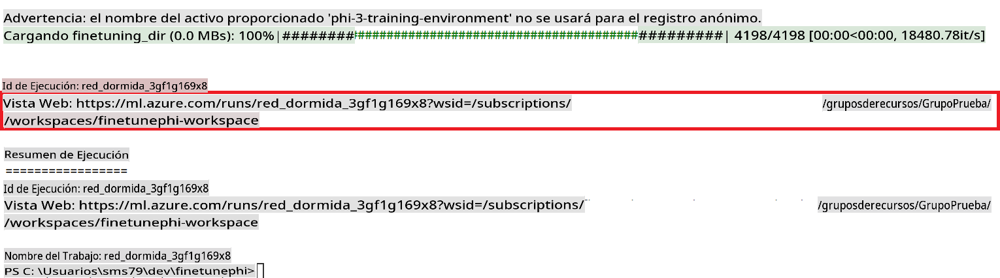

### Deploy the fine-tuned model

To integrate the fine-tuned Phi-3 model with Prompt Flow, you need to deploy the model to make it accessible for real-time inference. This process involves registering the model, creating an online endpoint, and deploying the model.

#### Set the model name, endpoint name, and deployment name for deployment

1. Open *config.py* file.

1. Replace `AZURE_MODEL_NAME = "your_fine_tuned_model_name"` with the desired name for your model.

1. Replace `AZURE_ENDPOINT_NAME = "your_fine_tuned_model_endpoint_name"` with the desired name for your endpoint.

1. Replace `AZURE_DEPLOYMENT_NAME = "your_fine_tuned_model_deployment_name"` con el nombre deseado para tu despliegue.

#### Agregar código al archivo *deploy_model.py*

Ejecutar el archivo *deploy_model.py* automatiza todo el proceso de despliegue. Registra el modelo, crea un endpoint y ejecuta el despliegue basado en las configuraciones especificadas en el archivo config.py, que incluye el nombre del modelo, el nombre del endpoint y el nombre del despliegue.

1. Abre el archivo *deploy_model.py* en Visual Studio Code.

1. Agrega el siguiente código al archivo *deploy_model.py*.

    ```python
    import logging
    from azure.identity import AzureCliCredential
    from azure.ai.ml import MLClient
    from azure.ai.ml.entities import Model, ProbeSettings, ManagedOnlineEndpoint, ManagedOnlineDeployment, IdentityConfiguration, ManagedIdentityConfiguration, OnlineRequestSettings
    from azure.ai.ml.constants import AssetTypes

    # Configuration imports
    from config import (
        AZURE_SUBSCRIPTION_ID,
        AZURE_RESOURCE_GROUP_NAME,
        AZURE_ML_WORKSPACE_NAME,
        AZURE_MANAGED_IDENTITY_RESOURCE_ID,
        AZURE_MANAGED_IDENTITY_CLIENT_ID,
        AZURE_MODEL_NAME,
        AZURE_ENDPOINT_NAME,
        AZURE_DEPLOYMENT_NAME
    )

    # Constants
    JOB_NAME = "your-job-name"
    COMPUTE_INSTANCE_TYPE = "Standard_E4s_v3"

    deployment_env_vars = {
        "SUBSCRIPTION_ID": AZURE_SUBSCRIPTION_ID,
        "RESOURCE_GROUP_NAME": AZURE_RESOURCE_GROUP_NAME,
        "UAI_CLIENT_ID": AZURE_MANAGED_IDENTITY_CLIENT_ID,
    }

    # Logging setup
    logging.basicConfig(
        format="%(asctime)s - %(levelname)s - %(name)s - %(message)s",
        datefmt="%Y-%m-%d %H:%M:%S",
        level=logging.DEBUG
    )
    logger = logging.getLogger(__name__)

    def get_ml_client():
        """Initialize and return the ML Client."""
        credential = AzureCliCredential()
        return MLClient(credential, AZURE_SUBSCRIPTION_ID, AZURE_RESOURCE_GROUP_NAME, AZURE_ML_WORKSPACE_NAME)

    def register_model(ml_client, model_name, job_name):
        """Register a new model."""
        model_path = f"azureml://jobs/{job_name}/outputs/artifacts/paths/model_output"
        logger.info(f"Registering model {model_name} from job {job_name} at path {model_path}.")
        run_model = Model(
            path=model_path,
            name=model_name,
            description="Model created from run.",
            type=AssetTypes.MLFLOW_MODEL,
        )
        model = ml_client.models.create_or_update(run_model)
        logger.info(f"Registered model ID: {model.id}")
        return model

    def delete_existing_endpoint(ml_client, endpoint_name):
        """Delete existing endpoint if it exists."""
        try:
            endpoint_result = ml_client.online_endpoints.get(name=endpoint_name)
            logger.info(f"Deleting existing endpoint {endpoint_name}.")
            ml_client.online_endpoints.begin_delete(name=endpoint_name).result()
            logger.info(f"Deleted existing endpoint {endpoint_name}.")
        except Exception as e:
            logger.info(f"No existing endpoint {endpoint_name} found to delete: {e}")

    def create_or_update_endpoint(ml_client, endpoint_name, description=""):
        """Create or update an endpoint."""
        delete_existing_endpoint(ml_client, endpoint_name)
        logger.info(f"Creating new endpoint {endpoint_name}.")
        endpoint = ManagedOnlineEndpoint(
            name=endpoint_name,
            description=description,
            identity=IdentityConfiguration(
                type="user_assigned",
                user_assigned_identities=[ManagedIdentityConfiguration(resource_id=AZURE_MANAGED_IDENTITY_RESOURCE_ID)]
            )
        )
        endpoint_result = ml_client.online_endpoints.begin_create_or_update(endpoint).result()
        logger.info(f"Created new endpoint {endpoint_name}.")
        return endpoint_result

    def create_or_update_deployment(ml_client, endpoint_name, deployment_name, model):
        """Create or update a deployment."""

        logger.info(f"Creating deployment {deployment_name} for endpoint {endpoint_name}.")
        deployment = ManagedOnlineDeployment(
            name=deployment_name,
            endpoint_name=endpoint_name,
            model=model.id,
            instance_type=COMPUTE_INSTANCE_TYPE,
            instance_count=1,
            environment_variables=deployment_env_vars,
            request_settings=OnlineRequestSettings(
                max_concurrent_requests_per_instance=3,
                request_timeout_ms=180000,
                max_queue_wait_ms=120000
            ),
            liveness_probe=ProbeSettings(
                failure_threshold=30,
                success_threshold=1,
                period=100,
                initial_delay=500,
            ),
            readiness_probe=ProbeSettings(
                failure_threshold=30,
                success_threshold=1,
                period=100,
                initial_delay=500,
            ),
        )
        deployment_result = ml_client.online_deployments.begin_create_or_update(deployment).result()
        logger.info(f"Created deployment {deployment.name} for endpoint {endpoint_name}.")
        return deployment_result

    def set_traffic_to_deployment(ml_client, endpoint_name, deployment_name):
        """Set traffic to the specified deployment."""
        try:
            # Fetch the current endpoint details
            endpoint = ml_client.online_endpoints.get(name=endpoint_name)
            
            # Log the current traffic allocation for debugging
            logger.info(f"Current traffic allocation: {endpoint.traffic}")
            
            # Set the traffic allocation for the deployment
            endpoint.traffic = {deployment_name: 100}
            
            # Update the endpoint with the new traffic allocation
            endpoint_poller = ml_client.online_endpoints.begin_create_or_update(endpoint)
            updated_endpoint = endpoint_poller.result()
            
            # Log the updated traffic allocation for debugging
            logger.info(f"Updated traffic allocation: {updated_endpoint.traffic}")
            logger.info(f"Set traffic to deployment {deployment_name} at endpoint {endpoint_name}.")
            return updated_endpoint
        except Exception as e:
            # Log any errors that occur during the process
            logger.error(f"Failed to set traffic to deployment: {e}")
            raise


    def main():
        ml_client = get_ml_client()

        registered_model = register_model(ml_client, AZURE_MODEL_NAME, JOB_NAME)
        logger.info(f"Registered model ID: {registered_model.id}")

        endpoint = create_or_update_endpoint(ml_client, AZURE_ENDPOINT_NAME, "Endpoint for finetuned Phi-3 model")
        logger.info(f"Endpoint {AZURE_ENDPOINT_NAME} is ready.")

        try:
            deployment = create_or_update_deployment(ml_client, AZURE_ENDPOINT_NAME, AZURE_DEPLOYMENT_NAME, registered_model)
            logger.info(f"Deployment {AZURE_DEPLOYMENT_NAME} is created for endpoint {AZURE_ENDPOINT_NAME}.")

            set_traffic_to_deployment(ml_client, AZURE_ENDPOINT_NAME, AZURE_DEPLOYMENT_NAME)
            logger.info(f"Traffic is set to deployment {AZURE_DEPLOYMENT_NAME} at endpoint {AZURE_ENDPOINT_NAME}.")
        except Exception as e:
            logger.error(f"Failed to create or update deployment: {e}")

    if __name__ == "__main__":
        main()

    ```

1. Realiza las siguientes tareas para obtener el `JOB_NAME`:

    - Navigate to Azure Machine Learning resource that you created.
    - Select **Studio web URL** to open the Azure Machine Learning workspace.
    - Select **Jobs** from the left side tab.
    - Select the experiment for fine-tuning. For example, *finetunephi*.
    - Select the job that you created.
    - Copy and paste your job Name into the `JOB_NAME = "your-job-name"` in *deploy_model.py* file.

1. Replace `COMPUTE_INSTANCE_TYPE` con tus detalles específicos.

1. Escribe el siguiente comando para ejecutar el script *deploy_model.py* e iniciar el proceso de despliegue en Azure Machine Learning.

    ```python
    python deploy_model.py
    ```

> [!WARNING]
> Para evitar cargos adicionales en tu cuenta, asegúrate de eliminar el endpoint creado en el espacio de trabajo de Azure Machine Learning.
>

#### Verifica el estado del despliegue en el Espacio de Trabajo de Azure Machine Learning

1. Visita [Azure ML Studio](https://ml.azure.com/home?wt.mc_id=studentamb_279723).

1. Navega al espacio de trabajo de Azure Machine Learning que creaste.

1. Selecciona **Studio web URL** para abrir el espacio de trabajo de Azure Machine Learning.

1. Selecciona **Endpoints** desde la barra lateral izquierda.

    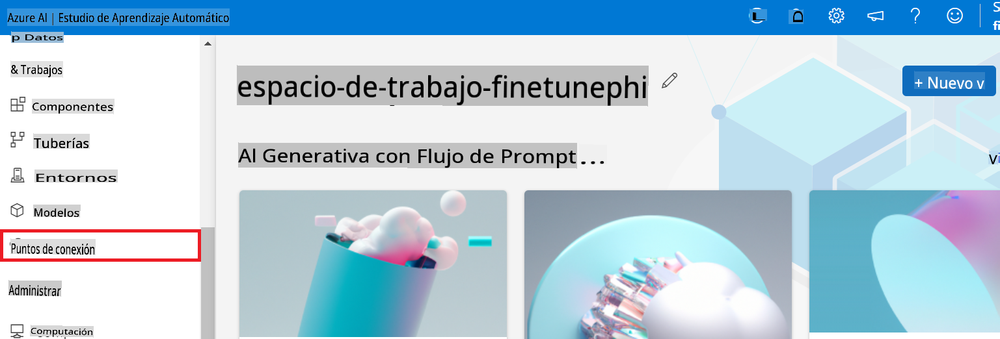

2. Selecciona el endpoint que creaste.

    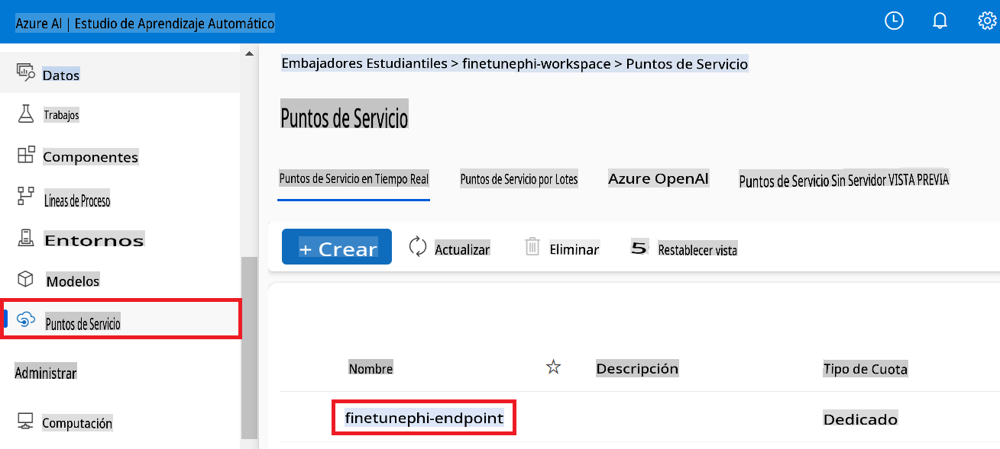

3. En esta página, puedes administrar los endpoints creados durante el proceso de despliegue.

## Escenario 3: Integrar con Prompt Flow y Chatear con tu modelo personalizado

### Integrar el modelo Phi-3 personalizado con Prompt Flow

Después de desplegar exitosamente tu modelo ajustado, ahora puedes integrarlo con Prompt Flow para usar tu modelo en aplicaciones en tiempo real, habilitando una variedad de tareas interactivas con tu modelo Phi-3 personalizado.

#### Configurar la clave API y la URI del endpoint del modelo Phi-3 ajustado

1. Navega al espacio de trabajo de Azure Machine Learning que creaste.
1. Selecciona **Endpoints** desde la barra lateral izquierda.
1. Selecciona el endpoint que creaste.
1. Selecciona **Consume** desde el menú de navegación.
1. Copia y pega tu **REST endpoint** en el archivo *config.py*, reemplazando `AZURE_ML_ENDPOINT = "your_fine_tuned_model_endpoint_uri"` with your **REST endpoint**.
1. Copy and paste your **Primary key** into the *config.py* file, replacing `AZURE_ML_API_KEY = "your_fine_tuned_model_api_key"` con tu **Primary key**.

    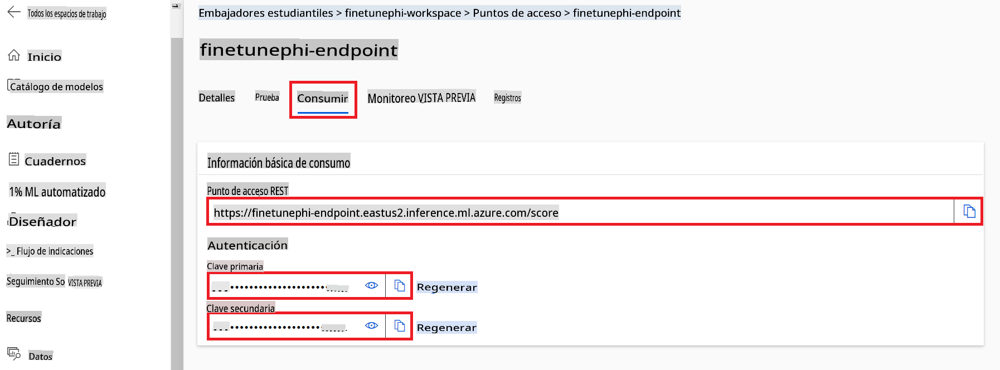

#### Agregar código al archivo *flow.dag.yml*

1. Abre el archivo *flow.dag.yml* en Visual Studio Code.

1. Agrega el siguiente código al archivo *flow.dag.yml*.

    ```yml
    inputs:
      input_data:
        type: string
        default: "Who founded Microsoft?"

    outputs:
      answer:
        type: string
        reference: ${integrate_with_promptflow.output}

    nodes:
    - name: integrate_with_promptflow
      type: python
      source:
        type: code
        path: integrate_with_promptflow.py
      inputs:
        input_data: ${inputs.input_data}
    ```

#### Agregar código al archivo *integrate_with_promptflow.py*

1. Abre el archivo *integrate_with_promptflow.py* en Visual Studio Code.

1. Agrega el siguiente código al archivo *integrate_with_promptflow.py*.

    ```python
    import logging
    import requests
    from promptflow.core import tool
    import asyncio
    import platform
    from config import (
        AZURE_ML_ENDPOINT,
        AZURE_ML_API_KEY
    )

    # Logging setup
    logging.basicConfig(
        format="%(asctime)s - %(levelname)s - %(name)s - %(message)s",
        datefmt="%Y-%m-%d %H:%M:%S",
        level=logging.DEBUG
    )
    logger = logging.getLogger(__name__)

    def query_azml_endpoint(input_data: list, endpoint_url: str, api_key: str) -> str:
        """
        Send a request to the Azure ML endpoint with the given input data.
        """
        headers = {
            "Content-Type": "application/json",
            "Authorization": f"Bearer {api_key}"
        }
        data = {
            "input_data": [input_data],
            "params": {
                "temperature": 0.7,
                "max_new_tokens": 128,
                "do_sample": True,
                "return_full_text": True
            }
        }
        try:
            response = requests.post(endpoint_url, json=data, headers=headers)
            response.raise_for_status()
            result = response.json()[0]
            logger.info("Successfully received response from Azure ML Endpoint.")
            return result
        except requests.exceptions.RequestException as e:
            logger.error(f"Error querying Azure ML Endpoint: {e}")
            raise

    def setup_asyncio_policy():
        """
        Setup asyncio event loop policy for Windows.
        """
        if platform.system() == 'Windows':
            asyncio.set_event_loop_policy(asyncio.WindowsSelectorEventLoopPolicy())
            logger.info("Set Windows asyncio event loop policy.")

    @tool
    def my_python_tool(input_data: str) -> str:
        """
        Tool function to process input data and query the Azure ML endpoint.
        """
        setup_asyncio_policy()
        return query_azml_endpoint(input_data, AZURE_ML_ENDPOINT, AZURE_ML_API_KEY)

    ```

### Chatear con tu modelo personalizado

1. Escribe el siguiente comando para ejecutar el script *deploy_model.py* e iniciar el proceso de despliegue en Azure Machine Learning.

    ```python
    pf flow serve --source ./ --port 8080 --host localhost
    ```

1. Aquí tienes un ejemplo de los resultados: Ahora puedes chatear con tu modelo Phi-3 personalizado. Se recomienda hacer preguntas basadas en los datos utilizados para el ajuste fino.

    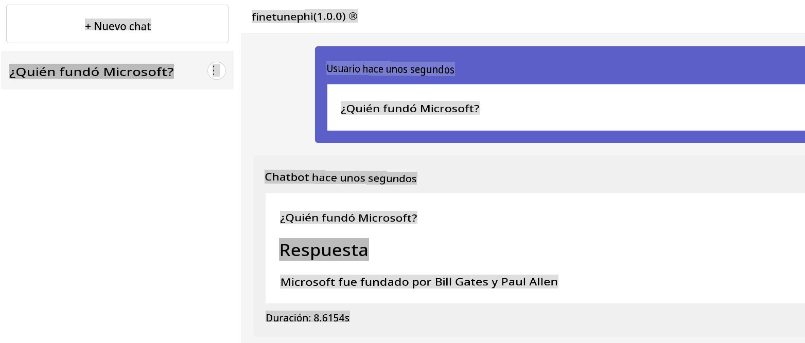

**Descargo de responsabilidad**:  
Este documento ha sido traducido utilizando servicios de traducción automática basados en inteligencia artificial. Si bien nos esforzamos por lograr precisión, tenga en cuenta que las traducciones automatizadas pueden contener errores o imprecisiones. El documento original en su idioma nativo debe considerarse la fuente autorizada. Para información crítica, se recomienda una traducción profesional realizada por humanos. No nos hacemos responsables de malentendidos o interpretaciones erróneas que surjan del uso de esta traducción.