# Ajustar y Integrar modelos Phi-3 personalizados con Prompt Flow en Azure AI Foundry

Este ejemplo de principio a fin (E2E) está basado en la guía "[Fine-Tune and Integrate Custom Phi-3 Models with Prompt Flow in Azure AI Foundry](https://techcommunity.microsoft.com/t5/educator-developer-blog/fine-tune-and-integrate-custom-phi-3-models-with-prompt-flow-in/ba-p/4191726?WT.mc_id=aiml-137032-kinfeylo)" de la Comunidad Técnica de Microsoft. Introduce los procesos de ajuste fino, implementación e integración de modelos Phi-3 personalizados con Prompt Flow en Azure AI Foundry.  
A diferencia del ejemplo E2E, "[Fine-Tune and Integrate Custom Phi-3 Models with Prompt Flow](./E2E_Phi-3-FineTuning_PromptFlow_Integration.md)", que implicaba ejecutar el código localmente, este tutorial se centra completamente en ajustar e integrar tu modelo dentro de Azure AI / ML Studio.

## Resumen

En este ejemplo E2E, aprenderás cómo ajustar el modelo Phi-3 e integrarlo con Prompt Flow en Azure AI Foundry. Aprovechando Azure AI / ML Studio, establecerás un flujo de trabajo para implementar y utilizar modelos de IA personalizados. Este ejemplo E2E está dividido en tres escenarios:

**Escenario 1: Configurar recursos de Azure y Prepararse para el ajuste fino**

**Escenario 2: Ajustar el modelo Phi-3 e Implementarlo en Azure Machine Learning Studio**

**Escenario 3: Integrarlo con Prompt Flow y Conversar con tu modelo personalizado en Azure AI Foundry**

Aquí tienes una visión general de este ejemplo E2E.

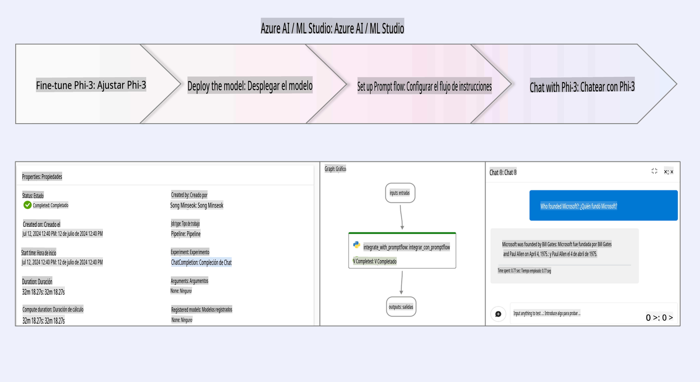

### Tabla de Contenidos

1. **[Escenario 1: Configurar recursos de Azure y Prepararse para el ajuste fino](../../../../../../md/02.Application/01.TextAndChat/Phi3)**
    - [Crear un Espacio de Trabajo de Azure Machine Learning](../../../../../../md/02.Application/01.TextAndChat/Phi3)
    - [Solicitar cuotas de GPU en la Suscripción de Azure](../../../../../../md/02.Application/01.TextAndChat/Phi3)
    - [Agregar asignación de roles](../../../../../../md/02.Application/01.TextAndChat/Phi3)
    - [Configurar el proyecto](../../../../../../md/02.Application/01.TextAndChat/Phi3)
    - [Preparar el conjunto de datos para el ajuste fino](../../../../../../md/02.Application/01.TextAndChat/Phi3)

1. **[Escenario 2: Ajustar el modelo Phi-3 e Implementarlo en Azure Machine Learning Studio](../../../../../../md/02.Application/01.TextAndChat/Phi3)**
    - [Ajustar el modelo Phi-3](../../../../../../md/02.Application/01.TextAndChat/Phi3)
    - [Implementar el modelo Phi-3 ajustado](../../../../../../md/02.Application/01.TextAndChat/Phi3)

1. **[Escenario 3: Integrarlo con Prompt Flow y Conversar con tu modelo personalizado en Azure AI Foundry](../../../../../../md/02.Application/01.TextAndChat/Phi3)**
    - [Integrar el modelo Phi-3 personalizado con Prompt Flow](../../../../../../md/02.Application/01.TextAndChat/Phi3)
    - [Conversar con tu modelo Phi-3 personalizado](../../../../../../md/02.Application/01.TextAndChat/Phi3)

## Escenario 1: Configurar recursos de Azure y Prepararse para el ajuste fino

### Crear un Espacio de Trabajo de Azure Machine Learning

1. Escribe *azure machine learning* en la **barra de búsqueda** en la parte superior de la página del portal y selecciona **Azure Machine Learning** de las opciones que aparecen.

    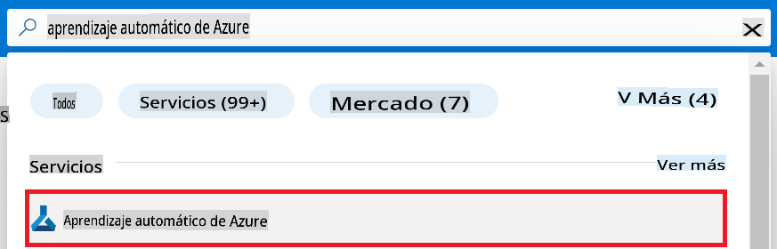

2. Selecciona **+ Crear** en el menú de navegación.

3. Selecciona **Nuevo espacio de trabajo** en el menú de navegación.

    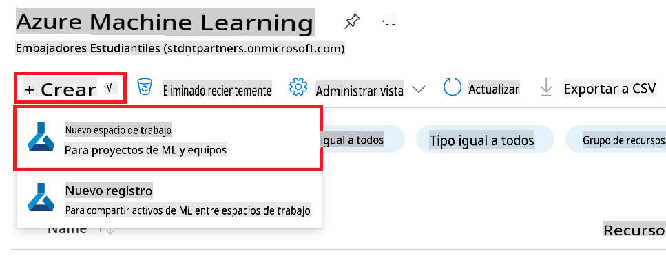

4. Realiza las siguientes tareas:

    - Selecciona tu **Suscripción de Azure**.
    - Selecciona el **Grupo de recursos** a utilizar (crea uno nuevo si es necesario).
    - Ingresa un **Nombre del espacio de trabajo**. Debe ser un valor único.
    - Selecciona la **Región** que deseas usar.
    - Selecciona la **Cuenta de almacenamiento** a utilizar (crea una nueva si es necesario).
    - Selecciona el **Key vault** a utilizar (crea uno nuevo si es necesario).
    - Selecciona **Application insights** a utilizar (crea uno nuevo si es necesario).
    - Selecciona el **Registro de contenedor** a utilizar (crea uno nuevo si es necesario).

    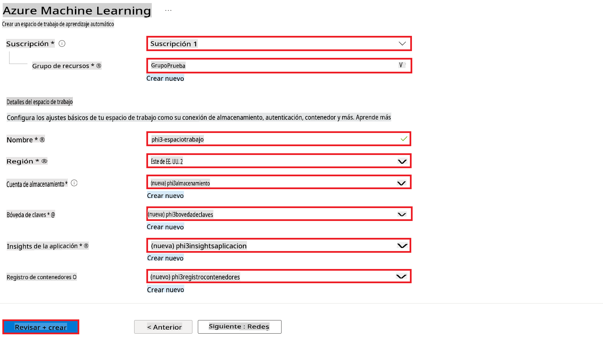

5. Selecciona **Revisar + Crear**.

6. Selecciona **Crear**.

### Solicitar cuotas de GPU en la Suscripción de Azure

En este tutorial, aprenderás a ajustar e implementar un modelo Phi-3 utilizando GPUs. Para el ajuste fino, usarás la GPU *Standard_NC24ads_A100_v4*, que requiere una solicitud de cuota. Para la implementación, usarás la GPU *Standard_NC6s_v3*, que también requiere una solicitud de cuota.

> [!NOTE]
>
> Solo las suscripciones de tipo Pago por Uso (Pay-As-You-Go) son elegibles para la asignación de GPU; las suscripciones con beneficios actualmente no son compatibles.
>

1. Visita [Azure ML Studio](https://ml.azure.com/home?wt.mc_id=studentamb_279723).

1. Realiza las siguientes tareas para solicitar la cuota de la familia *Standard NCADSA100v4*:

    - Selecciona **Cuota** desde la pestaña del lado izquierdo.
    - Selecciona la **Familia de máquinas virtuales** a utilizar. Por ejemplo, selecciona **Standard NCADSA100v4 Family Cluster Dedicated vCPUs**, que incluye la GPU *Standard_NC24ads_A100_v4*.
    - Selecciona **Solicitar cuota** desde el menú de navegación.

        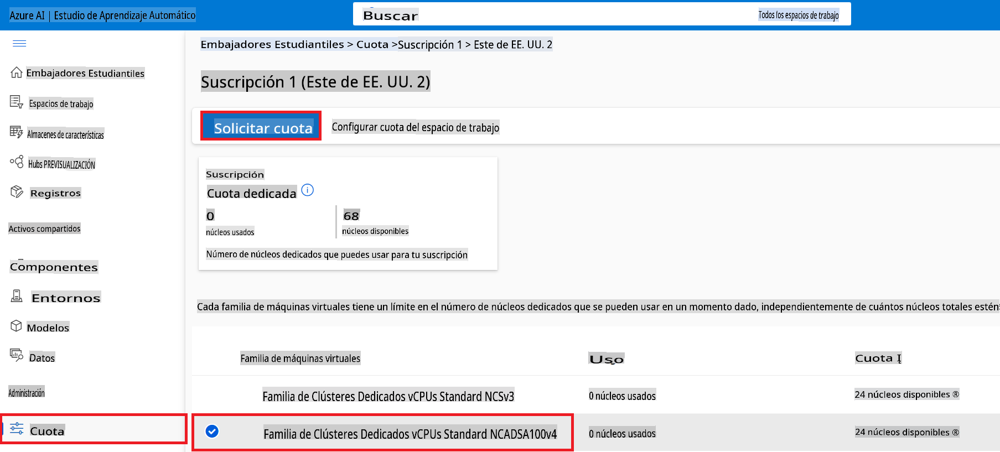

    - En la página de solicitud de cuota, ingresa el **Nuevo límite de núcleos** que deseas usar. Por ejemplo, 24.
    - En la página de solicitud de cuota, selecciona **Enviar** para solicitar la cuota de GPU.

1. Realiza las siguientes tareas para solicitar la cuota de la familia *Standard NCSv3*:

    - Selecciona **Cuota** desde la pestaña del lado izquierdo.
    - Selecciona la **Familia de máquinas virtuales** a utilizar. Por ejemplo, selecciona **Standard NCSv3 Family Cluster Dedicated vCPUs**, que incluye la GPU *Standard_NC6s_v3*.
    - Selecciona **Solicitar cuota** desde el menú de navegación.
    - En la página de solicitud de cuota, ingresa el **Nuevo límite de núcleos** que deseas usar. Por ejemplo, 24.
    - En la página de solicitud de cuota, selecciona **Enviar** para solicitar la cuota de GPU.

### Agregar asignación de roles

Para ajustar e implementar tus modelos, primero debes crear una Identidad Administrada Asignada por el Usuario (UAI) y asignarle los permisos adecuados. Esta UAI se utilizará para la autenticación durante la implementación.

#### Crear Identidad Administrada Asignada por el Usuario (UAI)

1. Escribe *managed identities* en la **barra de búsqueda** en la parte superior de la página del portal y selecciona **Managed Identities** de las opciones que aparecen.

    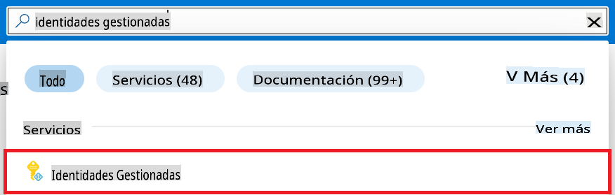

1. Selecciona **+ Crear**.

    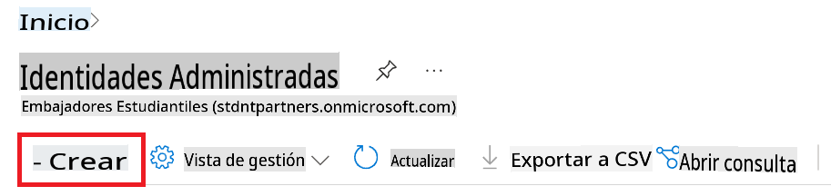

1. Realiza las siguientes tareas:

    - Selecciona tu **Suscripción de Azure**.
    - Selecciona el **Grupo de recursos** a utilizar (crea uno nuevo si es necesario).
    - Selecciona la **Región** que deseas usar.
    - Ingresa el **Nombre**. Debe ser un valor único.

    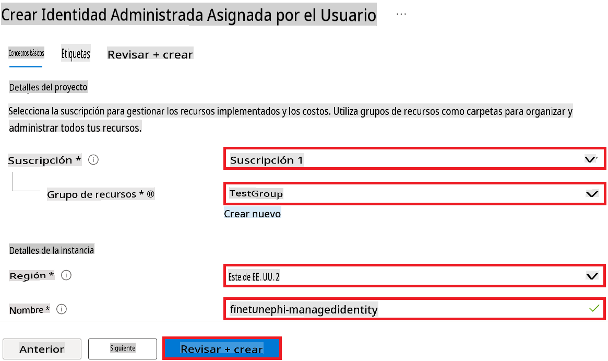

1. Selecciona **Revisar + Crear**.

1. Selecciona **+ Crear**.

#### Agregar asignación de rol de Colaborador a la Identidad Administrada

1. Navega al recurso de Identidad Administrada que creaste.

1. Selecciona **Asignaciones de roles de Azure** desde la pestaña del lado izquierdo.

1. Selecciona **+ Agregar asignación de rol** desde el menú de navegación.

1. En la página de asignación de roles, realiza las siguientes tareas:
    - Selecciona el **Ámbito** como **Grupo de recursos**.
    - Selecciona tu **Suscripción de Azure**.
    - Selecciona el **Grupo de recursos** a utilizar.
    - Selecciona el **Rol** como **Colaborador**.

    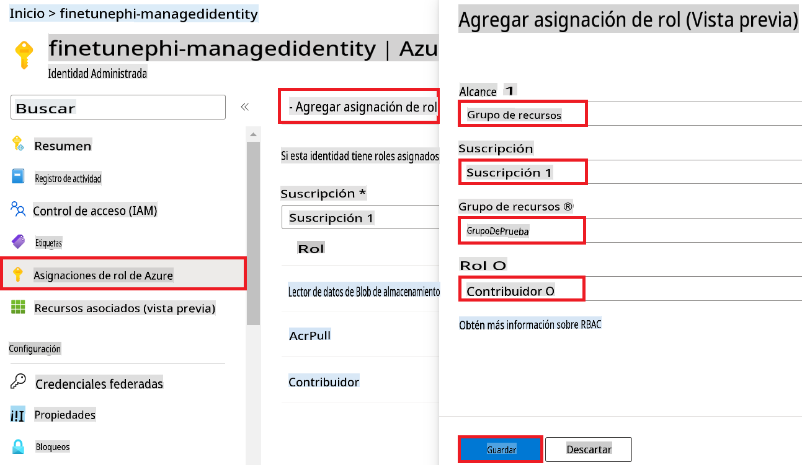

2. Selecciona **Guardar**.

#### Agregar asignación de rol de Lector de Datos de Blob de Almacenamiento a la Identidad Administrada

1. Escribe *storage accounts* en la **barra de búsqueda** en la parte superior de la página del portal y selecciona **Cuentas de almacenamiento** de las opciones que aparecen.

    

1. Selecciona la cuenta de almacenamiento asociada con el espacio de trabajo de Azure Machine Learning que creaste. Por ejemplo, *finetunephistorage*.

1. Realiza las siguientes tareas para navegar a la página de asignación de roles:

    - Navega a la cuenta de almacenamiento de Azure que creaste.
    - Selecciona **Control de acceso (IAM)** desde la pestaña del lado izquierdo.
    - Selecciona **+ Agregar** desde el menú de navegación.
    - Selecciona **Agregar asignación de rol** desde el menú de navegación.

    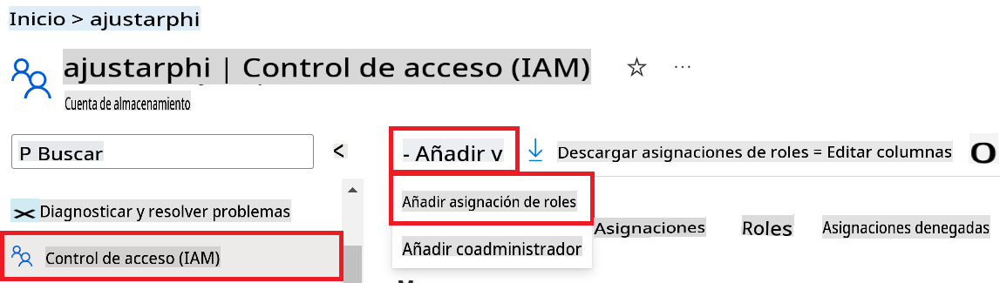

1. En la página de asignación de roles, realiza las siguientes tareas:

    - En la página de Rol, escribe *Storage Blob Data Reader* en la **barra de búsqueda** y selecciona **Storage Blob Data Reader** de las opciones que aparecen.
    - En la página de Rol, selecciona **Siguiente**.
    - En la página de Miembros, selecciona **Asignar acceso a** **Identidad Administrada**.
    - En la página de Miembros, selecciona **+ Seleccionar miembros**.
    - En la página de selección de identidades administradas, selecciona tu **Suscripción de Azure**.
    - En la página de selección de identidades administradas, selecciona la **Identidad Administrada** a **Managed Identity**.
    - En la página de selección de identidades administradas, selecciona la Identidad Administrada que creaste. Por ejemplo, *finetunephi-managedidentity*.
    - En la página de selección de identidades administradas, selecciona **Seleccionar**.

    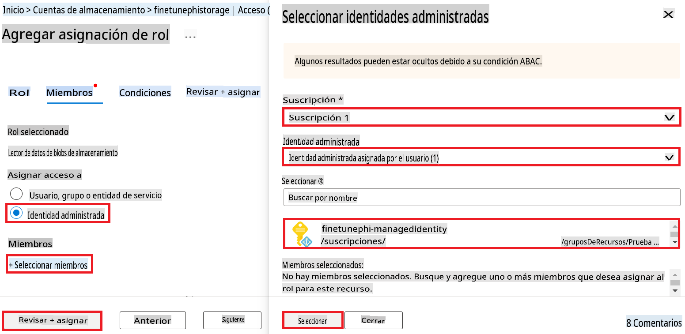

1. Selecciona **Revisar + asignar**.

#### Agregar asignación de rol AcrPull a la Identidad Administrada

1. Escribe *container registries* en la **barra de búsqueda** en la parte superior de la página del portal y selecciona **Registros de contenedores** de las opciones que aparecen.

    

1. Selecciona el registro de contenedor asociado con el espacio de trabajo de Azure Machine Learning. Por ejemplo, *finetunephicontainerregistry*.

1. Realiza las siguientes tareas para navegar a la página de asignación de roles:

    - Selecciona **Control de acceso (IAM)** desde la pestaña del lado izquierdo.
    - Selecciona **+ Agregar** desde el menú de navegación.
    - Selecciona **Agregar asignación de rol** desde el menú de navegación.

1. En la página de asignación de roles, realiza las siguientes tareas:

    - En la página de Rol, escribe *AcrPull* en la **barra de búsqueda** y selecciona **AcrPull** de las opciones que aparecen.
    - En la página de Rol, selecciona **Siguiente**.
    - En la página de Miembros, selecciona **Asignar acceso a** **Identidad Administrada**.
    - En la página de Miembros, selecciona **+ Seleccionar miembros**.
    - En la página de selección de identidades administradas, selecciona tu **Suscripción de Azure**.
    - En la página de selección de identidades administradas, selecciona la **Identidad Administrada** a **Managed Identity**.
    - En la página de selección de identidades administradas, selecciona la Identidad Administrada que creaste. Por ejemplo, *finetunephi-managedidentity*.
    - En la página de selección de identidades administradas, selecciona **Seleccionar**.
    - Selecciona **Revisar + asignar**.

### Configurar el proyecto

Para descargar los conjuntos de datos necesarios para el ajuste fino, configurarás un entorno local.

En este ejercicio, harás lo siguiente:

- Crear una carpeta para trabajar dentro de ella.
- Crear un entorno virtual.
- Instalar los paquetes necesarios.
- Crear un archivo *download_dataset.py* para descargar el conjunto de datos.

#### Crear una carpeta para trabajar dentro de ella

1. Abre una ventana de terminal y escribe el siguiente comando para crear una carpeta llamada *finetune-phi* en la ruta predeterminada.

    ```console
    mkdir finetune-phi
    ```

2. Escribe el siguiente comando en tu terminal para navegar a la carpeta *finetune-phi* que creaste.

    ```console
    cd finetune-phi
    ```

#### Crear un entorno virtual

1. Escribe el siguiente comando en tu terminal para crear un entorno virtual llamado *.venv*.

    ```console
    python -m venv .venv
    ```

2. Escribe el siguiente comando en tu terminal para activar el entorno virtual.

    ```console
    .venv\Scripts\activate.bat
    ```

> [!NOTE]
> Si funcionó, deberías ver *(.venv)* antes del indicador del terminal.

#### Instalar los paquetes necesarios

1. Escribe los siguientes comandos en tu terminal para instalar los paquetes necesarios.

    ```console
    pip install datasets==2.19.1
    ```

#### Crear `download_dataset.py`

> [!NOTE]
> Estructura completa de la carpeta:
>
> ```text
> └── YourUserName
> .    └── finetune-phi
> .        └── download_dataset.py
> ```

1. Abre **Visual Studio Code**.

1. Selecciona **Archivo** en la barra de menú.

1. Selecciona **Abrir Carpeta**.

1. Selecciona la carpeta *finetune-phi* que creaste, ubicada en *C:\Users\tuNombreDeUsuario\finetune-phi*.

    

1. En el panel izquierdo de Visual Studio Code, haz clic derecho y selecciona **Nuevo Archivo** para crear un archivo nuevo llamado *download_dataset.py*.

    

### Preparar el conjunto de datos para el ajuste fino

En este ejercicio, ejecutarás el archivo *download_dataset.py* para descargar los conjuntos de datos *ultrachat_200k* a tu entorno local. Luego usarás estos conjuntos de datos para ajustar el modelo Phi-3 en Azure Machine Learning.

En este ejercicio, harás lo siguiente:

- Agregar código al archivo *download_dataset.py* para descargar los conjuntos de datos.
- Ejecutar el archivo *download_dataset.py* para descargar los conjuntos de datos a tu entorno local.

#### Descargar tu conjunto de datos usando *download_dataset.py*

1. Abre el archivo *download_dataset.py* en Visual Studio Code.

1. Agrega el siguiente código al archivo *download_dataset.py*.

    ```python
    import json
    import os
    from datasets import load_dataset

    def load_and_split_dataset(dataset_name, config_name, split_ratio):
        """
        Load and split a dataset.
        """
        # Load the dataset with the specified name, configuration, and split ratio
        dataset = load_dataset(dataset_name, config_name, split=split_ratio)
        print(f"Original dataset size: {len(dataset)}")
        
        # Split the dataset into train and test sets (80% train, 20% test)
        split_dataset = dataset.train_test_split(test_size=0.2)
        print(f"Train dataset size: {len(split_dataset['train'])}")
        print(f"Test dataset size: {len(split_dataset['test'])}")
        
        return split_dataset

    def save_dataset_to_jsonl(dataset, filepath):
        """
        Save a dataset to a JSONL file.
        """
        # Create the directory if it does not exist
        os.makedirs(os.path.dirname(filepath), exist_ok=True)
        
        # Open the file in write mode
        with open(filepath, 'w', encoding='utf-8') as f:
            # Iterate over each record in the dataset
            for record in dataset:
                # Dump the record as a JSON object and write it to the file
                json.dump(record, f)
                # Write a newline character to separate records
                f.write('\n')
        
        print(f"Dataset saved to {filepath}")

    def main():
        """
        Main function to load, split, and save the dataset.
        """
        # Load and split the ULTRACHAT_200k dataset with a specific configuration and split ratio
        dataset = load_and_split_dataset("HuggingFaceH4/ultrachat_200k", 'default', 'train_sft[:1%]')
        
        # Extract the train and test datasets from the split
        train_dataset = dataset['train']
        test_dataset = dataset['test']

        # Save the train dataset to a JSONL file
        save_dataset_to_jsonl(train_dataset, "data/train_data.jsonl")
        
        # Save the test dataset to a separate JSONL file
        save_dataset_to_jsonl(test_dataset, "data/test_data.jsonl")

    if __name__ == "__main__":
        main()

    ```

1. Escribe el siguiente comando en tu terminal para ejecutar el script y descargar el conjunto de datos a tu entorno local.

    ```console
    python download_dataset.py
    ```

1. Verifica que los conjuntos de datos se hayan guardado correctamente en tu directorio local *finetune-phi/data*.

> [!NOTE]
>
> #### Nota sobre el tamaño del conjunto de datos y el tiempo de ajuste fino
>
> En este tutorial, usarás solo el 1% del conjunto de datos (`split='train[:1%]'`). Esto reduce significativamente la cantidad de datos, acelerando tanto la carga como los procesos de ajuste fino. Puedes ajustar el porcentaje para encontrar el equilibrio adecuado entre el tiempo de entrenamiento y el rendimiento del modelo. Usar un subconjunto más pequeño del conjunto de datos reduce el tiempo requerido para el ajuste fino, haciendo el proceso más manejable para un tutorial.

## Escenario 2: Ajustar el modelo Phi-3 e Implementarlo en Azure Machine Learning Studio

### Ajustar el modelo Phi-3

En este ejercicio, ajustarás el modelo Phi-3 en Azure Machine Learning Studio.

En este ejercicio, harás lo siguiente:

- Crear un clúster de computación para el ajuste fino.
- Ajustar el modelo Phi-3 en Azure Machine Learning Studio.

#### Crear clúster de computación para el ajuste fino
1. Visita [Azure ML Studio](https://ml.azure.com/home?wt.mc_id=studentamb_279723).

1. Selecciona **Compute** en la pestaña lateral izquierda.

1. Selecciona **Compute clusters** en el menú de navegación.

1. Selecciona **+ New**.

    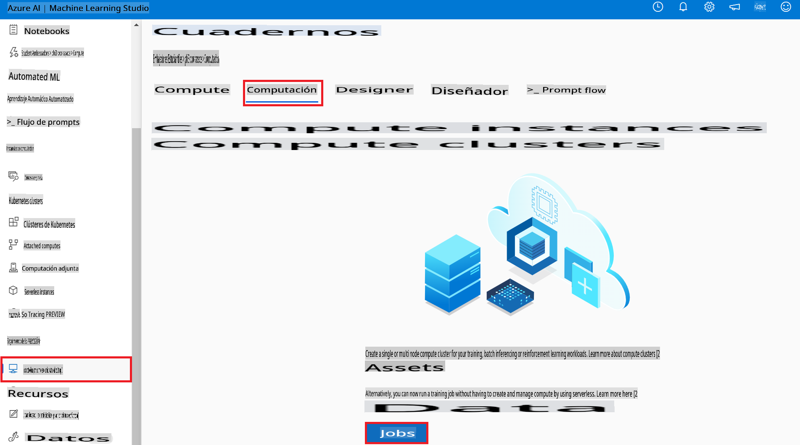

1. Realiza las siguientes tareas:

    - Selecciona la **Región** que deseas usar.
    - Cambia el **Nivel de máquina virtual** a **Dedicated**.
    - Cambia el **Tipo de máquina virtual** a **GPU**.
    - Cambia el filtro de **Tamaño de máquina virtual** a **Select from all options**.
    - Selecciona el **Tamaño de máquina virtual** como **Standard_NC24ads_A100_v4**.

    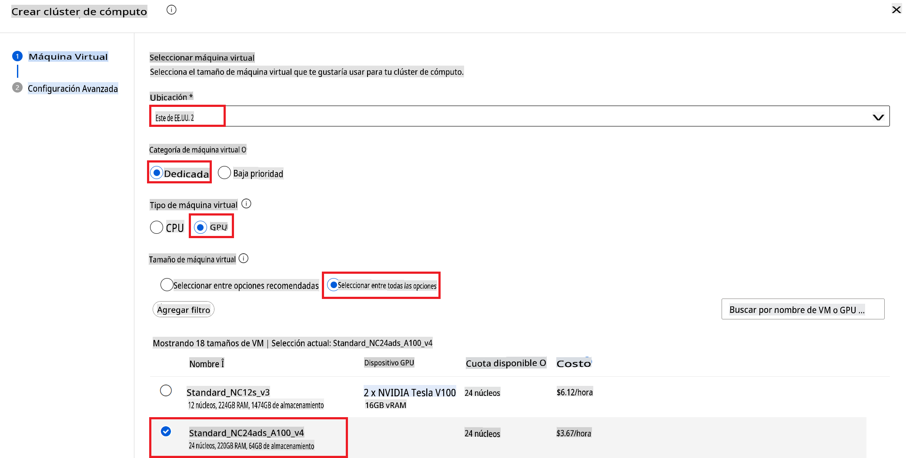

1. Selecciona **Next**.

1. Realiza las siguientes tareas:

    - Ingresa un **Compute name**. Debe ser un valor único.
    - Cambia el **Número mínimo de nodos** a **0**.
    - Cambia el **Número máximo de nodos** a **1**.
    - Cambia los **Segundos de inactividad antes de reducir el escalado** a **120**.

    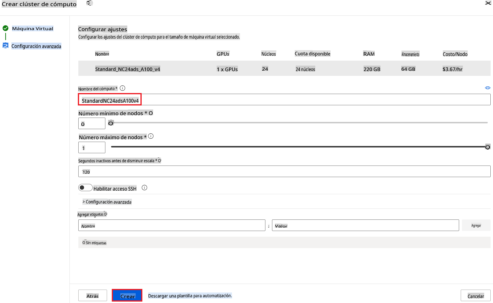

1. Selecciona **Create**.

#### Ajustar el modelo Phi-3

1. Visita [Azure ML Studio](https://ml.azure.com/home?wt.mc_id=studentamb_279723).

1. Selecciona el espacio de trabajo de Azure Machine Learning que creaste.

    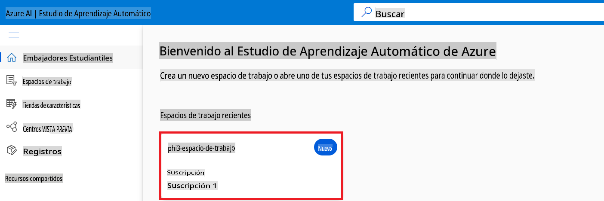

1. Realiza las siguientes tareas:

    - Selecciona **Model catalog** en la pestaña lateral izquierda.
    - Escribe *phi-3-mini-4k* en la **barra de búsqueda** y selecciona **Phi-3-mini-4k-instruct** de las opciones que aparecen.

    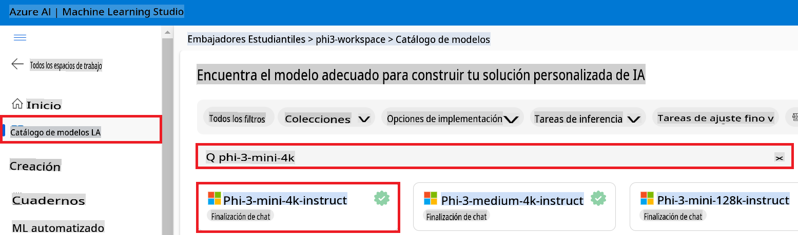

1. Selecciona **Fine-tune** en el menú de navegación.

    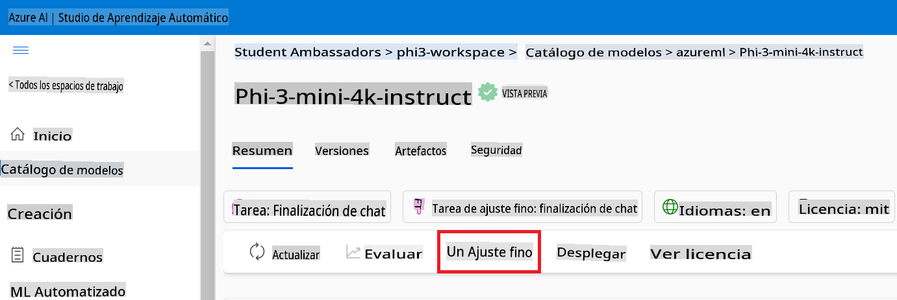

1. Realiza las siguientes tareas:

    - Cambia **Select task type** a **Chat completion**.
    - Selecciona **+ Select data** para cargar los **Datos de entrenamiento**.
    - Cambia el tipo de carga de datos de validación a **Provide different validation data**.
    - Selecciona **+ Select data** para cargar los **Datos de validación**.

    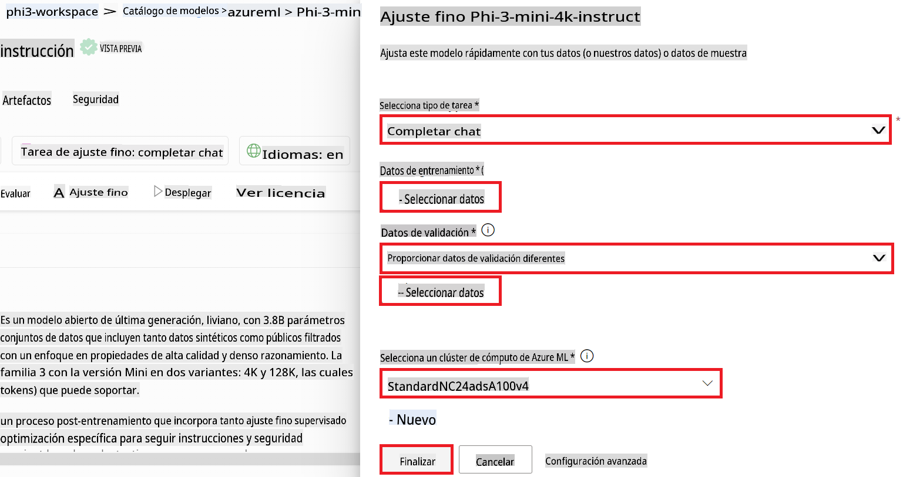

    > [!TIP]
    >
    > Puedes seleccionar **Advanced settings** para personalizar configuraciones como **learning_rate** y **lr_scheduler_type** para optimizar el proceso de ajuste fino según tus necesidades específicas.

1. Selecciona **Finish**.

1. En este ejercicio, ajustaste exitosamente el modelo Phi-3 usando Azure Machine Learning. Ten en cuenta que el proceso de ajuste fino puede tomar un tiempo considerable. Después de ejecutar el trabajo de ajuste fino, deberás esperar a que finalice. Puedes monitorear el estado del trabajo de ajuste fino navegando a la pestaña Jobs en el lado izquierdo de tu espacio de trabajo de Azure Machine Learning. En la próxima serie, implementarás el modelo ajustado e integrarás con Prompt flow.

    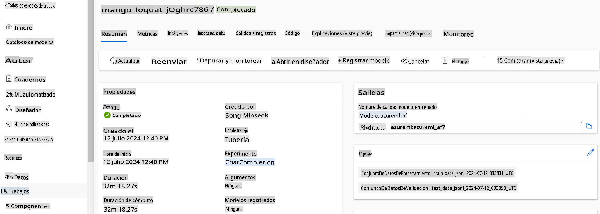

### Implementar el modelo Phi-3 ajustado

Para integrar el modelo Phi-3 ajustado con Prompt flow, necesitas implementarlo para que esté accesible para inferencias en tiempo real. Este proceso implica registrar el modelo, crear un endpoint en línea e implementar el modelo.

En este ejercicio, harás lo siguiente:

- Registrar el modelo ajustado en el espacio de trabajo de Azure Machine Learning.
- Crear un endpoint en línea.
- Implementar el modelo Phi-3 ajustado registrado.

#### Registrar el modelo ajustado

1. Visita [Azure ML Studio](https://ml.azure.com/home?wt.mc_id=studentamb_279723).

1. Selecciona el espacio de trabajo de Azure Machine Learning que creaste.

    

1. Selecciona **Models** en la pestaña lateral izquierda.
1. Selecciona **+ Register**.
1. Selecciona **From a job output**.

    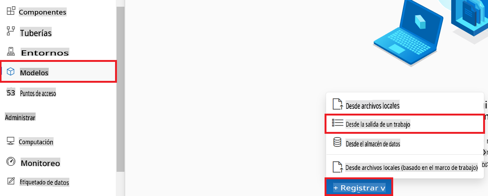

1. Selecciona el trabajo que creaste.

    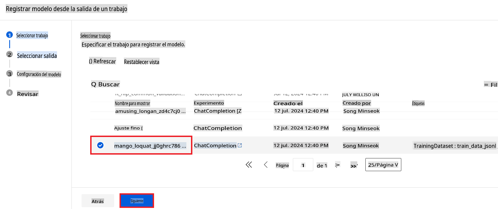

1. Selecciona **Next**.

1. Cambia **Model type** a **MLflow**.

1. Asegúrate de que **Job output** esté seleccionado; debería estarlo automáticamente.

    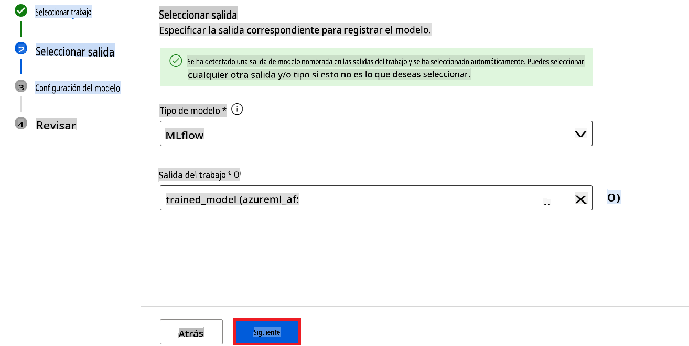

2. Selecciona **Next**.

3. Selecciona **Register**.

    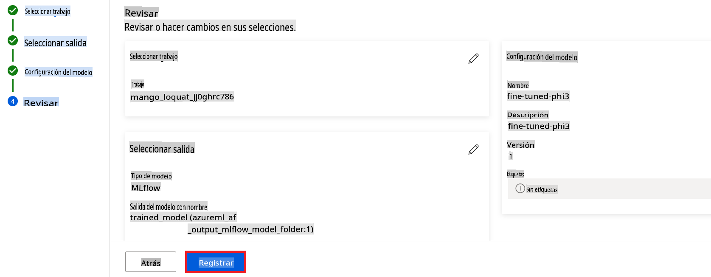

4. Puedes ver tu modelo registrado navegando al menú **Models** en la pestaña lateral izquierda.

    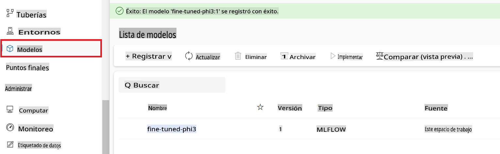

#### Implementar el modelo ajustado

1. Navega al espacio de trabajo de Azure Machine Learning que creaste.

1. Selecciona **Endpoints** en la pestaña lateral izquierda.

1. Selecciona **Real-time endpoints** en el menú de navegación.

    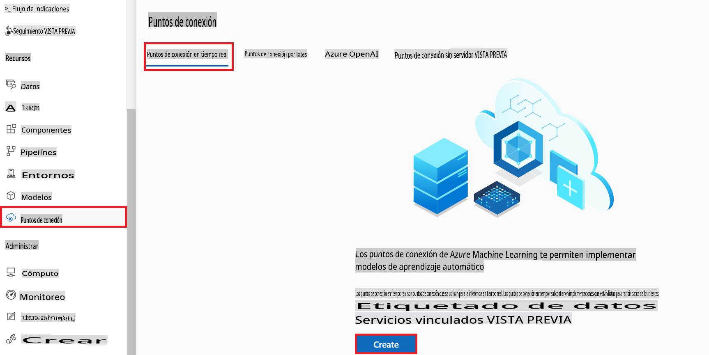

1. Selecciona **Create**.

1. Selecciona el modelo registrado que creaste.

    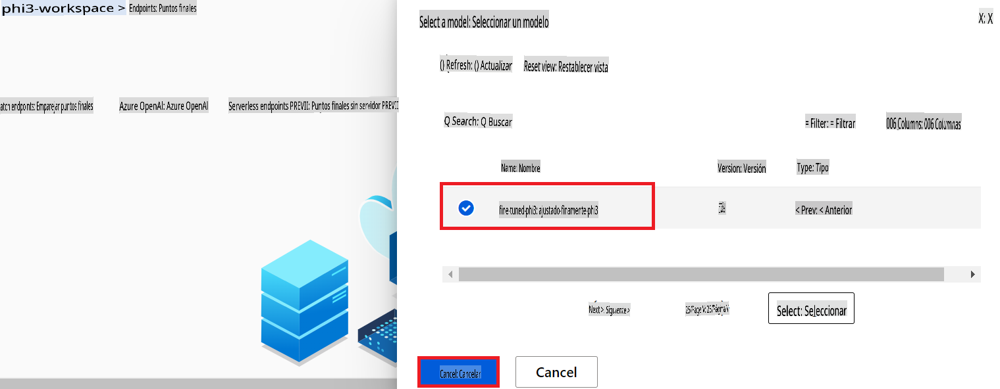

1. Selecciona **Select**.

1. Realiza las siguientes tareas:

    - Cambia **Virtual machine** a *Standard_NC6s_v3*.
    - Selecciona el **Número de instancias** que deseas usar. Por ejemplo, *1*.
    - Cambia **Endpoint** a **New** para crear un nuevo endpoint.
    - Ingresa un **Endpoint name**. Debe ser un valor único.
    - Ingresa un **Deployment name**. Debe ser un valor único.

    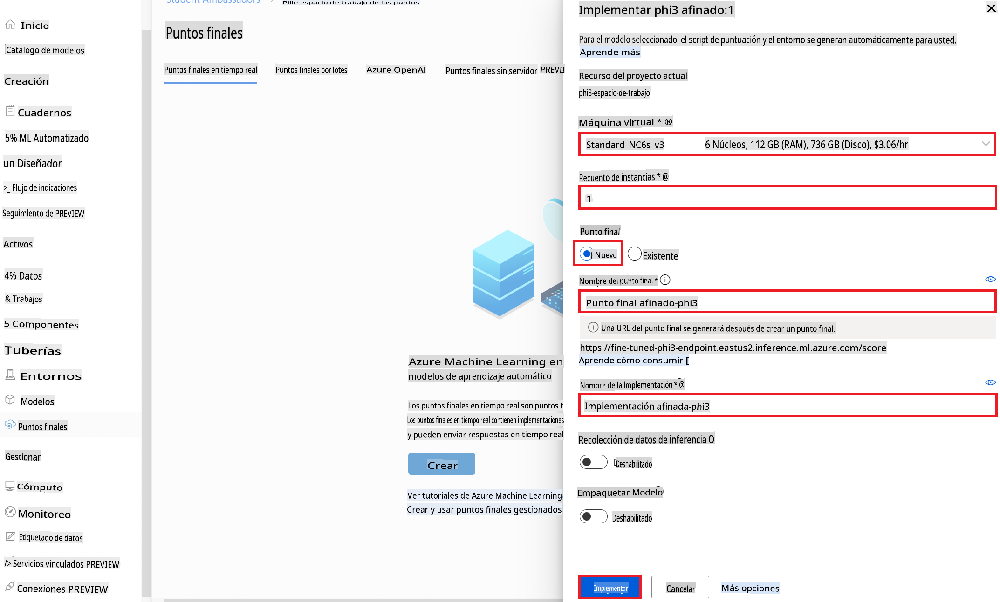

1. Selecciona **Deploy**.

> [!WARNING]
> Para evitar cargos adicionales en tu cuenta, asegúrate de eliminar el endpoint creado en el espacio de trabajo de Azure Machine Learning.
>

#### Verificar el estado de implementación en el espacio de trabajo de Azure Machine Learning

1. Navega al espacio de trabajo de Azure Machine Learning que creaste.

1. Selecciona **Endpoints** en la pestaña lateral izquierda.

1. Selecciona el endpoint que creaste.

    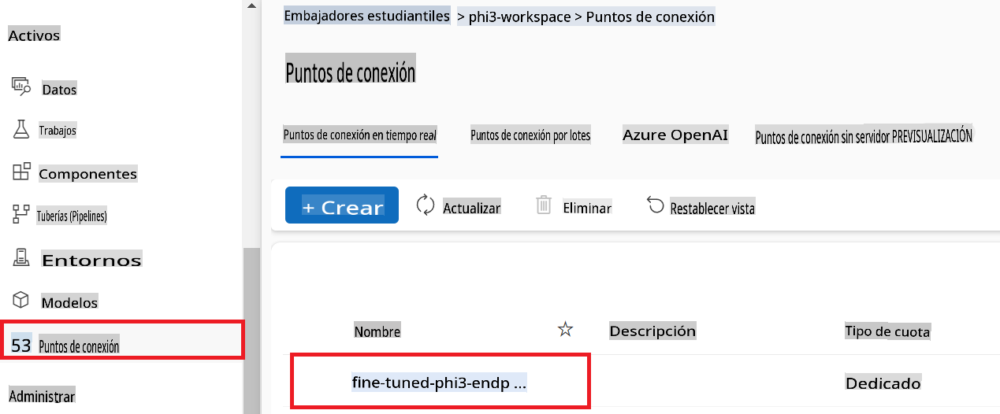

1. En esta página, puedes gestionar los endpoints durante el proceso de implementación.

> [!NOTE]
> Una vez que la implementación esté completa, asegúrate de que **Live traffic** esté configurado en **100%**. Si no lo está, selecciona **Update traffic** para ajustar la configuración de tráfico. Ten en cuenta que no puedes probar el modelo si el tráfico está configurado en 0%.
>
> 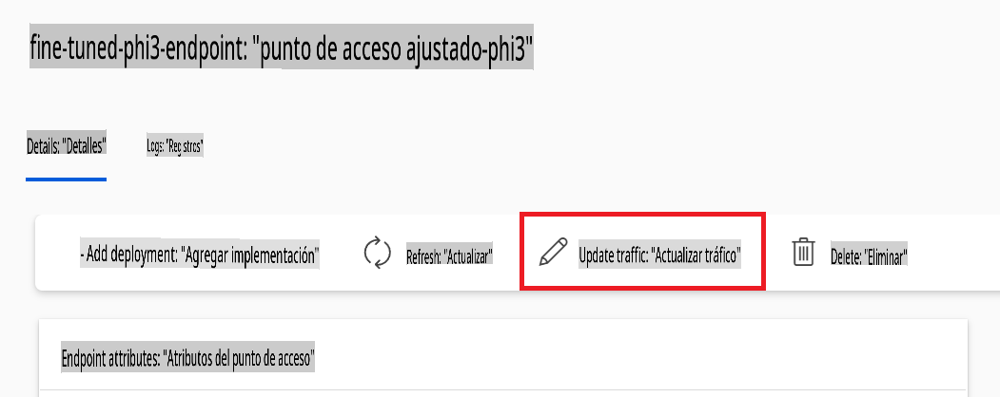
>

## Escenario 3: Integrar con Prompt flow y chatear con tu modelo personalizado en Azure AI Foundry

### Integrar el modelo Phi-3 personalizado con Prompt flow

Después de implementar exitosamente tu modelo ajustado, ahora puedes integrarlo con Prompt Flow para usarlo en aplicaciones en tiempo real, habilitando una variedad de tareas interactivas con tu modelo Phi-3 personalizado.

En este ejercicio, harás lo siguiente:

- Crear un Azure AI Foundry Hub.
- Crear un Azure AI Foundry Project.
- Crear un Prompt flow.
- Agregar una conexión personalizada para el modelo Phi-3 ajustado.
- Configurar Prompt flow para chatear con tu modelo Phi-3 personalizado.

> [!NOTE]
> También puedes integrar con Promptflow usando Azure ML Studio. El mismo proceso de integración se aplica a Azure ML Studio.

#### Crear un Azure AI Foundry Hub

Necesitas crear un Hub antes de crear el Project. Un Hub actúa como un Grupo de Recursos, permitiéndote organizar y gestionar múltiples Proyectos dentro de Azure AI Foundry.

1. Visita [Azure AI Foundry](https://ai.azure.com/?WT.mc_id=aiml-137032-kinfeylo).

1. Selecciona **All hubs** en la pestaña lateral izquierda.

1. Selecciona **+ New hub** en el menú de navegación.

    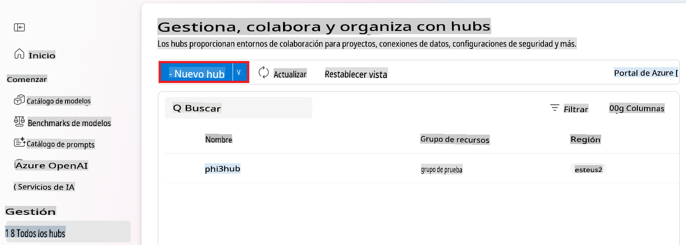

1. Realiza las siguientes tareas:

    - Ingresa un **Hub name**. Debe ser un valor único.
    - Selecciona tu **Subscription** de Azure.
    - Selecciona el **Resource group** que deseas usar (crea uno nuevo si es necesario).
    - Selecciona la **Location** que deseas usar.
    - Cambia **Connect Azure AI Services** a la opción deseada (crea uno nuevo si es necesario).
    - Cambia **Connect Azure AI Search** a **Skip connecting**.

    

1. Selecciona **Next**.

#### Crear un Azure AI Foundry Project

1. En el Hub que creaste, selecciona **All projects** en la pestaña lateral izquierda.

1. Selecciona **+ New project** en el menú de navegación.

    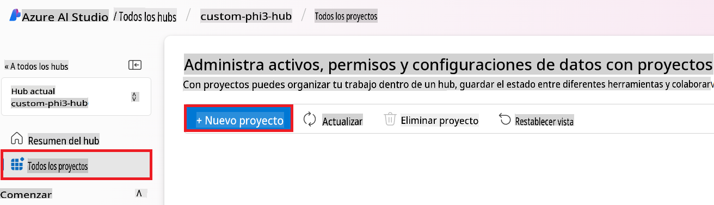

1. Ingresa un **Project name**. Debe ser un valor único.

    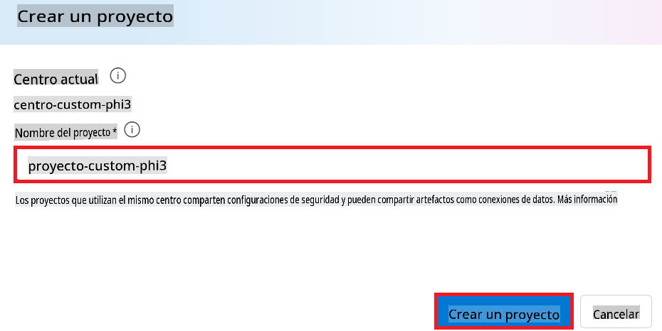

1. Selecciona **Create a project**.

#### Agregar una conexión personalizada para el modelo Phi-3 ajustado

Para integrar tu modelo Phi-3 personalizado con Prompt flow, necesitas guardar el endpoint y la clave del modelo en una conexión personalizada. Esta configuración asegura el acceso a tu modelo Phi-3 personalizado en Prompt flow.

#### Configurar la clave API y el URI del endpoint del modelo Phi-3 ajustado

1. Visita [Azure ML Studio](https://ml.azure.com/home?WT.mc_id=aiml-137032-kinfeylo).

1. Navega al espacio de trabajo de Azure Machine Learning que creaste.

1. Selecciona **Endpoints** en la pestaña lateral izquierda.

    

1. Selecciona el endpoint que creaste.

    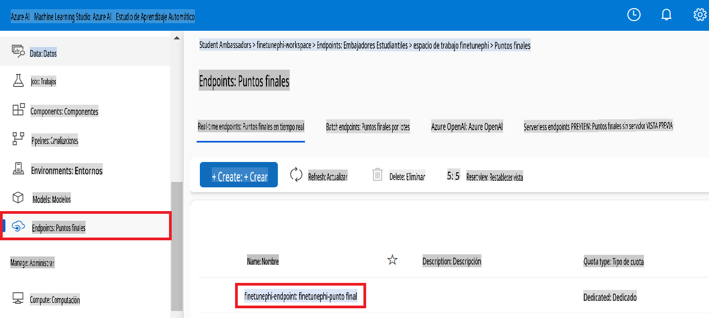

1. Selecciona **Consume** en el menú de navegación.

1. Copia tu **REST endpoint** y **Primary key**.
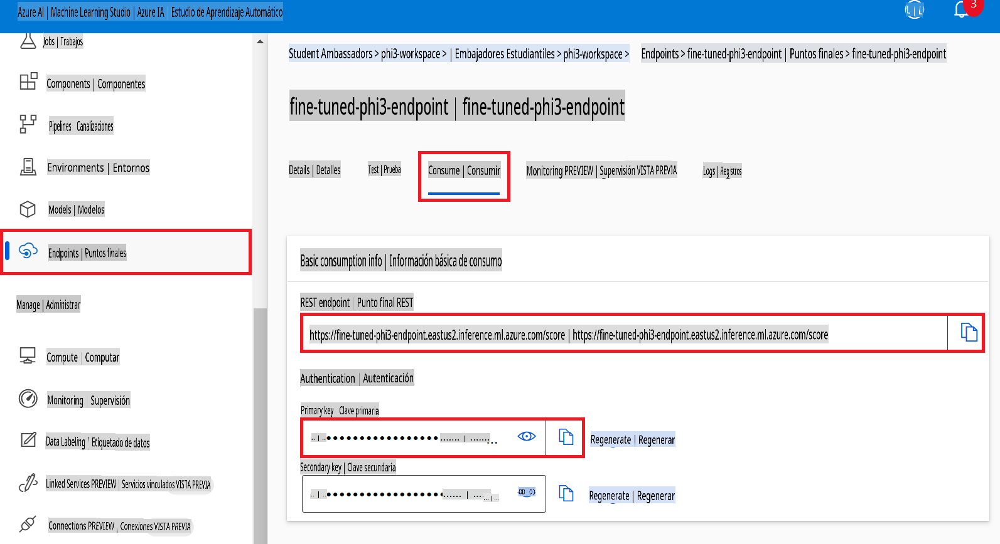

#### Agregar la Conexión Personalizada

1. Visita [Azure AI Foundry](https://ai.azure.com/?WT.mc_id=aiml-137032-kinfeylo).

1. Navega al proyecto de Azure AI Foundry que creaste.

1. En el proyecto que creaste, selecciona **Settings** desde la pestaña lateral izquierda.

1. Selecciona **+ New connection**.

    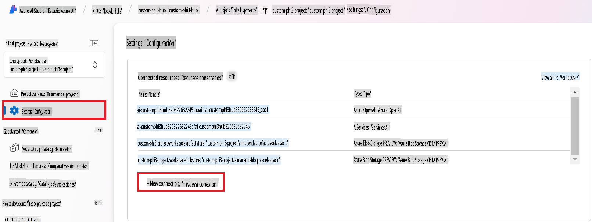

1. Selecciona **Custom keys** desde el menú de navegación.

    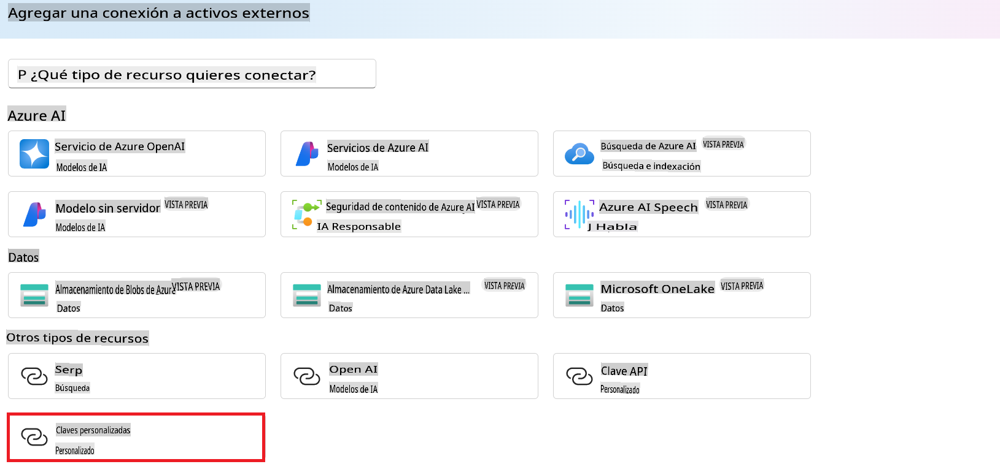

1. Realiza las siguientes tareas:

    - Selecciona **+ Add key value pairs**.
    - Para el nombre de la clave, ingresa **endpoint** y pega el endpoint que copiaste de Azure ML Studio en el campo de valor.
    - Selecciona **+ Add key value pairs** nuevamente.
    - Para el nombre de la clave, ingresa **key** y pega la clave que copiaste de Azure ML Studio en el campo de valor.
    - Después de agregar las claves, selecciona **is secret** para evitar que la clave sea expuesta.

    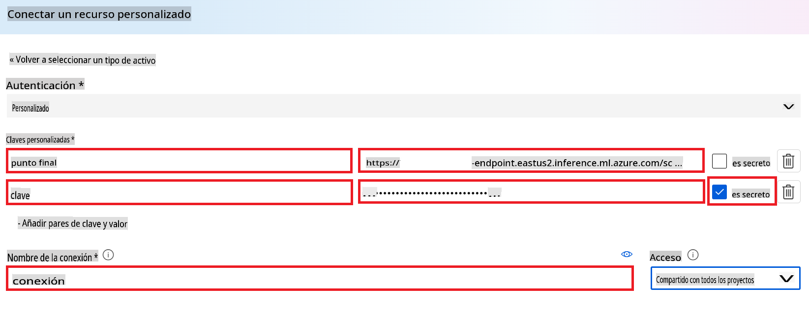

1. Selecciona **Add connection**.

#### Crear Prompt flow

Has agregado una conexión personalizada en Azure AI Foundry. Ahora, vamos a crear un Prompt flow siguiendo los pasos a continuación. Luego, conectarás este Prompt flow a la conexión personalizada para que puedas usar el modelo ajustado dentro del Prompt flow.

1. Navega al proyecto de Azure AI Foundry que creaste.

1. Selecciona **Prompt flow** desde la pestaña lateral izquierda.

1. Selecciona **+ Create** desde el menú de navegación.

    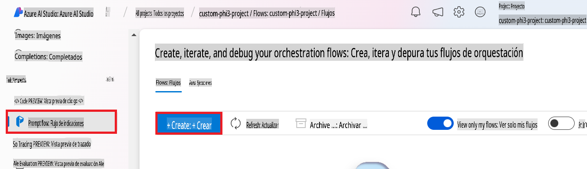

1. Selecciona **Chat flow** desde el menú de navegación.

    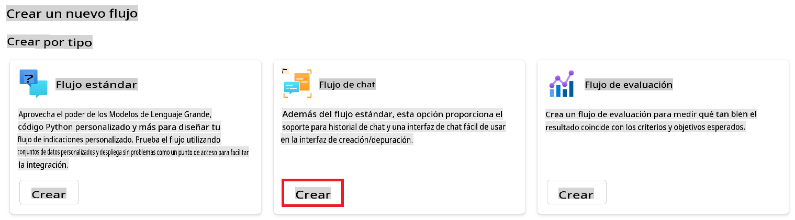

1. Ingresa el **Folder name** que deseas usar.

    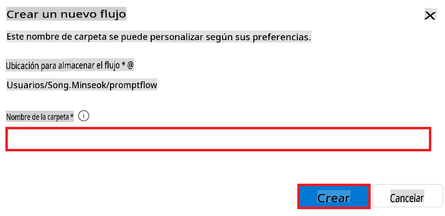

2. Selecciona **Create**.

#### Configurar Prompt flow para chatear con tu modelo Phi-3 personalizado

Es necesario integrar el modelo Phi-3 ajustado en un Prompt flow. Sin embargo, el Prompt flow existente no está diseñado para este propósito. Por lo tanto, debes rediseñar el Prompt flow para habilitar la integración del modelo personalizado.

1. En el Prompt flow, realiza las siguientes tareas para reconstruir el flujo existente:

    - Selecciona **Raw file mode**.
    - Elimina todo el código existente en el archivo *flow.dag.yml*.
    - Agrega el siguiente código al archivo *flow.dag.yml*.

        ```yml
        inputs:
          input_data:
            type: string
            default: "Who founded Microsoft?"

        outputs:
          answer:
            type: string
            reference: ${integrate_with_promptflow.output}

        nodes:
        - name: integrate_with_promptflow
          type: python
          source:
            type: code
            path: integrate_with_promptflow.py
          inputs:
            input_data: ${inputs.input_data}
        ```

    - Selecciona **Save**.

    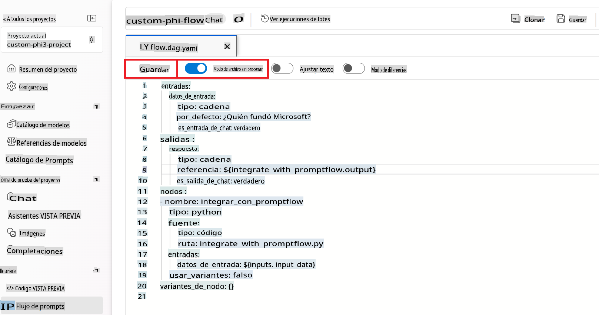

1. Agrega el siguiente código al archivo *integrate_with_promptflow.py* para usar el modelo Phi-3 personalizado en el Prompt flow.

    ```python
    import logging
    import requests
    from promptflow import tool
    from promptflow.connections import CustomConnection

    # Logging setup
    logging.basicConfig(
        format="%(asctime)s - %(levelname)s - %(name)s - %(message)s",
        datefmt="%Y-%m-%d %H:%M:%S",
        level=logging.DEBUG
    )
    logger = logging.getLogger(__name__)

    def query_phi3_model(input_data: str, connection: CustomConnection) -> str:
        """
        Send a request to the Phi-3 model endpoint with the given input data using Custom Connection.
        """

        # "connection" is the name of the Custom Connection, "endpoint", "key" are the keys in the Custom Connection
        endpoint_url = connection.endpoint
        api_key = connection.key

        headers = {
            "Content-Type": "application/json",
            "Authorization": f"Bearer {api_key}"
        }
        data = {
            "input_data": {
                "input_string": [
                    {"role": "user", "content": input_data}
                ],
                "parameters": {
                    "temperature": 0.7,
                    "max_new_tokens": 128
                }
            }
        }
        try:
            response = requests.post(endpoint_url, json=data, headers=headers)
            response.raise_for_status()
            
            # Log the full JSON response
            logger.debug(f"Full JSON response: {response.json()}")

            result = response.json()["output"]
            logger.info("Successfully received response from Azure ML Endpoint.")
            return result
        except requests.exceptions.RequestException as e:
            logger.error(f"Error querying Azure ML Endpoint: {e}")
            raise

    @tool
    def my_python_tool(input_data: str, connection: CustomConnection) -> str:
        """
        Tool function to process input data and query the Phi-3 model.
        """
        return query_phi3_model(input_data, connection)

    ```

    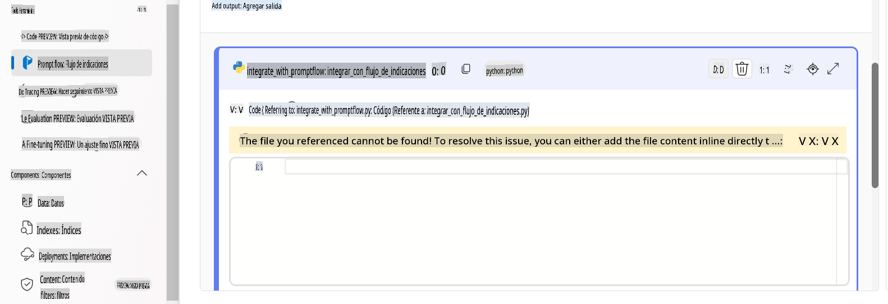

> [!NOTE]
> Para obtener más información detallada sobre el uso de Prompt flow en Azure AI Foundry, puedes consultar [Prompt flow en Azure AI Foundry](https://learn.microsoft.com/azure/ai-studio/how-to/prompt-flow).

1. Selecciona **Chat input**, **Chat output** para habilitar el chat con tu modelo.

    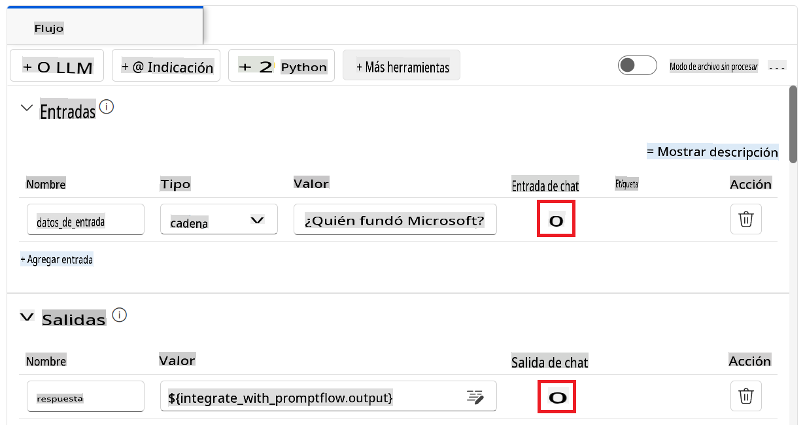

1. Ahora estás listo para chatear con tu modelo Phi-3 personalizado. En el próximo ejercicio, aprenderás cómo iniciar Prompt flow y usarlo para chatear con tu modelo Phi-3 ajustado.

> [!NOTE]
>
> El flujo reconstruido debería verse como la imagen a continuación:
>
> 
>

### Chatear con tu modelo Phi-3 personalizado

Ahora que has ajustado e integrado tu modelo Phi-3 personalizado con Prompt flow, estás listo para comenzar a interactuar con él. Este ejercicio te guiará a través del proceso de configuración e inicio de un chat con tu modelo usando Prompt flow. Siguiendo estos pasos, podrás aprovechar al máximo las capacidades de tu modelo Phi-3 ajustado para diversas tareas y conversaciones.

- Chatea con tu modelo Phi-3 personalizado usando Prompt flow.

#### Iniciar Prompt flow

1. Selecciona **Start compute sessions** para iniciar Prompt flow.

    

1. Selecciona **Validate and parse input** para renovar parámetros.

    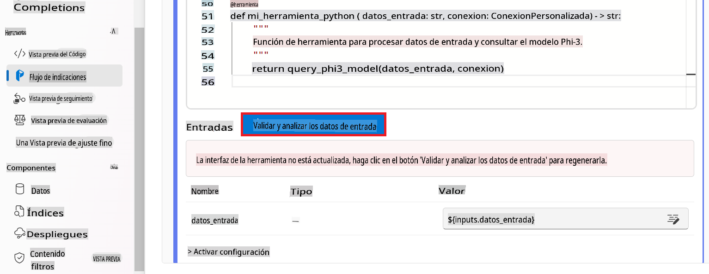

1. Selecciona el **Value** de la **connection** a la conexión personalizada que creaste. Por ejemplo, *connection*.

    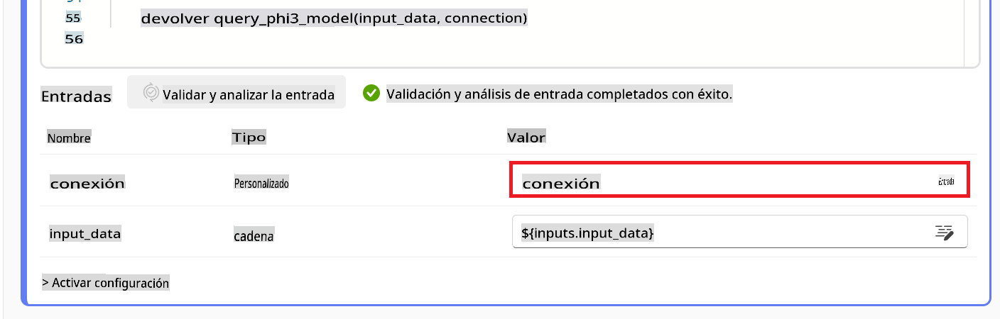

#### Chatear con tu modelo personalizado

1. Selecciona **Chat**.

    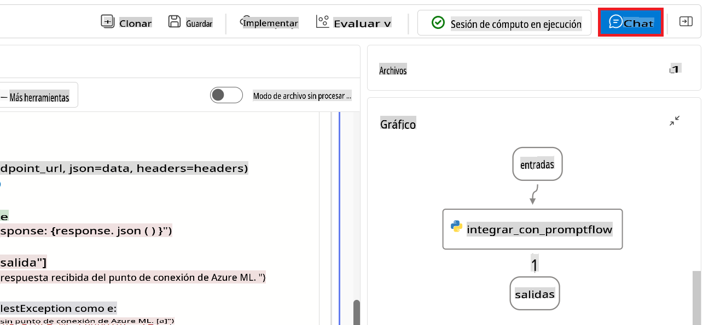

1. Aquí tienes un ejemplo de los resultados: Ahora puedes chatear con tu modelo Phi-3 personalizado. Se recomienda hacer preguntas basadas en los datos utilizados para el ajuste fino.

    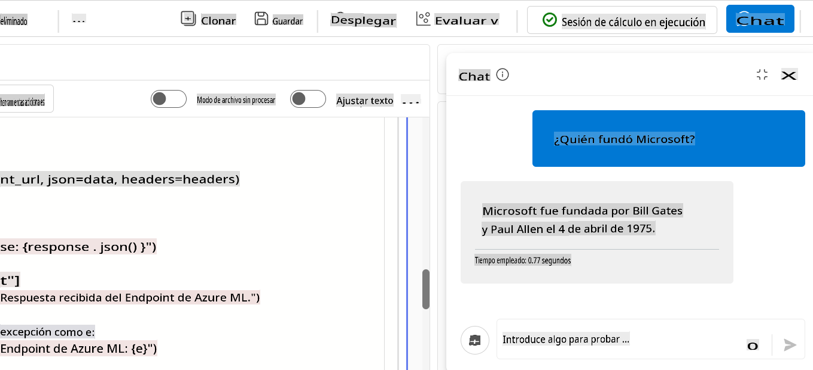

**Descargo de responsabilidad**:  
Este documento ha sido traducido utilizando servicios de traducción automática basados en inteligencia artificial. Si bien nos esforzamos por lograr precisión, tenga en cuenta que las traducciones automatizadas pueden contener errores o imprecisiones. El documento original en su idioma nativo debe considerarse como la fuente autorizada. Para información crítica, se recomienda una traducción profesional realizada por humanos. No nos hacemos responsables de malentendidos o interpretaciones erróneas que puedan surgir del uso de esta traducción.