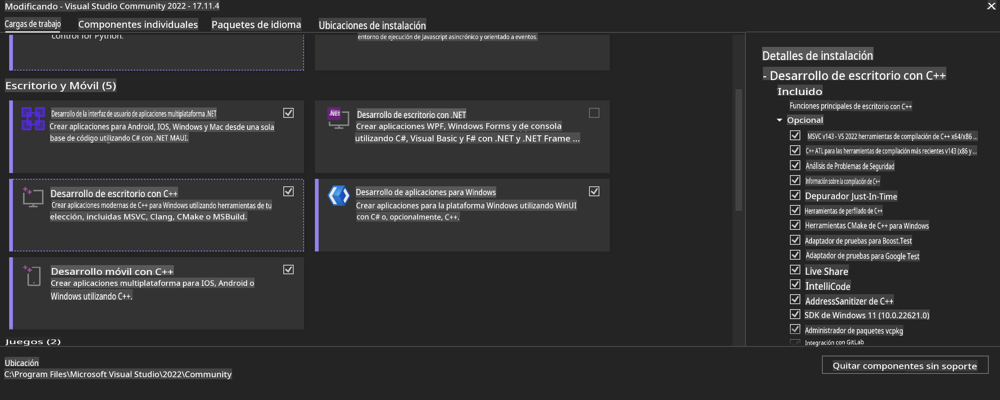
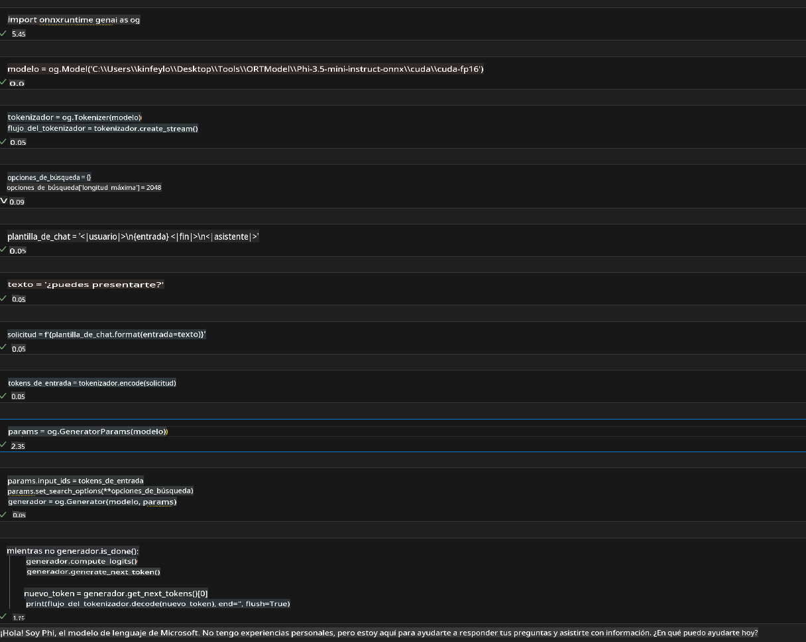
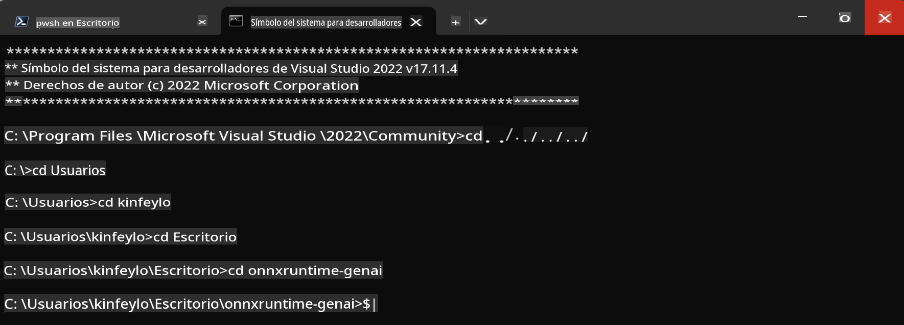

# **Guía para OnnxRuntime GenAI en GPU de Windows**

Esta guía proporciona los pasos para configurar y utilizar ONNX Runtime (ORT) con GPUs en Windows. Está diseñada para ayudarte a aprovechar la aceleración por GPU para tus modelos, mejorando el rendimiento y la eficiencia.

El documento incluye orientación sobre:

- Configuración del entorno: Instrucciones para instalar las dependencias necesarias como CUDA, cuDNN y ONNX Runtime.
- Configuración: Cómo configurar el entorno y ONNX Runtime para usar los recursos de GPU de manera efectiva.
- Consejos de optimización: Recomendaciones para ajustar la configuración de la GPU para un rendimiento óptimo.

### **1. Python 3.10.x / 3.11.8**

   ***Nota*** Se sugiere usar [miniforge](https://github.com/conda-forge/miniforge/releases/latest/download/Miniforge3-Windows-x86_64.exe) como tu entorno de Python.

   ```bash

   conda create -n pydev python==3.11.8

   conda activate pydev

   ```

   ***Recordatorio*** Si tienes instalada alguna biblioteca de ONNX para Python, desinstálala.

### **2. Instalar CMake con winget**

   ```bash

   winget install -e --id Kitware.CMake

   ```

### **3. Instalar Visual Studio 2022 - Desarrollo de escritorio con C++**

   ***Nota*** Si no deseas compilar, puedes omitir este paso.



### **4. Instalar el controlador de NVIDIA**

1. **Controlador de GPU NVIDIA** [https://www.nvidia.com/en-us/drivers/](https://www.nvidia.com/en-us/drivers/)

2. **NVIDIA CUDA 12.4** [https://developer.nvidia.com/cuda-12-4-0-download-archive](https://developer.nvidia.com/cuda-12-4-0-download-archive)

3. **NVIDIA CUDNN 9.4** [https://developer.nvidia.com/cudnn-downloads](https://developer.nvidia.com/cudnn-downloads)

***Recordatorio*** Utiliza la configuración predeterminada durante el flujo de instalación.

### **5. Configurar el entorno de NVIDIA**

Copia las carpetas lib, bin e include de NVIDIA CUDNN 9.4 a las respectivas carpetas de NVIDIA CUDA 12.4.

- Copia los archivos de *'C:\Program Files\NVIDIA\CUDNN\v9.4\bin\12.6'* a *'C:\Program Files\NVIDIA GPU Computing Toolkit\CUDA\v12.4\bin'*

- Copia los archivos de *'C:\Program Files\NVIDIA\CUDNN\v9.4\include\12.6'* a *'C:\Program Files\NVIDIA GPU Computing Toolkit\CUDA\v12.4\include'*

- Copia los archivos de *'C:\Program Files\NVIDIA\CUDNN\v9.4\lib\12.6'* a *'C:\Program Files\NVIDIA GPU Computing Toolkit\CUDA\v12.4\lib\x64'*

### **6. Descargar Phi-3.5-mini-instruct-onnx**

   ```bash

   winget install -e --id Git.Git

   winget install -e --id GitHub.GitLFS

   git lfs install

   git clone https://huggingface.co/microsoft/Phi-3.5-mini-instruct-onnx

   ```

### **7. Ejecutar InferencePhi35Instruct.ipynb**

   Abre el [Notebook](../../../../../../code/09.UpdateSamples/Aug/ortgpu-phi35-instruct.ipynb) y ejecútalo.



### **8. Compilar ORT GenAI GPU**

   ***Nota*** 
   
   1. Primero desinstala todo lo relacionado con onnx, onnxruntime y onnxruntime-genai.

   ```bash

   pip list 
   
   ```

   Luego desinstala todas las bibliotecas de onnxruntime, por ejemplo:

   ```bash

   pip uninstall onnxruntime

   pip uninstall onnxruntime-genai

   pip uninstall onnxruntume-genai-cuda
   
   ```

   2. Verifica el soporte de la extensión de Visual Studio.

   Revisa en C:\Program Files\NVIDIA GPU Computing Toolkit\CUDA\v12.4\extras para asegurarte de que la carpeta C:\Program Files\NVIDIA GPU Computing Toolkit\CUDA\v12.4\extras\visual_studio_integration esté presente. 

   Si no está, revisa otras carpetas del controlador del toolkit de CUDA y copia la carpeta visual_studio_integration y su contenido a C:\Program Files\NVIDIA GPU Computing Toolkit\CUDA\v12.4\extras\visual_studio_integration.

   - Si no deseas compilar, puedes omitir este paso.

   ```bash

   git clone https://github.com/microsoft/onnxruntime-genai

   ```

   - Descarga [https://github.com/microsoft/onnxruntime/releases/download/v1.19.2/onnxruntime-win-x64-gpu-1.19.2.zip](https://github.com/microsoft/onnxruntime/releases/download/v1.19.2/onnxruntime-win-x64-gpu-1.19.2.zip)

   - Descomprime onnxruntime-win-x64-gpu-1.19.2.zip, renómbralo como **ort** y copia la carpeta ort a onnxruntime-genai.

   - Usando el Terminal de Windows, abre el Símbolo del sistema para desarrolladores de VS 2022 y navega hasta onnxruntime-genai.



   - Compílalo con tu entorno de Python.

   ```bash

   cd onnxruntime-genai

   python build.py --use_cuda  --cuda_home "C:\Program Files\NVIDIA GPU Computing Toolkit\CUDA\v12.4" --config Release
 

   cd build/Windows/Release/Wheel

   pip install .whl

   ```

**Descargo de responsabilidad**:  
Este documento ha sido traducido utilizando servicios de traducción automática basados en inteligencia artificial. Si bien nos esforzamos por garantizar la precisión, tenga en cuenta que las traducciones automatizadas pueden contener errores o imprecisiones. El documento original en su idioma nativo debe considerarse la fuente autorizada. Para información crítica, se recomienda una traducción profesional realizada por humanos. No nos hacemos responsables de malentendidos o interpretaciones erróneas que puedan surgir del uso de esta traducción.