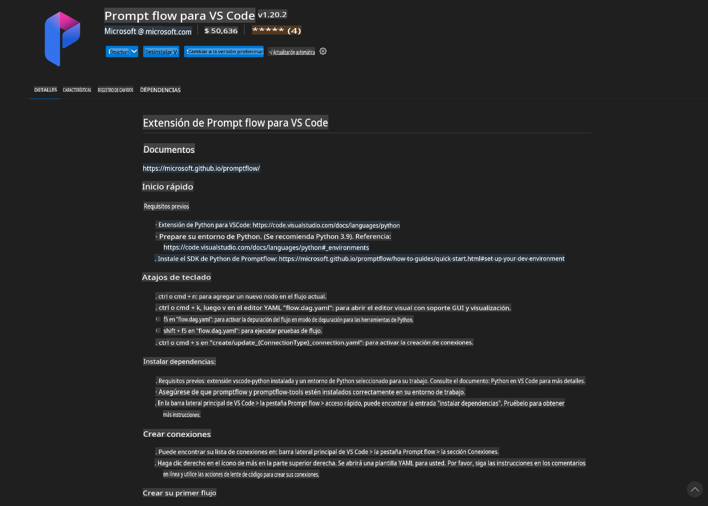
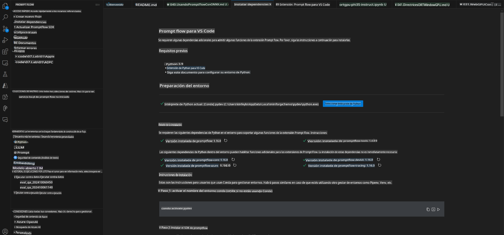
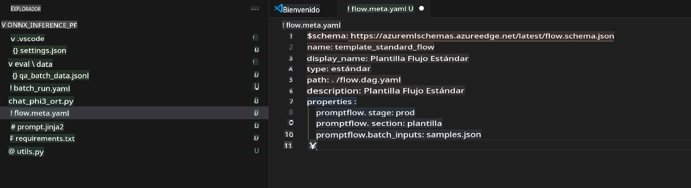
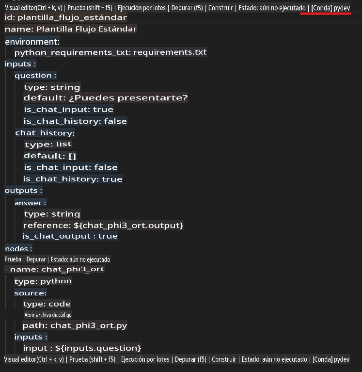
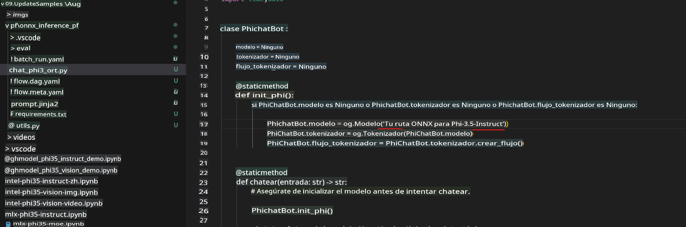
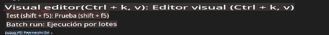
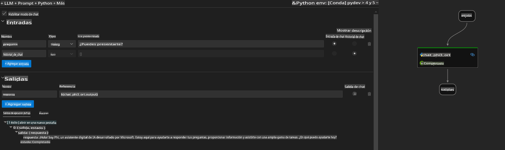
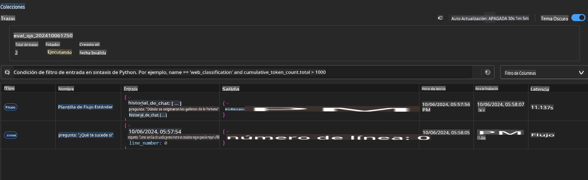

# Usar GPU de Windows para crear una solución Prompt flow con Phi-3.5-Instruct ONNX 

El siguiente documento es un ejemplo de cómo usar PromptFlow con ONNX (Open Neural Network Exchange) para desarrollar aplicaciones de IA basadas en modelos Phi-3.

PromptFlow es un conjunto de herramientas de desarrollo diseñado para simplificar el ciclo completo de desarrollo de aplicaciones de IA basadas en LLM (Modelos de Lenguaje a Gran Escala), desde la ideación y el prototipado hasta las pruebas y la evaluación.

Al integrar PromptFlow con ONNX, los desarrolladores pueden:

- Optimizar el Rendimiento del Modelo: Aprovechar ONNX para una inferencia y despliegue de modelos más eficientes.
- Simplificar el Desarrollo: Utilizar PromptFlow para gestionar el flujo de trabajo y automatizar tareas repetitivas.
- Mejorar la Colaboración: Facilitar una mejor colaboración entre los miembros del equipo proporcionando un entorno de desarrollo unificado.

**Prompt flow** es un conjunto de herramientas de desarrollo diseñado para simplificar el ciclo completo de desarrollo de aplicaciones de IA basadas en LLM, desde la ideación, el prototipado, las pruebas, la evaluación, hasta el despliegue en producción y el monitoreo. Facilita enormemente la ingeniería de prompts y te permite construir aplicaciones LLM con calidad de producción.

Prompt flow puede conectarse a OpenAI, Azure OpenAI Service y modelos personalizables (Huggingface, LLM/SLM locales). Esperamos desplegar el modelo ONNX cuantizado de Phi-3.5 en aplicaciones locales. Prompt flow puede ayudarnos a planificar mejor nuestro negocio y completar soluciones locales basadas en Phi-3.5. En este ejemplo, combinaremos la biblioteca ONNX Runtime GenAI para completar la solución Prompt flow basada en GPU de Windows.

## **Instalación**

### **ONNX Runtime GenAI para GPU de Windows**

Lee esta guía para configurar ONNX Runtime GenAI para GPU de Windows [haz clic aquí](./ORTWindowGPUGuideline.md)

### **Configurar Prompt flow en VSCode**

1. Instala la extensión Prompt flow para VS Code



2. Después de instalar la extensión Prompt flow para VS Code, haz clic en la extensión y selecciona **Installation dependencies**. Sigue esta guía para instalar el SDK de Prompt flow en tu entorno.



3. Descarga [Código de Ejemplo](../../../../../../code/09.UpdateSamples/Aug/pf/onnx_inference_pf) y usa VS Code para abrir este ejemplo.



4. Abre **flow.dag.yaml** para elegir tu entorno de Python.



   Abre **chat_phi3_ort.py** para cambiar la ubicación de tu modelo Phi-3.5-Instruct ONNX.



5. Ejecuta tu flujo de prompts para realizar pruebas.

Abre **flow.dag.yaml** y haz clic en el editor visual.



Después de hacer clic aquí, ejecútalo para realizar pruebas.



1. Puedes ejecutar un lote en la terminal para verificar más resultados.

```bash

pf run create --file batch_run.yaml --stream --name 'Your eval qa name'    

```

Puedes verificar los resultados en tu navegador predeterminado.



**Descargo de responsabilidad**:  
Este documento ha sido traducido utilizando servicios de traducción automática basados en inteligencia artificial. Si bien nos esforzamos por garantizar la precisión, tenga en cuenta que las traducciones automatizadas pueden contener errores o inexactitudes. El documento original en su idioma nativo debe considerarse como la fuente autorizada. Para información crítica, se recomienda una traducción profesional realizada por humanos. No nos hacemos responsables de malentendidos o interpretaciones erróneas que puedan surgir del uso de esta traducción.