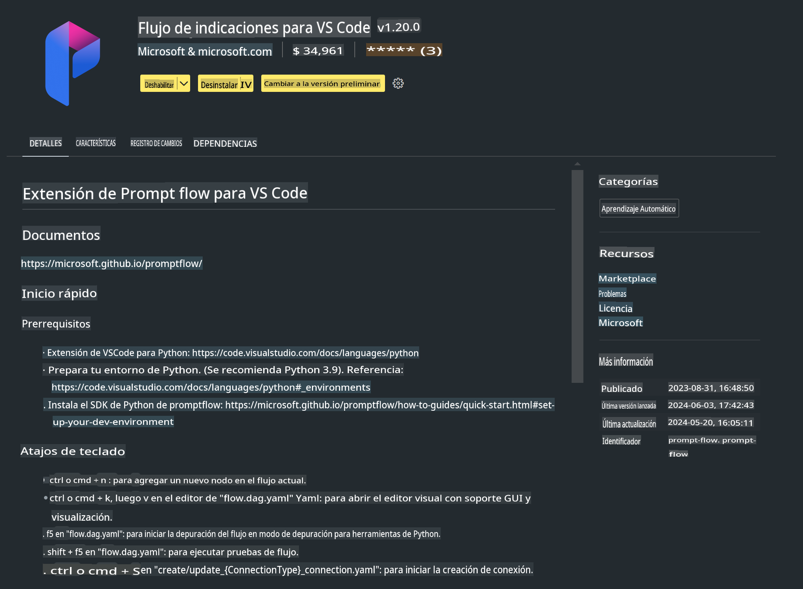

# **Lab 0 - Instalación**

Cuando ingresamos al laboratorio, necesitamos configurar el entorno correspondiente:

### **1. Python 3.11+**

Se recomienda usar miniforge para configurar tu entorno de Python.

Para configurar miniforge, consulta [https://github.com/conda-forge/miniforge](https://github.com/conda-forge/miniforge)

Después de configurar miniforge, ejecuta el siguiente comando en Power Shell:

```bash

conda create -n pyenv python==3.11.8 -y

conda activate pyenv

```

### **2. Instalar Prompt flow SDK**

En el Lab 1, utilizamos Prompt flow, por lo que necesitas configurar el Prompt flow SDK.

```bash

pip install promptflow --upgrade

```

Puedes verificar el SDK de promptflow con este comando:

```bash

pf --version

```

### **3. Instalar la Extensión Prompt flow para Visual Studio Code**



### **4. Biblioteca de Aceleración NPU de Intel**

Los procesadores de nueva generación de Intel son compatibles con NPU. Si deseas usar NPU para ejecutar LLMs / SLMs localmente, puedes utilizar la ***Biblioteca de Aceleración NPU de Intel***. Si quieres saber más, puedes leer [https://github.com/microsoft/PhiCookBook/blob/main/md/01.Introduction/03/AIPC_Inference.md](https://github.com/microsoft/PhiCookBook/blob/main/md/01.Introduction/03/AIPC_Inference.md).

Instala la Biblioteca de Aceleración NPU de Intel en bash:

```bash

pip install intel-npu-acceleration-library

```

***Nota***: Ten en cuenta que esta biblioteca es compatible con transformers ***4.40.2***. Por favor, confirma la versión.

### **5. Otras Bibliotecas de Python**

Crea un archivo requirements.txt y añade este contenido:

```txt

notebook
numpy 
scipy 
scikit-learn 
matplotlib 
pandas 
pillow 
graphviz

```

### **6. Instalar NVM**

Instala nvm en Powershell:

```bash

winget install -e --id CoreyButler.NVMforWindows

```

Instala nodejs 18.20:

```bash

nvm install 18.20.0

nvm use 18.20.0

```

### **7. Instalar Soporte de Desarrollo para Visual Studio Code**

```bash

npm install --global yo generator-code

```

¡Felicidades! Has configurado el SDK exitosamente. A continuación, procede con los pasos prácticos.

**Descargo de responsabilidad**:  
Este documento ha sido traducido utilizando servicios de traducción automática basados en inteligencia artificial. Si bien nos esforzamos por lograr precisión, tenga en cuenta que las traducciones automatizadas pueden contener errores o imprecisiones. El documento original en su idioma nativo debe considerarse la fuente autorizada. Para información crítica, se recomienda una traducción profesional realizada por humanos. No nos hacemos responsables de malentendidos o interpretaciones erróneas que puedan surgir del uso de esta traducción.