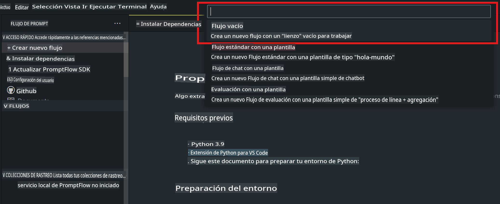
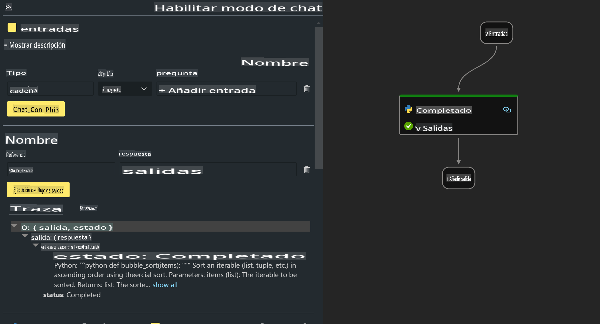

# **Lab 2 - Ejecutar Prompt flow con Phi-3-mini en AIPC**

## **Qué es Prompt flow**

Prompt flow es un conjunto de herramientas de desarrollo diseñadas para simplificar el ciclo completo de desarrollo de aplicaciones de IA basadas en LLM, desde la ideación, creación de prototipos, pruebas, evaluación hasta la implementación en producción y el monitoreo. Facilita enormemente la ingeniería de prompts y te permite construir aplicaciones de LLM con calidad de producción.

Con Prompt flow, podrás:

- Crear flujos que conecten LLMs, prompts, código Python y otras herramientas en un flujo de trabajo ejecutable.

- Depurar e iterar tus flujos, especialmente la interacción con los LLMs, de manera sencilla.

- Evaluar tus flujos, calcular métricas de calidad y rendimiento con conjuntos de datos más grandes.

- Integrar las pruebas y evaluaciones en tu sistema CI/CD para garantizar la calidad de tu flujo.

- Implementar tus flujos en la plataforma de servicio que elijas o integrarlos fácilmente en el código base de tu aplicación.

- (Opcional pero altamente recomendado) Colaborar con tu equipo aprovechando la versión en la nube de Prompt flow en Azure AI.

## **Qué es AIPC**

Un PC de IA cuenta con un CPU, un GPU y un NPU, cada uno con capacidades específicas de aceleración de IA. Un NPU, o unidad de procesamiento neuronal, es un acelerador especializado que maneja tareas de inteligencia artificial (IA) y aprendizaje automático (ML) directamente en tu PC, en lugar de enviar los datos para ser procesados en la nube. Aunque el GPU y el CPU también pueden procesar estas cargas de trabajo, el NPU es especialmente eficaz en cálculos de IA de bajo consumo. El PC de IA representa un cambio fundamental en cómo operan nuestras computadoras. No es una solución para un problema que no existía antes. En su lugar, promete ser una gran mejora para los usos cotidianos de las PC.

¿Cómo funciona? Comparado con la IA generativa y los modelos de lenguaje masivos (LLMs) entrenados con grandes cantidades de datos públicos, la IA que se ejecutará en tu PC es más accesible en casi todos los niveles. El concepto es más fácil de comprender, y al estar entrenada con tus datos, sin necesidad de acceder a la nube, los beneficios son más atractivos de manera inmediata para un público más amplio.

A corto plazo, el mundo del PC de IA implica asistentes personales y modelos de IA más pequeños que se ejecutan directamente en tu PC, utilizando tus datos para ofrecer mejoras de IA personales, privadas y más seguras para actividades que ya realizas a diario: tomar notas de reuniones, organizar una liga de fútbol de fantasía, automatizar mejoras en la edición de fotos y videos, o planificar el itinerario perfecto para una reunión familiar basado en los horarios de llegada y salida de todos.

## **Construcción de flujos de generación de código en AIPC**

***Nota***: Si no has completado la instalación del entorno, visita [Lab 0 - Instalaciones](./01.Installations.md)

1. Abre la extensión de Prompt flow en Visual Studio Code y crea un proyecto de flujo vacío.



2. Agrega parámetros de Entrada y Salida y añade código Python como un nuevo flujo.



Puedes referenciar esta estructura (flow.dag.yaml) para construir tu flujo.

```yaml

inputs:
  question:
    type: string
    default: how to write Bubble Algorithm
outputs:
  answer:
    type: string
    reference: ${Chat_With_Phi3.output}
nodes:
- name: Chat_With_Phi3
  type: python
  source:
    type: code
    path: Chat_With_Phi3.py
  inputs:
    question: ${inputs.question}


```

3. Agrega el código en ***Chat_With_Phi3.py***.

```python


from promptflow.core import tool

# import torch
from transformers import AutoTokenizer, pipeline,TextStreamer
import intel_npu_acceleration_library as npu_lib

import warnings

import asyncio
import platform

class Phi3CodeAgent:
    
    model = None
    tokenizer = None
    text_streamer = None
    
    model_id = "microsoft/Phi-3-mini-4k-instruct"

    @staticmethod
    def init_phi3():
        
        if Phi3CodeAgent.model is None or Phi3CodeAgent.tokenizer is None or Phi3CodeAgent.text_streamer is None:
            Phi3CodeAgent.model = npu_lib.NPUModelForCausalLM.from_pretrained(
                                    Phi3CodeAgent.model_id,
                                    torch_dtype="auto",
                                    dtype=npu_lib.int4,
                                    trust_remote_code=True
                                )
            Phi3CodeAgent.tokenizer = AutoTokenizer.from_pretrained(Phi3CodeAgent.model_id)
            Phi3CodeAgent.text_streamer = TextStreamer(Phi3CodeAgent.tokenizer, skip_prompt=True)

    

    @staticmethod
    def chat_with_phi3(prompt):
        
        Phi3CodeAgent.init_phi3()

        messages = "<|system|>You are a AI Python coding assistant. Please help me to generate code in Python.The answer only genertated Python code, but any comments and instructions do not need to be generated<|end|><|user|>" + prompt +"<|end|><|assistant|>"


        generation_args = {
            "max_new_tokens": 1024,
            "return_full_text": False,
            "temperature": 0.3,
            "do_sample": False,
            "streamer": Phi3CodeAgent.text_streamer,
        }

        pipe = pipeline(
            "text-generation",
            model=Phi3CodeAgent.model,
            tokenizer=Phi3CodeAgent.tokenizer,
            # **generation_args
        )

        result = ''

        with warnings.catch_warnings():
            warnings.simplefilter("ignore")
            response = pipe(messages, **generation_args)
            result =response[0]['generated_text']
            return result


@tool
def my_python_tool(question: str) -> str:
    if platform.system() == 'Windows':
        asyncio.set_event_loop_policy(asyncio.WindowsSelectorEventLoopPolicy())
    return Phi3CodeAgent.chat_with_phi3(question)


```

4. Puedes probar el flujo desde Debug o Run para verificar si la generación de código funciona correctamente.


5. Ejecuta el flujo como API de desarrollo en la terminal.

```

pf flow serve --source ./ --port 8080 --host localhost   

```

Puedes probarlo en Postman / Thunder Client.

### **Nota**

1. La primera ejecución toma mucho tiempo. Se recomienda descargar el modelo phi-3 desde Hugging Face CLI.

2. Considerando la potencia de cálculo limitada del Intel NPU, se recomienda usar Phi-3-mini-4k-instruct.

3. Usamos la aceleración del Intel NPU para la conversión cuantizada a INT4, pero si vuelves a ejecutar el servicio, necesitas eliminar las carpetas cache y nc_workshop.

## **Recursos**

1. Aprende sobre Promptflow [https://microsoft.github.io/promptflow/](https://microsoft.github.io/promptflow/)

2. Aprende sobre la aceleración Intel NPU [https://github.com/intel/intel-npu-acceleration-library](https://github.com/intel/intel-npu-acceleration-library)

3. Código de ejemplo, descarga [Código de ejemplo del agente NPU local](../../../../../../../../../code/07.Lab/01/AIPC)

**Descargo de responsabilidad**:  
Este documento ha sido traducido utilizando servicios de traducción automática basados en inteligencia artificial. Si bien nos esforzamos por garantizar la precisión, tenga en cuenta que las traducciones automáticas pueden contener errores o imprecisiones. El documento original en su idioma nativo debe considerarse como la fuente autorizada. Para información crítica, se recomienda una traducción profesional realizada por humanos. No nos hacemos responsables de malentendidos o interpretaciones erróneas que surjan del uso de esta traducción.