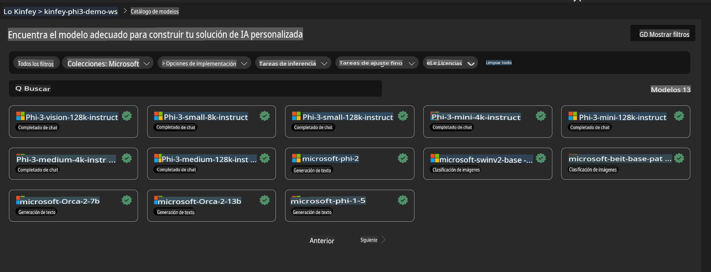
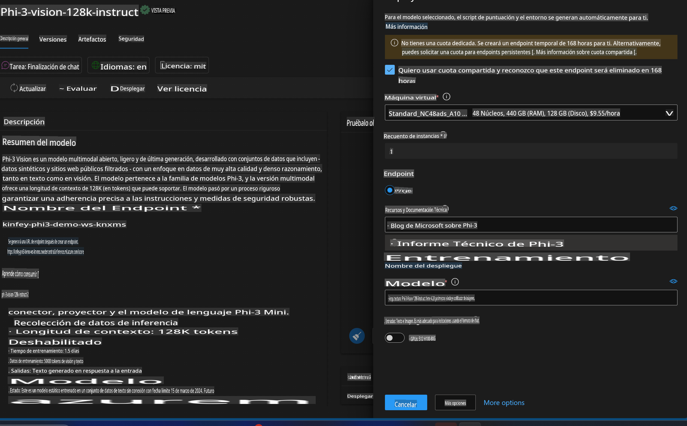
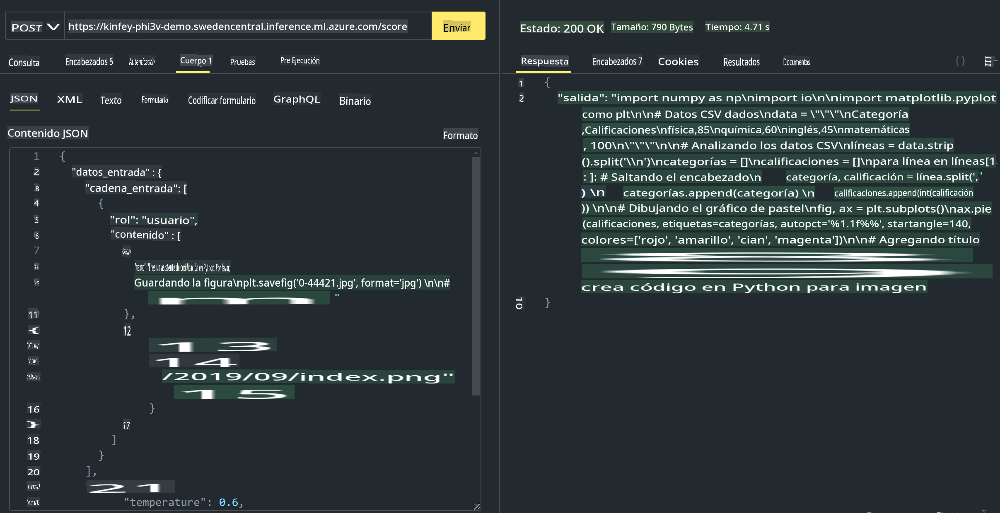

# **Lab 3 - Implementar Phi-3-Vision en Azure Machine Learning Service**

Usamos NPU para completar el despliegue de código local en producción y, posteriormente, queremos introducir la capacidad de integrar PHI-3-VISION a través de este para generar código a partir de imágenes.

En esta introducción, aprenderemos a construir rápidamente un servicio Phi-3 Vision como modelo como servicio (Model As Service) en Azure Machine Learning Service.

***Nota***: Phi-3 Vision requiere potencia computacional para generar contenido a mayor velocidad. Necesitamos computación en la nube para ayudarnos a lograr esto.

### **1. Crear Azure Machine Learning Service**

Es necesario crear un Azure Machine Learning Service en el portal de Azure. Si deseas aprender cómo hacerlo, por favor visita este enlace [https://learn.microsoft.com/azure/machine-learning/quickstart-create-resources?view=azureml-api-2](https://learn.microsoft.com/azure/machine-learning/quickstart-create-resources?view=azureml-api-2)

### **2. Seleccionar Phi-3 Vision en Azure Machine Learning Service**



### **3. Implementar Phi-3-Vision en Azure**



### **4. Probar el Endpoint en Postman**



***Nota***

1. Los parámetros que se deben enviar deben incluir Authorization, azureml-model-deployment y Content-Type. Es necesario consultar la información del despliegue para obtenerlos.

2. Para enviar parámetros, Phi-3-Vision necesita un enlace de imagen. Por favor, consulta el método de GPT-4-Vision para enviar parámetros, como:

```json

{
  "input_data":{
    "input_string":[
      {
        "role":"user",
        "content":[ 
          {
            "type": "text",
            "text": "You are a Python coding assistant.Please create Python code for image "
          },
          {
              "type": "image_url",
              "image_url": {
                "url": "https://ajaytech.co/wp-content/uploads/2019/09/index.png"
              }
          }
        ]
      }
    ],
    "parameters":{
          "temperature": 0.6,
          "top_p": 0.9,
          "do_sample": false,
          "max_new_tokens": 2048
    }
  }
}

```

3. Llama al endpoint **/score** utilizando el método Post.

**¡Felicidades!** Has completado el despliegue rápido de PHI-3-VISION y has probado cómo usar imágenes para generar código. A continuación, podemos construir aplicaciones combinando NPUs y la nube.

**Descargo de responsabilidad**:  
Este documento ha sido traducido utilizando servicios de traducción automática basados en inteligencia artificial. Si bien nos esforzamos por garantizar la precisión, tenga en cuenta que las traducciones automáticas pueden contener errores o imprecisiones. El documento original en su idioma nativo debe considerarse como la fuente autorizada. Para información crítica, se recomienda una traducción profesional realizada por humanos. No nos hacemos responsables por malentendidos o interpretaciones erróneas que surjan del uso de esta traducción.