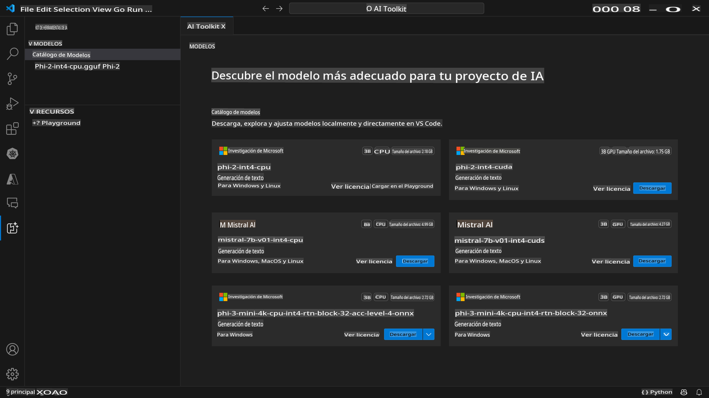
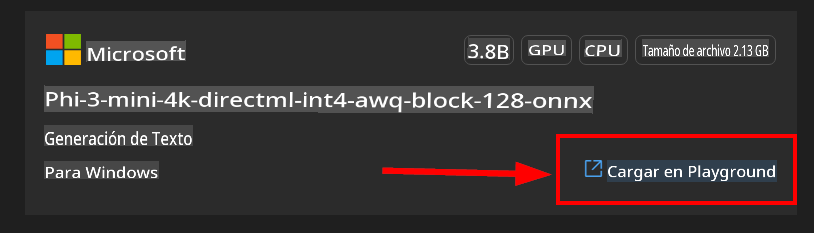

# AI Toolkit para VScode (Windows)

[AI Toolkit para VS Code](https://marketplace.visualstudio.com/items?itemName=ms-windows-ai-studio.windows-ai-studio) simplifica el desarrollo de aplicaciones de IA generativa al reunir herramientas de desarrollo de IA de vanguardia y modelos del Catálogo de Azure AI Studio y otros catálogos como Hugging Face. Podrás explorar el catálogo de modelos de IA impulsado por Azure ML y Hugging Face, descargarlos localmente, ajustarlos, probarlos y usarlos en tu aplicación.

AI Toolkit Preview se ejecutará localmente. Dependiendo del modelo que selecciones, algunas tareas solo tienen soporte en Windows y Linux.

Para la inferencia o ajuste local, dependiendo del modelo que selecciones, puede que necesites tener una GPU como una NVIDIA CUDA GPU.

Si ejecutas remotamente, el recurso en la nube necesita tener una GPU, asegúrate de verificar tu entorno. Para la ejecución local en Windows + WSL, la distribución de WSL Ubuntu 18.4 o superior debe estar instalada y configurada como predeterminada antes de usar AI Toolkit.

## Comenzando

[Aprende más sobre cómo instalar el subsistema de Windows para Linux](https://learn.microsoft.com/windows/wsl/install?WT.mc_id=aiml-137032-kinfeylo)

y [cambiar la distribución predeterminada](https://learn.microsoft.com/windows/wsl/install#change-the-default-linux-distribution-installed).

[Repositorio de GitHub de AI Toolkit](https://github.com/microsoft/vscode-ai-toolkit/)

- Windows o Linux.
- **El soporte para MacOS llegará pronto**
- Para el ajuste en Windows y Linux, necesitarás una GPU Nvidia. Además, **Windows** requiere el subsistema para Linux con la distribución de Ubuntu 18.4 o superior. [Aprende más sobre cómo instalar el subsistema de Windows para Linux](https://learn.microsoft.com/windows/wsl/install) y [cambiar la distribución predeterminada](https://learn.microsoft.com/windows/wsl/install#change-the-default-linux-distribution-installed).

### Instalar AI Toolkit

AI Toolkit se distribuye como una [Extensión de Visual Studio Code](https://code.visualstudio.com/docs/setup/additional-components#_vs-code-extensions), por lo que necesitas instalar [VS Code](https://code.visualstudio.com/docs/setup/windows?WT.mc_id=aiml-137032-kinfeylo) primero, y descargar AI Toolkit desde el [VS Marketplace](https://marketplace.visualstudio.com/items?itemName=ms-windows-ai-studio.windows-ai-studio).
El [AI Toolkit está disponible en el Visual Studio Marketplace](https://marketplace.visualstudio.com/items?itemName=ms-windows-ai-studio.windows-ai-studio) y se puede instalar como cualquier otra extensión de VS Code.

Si no estás familiarizado con la instalación de extensiones de VS Code, sigue estos pasos:

### Iniciar sesión

1. En la Barra de Actividades en VS Code selecciona **Extensiones**
1. En la barra de búsqueda de Extensiones escribe "AI Toolkit"
1. Selecciona "AI Toolkit para Visual Studio code"
1. Selecciona **Instalar**

¡Ahora estás listo para usar la extensión!

Se te pedirá que inicies sesión en GitHub, así que haz clic en "Permitir" para continuar. Serás redirigido a la página de inicio de sesión de GitHub.

Inicia sesión y sigue los pasos del proceso. Después de completar exitosamente, serás redirigido a VS Code.

Una vez que la extensión se haya instalado, verás el ícono de AI Toolkit aparecer en tu Barra de Actividades.

¡Vamos a explorar las acciones disponibles!

### Acciones Disponibles

La barra lateral principal de AI Toolkit está organizada en

- **Modelos**
- **Recursos**
- **Playground**
- **Ajuste fino**

Están disponibles en la sección de Recursos. Para comenzar, selecciona **Catálogo de Modelos**.

### Descargar un modelo del catálogo

Al lanzar AI Toolkit desde la barra lateral de VS Code, puedes seleccionar entre las siguientes opciones:



- Encuentra un modelo compatible en el **Catálogo de Modelos** y descárgalo localmente
- Prueba la inferencia del modelo en el **Model Playground**
- Ajusta el modelo localmente o remotamente en **Model Fine-tuning**
- Despliega modelos ajustados a la nube a través de la paleta de comandos para AI Toolkit

> [!NOTE]
>
> **GPU Vs CPU**
>
> Notarás que las tarjetas de modelo muestran el tamaño del modelo, la plataforma y el tipo de acelerador (CPU, GPU). Para un rendimiento optimizado en **dispositivos Windows que tienen al menos una GPU**, selecciona versiones de modelos que solo apunten a Windows.
>
> Esto asegura que tengas un modelo optimizado para el acelerador DirectML.
>
> Los nombres de los modelos están en el formato de
>
> - `{model_name}-{accelerator}-{quantization}-{format}`.
>
>Para verificar si tienes una GPU en tu dispositivo Windows, abre **Administrador de Tareas** y luego selecciona la pestaña **Rendimiento**. Si tienes GPU(s), estarán listadas bajo nombres como "GPU 0" o "GPU 1".

### Ejecutar el modelo en el playground

Después de configurar todos los parámetros, haz clic en **Generate Project**.

Una vez que tu modelo se haya descargado, selecciona **Load in Playground** en la tarjeta del modelo en el catálogo:

- Inicia la descarga del modelo
- Instala todos los prerrequisitos y dependencias
- Crea el espacio de trabajo de VS Code



Cuando el modelo se haya descargado, puedes lanzar el proyecto desde AI Toolkit.

> ***Note*** Si quieres probar la función de vista previa para hacer inferencia o ajuste fino remotamente, sigue [esta guía](https://aka.ms/previewFinetune)

### Modelos Optimizados para Windows

Deberías ver la respuesta del modelo transmitida de vuelta a ti:

AI Toolkit ofrece una colección de modelos de IA disponibles públicamente ya optimizados para Windows. Los modelos se almacenan en diferentes ubicaciones, incluyendo Hugging Face, GitHub y otros, pero puedes explorar los modelos y encontrarlos todos en un solo lugar listos para descargar y usar en tu aplicación de Windows.


### Selecciones de Modelo

Si **no** tienes una **GPU** disponible en tu dispositivo *Windows* pero seleccionaste el

- modelo Phi-3-mini-4k-**directml**-int4-awq-block-128-onnx

la respuesta del modelo será *muy lenta*.

Deberías en su lugar descargar la versión optimizada para CPU:

- Phi-3-mini-4k-**cpu**-int4-rtn-block-32-acc-level-4-onnx.

También es posible cambiar:

**Instrucciones de Contexto:** Ayuda al modelo a entender el panorama general de tu solicitud. Esto podría ser información de fondo, ejemplos/demostraciones de lo que deseas o explicar el propósito de tu tarea.

**Parámetros de inferencia:**

- *Longitud máxima de respuesta*: El número máximo de tokens que el modelo devolverá.
- *Temperatura*: La temperatura del modelo es un parámetro que controla cuán aleatoria es la salida de un modelo de lenguaje. Una temperatura más alta significa que el modelo toma más riesgos, dándote una mezcla diversa de palabras. Por otro lado, una temperatura más baja hace que el modelo juegue a lo seguro, apegándose a respuestas más enfocadas y predecibles.
- *Top P*: También conocido como muestreo de núcleo, es una configuración que controla cuántas palabras o frases posibles considera el modelo de lenguaje al predecir la siguiente palabra.
- *Penalización de frecuencia*: Este parámetro influye en la frecuencia con la que el modelo repite palabras o frases en su salida. Un valor más alto (más cercano a 1.0) anima al modelo a *evitar* repetir palabras o frases.
- *Penalización de presencia*: Este parámetro se utiliza en modelos de IA generativa para fomentar la diversidad y especificidad en el texto generado. Un valor más alto (más cercano a 1.0) anima al modelo a incluir más tokens novedosos y diversos. Un valor más bajo es más probable que el modelo genere frases comunes o clichés.

### Usar la API REST en tu aplicación

AI Toolkit viene con un servidor web local de API REST **en el puerto 5272** que utiliza el [formato de completaciones de chat de OpenAI](https://platform.openai.com/docs/api-reference/chat/create).

Esto te permite probar tu aplicación localmente sin tener que depender de un servicio de modelo de IA en la nube. Por ejemplo, el siguiente archivo JSON muestra cómo configurar el cuerpo de la solicitud:

```json
{
    "model": "Phi-3-mini-4k-directml-int4-awq-block-128-onnx",
    "messages": [
        {
            "role": "user",
            "content": "¿qué es la proporción áurea?"
        }
    ],
    "temperature": 0.7,
    "top_p": 1,
    "top_k": 10,
    "max_tokens": 100,
    "stream": true
}
```

Puedes probar la API REST usando (por ejemplo) [Postman](https://www.postman.com/) o la utilidad CURL (Client URL):

```bash
curl -vX POST http://127.0.0.1:5272/v1/chat/completions -H 'Content-Type: application/json' -d @body.json
```

### Usar la biblioteca cliente de OpenAI para Python

```python
from openai import OpenAI

client = OpenAI(
    base_url="http://127.0.0.1:5272/v1/", 
    api_key="x" # requerido para la API pero no usado
)

chat_completion = client.chat.completions.create(
    messages=[
        {
            "role": "user",
            "content": "¿qué es la proporción áurea?",
        }
    ],
    model="Phi-3-mini-4k-cuda-int4-onnx",
)

print(chat_completion.choices[0].message.content)
```

### Usar la biblioteca cliente de Azure OpenAI para .NET

Añade la [biblioteca cliente de Azure OpenAI para .NET](https://www.nuget.org/packages/Azure.AI.OpenAI/) a tu proyecto usando NuGet:

```bash
dotnet add {project_name} package Azure.AI.OpenAI --version 1.0.0-beta.17
```

Añade un archivo C# llamado **OverridePolicy.cs** a tu proyecto y pega el siguiente código:

```csharp
// OverridePolicy.cs
using Azure.Core.Pipeline;
using Azure.Core;

internal partial class OverrideRequestUriPolicy(Uri overrideUri)
    : HttpPipelineSynchronousPolicy
{
    private readonly Uri _overrideUri = overrideUri;

    public override void OnSendingRequest(HttpMessage message)
    {
        message.Request.Uri.Reset(_overrideUri);
    }
}
```

Luego, pega el siguiente código en tu archivo **Program.cs**:

```csharp
// Program.cs
using Azure.AI.OpenAI;

Uri localhostUri = new("http://localhost:5272/v1/chat/completions");

OpenAIClientOptions clientOptions = new();
clientOptions.AddPolicy(
    new OverrideRequestUriPolicy(localhostUri),
    Azure.Core.HttpPipelinePosition.BeforeTransport);
OpenAIClient client = new(openAIApiKey: "unused", clientOptions);

ChatCompletionsOptions options = new()
{
    DeploymentName = "Phi-3-mini-4k-directml-int4-awq-block-128-onnx",
    Messages =
    {
        new ChatRequestSystemMessage("Eres un asistente útil. Sé breve y conciso."),
        new ChatRequestUserMessage("¿Qué es la proporción áurea?"),
    }
};

StreamingResponse<StreamingChatCompletionsUpdate> streamingChatResponse
    = await client.GetChatCompletionsStreamingAsync(options);

await foreach (StreamingChatCompletionsUpdate chatChunk in streamingChatResponse)
{
    Console.Write(chatChunk.ContentUpdate);
}
```

## Ajuste Fino con AI Toolkit

- Comienza con el descubrimiento de modelos y el playground.
- Ajuste fino e inferencia de modelos usando recursos de computación locales.
- Ajuste fino e inferencia remotos usando recursos de Azure

[Ajuste Fino con AI Toolkit](../04.Fine-tuning/Finetuning_VSCodeaitoolkit.md)

## Recursos de Preguntas y Respuestas de AI Toolkit

Consulta nuestra [página de preguntas y respuestas](https://github.com/microsoft/vscode-ai-toolkit/blob/main/QA.md) para los problemas más comunes y sus soluciones.

Aviso legal: La traducción fue realizada a partir de su original por un modelo de IA y puede no ser perfecta. Por favor, revise el resultado y haga las correcciones necesarias.