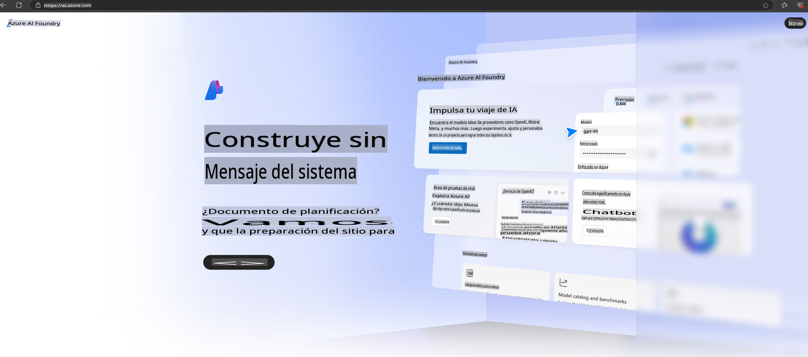

# **Usando Phi-3 en Azure AI Foundry**

Con el desarrollo de la IA Generativa, esperamos utilizar una plataforma unificada para gestionar diferentes LLM y SLM, integrar datos empresariales, realizar operaciones de ajuste fino/RAG, y evaluar diferentes negocios empresariales tras integrar LLM y SLM, entre otros, para que las aplicaciones inteligentes de IA generativa se implementen de manera más eficiente. [Azure AI Foundry](https://ai.azure.com) es una plataforma empresarial para aplicaciones de IA generativa.

Con Azure AI Foundry, puedes evaluar las respuestas de los modelos de lenguaje grande (LLM) y orquestar componentes de aplicación de prompts con "prompt flow" para obtener un mejor rendimiento. La plataforma facilita la escalabilidad para transformar pruebas de concepto en producciones completas de manera sencilla. El monitoreo continuo y la mejora garantizan el éxito a largo plazo.

Podemos desplegar rápidamente el modelo Phi-3 en Azure AI Foundry a través de pasos simples, y luego usar Azure AI Foundry para completar trabajos relacionados con Phi-3, como Playground/Chat, ajuste fino, evaluación y otros.

## **1. Preparación**

Si ya tienes instalado el [Azure Developer CLI](https://learn.microsoft.com/azure/developer/azure-developer-cli/overview?WT.mc_id=aiml-138114-kinfeylo) en tu máquina, usar esta plantilla es tan simple como ejecutar este comando en un nuevo directorio.

## Creación Manual

Crear un proyecto y un hub en Microsoft Azure AI Foundry es una excelente manera de organizar y gestionar tu trabajo en IA. Aquí tienes una guía paso a paso para comenzar:

### Creación de un Proyecto en Azure AI Foundry

1. **Ir a Azure AI Foundry**: Inicia sesión en el portal de Azure AI Foundry.
2. **Crear un Proyecto**:
   - Si estás dentro de un proyecto, selecciona "Azure AI Foundry" en la parte superior izquierda de la página para ir a la página principal.
   - Selecciona "+ Crear proyecto".
   - Ingresa un nombre para el proyecto.
   - Si tienes un hub, se seleccionará por defecto. Si tienes acceso a más de un hub, puedes seleccionar uno diferente del menú desplegable. Si deseas crear un nuevo hub, selecciona "Crear nuevo hub" y proporciona un nombre.
   - Selecciona "Crear".

### Creación de un Hub en Azure AI Foundry

1. **Ir a Azure AI Foundry**: Inicia sesión con tu cuenta de Azure.
2. **Crear un Hub**:
   - Selecciona el Centro de gestión desde el menú izquierdo.
   - Selecciona "Todos los recursos", luego la flecha hacia abajo junto a "+ Nuevo proyecto" y selecciona "+ Nuevo hub".
   - En el cuadro de diálogo "Crear un nuevo hub", ingresa un nombre para tu hub (por ejemplo, contoso-hub) y modifica los otros campos según sea necesario.
   - Selecciona "Siguiente", revisa la información y luego selecciona "Crear".

Para obtener instrucciones más detalladas, puedes consultar la [documentación oficial de Microsoft](https://learn.microsoft.com/azure/ai-studio/how-to/create-projects).

Después de una creación exitosa, puedes acceder al estudio que creaste a través de [ai.azure.com](https://ai.azure.com/)

Puede haber múltiples proyectos en un AI Foundry. Crea un proyecto en AI Foundry para prepararte.

Crea Azure AI Foundry [QuickStarts](https://learn.microsoft.com/azure/ai-studio/quickstarts/get-started-code)

## **2. Desplegar un modelo Phi en Azure AI Foundry**

Haz clic en la opción Explorar del proyecto para ingresar al Catálogo de Modelos y selecciona Phi-3.

Selecciona Phi-3-mini-4k-instruct.

Haz clic en 'Deploy' para desplegar el modelo Phi-3-mini-4k-instruct.

> [!NOTE]
>
> Puedes seleccionar la capacidad de cómputo al desplegar.

## **3. Chat Playground con Phi en Azure AI Foundry**

Ve a la página de despliegue, selecciona Playground y chatea con Phi-3 en Azure AI Foundry.

## **4. Desplegar el Modelo desde Azure AI Foundry**

Para desplegar un modelo desde el Catálogo de Modelos de Azure, puedes seguir estos pasos:

- Inicia sesión en Azure AI Foundry.
- Elige el modelo que deseas desplegar desde el catálogo de modelos de Azure AI Foundry.
- En la página de Detalles del modelo, selecciona Deploy y luego selecciona API sin servidor con Azure AI Content Safety.
- Selecciona el proyecto en el que deseas desplegar tus modelos. Para usar la oferta de API sin servidor, tu espacio de trabajo debe pertenecer a la región East US 2 o Sweden Central. Puedes personalizar el nombre del despliegue.
- En el asistente de despliegue, selecciona Pricing and terms para conocer los precios y términos de uso.
- Selecciona Deploy. Espera hasta que el despliegue esté listo y seas redirigido a la página de Despliegues.
- Selecciona Open in playground para comenzar a interactuar con el modelo.
- Puedes regresar a la página de Despliegues, seleccionar el despliegue y anotar la URL del endpoint objetivo y la Clave Secreta, que puedes usar para llamar al despliegue y generar respuestas.
- Siempre puedes encontrar los detalles del endpoint, URL y claves de acceso navegando a la pestaña Build y seleccionando Deployments en la sección de Componentes.

> [!NOTE]
> Ten en cuenta que tu cuenta debe tener permisos de rol de Desarrollador de Azure AI en el Grupo de Recursos para realizar estos pasos.

## **5. Usar la API de Phi en Azure AI Foundry**

Puedes acceder a https://{Nombre de tu proyecto}.region.inference.ml.azure.com/swagger.json a través de una solicitud GET en Postman y combinarla con la clave para conocer las interfaces disponibles.

Puedes obtener los parámetros de solicitud de manera muy conveniente, así como los parámetros de respuesta.

**Descargo de responsabilidad**:  
Este documento ha sido traducido utilizando servicios de traducción automática basados en inteligencia artificial. Si bien nos esforzamos por lograr precisión, tenga en cuenta que las traducciones automatizadas pueden contener errores o imprecisiones. El documento original en su idioma nativo debe considerarse como la fuente autorizada. Para información crítica, se recomienda una traducción profesional realizada por humanos. No nos hacemos responsables de malentendidos o interpretaciones erróneas que puedan surgir del uso de esta traducción.