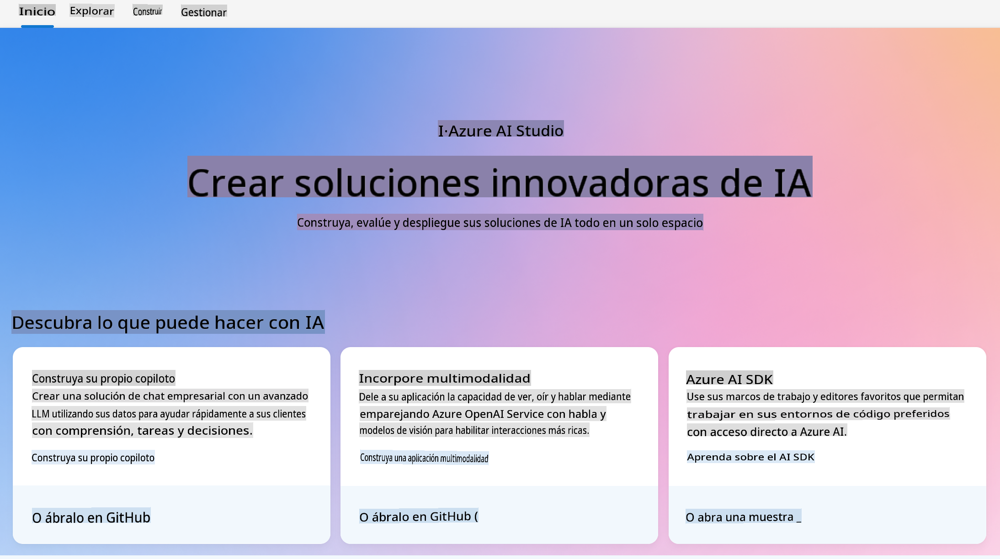
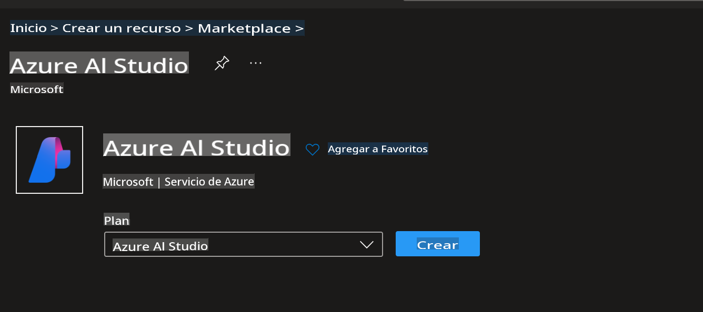
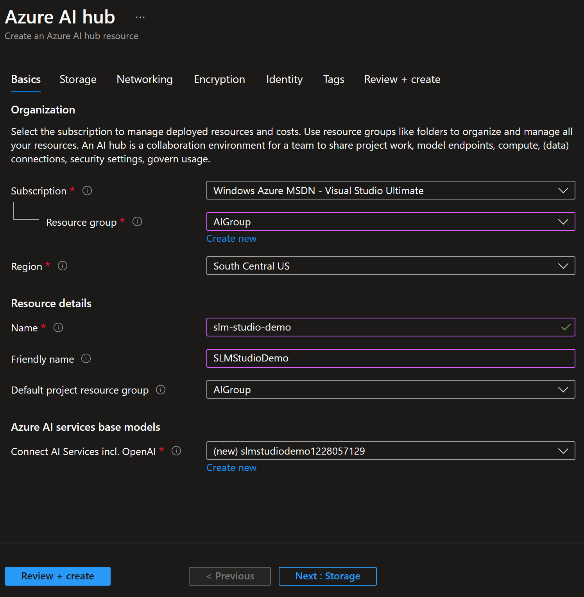
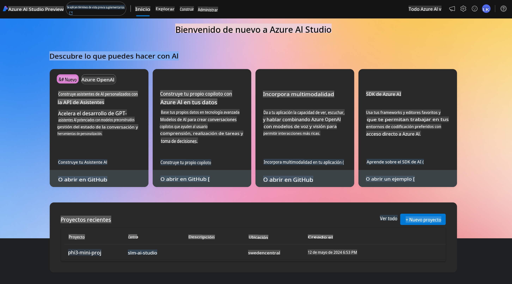
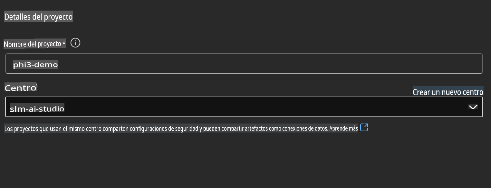
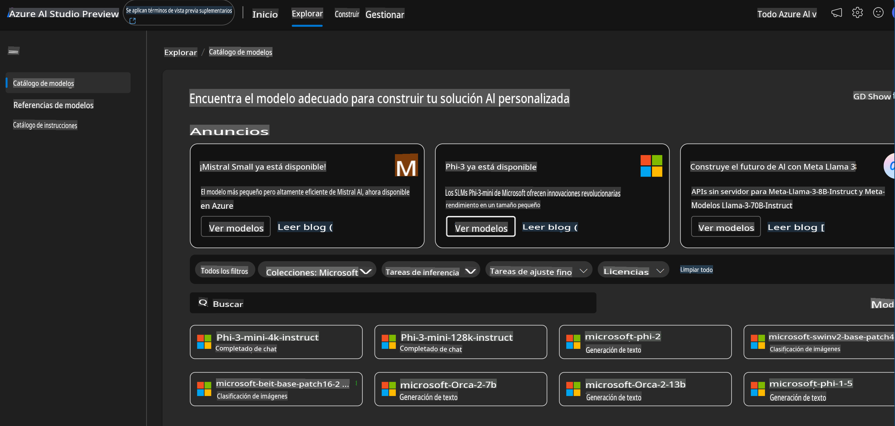
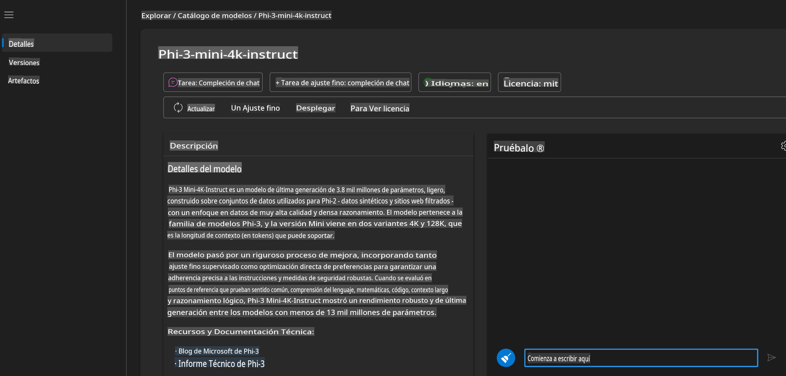
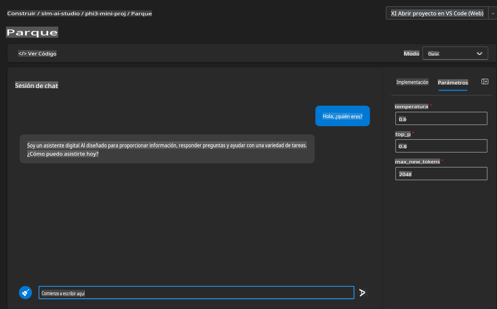
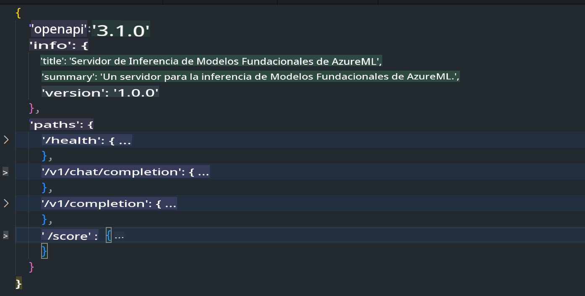
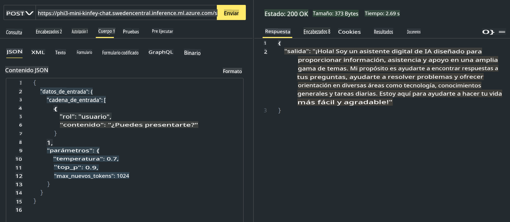

# **Uso de Phi-3 en Azure AI Studio**

Con el desarrollo de la IA Generativa, esperamos usar una plataforma unificada para gestionar diferentes LLM y SLM, integración de datos empresariales, operaciones de ajuste fino/RAG, y la evaluación de diferentes negocios empresariales después de integrar LLM y SLM, etc., para que las aplicaciones inteligentes de IA generativa se implementen mejor. [Azure AI Studio](https://ai.azure.com) es una plataforma de aplicaciones de IA generativa a nivel empresarial.



Con Azure AI Studio, puedes evaluar las respuestas de grandes modelos de lenguaje (LLM) y orquestar componentes de aplicación con flujo de prompts para un mejor rendimiento. La plataforma facilita la escalabilidad para transformar pruebas de concepto en producción completa con facilidad. El monitoreo continuo y la refinación apoyan el éxito a largo plazo.

Podemos desplegar rápidamente el modelo Phi-3 en Azure AI Studio a través de pasos simples, y luego usar Azure AI Studio para completar trabajos relacionados con Phi-3 como Playground/Chat, ajuste fino, evaluación y otros trabajos relacionados.

## **1. Preparación**

## [Plantilla de Inicio de AZD AI Studio](https://azure.github.io/awesome-azd/?name=AI+Studio)

### Inicio de Azure AI Studio

Esta es una plantilla Bicep que despliega todo lo que necesitas para comenzar con Azure AI Studio. Incluye AI Hub con recursos dependientes, proyecto de IA, Servicios de IA y un endpoint en línea.

### Uso Rápido

Si ya tienes el [CLI de Azure Developer](https://learn.microsoft.com/azure/developer/azure-developer-cli/overview?WT.mc_id=aiml-138114-kinfeylo) instalado en tu máquina, usar esta plantilla es tan simple como ejecutar este comando en un nuevo directorio.

### Comando de Terminal

```bash
azd init -t azd-aistudio-starter
```

O
Si usas la extensión de azd para VS Code, puedes pegar esta URL en la terminal de comandos de VS Code.

### URL de Terminal

```bash
azd-aistudio-starter
```

## Creación Manual

Crea Azure AI Studio en [Azure Portal](https://portal.azure.com?WT.mc_id=aiml-138114-kinfeylo)



Después de completar el nombrado del estudio y configurar la región, puedes crearlo.



Después de una creación exitosa, puedes acceder al estudio que creaste a través de [ai.azure.com](https://ai.azure.com/)



Puede haber múltiples proyectos en un AI Studio. Crea un proyecto en AI Studio para prepararte.



## **2. Desplegar el modelo Phi-3 en Azure AI Studio**

Haz clic en la opción Explorar del proyecto para entrar en el Catálogo de Modelos y selecciona Phi-3.



Selecciona Phi-3-mini-4k-instruct.



Haz clic en 'Deploy' para desplegar el modelo Phi-3-mini-4k-instruct.

> [!NOTE]
>
> Puedes seleccionar la potencia de cómputo al desplegar.

## **3. Playground Chat Phi-3 en Azure AI Studio**

Ve a la página de despliegue, selecciona Playground, y chatea con Phi-3 de Azure AI Studio.



## **4. Desplegar el Modelo desde Azure AI Studio**

Para desplegar un modelo desde el Catálogo de Modelos de Azure, puedes seguir estos pasos:

- Inicia sesión en Azure AI Studio.
- Elige el modelo que deseas desplegar desde el catálogo de modelos de Azure AI Studio.
- En la página de Detalles del modelo, selecciona Deploy y luego selecciona Serverless API con Azure AI Content Safety.
- Selecciona el proyecto en el que deseas desplegar tus modelos. Para usar la oferta de Serverless API, tu workspace debe pertenecer a la región East US 2 o Sweden Central. Puedes personalizar el nombre del Despliegue.
- En el asistente de despliegue, selecciona el Pricing and terms para conocer los precios y términos de uso.
- Selecciona Deploy. Espera hasta que el despliegue esté listo y seas redirigido a la página de Deployments.
- Selecciona Open in playground para comenzar a interactuar con el modelo.
- Puedes regresar a la página de Deployments, seleccionar el despliegue y anotar la URL del Target del endpoint y la Clave Secreta, que puedes usar para llamar al despliegue y generar completions.
- Siempre puedes encontrar los detalles del endpoint, la URL y las claves de acceso navegando a la pestaña Build y seleccionando Deployments en la sección de Components.

> [!NOTE]
> Ten en cuenta que tu cuenta debe tener permisos de rol de Azure AI Developer en el Grupo de Recursos para realizar estos pasos.

## **5. Usar la API de Phi-3 en Azure AI Studio**

Puedes acceder a https://{Tu nombre de proyecto}.region.inference.ml.azure.com/swagger.json a través de Postman GET y combinarlo con la Key para conocer las interfaces proporcionadas.



como acceder a la api de puntuación


Puedes obtener los parámetros de solicitud muy convenientemente, así como los parámetros de respuesta. Este es el resultado de Postman.



Aviso legal: La traducción fue realizada a partir de su original por un modelo de IA y puede no ser perfecta. 
Por favor, revise el resultado y haga las correcciones necesarias.