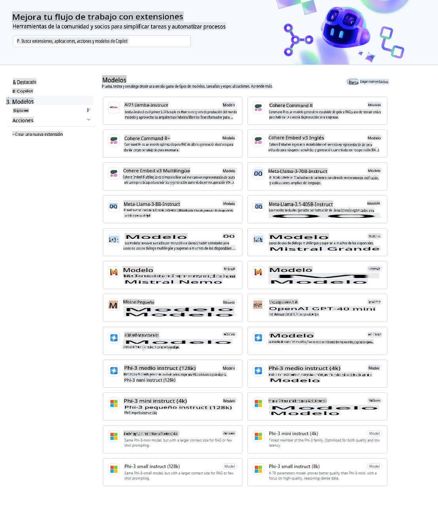
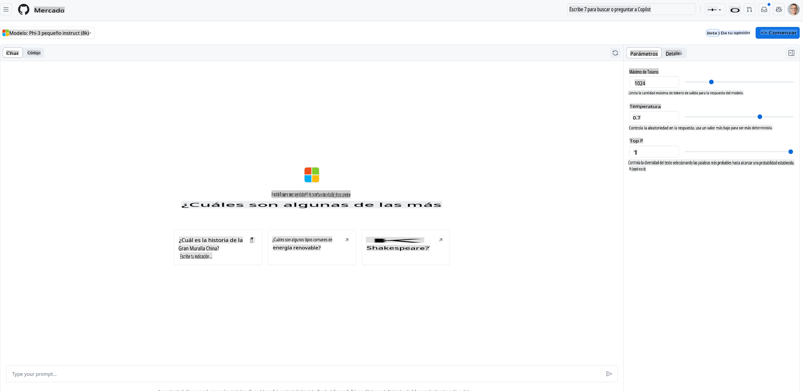
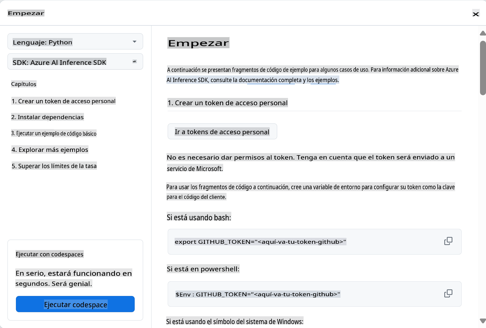
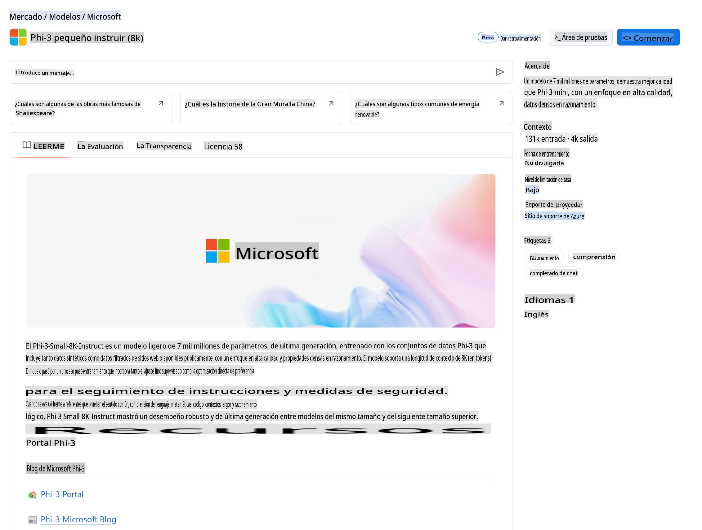

## Modelos de GitHub - Beta Público Limitado

¡Bienvenido a [Modelos de GitHub](https://github.com/marketplace/models)! Tenemos todo listo para que explores los Modelos de IA alojados en Azure AI.



Para más información sobre los Modelos disponibles en GitHub Models, visita el [GitHub Model Marketplace](https://github.com/marketplace/models)

## Modelos Disponibles

Cada modelo tiene un playground dedicado y código de ejemplo 



### Modelos Phi-3 en el Catálogo de Modelos de GitHub

[Phi-3-Medium-128k-Instruct](https://github.com/marketplace/models/azureml/Phi-3-medium-128k-instruct)

[Phi-3-medium-4k-instruct](https://github.com/marketplace/models/azureml/Phi-3-medium-4k-instruct)

[Phi-3-mini-128k-instruct](https://github.com/marketplace/models/azureml/Phi-3-mini-128k-instruct)

[Phi-3-mini-4k-instruct](https://github.com/marketplace/models/azureml/Phi-3-mini-4k-instruct)

[Phi-3-small-128k-instruct](https://github.com/marketplace/models/azureml/Phi-3-small-128k-instruct)

[Phi-3-small-8k-instruct](https://github.com/marketplace/models/azureml/Phi-3-small-8k-instruct)

## Primeros Pasos

Hay algunos ejemplos básicos que están listos para que los ejecutes. Puedes encontrarlos en el directorio de samples. Si quieres ir directamente a tu lenguaje favorito, puedes encontrar los ejemplos en los siguientes lenguajes:

- Python
- JavaScript
- cURL

También hay un entorno dedicado de Codespaces para ejecutar los ejemplos y modelos. 




## Código de Ejemplo 

A continuación se muestran fragmentos de código de ejemplo para algunos casos de uso. Para más información sobre Azure AI Inference SDK, consulta la documentación completa y los ejemplos.

## Configuración 

1. Crear un token de acceso personal
No necesitas dar permisos al token. Ten en cuenta que el token será enviado a un servicio de Microsoft.

Para usar los fragmentos de código a continuación, crea una variable de entorno para establecer tu token como la clave para el código del cliente.

Si estás usando bash:
```
export GITHUB_TOKEN="<tu-token-de-github>"
```
Si estás en powershell:

```
$Env:GITHUB_TOKEN="<tu-token-de-github>"
```

Si estás usando el símbolo del sistema de Windows:

```
set GITHUB_TOKEN=<tu-token-de-github>
```

## Ejemplo en Python

### Instalar dependencias
Instala el Azure AI Inference SDK usando pip (Requiere: Python >=3.8):

```
pip install azure-ai-inference
```
### Ejecutar un ejemplo básico de código

Este ejemplo demuestra una llamada básica a la API de finalización de chat. Está utilizando el endpoint de inferencia del modelo de GitHub AI y tu token de GitHub. La llamada es síncrona.

```
import os
from azure.ai.inference import ChatCompletionsClient
from azure.ai.inference.models import SystemMessage, UserMessage
from azure.core.credentials import AzureKeyCredential

endpoint = "https://models.inference.ai.azure.com"
# Reemplaza Model_Name 
model_name = "Phi-3-small-8k-instruct"
token = os.environ["GITHUB_TOKEN"]

client = ChatCompletionsClient(
    endpoint=endpoint,
    credential=AzureKeyCredential(token),
)

response = client.complete(
    messages=[
        SystemMessage(content="You are a helpful assistant."),
        UserMessage(content="What is the capital of France?"),
    ],
    model=model_name,
    temperature=1.,
    max_tokens=1000,
    top_p=1.
)

print(response.choices[0].message.content)
```

### Ejecutar una conversación de varios turnos

Este ejemplo demuestra una conversación de varios turnos con la API de finalización de chat. Al usar el modelo para una aplicación de chat, necesitarás gestionar el historial de esa conversación y enviar los últimos mensajes al modelo.

```
import os
from azure.ai.inference import ChatCompletionsClient
from azure.ai.inference.models import AssistantMessage, SystemMessage, UserMessage
from azure.core.credentials import AzureKeyCredential

token = os.environ["GITHUB_TOKEN"]
endpoint = "https://models.inference.ai.azure.com"
# Reemplaza Model_Name
model_name = "Phi-3-small-8k-instruct"

client = ChatCompletionsClient(
    endpoint=endpoint,
    credential=AzureKeyCredential(token),
)

messages = [
    SystemMessage(content="You are a helpful assistant."),
    UserMessage(content="What is the capital of France?"),
    AssistantMessage(content="The capital of France is Paris."),
    UserMessage(content="What about Spain?"),
]

response = client.complete(messages=messages, model=model_name)

print(response.choices[0].message.content)
```

### Transmitir la salida

Para una mejor experiencia de usuario, querrás transmitir la respuesta del modelo para que el primer token aparezca rápidamente y evites esperar por respuestas largas.

```
import os
from azure.ai.inference import ChatCompletionsClient
from azure.ai.inference.models import SystemMessage, UserMessage
from azure.core.credentials import AzureKeyCredential

token = os.environ["GITHUB_TOKEN"]
endpoint = "https://models.inference.ai.azure.com"
# Reemplaza Model_Name
model_name = "Phi-3-small-8k-instruct"

client = ChatCompletionsClient(
    endpoint=endpoint,
    credential=AzureKeyCredential(token),
)

response = client.complete(
    stream=True,
    messages=[
        SystemMessage(content="You are a helpful assistant."),
        UserMessage(content="Give me 5 good reasons why I should exercise every day."),
    ],
    model=model_name,
)

for update in response:
    if update.choices:
        print(update.choices[0].delta.content or "", end="")

client.close()
```
## JavaScript 

### Instalar dependencias

Instala Node.js.

Copia las siguientes líneas de texto y guárdalas como un archivo package.json dentro de tu carpeta.

```
{
  "type": "module",
  "dependencies": {
    "@azure-rest/ai-inference": "latest",
    "@azure/core-auth": "latest",
    "@azure/core-sse": "latest"
  }
}
```

Nota: @azure/core-sse solo es necesario cuando transmites la respuesta de finalización de chat.

Abre una ventana de terminal en esta carpeta y ejecuta npm install.

Para cada uno de los fragmentos de código a continuación, copia el contenido en un archivo sample.js y ejecuta con node sample.js.

### Ejecutar un ejemplo básico de código

Este ejemplo demuestra una llamada básica a la API de finalización de chat. Está utilizando el endpoint de inferencia del modelo de GitHub AI y tu token de GitHub. La llamada es síncrona.

```
import ModelClient from "@azure-rest/ai-inference";
import { AzureKeyCredential } from "@azure/core-auth";

const token = process.env["GITHUB_TOKEN"];
const endpoint = "https://models.inference.ai.azure.com";
// Actualiza tu modelname
const modelName = "Phi-3-small-8k-instruct";

export async function main() {

  const client = new ModelClient(endpoint, new AzureKeyCredential(token));

  const response = await client.path("/chat/completions").post({
    body: {
      messages: [
        { role:"system", content: "You are a helpful assistant." },
        { role:"user", content: "What is the capital of France?" }
      ],
      model: modelName,
      temperature: 1.,
      max_tokens: 1000,
      top_p: 1.
    }
  });

  if (response.status !== "200") {
    throw response.body.error;
  }
  console.log(response.body.choices[0].message.content);
}

main().catch((err) => {
  console.error("The sample encountered an error:", err);
});
```

### Ejecutar una conversación de varios turnos

Este ejemplo demuestra una conversación de varios turnos con la API de finalización de chat. Al usar el modelo para una aplicación de chat, necesitarás gestionar el historial de esa conversación y enviar los últimos mensajes al modelo.

```
import ModelClient from "@azure-rest/ai-inference";
import { AzureKeyCredential } from "@azure/core-auth";

const token = process.env["GITHUB_TOKEN"];
const endpoint = "https://models.inference.ai.azure.com";
// Actualiza tu modelname
const modelName = "Phi-3-small-8k-instruct";

export async function main() {

  const client = new ModelClient(endpoint, new AzureKeyCredential(token));

  const response = await client.path("/chat/completions").post({
    body: {
      messages: [
        { role: "system", content: "You are a helpful assistant." },
        { role: "user", content: "What is the capital of France?" },
        { role: "assistant", content: "The capital of France is Paris." },
        { role: "user", content: "What about Spain?" },
      ],
      model: modelName,
    }
  });

  if (response.status !== "200") {
    throw response.body.error;
  }

  for (const choice of response.body.choices) {
    console.log(choice.message.content);
  }
}

main().catch((err) => {
  console.error("The sample encountered an error:", err);
});
```

### Transmitir la salida
Para una mejor experiencia de usuario, querrás transmitir la respuesta del modelo para que el primer token aparezca rápidamente y evites esperar por respuestas largas.

```
import ModelClient from "@azure-rest/ai-inference";
import { AzureKeyCredential } from "@azure/core-auth";
import { createSseStream } from "@azure/core-sse";

const token = process.env["GITHUB_TOKEN"];
const endpoint = "https://models.inference.ai.azure.com";
// Actualiza tu modelname
const modelName = "Phi-3-small-8k-instruct";

export async function main() {

  const client = new ModelClient(endpoint, new AzureKeyCredential(token));

  const response = await client.path("/chat/completions").post({
    body: {
      messages: [
        { role: "system", content: "You are a helpful assistant." },
        { role: "user", content: "Give me 5 good reasons why I should exercise every day." },
      ],
      model: modelName,
      stream: true
    }
  }).asNodeStream();

  const stream = response.body;
  if (!stream) {
    throw new Error("The response stream is undefined");
  }

  if (response.status !== "200") {
    stream.destroy();
    throw new Error(`Failed to get chat completions, http operation failed with ${response.status} code`);
  }

  const sseStream = createSseStream(stream);

  for await (const event of sseStream) {
    if (event.data === "[DONE]") {
      return;
    }
    for (const choice of (JSON.parse(event.data)).choices) {
        process.stdout.write(choice.delta?.content ?? ``);
    }
  }
}

main().catch((err) => {
  console.error("The sample encountered an error:", err);
});
```

## REST 

### Ejecutar un ejemplo básico de código

Pega lo siguiente en una shell:

```
curl -X POST "https://models.inference.ai.azure.com/chat/completions" \
    -H "Content-Type: application/json" \
    -H "Authorization: Bearer $GITHUB_TOKEN" \
    -d '{
        "messages": [
            {
                "role": "system",
                "content": "You are a helpful assistant."
            },
            {
                "role": "user",
                "content": "What is the capital of France?"
            }
        ],
        "model": "Phi-3-small-8k-instruct"
    }'
```
### Ejecutar una conversación de varios turnos

Llama a la API de finalización de chat y pasa el historial del chat:

```
curl -X POST "https://models.inference.ai.azure.com/chat/completions" \
    -H "Content-Type: application/json" \
    -H "Authorization: Bearer $GITHUB_TOKEN" \
    -d '{
        "messages": [
            {
                "role": "system",
                "content": "You are a helpful assistant."
            },
            {
                "role": "user",
                "content": "What is the capital of France?"
            },
            {
                "role": "assistant",
                "content": "The capital of France is Paris."
            },
            {
                "role": "user",
                "content": "What about Spain?"
            }
        ],
        "model": "Phi-3-small-8k-instruct"
    }'
```
### Transmitir la salida

Este es un ejemplo de cómo llamar al endpoint y transmitir la respuesta.

```
curl -X POST "https://models.inference.ai.azure.com/chat/completions" \
    -H "Content-Type: application/json" \
    -H "Authorization: Bearer $GITHUB_TOKEN" \
    -d '{
        "messages": [
            {
                "role": "system",
                "content": "You are a helpful assistant."
            },
            {
                "role": "user",
                "content": "Give me 5 good reasons why I should exercise every day."
            }
        ],
        "stream": true,
        "model": "Phi-3-small-8k-instruct"
    }'
```

## Uso GRATUITO y Límites de Tasa para Modelos de GitHub



Los [límites de tasa para el playground y el uso gratuito de la API](https://docs.github.com/en/github-models/prototyping-with-ai-models#rate-limits) están diseñados para ayudarte a experimentar con modelos y prototipar tu aplicación de IA. Para uso más allá de esos límites, y para llevar tu aplicación a escala, debes aprovisionar recursos desde una cuenta de Azure y autenticarte desde allí en lugar de usar tu token de acceso personal de GitHub. No necesitas cambiar nada más en tu código. Usa este enlace para descubrir cómo ir más allá de los límites del nivel gratuito en Azure AI.


### Divulgaciones

Recuerda que al interactuar con un modelo estás experimentando con IA, por lo que es posible que haya errores en el contenido.

La función está sujeta a varios límites (incluyendo solicitudes por minuto, solicitudes por día, tokens por solicitud y solicitudes concurrentes) y no está diseñada para casos de uso en producción.

GitHub Models utiliza Azure AI Content Safety. Estos filtros no se pueden desactivar como parte de la experiencia de GitHub Models. Si decides emplear modelos a través de un servicio de pago, configura tus filtros de contenido para cumplir con tus requisitos.

Este servicio está bajo los Términos de Pre-lanzamiento de GitHub.

Aviso legal: La traducción fue realizada a partir del original por un modelo de IA y puede no ser perfecta. 
Por favor, revise el resultado y haga las correcciones necesarias.