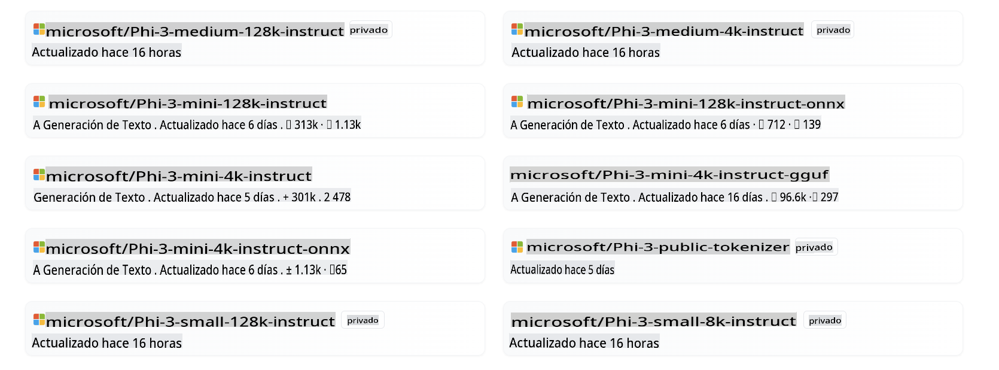
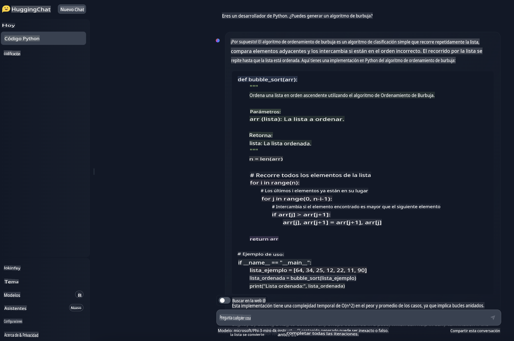

# **Usando Phi-3 en Hugging Face**

[Hugging Face](https://huggingface.co/) es una comunidad de IA muy popular con datos ricos y recursos de modelos de código abierto. Diferentes fabricantes lanzarán LLM y SLM de código abierto a través de Hugging Face, como Microsoft, Meta, Mistral, Apple, Google, etc.



Microsoft Phi-3 ha sido lanzado en Hugging Face. Los desarrolladores pueden descargar el modelo Phi-3 correspondiente basado en escenarios y negocios. Además de desplegar modelos Pytorch de Phi-3 en Hugging Face, también lanzamos modelos cuantizados, utilizando formatos GGUF y ONNX para dar a los usuarios finales una opción.


## **1. Descargar Phi-3 desde Hugging Face**

```bash

git lfs install 

git clone https://huggingface.co/microsoft/Phi-3-mini-4k-instruct

```

## **2. Conocer la Plantilla de Prompt de Phi-3**

Hay una plantilla de datos específica cuando se entrena Phi-3, por lo que al usar Phi-3, el envío de Prompt necesita ser configurado a través de la Plantilla. Durante el ajuste fino, los datos también necesitan ser ampliados según la plantilla.

La plantilla tiene tres roles, incluyendo sistema, usuario y asistente.

```txt

<|system|>
Your Role<|end|>
<|user|>
Your Question?<|end|>
<|assistant|>

```

por ejemplo

```txt

<|system|>
Your are a python developer.<|end|>
<|user|>
Help me generate a bubble algorithm<|end|>
<|assistant|>

```

## **3. Inferencias con Phi-3 en Python**

Las inferencias con Phi-3 se refieren al proceso de usar los modelos Phi-3 para generar predicciones o salidas basadas en datos de entrada. Los modelos Phi-3 son una familia de pequeños modelos de lenguaje (SLMs) que incluyen variantes como Phi-3-Mini, Phi-3-Small y Phi-3-Medium, cada uno diseñado para diferentes escenarios de aplicación y con tamaños de parámetros variados. Estos modelos han sido entrenados con datos de alta calidad y están afinados para capacidades de chat, alineación, robustez y seguridad. Pueden ser desplegados en plataformas tanto de borde como en la nube utilizando ONNX y TensorFlow Lite, y se desarrollan de acuerdo con los principios de IA Responsable de Microsoft.

Por ejemplo, el Phi-3-Mini es un modelo ligero y de última generación con 3.8 mil millones de parámetros, adecuado para prompts utilizando formato de chat y soportando una longitud de contexto de hasta 128K tokens. Es el primer modelo en su clase de peso que soporta un contexto tan largo.

Los modelos Phi-3 están disponibles en plataformas como Azure AI MaaS, HuggingFace, NVIDIA, Ollama, ONNX, y pueden ser usados para una variedad de aplicaciones, incluyendo interacciones en tiempo real, sistemas autónomos y aplicaciones que requieren baja latencia.

Hay muchas maneras de referenciar Phi-3. Puedes usar diferentes lenguajes de programación para referenciar el modelo.

Aquí hay un ejemplo en Python.

```python

import torch
from transformers import AutoModelForCausalLM, AutoTokenizer, pipeline

torch.random.manual_seed(0)

model = AutoModelForCausalLM.from_pretrained(
    "microsoft/Phi-3-mini-4k-instruct", 
    device_map="cuda", 
    torch_dtype="auto", 
    trust_remote_code=True, 
)
tokenizer = AutoTokenizer.from_pretrained("microsoft/Phi-3-mini-4k-instruct")

messages = [
    {"role": "system", "content": "Your are a python developer."},
    {"role": "user", "content": "Help me generate a bubble algorithm"},
]

pipe = pipeline(
    "text-generation",
    model=model,
    tokenizer=tokenizer,
)

generation_args = {
    "max_new_tokens": 600,
    "return_full_text": False,
    "temperature": 0.3,
    "do_sample": False,
}

output = pipe(messages, **generation_args)
print(output[0]['generated_text'])


```

> [!NOTE]
> Puedes ver si este resultado es consistente con el resultado en tu mente

## **4. Inferencias con Phi-3 en C#**

Aquí hay un ejemplo en una aplicación de consola .NET.

El proyecto C# debe agregar los siguientes paquetes:

```bash
dotnet add package Microsoft.ML.OnnxRuntime --version 1.18.0
dotnet add package Microsoft.ML.OnnxRuntimeGenAI --version 0.3.0-rc2
dotnet add package Microsoft.ML.OnnxRuntimeGenAI.Cuda --version 0.3.0-rc2
```

Aquí está el código en C#.

```csharp
using System;
using Microsoft.ML.OnnxRuntimeGenAI;


// folder location of the ONNX model file
var modelPath = @"..\models\Phi-3-mini-4k-instruct-onnx";
var model = new Model(modelPath);
var tokenizer = new Tokenizer(model);

var systemPrompt = "You are an AI assistant that helps people find information. Answer questions using a direct style. Do not share more information that the requested by the users.";

// chat start
Console.WriteLine(@"Ask your question. Type an empty string to Exit.");


// chat loop
while (true)
{
    // Get user question
    Console.WriteLine();
    Console.Write(@"Q: ");
    var userQ = Console.ReadLine();    
    if (string.IsNullOrEmpty(userQ))
    {
        break;
    }

    // show phi3 response
    Console.Write("Phi3: ");
    var fullPrompt = $"<|system|>{systemPrompt}<|end|><|user|>{userQ}<|end|><|assistant|>";
    var tokens = tokenizer.Encode(fullPrompt);

    var generatorParams = new GeneratorParams(model);
    generatorParams.SetSearchOption("max_length", 2048);
    generatorParams.SetSearchOption("past_present_share_buffer", false);
    generatorParams.SetInputSequences(tokens);

    var generator = new Generator(model, generatorParams);
    while (!generator.IsDone())
    {
        generator.ComputeLogits();
        generator.GenerateNextToken();
        var outputTokens = generator.GetSequence(0);
        var newToken = outputTokens.Slice(outputTokens.Length - 1, 1);
        var output = tokenizer.Decode(newToken);
        Console.Write(output);
    }
    Console.WriteLine();
}
```

La demostración en ejecución es similar a esta:


***Nota:** ¡hay un error tipográfico en la primera pregunta, Phi-3 es lo suficientemente genial como para compartir la respuesta correcta!*

## **5. Usando Phi-3 en el Chat de Hugging Face**

El chat de Hugging Face proporciona una experiencia relacionada. Ingresa [aquí para probar el chat de Phi-3](https://huggingface.co/chat/models/microsoft/Phi-3-mini-4k-instruct) en tu navegador para experimentarlo.



        **Descargo de responsabilidad**:
        Este documento ha sido traducido utilizando servicios de traducción automatizada por IA. Si bien nos esforzamos por lograr precisión, tenga en cuenta que las traducciones automatizadas pueden contener errores o imprecisiones. El documento original en su idioma nativo debe considerarse la fuente autorizada. Para información crítica, se recomienda una traducción profesional humana. No somos responsables de ningún malentendido o interpretación errónea que surja del uso de esta traducción.