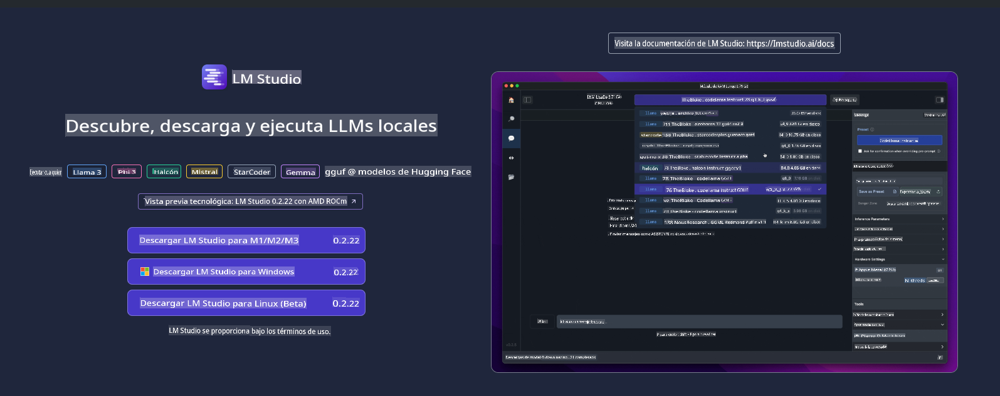
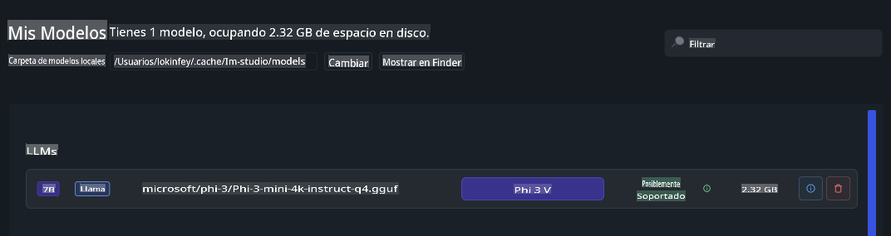
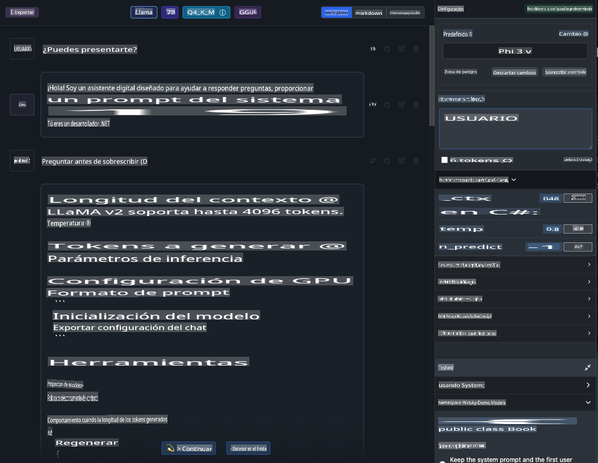
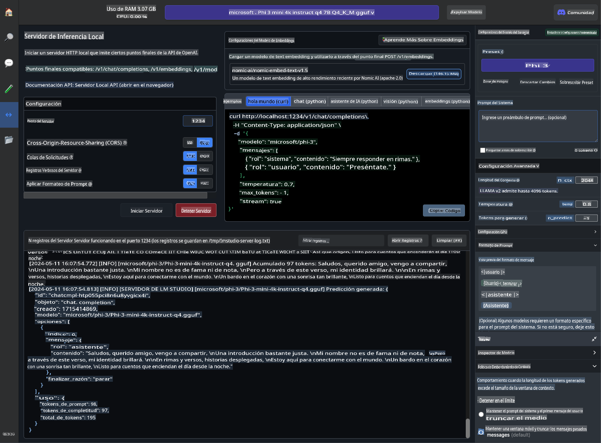
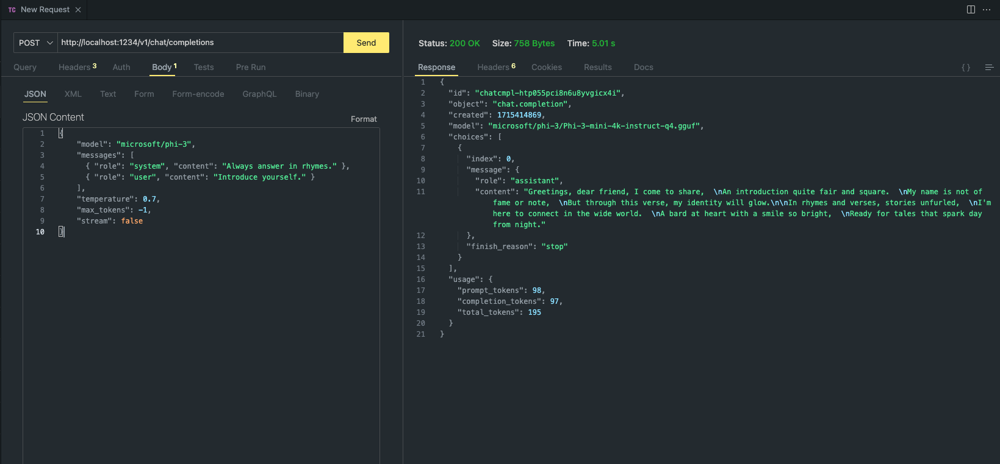

# **Usando Phi-3 en LM Studio**

[LM Studio](https://lmstudio.ai) es una aplicación para invocar SLM y LLM en una aplicación de escritorio local. Permite a los usuarios usar diferentes modelos de manera sencilla y admite computación acelerada utilizando GPU NVIDIA/AMD/Apple Silicon. A través de LM Studio, los usuarios pueden descargar, instalar y ejecutar varios LLM y SLM de código abierto basados en Hugging Face para probar el rendimiento del modelo localmente sin necesidad de codificar.

## **1. Instalación**

Puedes elegir instalar en Windows, Linux, macOS a través del sitio web de LM Studio [https://lmstudio.ai/](https://lmstudio.ai/)

## **2. Descargar Phi-3 en LM Studio**

LM Studio invoca modelos de código abierto en formato gguf cuantizado. Puedes descargarlo directamente desde la plataforma proporcionada por la interfaz de búsqueda de LM Studio, o puedes descargarlo tú mismo y especificar que se invoque en el directorio relevante.

***Buscamos Phi3 en la búsqueda de LM Studio y descargamos el modelo gguf de Phi-3***

***Gestiona los modelos descargados a través de LM Studio***

## **3. Chatear con Phi-3 en LM Studio**

Seleccionamos Phi-3 en LM Studio Chat y configuramos la plantilla de chat (Preset - Phi3) para iniciar el chat local con Phi-3

***Nota***:

a. Puedes configurar parámetros a través de Advance Configuration en el panel de control de LM Studio

b. Debido a que Phi-3 tiene requisitos específicos de plantilla de chat, Phi-3 debe ser seleccionado en Preset

c. También puedes configurar diferentes parámetros, como el uso de GPU, etc.

## **4. Llamar a la API de Phi-3 desde LM Studio**

LM Studio admite el despliegue rápido de servicios locales, y puedes construir servicios de modelos sin necesidad de codificación.

Este es el resultado en Postman

Aviso legal: La traducción fue realizada a partir del original por un modelo de inteligencia artificial y puede no ser perfecta. 
Por favor, revise el resultado y haga las correcciones necesarias.