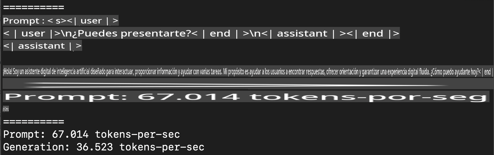
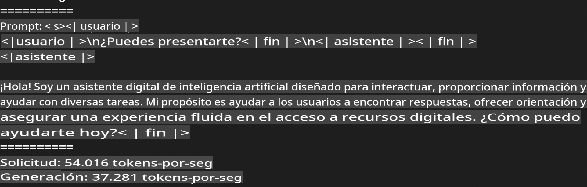
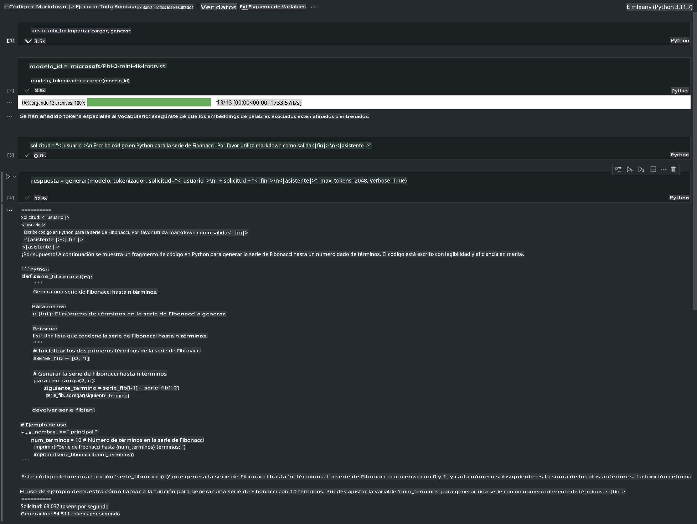

# **Inferencia de Phi-3 con el Framework Apple MLX**

## **¿Qué es el Framework MLX?**

MLX es un framework de arrays para investigación en aprendizaje automático en dispositivos con Apple Silicon, desarrollado por el equipo de investigación de aprendizaje automático de Apple.

MLX está diseñado por investigadores en aprendizaje automático para investigadores en aprendizaje automático. El framework busca ser fácil de usar, pero al mismo tiempo eficiente para entrenar y desplegar modelos. Además, el diseño del framework es conceptualmente sencillo. Nuestro objetivo es facilitar que los investigadores amplíen y mejoren MLX para explorar nuevas ideas rápidamente.

Los modelos de lenguaje grandes (LLMs) pueden ser acelerados en dispositivos con Apple Silicon a través de MLX, y los modelos pueden ejecutarse localmente de manera muy conveniente.

## **Usando MLX para inferir Phi-3-mini**

### **1. Configura tu entorno MLX**

1. Python 3.11.x  
2. Instala la biblioteca MLX  

```bash

pip install mlx-lm

```

### **2. Ejecutando Phi-3-mini en la Terminal con MLX**

```bash

python -m mlx_lm.generate --model microsoft/Phi-3-mini-4k-instruct --max-token 2048 --prompt  "<|user|>\nCan you introduce yourself<|end|>\n<|assistant|>"

```

El resultado (mi entorno es Apple M1 Max, 64GB) es:



### **3. Cuantizando Phi-3-mini con MLX en la Terminal**

```bash

python -m mlx_lm.convert --hf-path microsoft/Phi-3-mini-4k-instruct

```

***Nota:*** El modelo puede ser cuantizado a través de `mlx_lm.convert`, y la cuantización predeterminada es INT4. Este ejemplo cuantiza Phi-3-mini a INT4.

El modelo se cuantiza mediante `mlx_lm.convert`, con la cuantización predeterminada en INT4. En este ejemplo, se cuantiza Phi-3-mini a INT4. Después de la cuantización, el modelo se almacena en el directorio predeterminado `./mlx_model`.

Podemos probar el modelo cuantizado con MLX desde la terminal:

```bash

python -m mlx_lm.generate --model ./mlx_model/ --max-token 2048 --prompt  "<|user|>\nCan you introduce yourself<|end|>\n<|assistant|>"

```

El resultado es:



### **4. Ejecutando Phi-3-mini con MLX en Jupyter Notebook**



***Nota:*** Por favor, consulta este ejemplo [haz clic en este enlace](../../../../../code/03.Inference/MLX/MLX_DEMO.ipynb)

## **Recursos**

1. Aprende más sobre el Framework Apple MLX [https://ml-explore.github.io](https://ml-explore.github.io/mlx/build/html/index.html)  

2. Repositorio de Apple MLX en GitHub [https://github.com/ml-explore](https://github.com/ml-explore)  

**Descargo de responsabilidad**:  
Este documento ha sido traducido utilizando servicios de traducción automática basados en inteligencia artificial. Si bien nos esforzamos por lograr precisión, tenga en cuenta que las traducciones automatizadas pueden contener errores o imprecisiones. El documento original en su idioma nativo debe considerarse como la fuente autorizada. Para información crítica, se recomienda una traducción profesional realizada por humanos. No nos hacemos responsables por malentendidos o interpretaciones erróneas que surjan del uso de esta traducción.