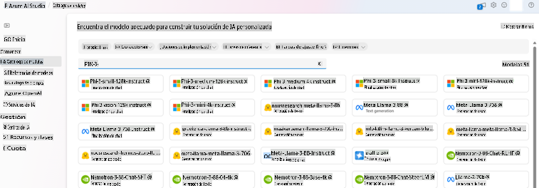
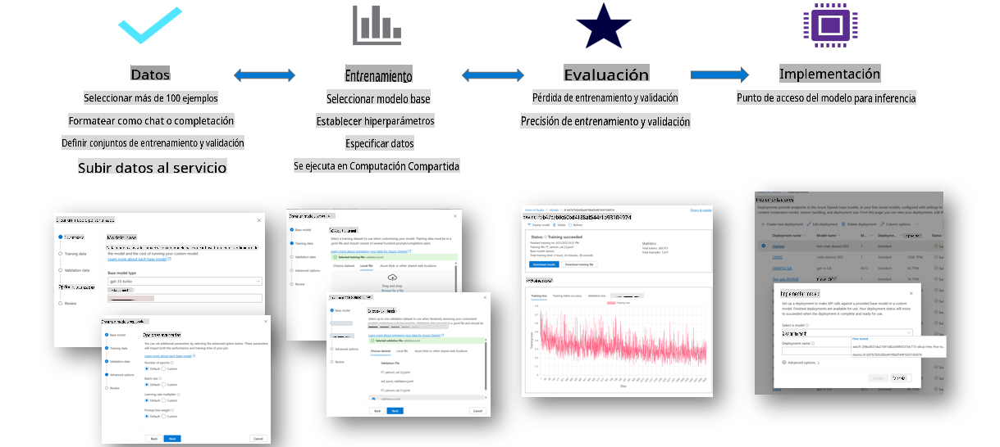
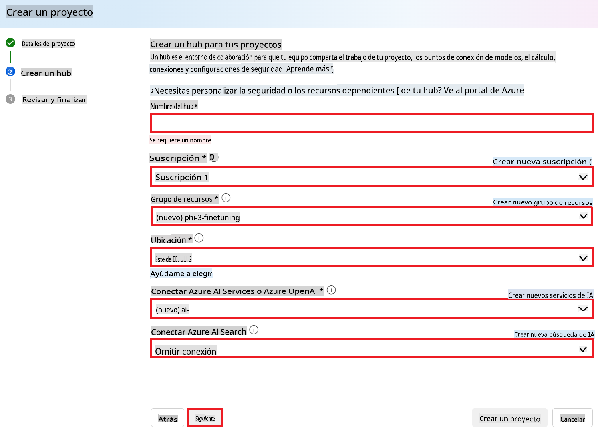
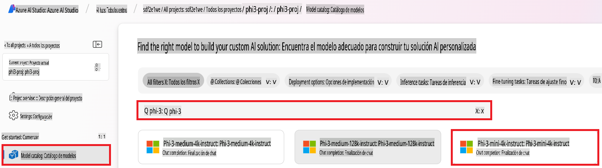
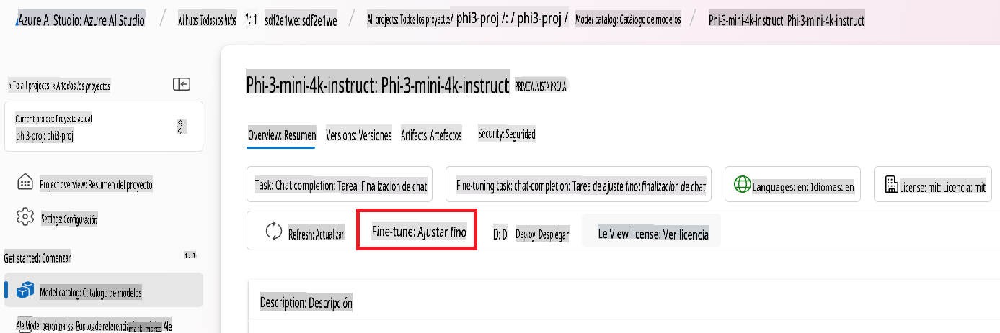
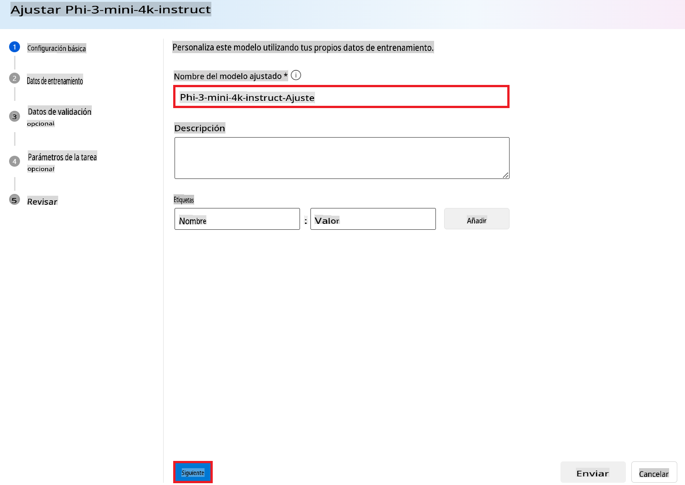
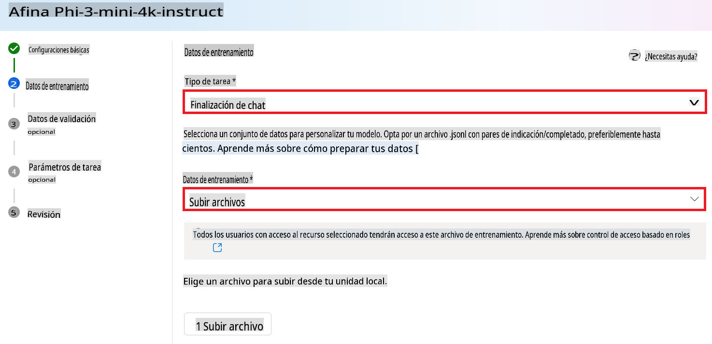
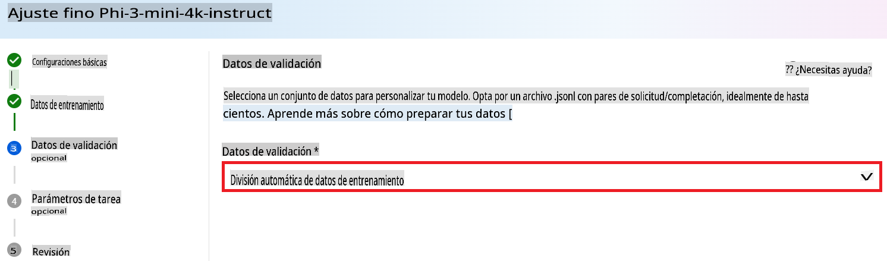
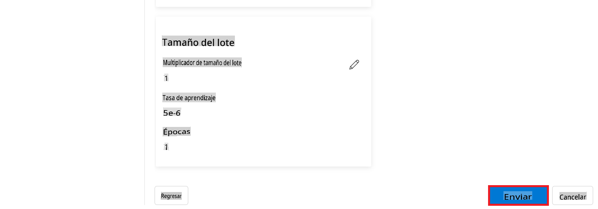
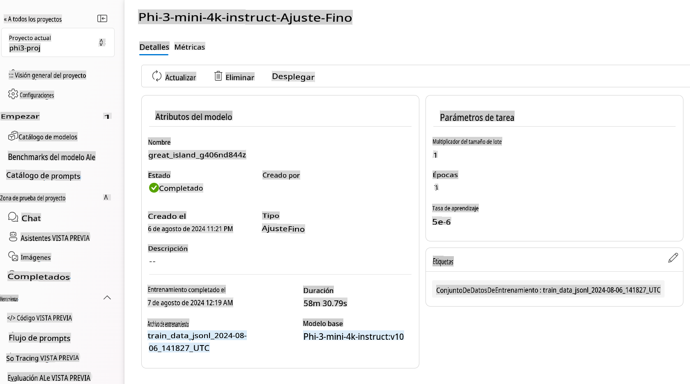

# Ajuste fino de Phi-3 con Azure AI Foundry

Exploremos cómo ajustar el modelo de lenguaje Phi-3 Mini de Microsoft utilizando Azure AI Foundry. El ajuste fino te permite adaptar Phi-3 Mini a tareas específicas, haciéndolo aún más poderoso y consciente del contexto.

## Consideraciones

- **Capacidades:** ¿Qué modelos se pueden ajustar? ¿Qué puede hacer el modelo base después de ser ajustado?
- **Costo:** ¿Cuál es el modelo de precios para el ajuste fino?
- **Personalización:** ¿Cuánto puedo modificar el modelo base y de qué formas?
- **Conveniencia:** ¿Cómo se realiza el ajuste fino? ¿Necesito escribir código personalizado? ¿Debo proporcionar mi propio hardware?
- **Seguridad:** Los modelos ajustados son conocidos por tener riesgos de seguridad. ¿Existen medidas para proteger contra daños no intencionados?



## Preparación para el ajuste fino

### Requisitos previos

> [!NOTE]
> Para los modelos de la familia Phi-3, la oferta de ajuste fino de pago por uso solo está disponible con hubs creados en regiones de **East US 2**.

- Una suscripción de Azure. Si no tienes una, crea una [cuenta de Azure de pago](https://azure.microsoft.com/pricing/purchase-options/pay-as-you-go) para comenzar.

- Un [proyecto de AI Foundry](https://ai.azure.com?WT.mc_id=aiml-138114-kinfeylo).
- Los controles de acceso basados en roles de Azure (Azure RBAC) se utilizan para otorgar acceso a las operaciones en Azure AI Foundry. Para realizar los pasos de este artículo, tu cuenta de usuario debe tener asignado el rol de __Azure AI Developer__ en el grupo de recursos.

### Registro del proveedor de suscripción

Verifica que la suscripción esté registrada con el proveedor de recursos `Microsoft.Network`.

1. Inicia sesión en el [portal de Azure](https://portal.azure.com).
1. Selecciona **Suscripciones** en el menú de la izquierda.
1. Selecciona la suscripción que deseas usar.
1. Selecciona **Configuración del proyecto AI** > **Proveedores de recursos** en el menú de la izquierda.
1. Confirma que **Microsoft.Network** esté en la lista de proveedores de recursos. Si no está, agrégalo.

### Preparación de datos

Prepara tus datos de entrenamiento y validación para ajustar tu modelo. Tus conjuntos de datos de entrenamiento y validación deben consistir en ejemplos de entrada y salida que representen cómo deseas que el modelo funcione.

Asegúrate de que todos los ejemplos de entrenamiento sigan el formato esperado para la inferencia. Para ajustar modelos de manera efectiva, utiliza un conjunto de datos equilibrado y diverso.

Esto incluye mantener un balance de datos, incorporar varios escenarios y refinar periódicamente los datos de entrenamiento para alinearlos con expectativas del mundo real, lo que resultará en respuestas más precisas y balanceadas del modelo.

Diferentes tipos de modelos requieren formatos distintos de datos de entrenamiento.

### Chat Completion

Los datos de entrenamiento y validación que utilices **deben** estar formateados como un documento JSON Lines (JSONL). Para `Phi-3-mini-128k-instruct`, el conjunto de datos de ajuste fino debe estar en el formato conversacional utilizado por la API de Chat completions.

### Ejemplo de formato de archivo

```json
    {"messages": [{"role": "system", "content": "You are an Xbox customer support agent whose primary goal is to help users with issues they are experiencing with their Xbox devices. You are friendly and concise. You only provide factual answers to queries, and do not provide answers that are not related to Xbox."}, {"role": "user", "content": "Is Xbox better than PlayStation?"}, {"role": "assistant", "content": "I apologize, but I cannot provide personal opinions. My primary job is to assist you with any issues related to your Xbox device. Do you have any Xbox-related issues that need addressing?"}]}
    {"messages": [{"role": "system", "content": "You are an Xbox customer support agent whose primary goal is to help users with issues they are experiencing with their Xbox devices. You are friendly and concise. You only provide factual answers to queries, and do not provide answers that are not related to Xbox."}, {"role": "user", "content": "Can I play PC games on my Xbox?"}, {"role": "assistant", "content": "While Xbox consoles don't natively support PC games, they can play an array of Xbox games, many of which are also available on PC. Can I assist you with finding games compatible with your Xbox device?"}]}
    {"messages": [{"role": "system", "content": "You are an Xbox customer support agent whose primary goal is to help users with issues they are experiencing with their Xbox devices. You are friendly and concise. You only provide factual answers to queries, and do not provide answers that are not related to Xbox."}, {"role": "user", "content": "I'm having trouble connecting my Xbox to the Wi-Fi."}, {"role": "assistant", "content": "No worries, let's go through the network settings on your Xbox. Can you please tell me what happens when you try to connect it to the Wi-Fi?"}]}
```

El tipo de archivo compatible es JSON Lines. Los archivos se cargan en el almacenamiento predeterminado y se ponen a disposición en tu proyecto.

## Ajuste fino de Phi-3 con Azure AI Foundry

Azure AI Foundry te permite personalizar modelos de lenguaje grandes con tus propios conjuntos de datos mediante un proceso conocido como ajuste fino. Este proceso ofrece un gran valor al permitir la personalización y optimización para tareas y aplicaciones específicas. Mejora el rendimiento, reduce costos, disminuye la latencia y genera resultados personalizados.



### Crear un nuevo proyecto

1. Inicia sesión en [Azure AI Foundry](https://ai.azure.com).

1. Selecciona **+Nuevo proyecto** para crear un nuevo proyecto en Azure AI Foundry.

    

1. Realiza las siguientes tareas:

    - **Nombre del hub del proyecto.** Debe ser un valor único.
    - Selecciona el **Hub** a usar (crea uno nuevo si es necesario).

    

1. Realiza las siguientes tareas para crear un nuevo hub:

    - Ingresa un **Nombre del hub**. Debe ser un valor único.
    - Selecciona tu **Suscripción de Azure**.
    - Selecciona el **Grupo de recursos** a usar (crea uno nuevo si es necesario).
    - Selecciona la **Ubicación** que deseas usar.
    - Selecciona **Conectar servicios de Azure AI** a usar (crea uno nuevo si es necesario).
    - Selecciona **Conectar búsqueda de Azure AI** y elige **Omitir conexión**.

    

1. Selecciona **Siguiente**.
1. Selecciona **Crear un proyecto**.

### Preparación de datos

Antes del ajuste fino, reúne o crea un conjunto de datos relevante para tu tarea, como instrucciones de chat, pares de preguntas y respuestas, u otros datos de texto pertinentes. Limpia y preprocesa estos datos eliminando ruido, manejando valores faltantes y tokenizando el texto.

### Ajustar modelos Phi-3 en Azure AI Foundry

> [!NOTE]
> Actualmente, el ajuste fino de modelos Phi-3 está disponible solo en proyectos ubicados en East US 2.

1. Selecciona **Catálogo de modelos** desde la pestaña lateral izquierda.

1. Escribe *phi-3* en la **barra de búsqueda** y selecciona el modelo phi-3 que deseas usar.

    

1. Selecciona **Ajustar**.

    

1. Ingresa el **Nombre del modelo ajustado**.

    

1. Selecciona **Siguiente**.

1. Realiza las siguientes tareas:

    - Selecciona **tipo de tarea** como **Chat completion**.
    - Selecciona los **Datos de entrenamiento** que deseas usar. Puedes cargarlos a través de los datos de Azure AI Foundry o desde tu entorno local.

    

1. Selecciona **Siguiente**.

1. Carga los **Datos de validación** que deseas usar, o selecciona **División automática de datos de entrenamiento**.

    

1. Selecciona **Siguiente**.

1. Realiza las siguientes tareas:

    - Selecciona el **Multiplicador de tamaño de lote** que deseas usar.
    - Selecciona la **Tasa de aprendizaje** que deseas usar.
    - Selecciona el número de **Épocas** que deseas usar.

    

1. Selecciona **Enviar** para iniciar el proceso de ajuste fino.

    

1. Una vez que tu modelo esté ajustado, el estado se mostrará como **Completado**, como se muestra en la imagen a continuación. Ahora puedes implementar el modelo y usarlo en tu propia aplicación, en el playground o en prompt flow. Para más información, consulta [Cómo implementar la familia de modelos Phi-3 con Azure AI Foundry](https://learn.microsoft.com/azure/ai-studio/how-to/deploy-models-phi-3?tabs=phi-3-5&pivots=programming-language-python).

    

> [!NOTE]
> Para información más detallada sobre el ajuste fino de Phi-3, visita [Ajuste fino de modelos Phi-3 en Azure AI Foundry](https://learn.microsoft.com/azure/ai-studio/how-to/fine-tune-phi-3?tabs=phi-3-mini).

## Limpieza de modelos ajustados

Puedes eliminar un modelo ajustado desde la lista de modelos de ajuste fino en [Azure AI Foundry](https://ai.azure.com) o desde la página de detalles del modelo. Selecciona el modelo ajustado que deseas eliminar desde la página de Ajuste fino y luego selecciona el botón Eliminar.

> [!NOTE]
> No puedes eliminar un modelo personalizado si tiene un despliegue existente. Primero debes eliminar el despliegue del modelo antes de eliminar el modelo personalizado.

## Costos y cuotas

### Consideraciones de costos y cuotas para modelos Phi-3 ajustados como servicio

Los modelos Phi ajustados como servicio son ofrecidos por Microsoft e integrados con Azure AI Foundry para su uso. Puedes encontrar los precios al [desplegar](https://learn.microsoft.com/azure/ai-studio/how-to/deploy-models-phi-3?tabs=phi-3-5&pivots=programming-language-python) o ajustar los modelos bajo la pestaña de Precios y términos en el asistente de despliegue.

## Filtrado de contenido

Los modelos desplegados como servicio con pago por uso están protegidos por Azure AI Content Safety. Cuando se despliegan en puntos de acceso en tiempo real, puedes optar por no usar esta capacidad. Con Azure AI Content Safety activado, tanto el prompt como la respuesta pasan por un conjunto de modelos de clasificación diseñados para detectar y prevenir la generación de contenido dañino. El sistema de filtrado de contenido detecta y toma medidas sobre categorías específicas de contenido potencialmente dañino tanto en los prompts de entrada como en las respuestas generadas. Aprende más sobre [Azure AI Content Safety](https://learn.microsoft.com/azure/ai-studio/concepts/content-filtering).

**Configuración de ajuste fino**

Hiperparámetros: Define hiperparámetros como tasa de aprendizaje, tamaño de lote y número de épocas de entrenamiento.

**Función de pérdida**

Elige una función de pérdida adecuada para tu tarea (por ejemplo, entropía cruzada).

**Optimizador**

Selecciona un optimizador (por ejemplo, Adam) para las actualizaciones de gradiente durante el entrenamiento.

**Proceso de ajuste fino**

- Carga el modelo preentrenado: Carga el checkpoint de Phi-3 Mini.
- Añade capas personalizadas: Añade capas específicas para la tarea (por ejemplo, una cabeza de clasificación para instrucciones de chat).

**Entrena el modelo**
Ajusta el modelo usando tu conjunto de datos preparado. Supervisa el progreso del entrenamiento y ajusta los hiperparámetros según sea necesario.

**Evaluación y validación**

Conjunto de validación: Divide tus datos en conjuntos de entrenamiento y validación.

**Evalúa el rendimiento**

Utiliza métricas como precisión, F1-score o perplejidad para evaluar el rendimiento del modelo.

## Guarda el modelo ajustado

**Checkpoint**
Guarda el checkpoint del modelo ajustado para uso futuro.

## Despliegue

- Despliega como un servicio web: Despliega tu modelo ajustado como un servicio web en Azure AI Foundry.
- Prueba el punto de acceso: Envía consultas de prueba al punto de acceso desplegado para verificar su funcionalidad.

## Itera y mejora

Itera: Si el rendimiento no es satisfactorio, ajusta hiperparámetros, añade más datos o realiza más épocas de ajuste fino.

## Monitorea y refina

Supervisa continuamente el comportamiento del modelo y refínalo según sea necesario.

## Personaliza y amplía

Tareas personalizadas: Phi-3 Mini puede ajustarse para diversas tareas más allá de las instrucciones de chat. ¡Explora otros casos de uso!
Experimenta: Prueba diferentes arquitecturas, combinaciones de capas y técnicas para mejorar el rendimiento.

> [!NOTE]
> El ajuste fino es un proceso iterativo. ¡Experimenta, aprende y adapta tu modelo para lograr los mejores resultados en tu tarea específica!

**Descargo de responsabilidad**:  
Este documento ha sido traducido utilizando servicios de traducción automática basados en inteligencia artificial. Si bien nos esforzamos por garantizar la precisión, tenga en cuenta que las traducciones automáticas pueden contener errores o imprecisiones. El documento original en su idioma nativo debe considerarse como la fuente autorizada. Para información crítica, se recomienda una traducción profesional realizada por humanos. No nos hacemos responsables por malentendidos o interpretaciones erróneas que puedan surgir del uso de esta traducción.