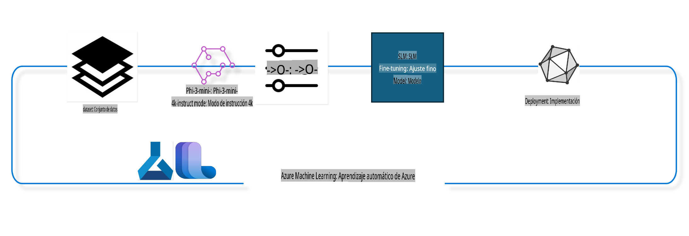

## Cómo usar componentes de finalización de chat del registro del sistema Azure ML para ajustar un modelo

En este ejemplo, realizaremos el ajuste fino del modelo Phi-3-mini-4k-instruct para completar una conversación entre 2 personas utilizando el conjunto de datos ultrachat_200k.



El ejemplo te mostrará cómo realizar el ajuste fino utilizando el SDK de Azure ML y Python, y luego desplegar el modelo ajustado en un endpoint en línea para inferencia en tiempo real.

### Datos de entrenamiento

Usaremos el conjunto de datos ultrachat_200k. Esta es una versión altamente filtrada del conjunto de datos UltraChat y fue utilizada para entrenar Zephyr-7B-β, un modelo de chat de última generación con 7 mil millones de parámetros.

### Modelo

Utilizaremos el modelo Phi-3-mini-4k-instruct para mostrar cómo un usuario puede ajustar un modelo para tareas de finalización de chat. Si abriste este notebook desde una tarjeta de modelo específica, recuerda reemplazar el nombre del modelo correspondiente.

### Tareas

- Seleccionar un modelo para ajustar.
- Seleccionar y explorar los datos de entrenamiento.
- Configurar el trabajo de ajuste fino.
- Ejecutar el trabajo de ajuste fino.
- Revisar las métricas de entrenamiento y evaluación.
- Registrar el modelo ajustado.
- Desplegar el modelo ajustado para inferencia en tiempo real.
- Limpiar los recursos.

## 1. Configuración de requisitos previos

- Instalar dependencias.
- Conectarse al Workspace de AzureML. Aprende más en configurar la autenticación del SDK. Reemplaza <WORKSPACE_NAME>, <RESOURCE_GROUP> y <SUBSCRIPTION_ID> a continuación.
- Conectarse al registro del sistema AzureML.
- Establecer un nombre opcional para el experimento.
- Verificar o crear un recurso de cómputo.

> [!NOTE]
> Los requisitos incluyen un nodo con GPU única que puede tener múltiples tarjetas GPU. Por ejemplo, en un nodo de Standard_NC24rs_v3 hay 4 GPUs NVIDIA V100, mientras que en Standard_NC12s_v3 hay 2 GPUs NVIDIA V100. Consulta la documentación para esta información. El número de tarjetas GPU por nodo se establece en el parámetro gpus_per_node a continuación. Configurar este valor correctamente garantizará la utilización de todas las GPUs en el nodo. Las SKUs de GPU recomendadas se pueden encontrar aquí y aquí.

### Librerías de Python

Instala las dependencias ejecutando la celda a continuación. Este paso no es opcional si estás trabajando en un entorno nuevo.

```bash
pip install azure-ai-ml
pip install azure-identity
pip install datasets==2.9.0
pip install mlflow
pip install azureml-mlflow
```

### Interacción con Azure ML

1. Este script de Python se utiliza para interactuar con el servicio Azure Machine Learning (Azure ML). Aquí hay un desglose de lo que hace:

    - Importa los módulos necesarios de los paquetes azure.ai.ml, azure.identity y azure.ai.ml.entities. También importa el módulo time.

    - Intenta autenticar utilizando DefaultAzureCredential(), lo que proporciona una experiencia de autenticación simplificada para comenzar rápidamente a desarrollar aplicaciones en la nube de Azure. Si esto falla, recurre a InteractiveBrowserCredential(), que ofrece un aviso de inicio de sesión interactivo.

    - Intenta crear una instancia de MLClient utilizando el método from_config, que lee la configuración desde el archivo de configuración predeterminado (config.json). Si esto falla, crea una instancia de MLClient proporcionando manualmente subscription_id, resource_group_name y workspace_name.

    - Crea otra instancia de MLClient, esta vez para el registro de Azure ML llamado "azureml". Este registro es donde se almacenan los modelos, las canalizaciones de ajuste fino y los entornos.

    - Establece el experiment_name como "chat_completion_Phi-3-mini-4k-instruct".

    - Genera una marca de tiempo única convirtiendo el tiempo actual (en segundos desde la época, como un número de punto flotante) a un entero y luego a una cadena. Esta marca de tiempo puede usarse para crear nombres y versiones únicos.

    ```python
    # Import necessary modules from Azure ML and Azure Identity
    from azure.ai.ml import MLClient
    from azure.identity import (
        DefaultAzureCredential,
        InteractiveBrowserCredential,
    )
    from azure.ai.ml.entities import AmlCompute
    import time  # Import time module
    
    # Try to authenticate using DefaultAzureCredential
    try:
        credential = DefaultAzureCredential()
        credential.get_token("https://management.azure.com/.default")
    except Exception as ex:  # If DefaultAzureCredential fails, use InteractiveBrowserCredential
        credential = InteractiveBrowserCredential()
    
    # Try to create an MLClient instance using the default config file
    try:
        workspace_ml_client = MLClient.from_config(credential=credential)
    except:  # If that fails, create an MLClient instance by manually providing the details
        workspace_ml_client = MLClient(
            credential,
            subscription_id="<SUBSCRIPTION_ID>",
            resource_group_name="<RESOURCE_GROUP>",
            workspace_name="<WORKSPACE_NAME>",
        )
    
    # Create another MLClient instance for the Azure ML registry named "azureml"
    # This registry is where models, fine-tuning pipelines, and environments are stored
    registry_ml_client = MLClient(credential, registry_name="azureml")
    
    # Set the experiment name
    experiment_name = "chat_completion_Phi-3-mini-4k-instruct"
    
    # Generate a unique timestamp that can be used for names and versions that need to be unique
    timestamp = str(int(time.time()))
    ```

## 2. Seleccionar un modelo base para ajustar

1. Phi-3-mini-4k-instruct es un modelo ligero de última generación con 3.8 mil millones de parámetros, construido sobre conjuntos de datos utilizados para Phi-2. El modelo pertenece a la familia de modelos Phi-3, y la versión Mini viene en dos variantes: 4K y 128K, que representan la longitud de contexto (en tokens) que puede soportar. Necesitamos ajustar el modelo para nuestro propósito específico antes de usarlo. Puedes explorar estos modelos en el Catálogo de Modelos en AzureML Studio, filtrando por la tarea de finalización de chat. En este ejemplo, utilizamos el modelo Phi-3-mini-4k-instruct. Si abriste este notebook para un modelo diferente, reemplaza el nombre y la versión del modelo según corresponda.

    > [!NOTE]
    > la propiedad id del modelo será pasada como entrada al trabajo de ajuste fino. Esto también está disponible como el campo Asset ID en la página de detalles del modelo en el Catálogo de Modelos de AzureML Studio.

2. Este script de Python interactúa con el servicio Azure Machine Learning (Azure ML). Aquí hay un desglose de lo que hace:

    - Establece el model_name como "Phi-3-mini-4k-instruct".

    - Utiliza el método get de la propiedad models del objeto registry_ml_client para recuperar la versión más reciente del modelo con el nombre especificado desde el registro de Azure ML. El método get se llama con dos argumentos: el nombre del modelo y una etiqueta que especifica que se debe recuperar la versión más reciente del modelo.

    - Imprime un mensaje en la consola indicando el nombre, la versión y el id del modelo que se utilizará para el ajuste fino. El método format de la cadena se utiliza para insertar el nombre, la versión y el id del modelo en el mensaje. El nombre, la versión y el id del modelo se acceden como propiedades del objeto foundation_model.

    ```python
    # Set the model name
    model_name = "Phi-3-mini-4k-instruct"
    
    # Get the latest version of the model from the Azure ML registry
    foundation_model = registry_ml_client.models.get(model_name, label="latest")
    
    # Print the model name, version, and id
    # This information is useful for tracking and debugging
    print(
        "\n\nUsing model name: {0}, version: {1}, id: {2} for fine tuning".format(
            foundation_model.name, foundation_model.version, foundation_model.id
        )
    )
    ```

## 3. Crear un recurso de cómputo para el trabajo

El trabajo de ajuste fino funciona SOLO con recursos de cómputo con GPU. El tamaño del recurso depende del tamaño del modelo y, en la mayoría de los casos, puede ser complicado identificar el recurso adecuado para el trabajo. En esta celda, guiamos al usuario para seleccionar el recurso adecuado.

> [!NOTE]
> Los recursos listados a continuación funcionan con la configuración más optimizada. Cualquier cambio en la configuración podría generar un error de memoria insuficiente (Cuda Out Of Memory). En tales casos, intenta actualizar el recurso a un tamaño mayor.

> [!NOTE]
> Al seleccionar el compute_cluster_size a continuación, asegúrate de que el recurso esté disponible en tu grupo de recursos. Si un recurso en particular no está disponible, puedes solicitar acceso a los recursos de cómputo.

### Verificar compatibilidad del modelo para ajuste fino

1. Este script de Python interactúa con un modelo de Azure Machine Learning (Azure ML). Aquí hay un desglose de lo que hace:

    - Importa el módulo ast, que proporciona funciones para procesar árboles de gramática de sintaxis abstracta de Python.

    - Verifica si el objeto foundation_model (que representa un modelo en Azure ML) tiene una etiqueta llamada finetune_compute_allow_list. Las etiquetas en Azure ML son pares clave-valor que puedes crear y usar para filtrar y ordenar modelos.

    - Si la etiqueta finetune_compute_allow_list está presente, utiliza la función ast.literal_eval para analizar de manera segura el valor de la etiqueta (una cadena) en una lista de Python. Esta lista se asigna a la variable computes_allow_list. Luego imprime un mensaje indicando que se debe crear un recurso de la lista.

    - Si la etiqueta finetune_compute_allow_list no está presente, establece computes_allow_list en None y muestra un mensaje indicando que la etiqueta finetune_compute_allow_list no forma parte de las etiquetas del modelo.

    - En resumen, este script verifica una etiqueta específica en los metadatos del modelo, convierte el valor de la etiqueta en una lista si existe y proporciona retroalimentación al usuario en consecuencia.

    ```python
    # Import the ast module, which provides functions to process trees of the Python abstract syntax grammar
    import ast
    
    # Check if the 'finetune_compute_allow_list' tag is present in the model's tags
    if "finetune_compute_allow_list" in foundation_model.tags:
        # If the tag is present, use ast.literal_eval to safely parse the tag's value (a string) into a Python list
        computes_allow_list = ast.literal_eval(
            foundation_model.tags["finetune_compute_allow_list"]
        )  # convert string to python list
        # Print a message indicating that a compute should be created from the list
        print(f"Please create a compute from the above list - {computes_allow_list}")
    else:
        # If the tag is not present, set computes_allow_list to None
        computes_allow_list = None
        # Print a message indicating that the 'finetune_compute_allow_list' tag is not part of the model's tags
        print("`finetune_compute_allow_list` is not part of model tags")
    ```

### Verificar instancia de cómputo

1. Este script de Python interactúa con el servicio Azure Machine Learning (Azure ML) y realiza varias verificaciones en una instancia de cómputo. Aquí hay un desglose de lo que hace:

    - Intenta recuperar la instancia de cómputo con el nombre almacenado en compute_cluster desde el espacio de trabajo de Azure ML. Si el estado de aprovisionamiento de la instancia de cómputo es "fallido", genera un ValueError.

    - Verifica si computes_allow_list no es None. Si no lo es, convierte todos los tamaños de cómputo en la lista a minúsculas y verifica si el tamaño de la instancia de cómputo actual está en la lista. Si no lo está, genera un ValueError.

    - Si computes_allow_list es None, verifica si el tamaño de la instancia de cómputo está en una lista de tamaños de GPU no compatibles. Si lo está, genera un ValueError.

    - Recupera una lista de todos los tamaños de cómputo disponibles en el espacio de trabajo. Luego, itera sobre esta lista y, para cada tamaño de cómputo, verifica si su nombre coincide con el tamaño de la instancia de cómputo actual. Si coincide, recupera el número de GPUs para ese tamaño de cómputo y establece gpu_count_found en True.

    - Si gpu_count_found es True, imprime el número de GPUs en la instancia de cómputo. Si gpu_count_found es False, genera un ValueError.

    - En resumen, este script realiza varias verificaciones en una instancia de cómputo en un espacio de trabajo de Azure ML, incluyendo verificar su estado de aprovisionamiento, su tamaño en relación con una lista de permitidos o denegados, y el número de GPUs que tiene.

    ```python
    # Print the exception message
    print(e)
    # Raise a ValueError if the compute size is not available in the workspace
    raise ValueError(
        f"WARNING! Compute size {compute_cluster_size} not available in workspace"
    )
    
    # Retrieve the compute instance from the Azure ML workspace
    compute = workspace_ml_client.compute.get(compute_cluster)
    # Check if the provisioning state of the compute instance is "failed"
    if compute.provisioning_state.lower() == "failed":
        # Raise a ValueError if the provisioning state is "failed"
        raise ValueError(
            f"Provisioning failed, Compute '{compute_cluster}' is in failed state. "
            f"please try creating a different compute"
        )
    
    # Check if computes_allow_list is not None
    if computes_allow_list is not None:
        # Convert all compute sizes in computes_allow_list to lowercase
        computes_allow_list_lower_case = [x.lower() for x in computes_allow_list]
        # Check if the size of the compute instance is in computes_allow_list_lower_case
        if compute.size.lower() not in computes_allow_list_lower_case:
            # Raise a ValueError if the size of the compute instance is not in computes_allow_list_lower_case
            raise ValueError(
                f"VM size {compute.size} is not in the allow-listed computes for finetuning"
            )
    else:
        # Define a list of unsupported GPU VM sizes
        unsupported_gpu_vm_list = [
            "standard_nc6",
            "standard_nc12",
            "standard_nc24",
            "standard_nc24r",
        ]
        # Check if the size of the compute instance is in unsupported_gpu_vm_list
        if compute.size.lower() in unsupported_gpu_vm_list:
            # Raise a ValueError if the size of the compute instance is in unsupported_gpu_vm_list
            raise ValueError(
                f"VM size {compute.size} is currently not supported for finetuning"
            )
    
    # Initialize a flag to check if the number of GPUs in the compute instance has been found
    gpu_count_found = False
    # Retrieve a list of all available compute sizes in the workspace
    workspace_compute_sku_list = workspace_ml_client.compute.list_sizes()
    available_sku_sizes = []
    # Iterate over the list of available compute sizes
    for compute_sku in workspace_compute_sku_list:
        available_sku_sizes.append(compute_sku.name)
        # Check if the name of the compute size matches the size of the compute instance
        if compute_sku.name.lower() == compute.size.lower():
            # If it does, retrieve the number of GPUs for that compute size and set gpu_count_found to True
            gpus_per_node = compute_sku.gpus
            gpu_count_found = True
    # If gpu_count_found is True, print the number of GPUs in the compute instance
    if gpu_count_found:
        print(f"Number of GPU's in compute {compute.size}: {gpus_per_node}")
    else:
        # If gpu_count_found is False, raise a ValueError
        raise ValueError(
            f"Number of GPU's in compute {compute.size} not found. Available skus are: {available_sku_sizes}."
            f"This should not happen. Please check the selected compute cluster: {compute_cluster} and try again."
        )
    ```
### Configuración del Pipeline

Este script en Python define y configura un pipeline de aprendizaje automático utilizando el SDK de Azure Machine Learning. A continuación, un desglose de lo que hace:

1. Importa los módulos necesarios del SDK de Azure AI ML.
2. Obtiene un componente del pipeline llamado "chat_completion_pipeline" desde el registro.
3. Define un trabajo de pipeline utilizando `@pipeline` decorator and the function `create_pipeline`. The name of the pipeline is set to `pipeline_display_name`.

1. Inside the `create_pipeline` function, it initializes the fetched pipeline component with various parameters, including the model path, compute clusters for different stages, dataset splits for training and testing, the number of GPUs to use for fine-tuning, and other fine-tuning parameters.

1. It maps the output of the fine-tuning job to the output of the pipeline job. This is done so that the fine-tuned model can be easily registered, which is required to deploy the model to an online or batch endpoint.

1. It creates an instance of the pipeline by calling the `create_pipeline` function.

1. It sets the `force_rerun` setting of the pipeline to `True`, meaning that cached results from previous jobs will not be used.

1. It sets the `continue_on_step_failure` setting of the pipeline to `False`, lo que significa que el pipeline se detendrá si algún paso falla.
4. En resumen, este script define y configura un pipeline de aprendizaje automático para una tarea de finalización de chat utilizando el SDK de Azure Machine Learning.

```python
    # Import necessary modules from the Azure AI ML SDK
    from azure.ai.ml.dsl import pipeline
    from azure.ai.ml import Input
    
    # Fetch the pipeline component named "chat_completion_pipeline" from the registry
    pipeline_component_func = registry_ml_client.components.get(
        name="chat_completion_pipeline", label="latest"
    )
    
    # Define the pipeline job using the @pipeline decorator and the function create_pipeline
    # The name of the pipeline is set to pipeline_display_name
    @pipeline(name=pipeline_display_name)
    def create_pipeline():
        # Initialize the fetched pipeline component with various parameters
        # These include the model path, compute clusters for different stages, dataset splits for training and testing, the number of GPUs to use for fine-tuning, and other fine-tuning parameters
        chat_completion_pipeline = pipeline_component_func(
            mlflow_model_path=foundation_model.id,
            compute_model_import=compute_cluster,
            compute_preprocess=compute_cluster,
            compute_finetune=compute_cluster,
            compute_model_evaluation=compute_cluster,
            # Map the dataset splits to parameters
            train_file_path=Input(
                type="uri_file", path="./ultrachat_200k_dataset/train_sft.jsonl"
            ),
            test_file_path=Input(
                type="uri_file", path="./ultrachat_200k_dataset/test_sft.jsonl"
            ),
            # Training settings
            number_of_gpu_to_use_finetuning=gpus_per_node,  # Set to the number of GPUs available in the compute
            **finetune_parameters
        )
        return {
            # Map the output of the fine tuning job to the output of pipeline job
            # This is done so that we can easily register the fine tuned model
            # Registering the model is required to deploy the model to an online or batch endpoint
            "trained_model": chat_completion_pipeline.outputs.mlflow_model_folder
        }
    
    # Create an instance of the pipeline by calling the create_pipeline function
    pipeline_object = create_pipeline()
    
    # Don't use cached results from previous jobs
    pipeline_object.settings.force_rerun = True
    
    # Set continue on step failure to False
    # This means that the pipeline will stop if any step fails
    pipeline_object.settings.continue_on_step_failure = False
    ```

### Enviar el Trabajo

1. Este script en Python envía un trabajo de pipeline de aprendizaje automático a un espacio de trabajo de Azure Machine Learning y espera a que se complete. A continuación, un desglose de lo que hace:

   - Llama al método `create_or_update` del objeto `jobs` en `workspace_ml_client` para enviar el trabajo del pipeline. El pipeline que se ejecutará se especifica con `pipeline_object`, y el experimento bajo el cual se ejecuta el trabajo se especifica con `experiment_name`.
   - Luego, llama al método `stream` del objeto `jobs` en `workspace_ml_client` para esperar a que se complete el trabajo del pipeline. El trabajo a esperar se especifica con el atributo `name` del objeto `pipeline_job`.
   - En resumen, este script envía un trabajo de pipeline de aprendizaje automático a un espacio de trabajo de Azure Machine Learning y espera a que se complete.

```python
    # Submit the pipeline job to the Azure Machine Learning workspace
    # The pipeline to be run is specified by pipeline_object
    # The experiment under which the job is run is specified by experiment_name
    pipeline_job = workspace_ml_client.jobs.create_or_update(
        pipeline_object, experiment_name=experiment_name
    )
    
    # Wait for the pipeline job to complete
    # The job to wait for is specified by the name attribute of the pipeline_job object
    workspace_ml_client.jobs.stream(pipeline_job.name)
    ```

## 6. Registrar el modelo ajustado con el espacio de trabajo

Registraremos el modelo del resultado del trabajo de ajuste fino. Esto rastreará la relación entre el modelo ajustado y el trabajo de ajuste fino. Además, el trabajo de ajuste fino rastrea la relación con el modelo base, los datos y el código de entrenamiento.

### Registro del Modelo de ML

1. Este script en Python registra un modelo de aprendizaje automático que fue entrenado en un pipeline de Azure Machine Learning. A continuación, un desglose de lo que hace:

   - Importa los módulos necesarios del SDK de Azure AI ML.
   - Verifica si la salida `trained_model` está disponible desde el trabajo del pipeline llamando al método `get` del objeto `jobs` en `workspace_ml_client` y accediendo a su atributo `outputs`.
   - Construye una ruta al modelo entrenado formateando un string con el nombre del trabajo del pipeline y el nombre de la salida ("trained_model").
   - Define un nombre para el modelo ajustado agregando "-ultrachat-200k" al nombre original del modelo y reemplazando cualquier barra con guiones.
   - Prepara el registro del modelo creando un objeto `Model` con varios parámetros, incluida la ruta al modelo, el tipo de modelo (modelo MLflow), el nombre y la versión del modelo, y una descripción del modelo.
   - Registra el modelo llamando al método `create_or_update` del objeto `models` en `workspace_ml_client` con el objeto `Model` como argumento.
   - Imprime el modelo registrado.
   - En resumen, este script registra un modelo de aprendizaje automático que fue entrenado en un pipeline de Azure Machine Learning.

```python
    # Import necessary modules from the Azure AI ML SDK
    from azure.ai.ml.entities import Model
    from azure.ai.ml.constants import AssetTypes
    
    # Check if the `trained_model` output is available from the pipeline job
    print("pipeline job outputs: ", workspace_ml_client.jobs.get(pipeline_job.name).outputs)
    
    # Construct a path to the trained model by formatting a string with the name of the pipeline job and the name of the output ("trained_model")
    model_path_from_job = "azureml://jobs/{0}/outputs/{1}".format(
        pipeline_job.name, "trained_model"
    )
    
    # Define a name for the fine-tuned model by appending "-ultrachat-200k" to the original model name and replacing any slashes with hyphens
    finetuned_model_name = model_name + "-ultrachat-200k"
    finetuned_model_name = finetuned_model_name.replace("/", "-")
    
    print("path to register model: ", model_path_from_job)
    
    # Prepare to register the model by creating a Model object with various parameters
    # These include the path to the model, the type of the model (MLflow model), the name and version of the model, and a description of the model
    prepare_to_register_model = Model(
        path=model_path_from_job,
        type=AssetTypes.MLFLOW_MODEL,
        name=finetuned_model_name,
        version=timestamp,  # Use timestamp as version to avoid version conflict
        description=model_name + " fine tuned model for ultrachat 200k chat-completion",
    )
    
    print("prepare to register model: \n", prepare_to_register_model)
    
    # Register the model by calling the create_or_update method of the models object in the workspace_ml_client with the Model object as the argument
    registered_model = workspace_ml_client.models.create_or_update(
        prepare_to_register_model
    )
    
    # Print the registered model
    print("registered model: \n", registered_model)
    ```

## 7. Desplegar el modelo ajustado en un endpoint en línea

Los endpoints en línea proporcionan una API REST duradera que puede integrarse con aplicaciones que necesitan usar el modelo.

### Gestionar Endpoint

1. Este script en Python crea un endpoint en línea administrado en Azure Machine Learning para un modelo registrado. A continuación, un desglose de lo que hace:

   - Importa los módulos necesarios del SDK de Azure AI ML.
   - Define un nombre único para el endpoint en línea agregando una marca de tiempo a la cadena "ultrachat-completion-".
   - Prepara la creación del endpoint en línea creando un objeto `ManagedOnlineEndpoint` con varios parámetros, incluido el nombre del endpoint, una descripción del endpoint y el modo de autenticación ("key").
   - Crea el endpoint en línea llamando al método `begin_create_or_update` de `workspace_ml_client` con el objeto `ManagedOnlineEndpoint` como argumento. Luego, espera a que se complete la operación de creación llamando al método `wait`.
   - En resumen, este script crea un endpoint en línea administrado en Azure Machine Learning para un modelo registrado.

```python
    # Import necessary modules from the Azure AI ML SDK
    from azure.ai.ml.entities import (
        ManagedOnlineEndpoint,
        ManagedOnlineDeployment,
        ProbeSettings,
        OnlineRequestSettings,
    )
    
    # Define a unique name for the online endpoint by appending a timestamp to the string "ultrachat-completion-"
    online_endpoint_name = "ultrachat-completion-" + timestamp
    
    # Prepare to create the online endpoint by creating a ManagedOnlineEndpoint object with various parameters
    # These include the name of the endpoint, a description of the endpoint, and the authentication mode ("key")
    endpoint = ManagedOnlineEndpoint(
        name=online_endpoint_name,
        description="Online endpoint for "
        + registered_model.name
        + ", fine tuned model for ultrachat-200k-chat-completion",
        auth_mode="key",
    )
    
    # Create the online endpoint by calling the begin_create_or_update method of the workspace_ml_client with the ManagedOnlineEndpoint object as the argument
    # Then wait for the creation operation to complete by calling the wait method
    workspace_ml_client.begin_create_or_update(endpoint).wait()
    ```

> [!NOTE]  
> Puedes encontrar aquí la lista de SKU compatibles para el despliegue: [Lista de SKU de endpoints en línea administrados](https://learn.microsoft.com/azure/machine-learning/reference-managed-online-endpoints-vm-sku-list)

### Desplegar el Modelo de ML

1. Este script en Python despliega un modelo de aprendizaje automático registrado en un endpoint en línea administrado en Azure Machine Learning. A continuación, un desglose de lo que hace:

   - Importa el módulo `ast`, que proporciona funciones para procesar árboles de la gramática de sintaxis abstracta de Python.
   - Establece el tipo de instancia para el despliegue en "Standard_NC6s_v3".
   - Verifica si la etiqueta `inference_compute_allow_list` está presente en el modelo base. Si está presente, convierte el valor de la etiqueta de una cadena a una lista de Python y lo asigna a `inference_computes_allow_list`. Si no está presente, establece `inference_computes_allow_list` en None.
   - Verifica si el tipo de instancia especificado está en la lista permitida. Si no lo está, imprime un mensaje pidiendo al usuario que seleccione un tipo de instancia de la lista permitida.
   - Prepara la creación del despliegue creando un objeto `ManagedOnlineDeployment` con varios parámetros, incluido el nombre del despliegue, el nombre del endpoint, el ID del modelo, el tipo y la cantidad de instancias, la configuración de la sonda de actividad y la configuración de las solicitudes.
   - Crea el despliegue llamando al método `begin_create_or_update` de `workspace_ml_client` con el objeto `ManagedOnlineDeployment` como argumento. Luego, espera a que se complete la operación llamando al método `wait`.
   - Establece el tráfico del endpoint para dirigir el 100% del tráfico al despliegue "demo".
   - Actualiza el endpoint llamando al método `begin_create_or_update` de `workspace_ml_client` con el objeto `endpoint` como argumento. Luego, espera a que se complete la operación llamando al método `result`.
   - En resumen, este script despliega un modelo de aprendizaje automático registrado en un endpoint en línea administrado en Azure Machine Learning.

```python
    # Import the ast module, which provides functions to process trees of the Python abstract syntax grammar
    import ast
    
    # Set the instance type for the deployment
    instance_type = "Standard_NC6s_v3"
    
    # Check if the `inference_compute_allow_list` tag is present in the foundation model
    if "inference_compute_allow_list" in foundation_model.tags:
        # If it is, convert the tag value from a string to a Python list and assign it to `inference_computes_allow_list`
        inference_computes_allow_list = ast.literal_eval(
            foundation_model.tags["inference_compute_allow_list"]
        )
        print(f"Please create a compute from the above list - {computes_allow_list}")
    else:
        # If it's not, set `inference_computes_allow_list` to `None`
        inference_computes_allow_list = None
        print("`inference_compute_allow_list` is not part of model tags")
    
    # Check if the specified instance type is in the allow list
    if (
        inference_computes_allow_list is not None
        and instance_type not in inference_computes_allow_list
    ):
        print(
            f"`instance_type` is not in the allow listed compute. Please select a value from {inference_computes_allow_list}"
        )
    
    # Prepare to create the deployment by creating a `ManagedOnlineDeployment` object with various parameters
    demo_deployment = ManagedOnlineDeployment(
        name="demo",
        endpoint_name=online_endpoint_name,
        model=registered_model.id,
        instance_type=instance_type,
        instance_count=1,
        liveness_probe=ProbeSettings(initial_delay=600),
        request_settings=OnlineRequestSettings(request_timeout_ms=90000),
    )
    
    # Create the deployment by calling the `begin_create_or_update` method of the `workspace_ml_client` with the `ManagedOnlineDeployment` object as the argument
    # Then wait for the creation operation to complete by calling the `wait` method
    workspace_ml_client.online_deployments.begin_create_or_update(demo_deployment).wait()
    
    # Set the traffic of the endpoint to direct 100% of the traffic to the "demo" deployment
    endpoint.traffic = {"demo": 100}
    
    # Update the endpoint by calling the `begin_create_or_update` method of the `workspace_ml_client` with the `endpoint` object as the argument
    # Then wait for the update operation to complete by calling the `result` method
    workspace_ml_client.begin_create_or_update(endpoint).result()
    ```

## 8. Probar el endpoint con datos de muestra

Obtendremos algunos datos de muestra del conjunto de datos de prueba y los enviaremos al endpoint en línea para realizar inferencias. Luego, mostraremos las etiquetas obtenidas junto a las etiquetas reales.

### Leer los resultados

1. Este script en Python lee un archivo JSON Lines en un DataFrame de pandas, toma una muestra aleatoria y restablece el índice. A continuación, un desglose de lo que hace:

   - Lee el archivo `./ultrachat_200k_dataset/test_gen.jsonl` en un DataFrame de pandas. La función `read_json` se utiliza con el argumento `lines=True` porque el archivo está en formato JSON Lines, donde cada línea es un objeto JSON separado.
   - Toma una muestra aleatoria de 1 fila del DataFrame. La función `sample` se utiliza con el argumento `n=1` para especificar el número de filas aleatorias a seleccionar.
   - Restablece el índice del DataFrame. La función `reset_index` se utiliza con el argumento `drop=True` para eliminar el índice original y reemplazarlo con un nuevo índice de valores enteros por defecto.
   - Muestra las primeras 2 filas del DataFrame utilizando la función `head` con el argumento 2. Sin embargo, dado que el DataFrame solo contiene una fila después de la muestra, esto solo mostrará esa fila.
   - En resumen, este script lee un archivo JSON Lines en un DataFrame de pandas, toma una muestra aleatoria de 1 fila, restablece el índice y muestra la primera fila.

```python
    # Import pandas library
    import pandas as pd
    
    # Read the JSON Lines file './ultrachat_200k_dataset/test_gen.jsonl' into a pandas DataFrame
    # The 'lines=True' argument indicates that the file is in JSON Lines format, where each line is a separate JSON object
    test_df = pd.read_json("./ultrachat_200k_dataset/test_gen.jsonl", lines=True)
    
    # Take a random sample of 1 row from the DataFrame
    # The 'n=1' argument specifies the number of random rows to select
    test_df = test_df.sample(n=1)
    
    # Reset the index of the DataFrame
    # The 'drop=True' argument indicates that the original index should be dropped and replaced with a new index of default integer values
    # The 'inplace=True' argument indicates that the DataFrame should be modified in place (without creating a new object)
    test_df.reset_index(drop=True, inplace=True)
    
    # Display the first 2 rows of the DataFrame
    # However, since the DataFrame only contains one row after the sampling, this will only display that one row
    test_df.head(2)
    ```

### Crear Objeto JSON

1. Este script en Python crea un objeto JSON con parámetros específicos y lo guarda en un archivo. A continuación, un desglose de lo que hace:

   - Importa el módulo `json`, que proporciona funciones para trabajar con datos JSON.
   - Crea un diccionario `parameters` con claves y valores que representan parámetros para un modelo de aprendizaje automático. Las claves son "temperature", "top_p", "do_sample" y "max_new_tokens", y sus valores correspondientes son 0.6, 0.9, True y 200 respectivamente.
   - Crea otro diccionario `test_json` con dos claves: "input_data" y "params". El valor de "input_data" es otro diccionario con las claves "input_string" y "parameters". El valor de "input_string" es una lista que contiene el primer mensaje del DataFrame `test_df`. El valor de "parameters" es el diccionario `parameters` creado anteriormente. El valor de "params" es un diccionario vacío.
   - Abre un archivo llamado `sample_score.json`.

```python
    # Import the json module, which provides functions to work with JSON data
    import json
    
    # Create a dictionary `parameters` with keys and values that represent parameters for a machine learning model
    # The keys are "temperature", "top_p", "do_sample", and "max_new_tokens", and their corresponding values are 0.6, 0.9, True, and 200 respectively
    parameters = {
        "temperature": 0.6,
        "top_p": 0.9,
        "do_sample": True,
        "max_new_tokens": 200,
    }
    
    # Create another dictionary `test_json` with two keys: "input_data" and "params"
    # The value of "input_data" is another dictionary with keys "input_string" and "parameters"
    # The value of "input_string" is a list containing the first message from the `test_df` DataFrame
    # The value of "parameters" is the `parameters` dictionary created earlier
    # The value of "params" is an empty dictionary
    test_json = {
        "input_data": {
            "input_string": [test_df["messages"][0]],
            "parameters": parameters,
        },
        "params": {},
    }
    
    # Open a file named `sample_score.json` in the `./ultrachat_200k_dataset` directory in write mode
    with open("./ultrachat_200k_dataset/sample_score.json", "w") as f:
        # Write the `test_json` dictionary to the file in JSON format using the `json.dump` function
        json.dump(test_json, f)
    ```

### Invocar el Endpoint

1. Este script en Python invoca un endpoint en línea en Azure Machine Learning para puntuar un archivo JSON. A continuación, un desglose de lo que hace:

   - Llama al método `invoke` de la propiedad `online_endpoints` del objeto `workspace_ml_client`. Este método se utiliza para enviar una solicitud a un endpoint en línea y obtener una respuesta.
   - Especifica el nombre del endpoint y el despliegue con los argumentos `endpoint_name` y `deployment_name`. En este caso, el nombre del endpoint se almacena en la variable `online_endpoint_name` y el nombre del despliegue es "demo".
   - Especifica la ruta al archivo JSON que se va a puntuar con el argumento `request_file`. En este caso, el archivo es `./ultrachat_200k_dataset/sample_score.json`.
   - Almacena la respuesta del endpoint en la variable `response`.
   - Imprime la respuesta sin procesar.
   - En resumen, este script invoca un endpoint en línea en Azure Machine Learning para puntuar un archivo JSON e imprime la respuesta.

```python
    # Invoke the online endpoint in Azure Machine Learning to score the `sample_score.json` file
    # The `invoke` method of the `online_endpoints` property of the `workspace_ml_client` object is used to send a request to an online endpoint and get a response
    # The `endpoint_name` argument specifies the name of the endpoint, which is stored in the `online_endpoint_name` variable
    # The `deployment_name` argument specifies the name of the deployment, which is "demo"
    # The `request_file` argument specifies the path to the JSON file to be scored, which is `./ultrachat_200k_dataset/sample_score.json`
    response = workspace_ml_client.online_endpoints.invoke(
        endpoint_name=online_endpoint_name,
        deployment_name="demo",
        request_file="./ultrachat_200k_dataset/sample_score.json",
    )
    
    # Print the raw response from the endpoint
    print("raw response: \n", response, "\n")
    ```

## 9. Eliminar el endpoint en línea

1. No olvides eliminar el endpoint en línea, de lo contrario, el medidor de facturación seguirá funcionando para el recurso de cómputo utilizado por el endpoint. Esta línea de código en Python elimina un endpoint en línea en Azure Machine Learning. A continuación, un desglose de lo que hace:

   - Llama al método `begin_delete` de la propiedad `online_endpoints` del objeto `workspace_ml_client`. Este método se utiliza para iniciar la eliminación de un endpoint en línea.
   - Especifica el nombre del endpoint que se va a eliminar con el argumento `name`. En este caso, el nombre del endpoint se almacena en la variable `online_endpoint_name`.
   - Llama al método `wait` para esperar a que se complete la operación de eliminación. Esta es una operación bloqueante, lo que significa que impedirá que el script continúe hasta que la eliminación haya finalizado.
   - En resumen, esta línea de código inicia la eliminación de un endpoint en línea en Azure Machine Learning y espera a que se complete la operación.

```python
    # Delete the online endpoint in Azure Machine Learning
    # The `begin_delete` method of the `online_endpoints` property of the `workspace_ml_client` object is used to start the deletion of an online endpoint
    # The `name` argument specifies the name of the endpoint to be deleted, which is stored in the `online_endpoint_name` variable
    # The `wait` method is called to wait for the deletion operation to complete. This is a blocking operation, meaning that it will prevent the script from continuing until the deletion is finished
    workspace_ml_client.online_endpoints.begin_delete(name=online_endpoint_name).wait()
    ```

**Descargo de responsabilidad**:  
Este documento ha sido traducido utilizando servicios de traducción automatizada basados en inteligencia artificial. Si bien nos esforzamos por lograr precisión, tenga en cuenta que las traducciones automáticas pueden contener errores o imprecisiones. El documento original en su idioma nativo debe considerarse como la fuente autorizada. Para información crítica, se recomienda una traducción profesional realizada por humanos. No nos hacemos responsables de ningún malentendido o interpretación errónea que surja del uso de esta traducción.