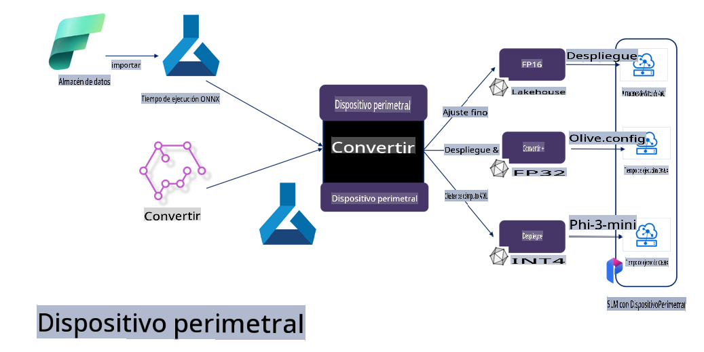

# **Ajuste fino de Phi-3 con Microsoft Olive**

[Olive](https://github.com/microsoft/OLive?WT.mc_id=aiml-138114-kinfeylo) es una herramienta de optimización de modelos consciente del hardware, fácil de usar, que reúne técnicas líderes en la industria para compresión, optimización y compilación de modelos.

Está diseñada para simplificar el proceso de optimización de modelos de aprendizaje automático, asegurando que aprovechen al máximo las arquitecturas de hardware específicas.

Ya sea que estés trabajando en aplicaciones basadas en la nube o en dispositivos de borde, Olive te permite optimizar tus modelos de manera sencilla y efectiva.

## Características clave:
- Olive agrupa y automatiza técnicas de optimización para objetivos de hardware específicos.
- No existe una técnica de optimización única para todos los escenarios, por lo que Olive permite extensibilidad al permitir que expertos de la industria integren sus innovaciones de optimización.

## Reduce el esfuerzo de ingeniería:
- Los desarrolladores a menudo necesitan aprender y utilizar múltiples cadenas de herramientas específicas de proveedores de hardware para preparar y optimizar modelos entrenados para su implementación.
- Olive simplifica esta experiencia al automatizar las técnicas de optimización para el hardware deseado.

## Solución lista para usar de optimización de extremo a extremo:

Componiendo y ajustando técnicas integradas, Olive ofrece una solución unificada para la optimización de extremo a extremo. Tiene en cuenta restricciones como precisión y latencia mientras optimiza los modelos.

## Uso de Microsoft Olive para ajuste fino

Microsoft Olive es una herramienta de optimización de modelos de código abierto, muy fácil de usar, que puede cubrir tanto el ajuste fino como la referencia en el campo de la inteligencia artificial generativa. Solo requiere una configuración simple, combinada con el uso de pequeños modelos de lenguaje de código abierto y entornos de ejecución relacionados (AzureML / GPU local, CPU, DirectML), para que puedas completar el ajuste fino o la referencia del modelo mediante la optimización automática y encontrar el mejor modelo para desplegar en la nube o en dispositivos de borde. Esto permite a las empresas construir sus propios modelos verticales de industria en las instalaciones y en la nube.


## Ajuste fino de Phi-3 con Microsoft Olive 



## Código de ejemplo y muestra de Phi-3 Olive
En este ejemplo, usarás Olive para:

- Ajustar fino un adaptador LoRA para clasificar frases en Tristeza, Alegría, Miedo y Sorpresa.
- Combinar los pesos del adaptador con el modelo base.
- Optimizar y cuantizar el modelo a int4.

[Código de ejemplo](../../code/03.Finetuning/olive-ort-example/README.md)

### Configuración de Microsoft Olive

La instalación de Microsoft Olive es muy sencilla y puede realizarse para CPU, GPU, DirectML y Azure ML.

```bash
pip install olive-ai
```

Si deseas ejecutar un modelo ONNX con una CPU, puedes usar

```bash
pip install olive-ai[cpu]
```

Si deseas ejecutar un modelo ONNX con una GPU, puedes usar

```python
pip install olive-ai[gpu]
```

Si deseas usar Azure ML, utiliza

```python
pip install git+https://github.com/microsoft/Olive#egg=olive-ai[azureml]
```

**Nota**
Requisitos del sistema operativo: Ubuntu 20.04 / 22.04 

### **Config.json de Microsoft Olive**

Después de la instalación, puedes configurar diferentes ajustes específicos del modelo a través del archivo Config, incluyendo datos, computación, entrenamiento, implementación y generación de modelos.

**1. Datos**

En Microsoft Olive, se admite el entrenamiento con datos locales y datos en la nube, y esto puede configurarse en los ajustes.

*Ajustes de datos locales*

Puedes configurar fácilmente el conjunto de datos que necesita entrenarse para el ajuste fino, generalmente en formato json, y adaptarlo con la plantilla de datos. Esto debe ajustarse según los requisitos del modelo (por ejemplo, adaptarlo al formato requerido por Microsoft Phi-3-mini. Si tienes otros modelos, consulta los formatos de ajuste fino requeridos por esos modelos).

```json

    "data_configs": [
        {
            "name": "dataset_default_train",
            "type": "HuggingfaceContainer",
            "load_dataset_config": {
                "params": {
                    "data_name": "json", 
                    "data_files":"dataset/dataset-classification.json",
                    "split": "train"
                }
            },
            "pre_process_data_config": {
                "params": {
                    "dataset_type": "corpus",
                    "text_cols": [
                            "phrase",
                            "tone"
                    ],
                    "text_template": "### Text: {phrase}\n### The tone is:\n{tone}",
                    "corpus_strategy": "join",
                    "source_max_len": 2048,
                    "pad_to_max_len": false,
                    "use_attention_mask": false
                }
            }
        }
    ],
```

**Ajustes de fuente de datos en la nube**

Al vincular el almacén de datos de Azure AI Studio/Azure Machine Learning Service, puedes introducir diferentes fuentes de datos a Azure AI Studio/Azure Machine Learning Service a través de Microsoft Fabric y Azure Data como soporte para el ajuste fino de los datos.

```json

    "data_configs": [
        {
            "name": "dataset_default_train",
            "type": "HuggingfaceContainer",
            "load_dataset_config": {
                "params": {
                    "data_name": "json", 
                    "data_files": {
                        "type": "azureml_datastore",
                        "config": {
                            "azureml_client": {
                                "subscription_id": "Your Azure Subscrition ID",
                                "resource_group": "Your Azure Resource Group",
                                "workspace_name": "Your Azure ML Workspaces name"
                            },
                            "datastore_name": "workspaceblobstore",
                            "relative_path": "Your train_data.json Azure ML Location"
                        }
                    },
                    "split": "train"
                }
            },
            "pre_process_data_config": {
                "params": {
                    "dataset_type": "corpus",
                    "text_cols": [
                            "Question",
                            "Best Answer"
                    ],
                    "text_template": "<|user|>\n{Question}<|end|>\n<|assistant|>\n{Best Answer}\n<|end|>",
                    "corpus_strategy": "join",
                    "source_max_len": 2048,
                    "pad_to_max_len": false,
                    "use_attention_mask": false
                }
            }
        }
    ],
    
```

**2. Configuración de computación**

Si necesitas trabajar localmente, puedes usar directamente recursos de datos locales. Si necesitas usar los recursos de Azure AI Studio / Azure Machine Learning Service, debes configurar los parámetros relevantes de Azure, el nombre de la capacidad de cómputo, etc.

```json

    "systems": {
        "aml": {
            "type": "AzureML",
            "config": {
                "accelerators": ["gpu"],
                "hf_token": true,
                "aml_compute": "Your Azure AI Studio / Azure Machine Learning Service Compute Name",
                "aml_docker_config": {
                    "base_image": "Your Azure AI Studio / Azure Machine Learning Service docker",
                    "conda_file_path": "conda.yaml"
                }
            }
        },
        "azure_arc": {
            "type": "AzureML",
            "config": {
                "accelerators": ["gpu"],
                "aml_compute": "Your Azure AI Studio / Azure Machine Learning Service Compute Name",
                "aml_docker_config": {
                    "base_image": "Your Azure AI Studio / Azure Machine Learning Service docker",
                    "conda_file_path": "conda.yaml"
                }
            }
        }
    },
```

***Nota***

Como se ejecuta a través de un contenedor en Azure AI Studio/Azure Machine Learning Service, es necesario configurar el entorno requerido. Esto se configura en el archivo conda.yaml del entorno.

```yaml

name: project_environment
channels:
  - defaults
dependencies:
  - python=3.8.13
  - pip=22.3.1
  - pip:
      - einops
      - accelerate
      - azure-keyvault-secrets
      - azure-identity
      - bitsandbytes
      - datasets
      - huggingface_hub
      - peft
      - scipy
      - sentencepiece
      - torch>=2.2.0
      - transformers
      - git+https://github.com/microsoft/Olive@jiapli/mlflow_loading_fix#egg=olive-ai[gpu]
      - --extra-index-url https://aiinfra.pkgs.visualstudio.com/PublicPackages/_packaging/ORT-Nightly/pypi/simple/ 
      - ort-nightly-gpu==1.18.0.dev20240307004
      - --extra-index-url https://aiinfra.pkgs.visualstudio.com/PublicPackages/_packaging/onnxruntime-genai/pypi/simple/
      - onnxruntime-genai-cuda

    

```

**3. Elige tu SLM**

Puedes usar el modelo directamente desde Hugging Face o combinarlo con el Catálogo de Modelos de Azure AI Studio / Azure Machine Learning para seleccionar el modelo a usar. En el ejemplo de código a continuación, usaremos Microsoft Phi-3-mini como ejemplo.

Si tienes el modelo localmente, puedes usar este método

```json

    "input_model":{
        "type": "PyTorchModel",
        "config": {
            "hf_config": {
                "model_name": "model-cache/microsoft/phi-3-mini",
                "task": "text-generation",
                "model_loading_args": {
                    "trust_remote_code": true
                }
            }
        }
    },
```

Si deseas usar un modelo desde Azure AI Studio / Azure Machine Learning Service, puedes usar este método

```json

    "input_model":{
        "type": "PyTorchModel",
        "config": {
            "model_path": {
                "type": "azureml_registry_model",
                "config": {
                    "name": "microsoft/Phi-3-mini-4k-instruct",
                    "registry_name": "azureml-msr",
                    "version": "11"
                }
            },
             "model_file_format": "PyTorch.MLflow",
             "hf_config": {
                "model_name": "microsoft/Phi-3-mini-4k-instruct",
                "task": "text-generation",
                "from_pretrained_args": {
                    "trust_remote_code": true
                }
            }
        }
    },
```

**Nota:**
Necesitamos integrarnos con Azure AI Studio / Azure Machine Learning Service, así que al configurar el modelo, consulta el número de versión y el nombre correspondiente.

Todos los modelos en Azure deben configurarse como PyTorch.MLflow.

Necesitas tener una cuenta de Hugging Face y vincular la clave al valor Key de Azure AI Studio / Azure Machine Learning.

**4. Algoritmo**

Microsoft Olive encapsula muy bien los algoritmos de ajuste fino Lora y QLora. Solo necesitas configurar algunos parámetros relevantes. Aquí tomo QLora como ejemplo.

```json
        "lora": {
            "type": "LoRA",
            "config": {
                "target_modules": [
                    "o_proj",
                    "qkv_proj"
                ],
                "double_quant": true,
                "lora_r": 64,
                "lora_alpha": 64,
                "lora_dropout": 0.1,
                "train_data_config": "dataset_default_train",
                "eval_dataset_size": 0.3,
                "training_args": {
                    "seed": 0,
                    "data_seed": 42,
                    "per_device_train_batch_size": 1,
                    "per_device_eval_batch_size": 1,
                    "gradient_accumulation_steps": 4,
                    "gradient_checkpointing": false,
                    "learning_rate": 0.0001,
                    "num_train_epochs": 3,
                    "max_steps": 10,
                    "logging_steps": 10,
                    "evaluation_strategy": "steps",
                    "eval_steps": 187,
                    "group_by_length": true,
                    "adam_beta2": 0.999,
                    "max_grad_norm": 0.3
                }
            }
        },
```

Si deseas realizar la conversión de cuantización, la rama principal de Microsoft Olive ya admite el método onnxruntime-genai. Puedes configurarlo según tus necesidades:

1. Combinar los pesos del adaptador con el modelo base.
2. Convertir el modelo a un modelo ONNX con la precisión requerida mediante ModelBuilder.

Por ejemplo, convertir a INT4 cuantizado.

```json

        "merge_adapter_weights": {
            "type": "MergeAdapterWeights"
        },
        "builder": {
            "type": "ModelBuilder",
            "config": {
                "precision": "int4"
            }
        }
```

**Nota** 
- Si usas QLoRA, la conversión de cuantización con ONNXRuntime-genai no está soportada por el momento.

- Cabe señalar que puedes configurar los pasos anteriores según tus propias necesidades. No es necesario configurar completamente todos los pasos mencionados. Dependiendo de tus necesidades, puedes usar directamente los pasos del algoritmo sin ajuste fino. Finalmente, necesitas configurar los motores relevantes.

```json

    "engine": {
        "log_severity_level": 0,
        "host": "aml",
        "target": "aml",
        "search_strategy": false,
        "execution_providers": ["CUDAExecutionProvider"],
        "cache_dir": "../model-cache/models/phi3-finetuned/cache",
        "output_dir" : "../model-cache/models/phi3-finetuned"
    }
```

**5. Ajuste fino finalizado**

En la línea de comandos, ejecuta en el directorio de olive-config.json

```bash
olive run --config olive-config.json  
```

**Descargo de responsabilidad**:  
Este documento ha sido traducido utilizando servicios de traducción automática basados en inteligencia artificial. Si bien nos esforzamos por garantizar la precisión, tenga en cuenta que las traducciones automatizadas pueden contener errores o inexactitudes. El documento original en su idioma nativo debe considerarse como la fuente autorizada. Para información crítica, se recomienda una traducción profesional realizada por humanos. No nos hacemos responsables de malentendidos o interpretaciones erróneas que puedan surgir del uso de esta traducción.