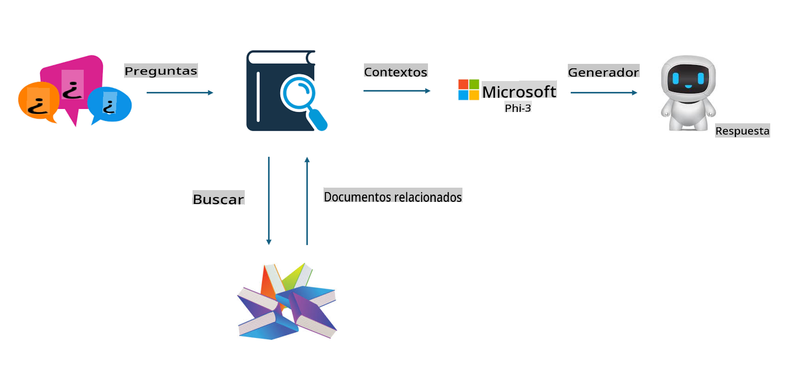
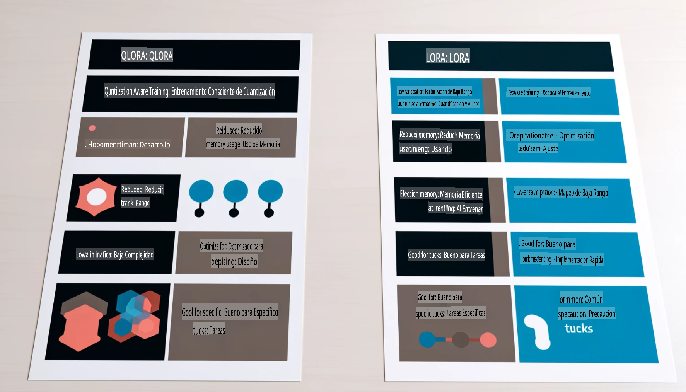

# **Deja que Phi-3 se convierta en un experto de la industria**

Para integrar el modelo Phi-3 en una industria, necesitas añadir datos empresariales específicos al modelo Phi-3. Tenemos dos opciones diferentes: la primera es RAG (Generación Aumentada por Recuperación) y la segunda es Fine Tuning (Ajuste Fino).

## **RAG vs Fine-Tuning**

### **Generación Aumentada por Recuperación (RAG)**

RAG combina la recuperación de datos con la generación de texto. Los datos estructurados y no estructurados de la empresa se almacenan en una base de datos vectorial. Al buscar contenido relevante, se encuentra un resumen y contenido relacionado para formar un contexto, y se combina con la capacidad de completar texto de LLM/SLM para generar contenido.

### **Fine-tuning (Ajuste Fino)**

El Fine-tuning se basa en la mejora de un modelo existente. No es necesario comenzar desde el algoritmo del modelo, pero se necesita acumular datos de manera continua. Si deseas una terminología más precisa y una expresión lingüística específica para aplicaciones industriales, el Fine-tuning es tu mejor opción. Sin embargo, si los datos cambian con frecuencia, el Fine-tuning puede volverse complicado.

### **Cómo elegir**

1. Si nuestra respuesta requiere la incorporación de datos externos, RAG es la mejor opción.

2. Si necesitas producir conocimientos de la industria estables y precisos, el Fine-tuning será una buena elección. RAG prioriza extraer contenido relevante, pero puede no captar siempre las sutilezas especializadas.

3. El Fine-tuning requiere un conjunto de datos de alta calidad, y si solo se trata de un pequeño rango de datos, no hará mucha diferencia. RAG es más flexible.

4. El Fine-tuning es una "caja negra", una especie de metafísica, y es difícil entender su mecanismo interno. Pero RAG facilita encontrar la fuente de los datos, ajustando eficazmente errores o alucinaciones de contenido y ofreciendo mayor transparencia.

### **Escenarios**

1. Las industrias verticales que requieren vocabulario y expresiones profesionales específicas, ***Fine-tuning*** será la mejor elección.

2. Sistemas de preguntas y respuestas (QA), que implican la síntesis de diferentes puntos de conocimiento, ***RAG*** será la mejor opción.

3. La combinación de flujos de negocio automatizados ***RAG + Fine-tuning*** es la mejor opción.

## **Cómo usar RAG**

Una base de datos vectorial es una colección de datos almacenados en forma matemática. Las bases de datos vectoriales facilitan que los modelos de aprendizaje automático recuerden entradas previas, permitiendo que se usen en casos como búsqueda, recomendaciones y generación de texto. Los datos pueden identificarse en base a métricas de similitud en lugar de coincidencias exactas, permitiendo que los modelos computacionales entiendan el contexto de los datos.

La base de datos vectorial es clave para implementar RAG. Podemos convertir datos en almacenamiento vectorial mediante modelos vectoriales como text-embedding-3, jina-ai-embedding, etc.

Más información sobre cómo crear una aplicación RAG [https://github.com/microsoft/Phi-3CookBook](https://github.com/microsoft/Phi-3CookBook?WT.mc_id=aiml-138114-kinfeylo)

## **Cómo usar Fine-tuning**

Los algoritmos más comunes en Fine-tuning son Lora y QLora. ¿Cómo elegir?
- [Aprende más con este cuaderno de ejemplo](../../../../code/04.Finetuning/Phi_3_Inference_Finetuning.ipynb)
- [Ejemplo de script de Fine-tuning en Python](../../../../code/04.Finetuning/FineTrainingScript.py)

### **Lora y QLora**

LoRA (Low-Rank Adaptation) y QLoRA (Quantized Low-Rank Adaptation) son técnicas utilizadas para ajustar grandes modelos de lenguaje (LLMs) mediante Fine Tuning Eficiente en Parámetros (PEFT). Las técnicas PEFT están diseñadas para entrenar modelos de manera más eficiente que los métodos tradicionales.  
LoRA es una técnica independiente de ajuste fino que reduce el uso de memoria aplicando una aproximación de bajo rango a la matriz de actualización de pesos. Ofrece tiempos de entrenamiento rápidos y mantiene un rendimiento cercano a los métodos de ajuste fino tradicionales.

QLoRA es una versión extendida de LoRA que incorpora técnicas de cuantización para reducir aún más el uso de memoria. QLoRA cuantiza la precisión de los parámetros de peso en el LLM preentrenado a una precisión de 4 bits, lo que es más eficiente en memoria que LoRA. Sin embargo, el entrenamiento con QLoRA es aproximadamente un 30% más lento que con LoRA debido a los pasos adicionales de cuantización y descuantización.

QLoRA utiliza LoRA como un accesorio para corregir los errores introducidos durante la cuantización. QLoRA permite ajustar modelos masivos con miles de millones de parámetros en GPUs relativamente pequeñas y ampliamente disponibles. Por ejemplo, QLoRA puede ajustar un modelo de 70 mil millones de parámetros que normalmente requeriría 36 GPUs con solo 2.

**Descargo de responsabilidad**:  
Este documento ha sido traducido utilizando servicios de traducción basados en inteligencia artificial. Si bien nos esforzamos por lograr precisión, tenga en cuenta que las traducciones automáticas pueden contener errores o imprecisiones. El documento original en su idioma nativo debe considerarse la fuente autorizada. Para información crítica, se recomienda una traducción profesional realizada por humanos. No nos hacemos responsables de malentendidos o interpretaciones erróneas que surjan del uso de esta traducción.