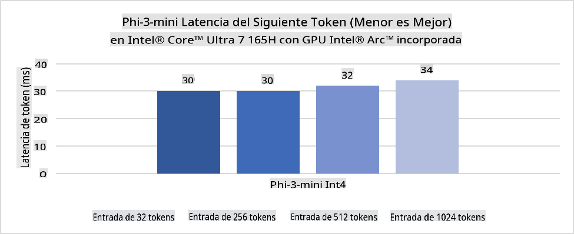
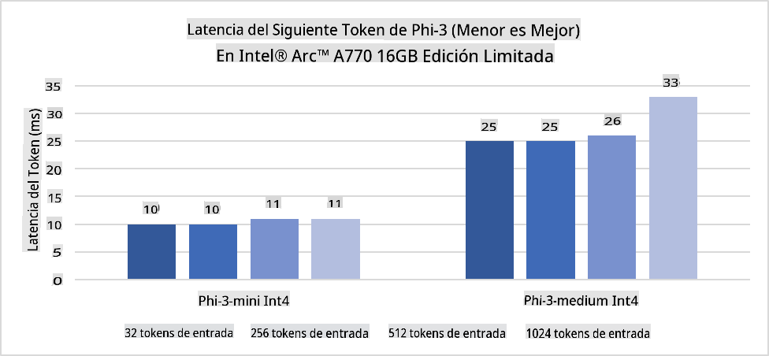
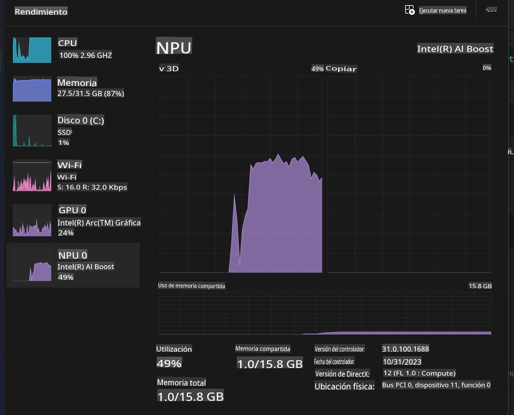
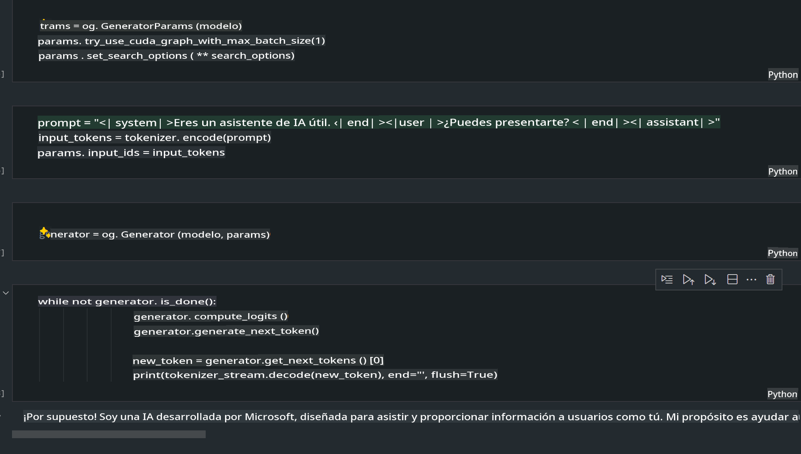
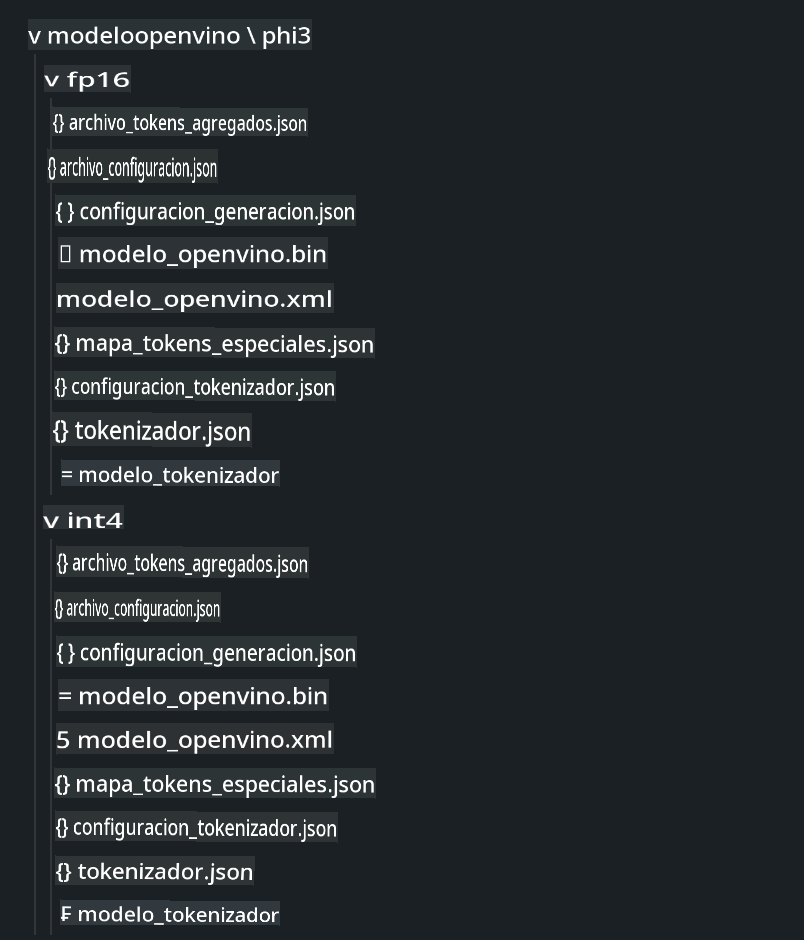
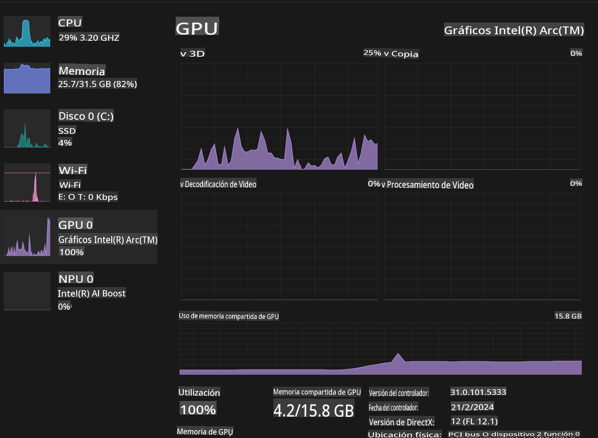

# **Inferencia de Phi-3 en AI PC**

Con el avance de la IA generativa y la mejora en las capacidades de hardware de los dispositivos de borde, un número creciente de modelos de IA generativa ahora puede integrarse en los dispositivos BYOD (Bring Your Own Device) de los usuarios. Las AI PCs están entre estos modelos. A partir de 2024, Intel, AMD y Qualcomm han colaborado con fabricantes de PC para introducir AI PCs que faciliten el despliegue de modelos de IA generativa localizados a través de modificaciones de hardware. En esta discusión, nos enfocaremos en las AI PCs de Intel y exploraremos cómo desplegar Phi-3 en una AI PC de Intel.

### **¿Qué es NPU?**

Una NPU (Unidad de Procesamiento Neural) es un procesador o unidad de procesamiento dedicada en un SoC más grande, diseñada específicamente para acelerar operaciones de redes neuronales y tareas de IA. A diferencia de las CPUs y GPUs de propósito general, las NPUs están optimizadas para una computación paralela impulsada por datos, lo que las hace altamente eficientes en el procesamiento de datos multimedia masivos como videos e imágenes y en el procesamiento de datos para redes neuronales. Son especialmente hábiles en manejar tareas relacionadas con IA, como el reconocimiento de voz, el desenfoque de fondo en videollamadas y los procesos de edición de fotos o videos como la detección de objetos.

## **NPU vs GPU**
Aunque muchas cargas de trabajo de IA y aprendizaje automático se ejecutan en GPUs, hay una distinción crucial entre GPUs y NPUs.
Las GPUs son conocidas por sus capacidades de computación paralela, pero no todas las GPUs son igualmente eficientes más allá del procesamiento de gráficos. Las NPUs, por otro lado, están diseñadas específicamente para los cálculos complejos involucrados en las operaciones de redes neuronales, lo que las hace altamente efectivas para tareas de IA.

En resumen, las NPUs son los genios matemáticos que aceleran los cálculos de IA y juegan un papel clave en la emergente era de las AI PCs.

***Este ejemplo se basa en el último procesador Intel Core Ultra de Intel***

## **1. Usar NPU para ejecutar el modelo Phi-3**

El dispositivo Intel® NPU es un acelerador de inferencia de IA integrado con las CPUs de cliente de Intel, comenzando desde la generación de CPUs Intel® Core™ Ultra (anteriormente conocida como Meteor Lake). Permite la ejecución eficiente en términos de energía de tareas de redes neuronales artificiales.





**Biblioteca de Aceleración Intel NPU**

La Biblioteca de Aceleración Intel NPU [https://github.com/intel/intel-npu-acceleration-library](https://github.com/intel/intel-npu-acceleration-library) es una biblioteca de Python diseñada para aumentar la eficiencia de tus aplicaciones aprovechando el poder de la Unidad de Procesamiento Neural (NPU) de Intel para realizar cálculos de alta velocidad en hardware compatible.

Ejemplo de Phi-3-mini en AI PC impulsado por procesadores Intel® Core™ Ultra.


Instalar la biblioteca de Python con pip

```bash

   pip install intel-npu-acceleration-library

```

***Note*** El proyecto aún está en desarrollo, pero el modelo de referencia ya es muy completo.

### **Ejecutando Phi-3 con la Biblioteca de Aceleración Intel NPU**

Usando la aceleración de Intel NPU, esta biblioteca no afecta el proceso de codificación tradicional. Solo necesitas usar esta biblioteca para cuantizar el modelo original Phi-3, como FP16, INT8, INT4, como

```python

from transformers import AutoTokenizer, pipeline, TextStreamer
import intel_npu_acceleration_library as npu_lib
import warnings

model_id = "microsoft/Phi-3-mini-4k-instruct"

model = npu_lib.NPUModelForCausalLM.from_pretrained(
                                    model_id,
                                    torch_dtype="auto",
                                    dtype=npu_lib.int4,
                                    trust_remote_code=True
                                )

tokenizer = AutoTokenizer.from_pretrained(model_id)

text_streamer = TextStreamer(tokenizer, skip_prompt=True)

```
Después de que la cuantificación sea exitosa, continúa la ejecución para llamar a la NPU y ejecutar el modelo Phi-3.

```python

generation_args = {
            "max_new_tokens": 1024,
            "return_full_text": False,
            "temperature": 0.3,
            "do_sample": False,
            "streamer": text_streamer,
        }

pipe = pipeline(
            "text-generation",
            model=model,
            tokenizer=tokenizer,
)

query = "<|system|>You are a helpful AI assistant.<|end|><|user|>Can you introduce yourself?<|end|><|assistant|>"

with warnings.catch_warnings():
    warnings.simplefilter("ignore")
    pipe(query, **generation_args)

```

Al ejecutar el código, podemos ver el estado de ejecución de la NPU a través del Administrador de Tareas.



***Samples*** : [AIPC_NPU_DEMO.ipynb](../../code/03.Inference/AIPC/AIPC_NPU_DEMO.ipynb)

## **2. Usar DirectML + ONNX Runtime para ejecutar el modelo Phi-3**

### **¿Qué es DirectML?**

[DirectML](https://github.com/microsoft/DirectML) es una biblioteca de DirectX 12 de alto rendimiento y acelerada por hardware para el aprendizaje automático. DirectML proporciona aceleración de GPU para tareas comunes de aprendizaje automático en una amplia gama de hardware y controladores compatibles, incluyendo todas las GPUs compatibles con DirectX 12 de proveedores como AMD, Intel, NVIDIA y Qualcomm.

Cuando se usa de forma independiente, la API de DirectML es una biblioteca de DirectX 12 de bajo nivel y es adecuada para aplicaciones de alto rendimiento y baja latencia como frameworks, juegos y otras aplicaciones en tiempo real. La interoperabilidad perfecta de DirectML con Direct3D 12, así como su bajo overhead y conformidad en hardware, hace que DirectML sea ideal para acelerar el aprendizaje automático cuando se desea un alto rendimiento y es crítica la confiabilidad y predictibilidad de los resultados en hardware.

***Note*** : La última versión de DirectML ya soporta NPU (https://devblogs.microsoft.com/directx/introducing-neural-processor-unit-npu-support-in-directml-developer-preview/)

### DirectML y CUDA en términos de sus capacidades y rendimiento:

**DirectML** es una biblioteca de aprendizaje automático desarrollada por Microsoft. Está diseñada para acelerar cargas de trabajo de aprendizaje automático en dispositivos Windows, incluyendo desktops, laptops y dispositivos de borde.
- Basado en DX12: DirectML está construido sobre DirectX 12 (DX12), lo que proporciona un amplio rango de soporte de hardware en GPUs, incluyendo tanto NVIDIA como AMD.
- Soporte más amplio: Dado que aprovecha DX12, DirectML puede trabajar con cualquier GPU que soporte DX12, incluso GPUs integradas.
- Procesamiento de imágenes: DirectML procesa imágenes y otros datos usando redes neuronales, haciéndolo adecuado para tareas como reconocimiento de imágenes, detección de objetos y más.
- Facilidad de configuración: Configurar DirectML es sencillo y no requiere SDKs o bibliotecas específicas de los fabricantes de GPU.
- Rendimiento: En algunos casos, DirectML funciona bien y puede ser más rápido que CUDA, especialmente para ciertas cargas de trabajo.
- Limitaciones: Sin embargo, hay instancias donde DirectML puede ser más lento, particularmente para tamaños de lote grandes en float16.

**CUDA** es la plataforma de computación paralela y modelo de programación de NVIDIA. Permite a los desarrolladores aprovechar el poder de las GPUs de NVIDIA para la computación de propósito general, incluyendo el aprendizaje automático y las simulaciones científicas.
- Específico de NVIDIA: CUDA está estrechamente integrado con las GPUs de NVIDIA y está diseñado específicamente para ellas.
- Altamente optimizado: Proporciona un excelente rendimiento para tareas aceleradas por GPU, especialmente cuando se usan GPUs de NVIDIA.
- Ampliamente utilizado: Muchos frameworks y bibliotecas de aprendizaje automático (como TensorFlow y PyTorch) tienen soporte para CUDA.
- Personalización: Los desarrolladores pueden ajustar finamente las configuraciones de CUDA para tareas específicas, lo que puede llevar a un rendimiento óptimo.
- Limitaciones: Sin embargo, la dependencia de CUDA en el hardware de NVIDIA puede ser limitante si se desea una compatibilidad más amplia en diferentes GPUs.

### Elegir entre DirectML y CUDA:
La elección entre DirectML y CUDA depende de tu caso de uso específico, la disponibilidad de hardware y tus preferencias.
Si buscas una compatibilidad más amplia y facilidad de configuración, DirectML podría ser una buena elección. Sin embargo, si tienes GPUs de NVIDIA y necesitas un rendimiento altamente optimizado, CUDA sigue siendo una opción fuerte. En resumen, tanto DirectML como CUDA tienen sus fortalezas y debilidades, así que considera tus requisitos y el hardware disponible al tomar una decisión.

### **IA Generativa con ONNX Runtime**

En la era de la IA, la portabilidad de los modelos de IA es muy importante. ONNX Runtime puede desplegar fácilmente modelos entrenados en diferentes dispositivos. Los desarrolladores no necesitan prestar atención al framework de inferencia y pueden usar una API unificada para completar la inferencia del modelo. En la era de la IA generativa, ONNX Runtime también ha realizado optimizaciones de código (https://onnxruntime.ai/docs/genai/). A través del ONNX Runtime optimizado, el modelo de IA generativa cuantificado puede inferirse en diferentes terminales. En la IA generativa con ONNX Runtime, puedes inferir la API del modelo de IA a través de Python, C#, C/C++. Por supuesto, el despliegue en iPhone puede aprovechar la API de IA Generativa con ONNX Runtime de C++.

[Código de ejemplo](https://github.com/Azure-Samples/Phi-3MiniSamples/tree/main/onnx)

***compilar IA generativa con la biblioteca ONNX Runtime***

```bash

winget install --id=Kitware.CMake -e

git clone https://github.com/microsoft/onnxruntime.git

cd .\onnxruntime\

./build.bat --build_shared_lib --skip_tests --parallel --use_dml --config Release

cd ../

git clone https://github.com/microsoft/onnxruntime-genai.git

cd .\onnxruntime-genai\

mkdir ort

cd ort

mkdir include

mkdir lib

copy ..\onnxruntime\include\onnxruntime\core\providers\dml\dml_provider_factory.h ort\include

copy ..\onnxruntime\include\onnxruntime\core\session\onnxruntime_c_api.h ort\include

copy ..\onnxruntime\build\Windows\Release\Release\*.dll ort\lib

copy ..\onnxruntime\build\Windows\Release\Release\onnxruntime.lib ort\lib

python build.py --use_dml

```

**Instalar biblioteca**

```bash

pip install .\onnxruntime_genai_directml-0.3.0.dev0-cp310-cp310-win_amd64.whl

```

Este es el resultado de ejecución



***Samples*** : [AIPC_DirectML_DEMO.ipynb](../../code/03.Inference/AIPC/AIPC_DirectML_DEMO.ipynb)

## **3. Usar Intel OpenVino para ejecutar el modelo Phi-3**

### **¿Qué es OpenVINO?**

[OpenVINO](https://github.com/openvinotoolkit/openvino) es un toolkit de código abierto para optimizar y desplegar modelos de aprendizaje profundo. Proporciona un rendimiento mejorado de aprendizaje profundo para modelos de visión, audio y lenguaje de frameworks populares como TensorFlow, PyTorch y más. Comienza con OpenVINO. OpenVINO también puede usarse en combinación con CPU y GPU para ejecutar el modelo Phi3.

***Note***: Actualmente, OpenVINO no soporta NPU en este momento.

### **Instalar la Biblioteca OpenVINO**

```bash

 pip install git+https://github.com/huggingface/optimum-intel.git

 pip install git+https://github.com/openvinotoolkit/nncf.git

 pip install openvino-nightly

```

### **Ejecutando Phi-3 con OpenVINO**

Al igual que NPU, OpenVINO completa la llamada de modelos de IA generativa ejecutando modelos cuantificados. Necesitamos cuantizar primero el modelo Phi-3 y completar la cuantización del modelo en la línea de comandos a través de optimum-cli.

**INT4**

```bash

optimum-cli export openvino --model "microsoft/Phi-3-mini-4k-instruct" --task text-generation-with-past --weight-format int4 --group-size 128 --ratio 0.6  --sym  --trust-remote-code ./openvinomodel/phi3/int4

```

**FP16**

```bash

optimum-cli export openvino --model "microsoft/Phi-3-mini-4k-instruct" --task text-generation-with-past --weight-format fp16 --trust-remote-code ./openvinomodel/phi3/fp16

```

el formato convertido, como este



Carga rutas de modelo (model_dir), configuraciones relacionadas (ov_config = {"PERFORMANCE_HINT": "LATENCY", "NUM_STREAMS": "1", "CACHE_DIR": ""}) y dispositivos acelerados por hardware (GPU.0) a través de OVModelForCausalLM

```python

ov_model = OVModelForCausalLM.from_pretrained(
     model_dir,
     device='GPU.0',
     ov_config=ov_config,
     config=AutoConfig.from_pretrained(model_dir, trust_remote_code=True),
     trust_remote_code=True,
)

```

Al ejecutar el código, podemos ver el estado de ejecución de la GPU a través del Administrador de Tareas.



***Samples*** : [AIPC_OpenVino_Demo.ipynb](../../code/03.Inference/AIPC/AIPC_OpenVino_Demo.ipynb)

### ***Note*** : Los tres métodos anteriores tienen sus propias ventajas, pero se recomienda usar la aceleración NPU para la inferencia en AI PC.

Aviso legal: La traducción fue realizada a partir del original por un modelo de IA y puede no ser perfecta. Por favor, revise el resultado y haga las correcciones necesarias.