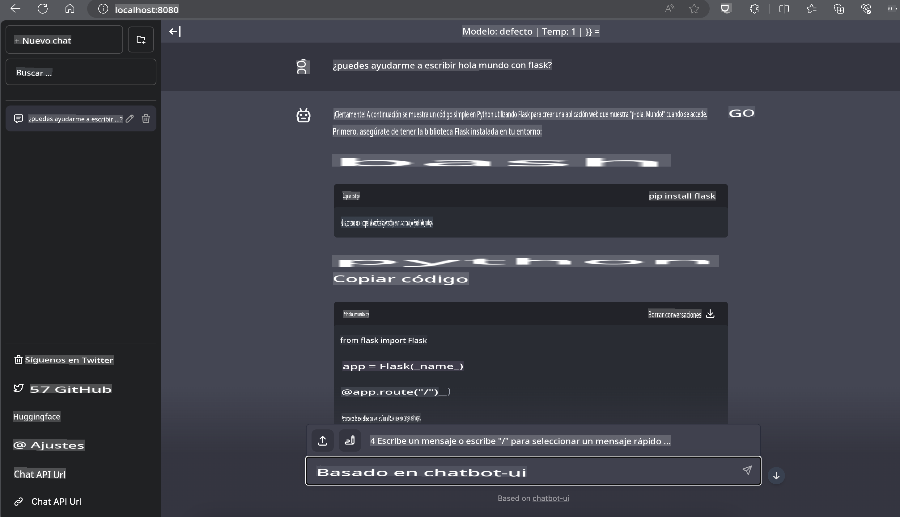

# **Inferencia Phi-3 en Nvidia Jetson**

Nvidia Jetson es una serie de placas de computación embebida de Nvidia. Los modelos Jetson TK1, TX1 y TX2 llevan un procesador Tegra (o SoC) de Nvidia que integra una unidad central de procesamiento (CPU) de arquitectura ARM. Jetson es un sistema de bajo consumo y está diseñado para acelerar aplicaciones de aprendizaje automático. Nvidia Jetson es utilizado por desarrolladores profesionales para crear productos innovadores de IA en todas las industrias, y por estudiantes y entusiastas para el aprendizaje práctico de IA y la creación de proyectos asombrosos. SLM se despliega en dispositivos de borde como Jetson, lo que permitirá una mejor implementación de escenarios de aplicación de IA generativa industrial.

## Despliegue en NVIDIA Jetson:
Los desarrolladores que trabajan en robótica autónoma y dispositivos embebidos pueden aprovechar Phi-3 Mini. El tamaño relativamente pequeño de Phi-3 lo hace ideal para el despliegue en el borde. Los parámetros han sido meticulosamente ajustados durante el entrenamiento, asegurando alta precisión en las respuestas.

### Optimización TensorRT-LLM:
La [biblioteca TensorRT-LLM de NVIDIA](https://github.com/NVIDIA/TensorRT-LLM?WT.mc_id=aiml-138114-kinfeylo) optimiza la inferencia de modelos de lenguaje grandes. Soporta la ventana de contexto largo de Phi-3 Mini, mejorando tanto el rendimiento como la latencia. Las optimizaciones incluyen técnicas como LongRoPE, FP8 y batching en vuelo.

### Disponibilidad y Despliegue:
Los desarrolladores pueden explorar Phi-3 Mini con la ventana de contexto de 128K en [NVIDIA's AI](https://www.nvidia.com/en-us/ai-data-science/generative-ai/). Está empaquetado como un NIM de NVIDIA, un microservicio con una API estándar que se puede desplegar en cualquier lugar. Además, las [implementaciones de TensorRT-LLM en GitHub](https://github.com/NVIDIA/TensorRT-LLM).

## **1. Preparación**

a. Jetson Orin NX / Jetson NX

b. JetPack 5.1.2+

c. Cuda 11.8

d. Python 3.8+

## **2. Ejecutando Phi-3 en Jetson**

Podemos elegir [Ollama](https://ollama.com) o [LlamaEdge](https://llamaedge.com)

Si quieres usar gguf en la nube y dispositivos de borde al mismo tiempo, LlamaEdge se puede entender como WasmEdge (WasmEdge es un runtime de WebAssembly ligero, de alto rendimiento y escalable, adecuado para aplicaciones nativas en la nube, de borde y descentralizadas. Soporta aplicaciones sin servidor, funciones embebidas, microservicios, contratos inteligentes y dispositivos IoT). Puedes desplegar el modelo cuantitativo de gguf en dispositivos de borde y en la nube a través de LlamaEdge.


Aquí están los pasos para usarlo

1. Instalar y descargar las bibliotecas y archivos relacionados

```bash

curl -sSf https://raw.githubusercontent.com/WasmEdge/WasmEdge/master/utils/install.sh | bash -s -- --plugin wasi_nn-ggml

curl -LO https://github.com/LlamaEdge/LlamaEdge/releases/latest/download/llama-api-server.wasm

curl -LO https://github.com/LlamaEdge/chatbot-ui/releases/latest/download/chatbot-ui.tar.gz

tar xzf chatbot-ui.tar.gz

```

**Nota**: llama-api-server.wasm y chatbot-ui deben estar en el mismo directorio

2. Ejecutar scripts en la terminal

```bash

wasmedge --dir .:. --nn-preload default:GGML:AUTO:{Your gguf path} llama-api-server.wasm -p phi-3-chat

```

Aquí está el resultado de la ejecución



***Código de ejemplo*** [Phi-3 mini WASM Notebook Sample](https://github.com/Azure-Samples/Phi-3MiniSamples/tree/main/wasm)

En resumen, Phi-3 Mini representa un avance en la modelización del lenguaje, combinando eficiencia, conciencia de contexto y la destreza en optimización de NVIDIA. Ya sea que estés construyendo robots o aplicaciones de borde, Phi-3 Mini es una herramienta poderosa a tener en cuenta.

Aviso legal: La traducción fue realizada a partir del original por un modelo de IA y puede no ser perfecta. 
Por favor, revise el resultado y haga las correcciones necesarias.