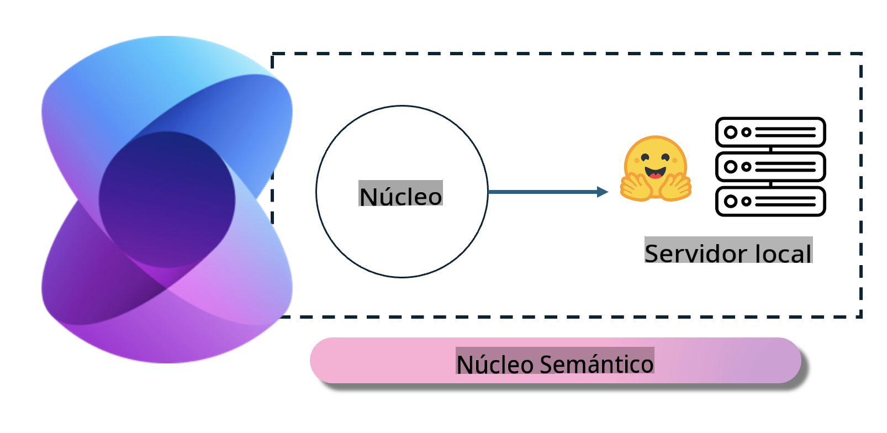
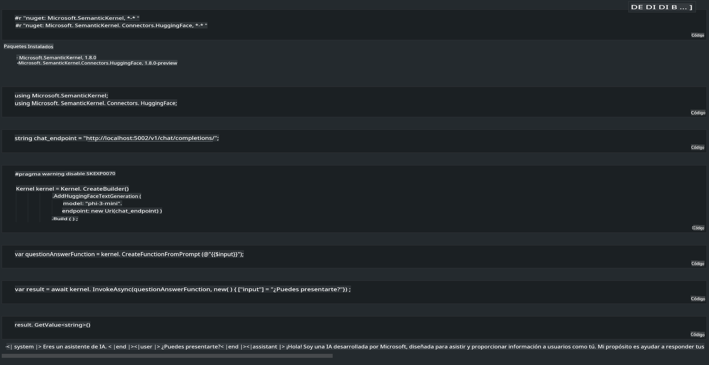

# **Inferencia Phi-3 en Servidor Local**

Podemos desplegar Phi-3 en un servidor local. Los usuarios pueden elegir las soluciones de [Ollama](https://ollama.com) o [LM Studio](https://llamaedge.com), o pueden escribir su propio código. Puedes conectar los servicios locales de Phi-3 a través de [Semantic Kernel](https://github.com/microsoft/semantic-kernel?WT.mc_id=aiml-138114-kinfeylo) o [Langchain](https://www.langchain.com/) para construir aplicaciones de Copilot.

## **Usar Semantic Kernel para acceder a Phi-3-mini**

En la aplicación Copilot, creamos aplicaciones a través de Semantic Kernel / LangChain. Este tipo de marco de aplicación es generalmente compatible con Azure OpenAI Service / OpenAI models, y también puede soportar modelos de código abierto en Hugging Face y modelos locales. ¿Qué debemos hacer si queremos usar Semantic Kernel para acceder a Phi-3-mini? Usando .NET como ejemplo, podemos combinarlo con el Hugging Face Connector en Semantic Kernel. Por defecto, puede corresponder al id del modelo en Hugging Face (la primera vez que lo uses, el modelo se descargará de Hugging Face, lo cual toma un tiempo considerable). También puedes conectarte al servicio local construido. Comparando ambos, recomendamos usar el último porque tiene un mayor grado de autonomía, especialmente en aplicaciones empresariales.

En la figura, accediendo a los servicios locales a través de Semantic Kernel se puede conectar fácilmente al servidor del modelo Phi-3-mini construido por uno mismo. Aquí está el resultado de la ejecución.

***Código de Ejemplo*** https://github.com/kinfey/Phi3MiniSamples/tree/main/semantickernel

Aviso legal: La traducción fue realizada a partir del original por un modelo de IA y puede no ser perfecta. 
Por favor, revise el resultado y haga las correcciones necesarias.