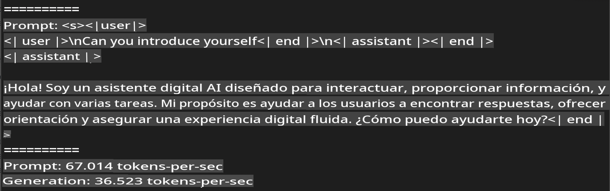
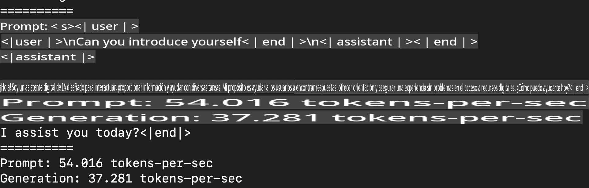

# **Inferencia Phi-3 con el Marco Apple MLX**

## **Qué es el Marco MLX**

MLX es un marco de arrays para la investigación en aprendizaje automático en dispositivos Apple silicon, desarrollado por el equipo de investigación en aprendizaje automático de Apple.

MLX está diseñado por investigadores en aprendizaje automático para investigadores en aprendizaje automático. El marco pretende ser fácil de usar, pero aún así eficiente para entrenar y desplegar modelos. El diseño del propio marco es también conceptualmente simple. Nuestro objetivo es facilitar a los investigadores la extensión y mejora de MLX con el fin de explorar rápidamente nuevas ideas.

Los LLMs pueden ser acelerados en dispositivos Apple Silicon a través de MLX, y los modelos pueden ejecutarse localmente de manera muy conveniente.

## **Usando MLX para inferencia de Phi-3-mini**

### **1. Configura tu entorno MLX**

1. Python 3.11.x
2. Instala la Biblioteca MLX

```bash
pip install mlx-lm
```

### **2. Ejecutando Phi-3-mini en Terminal con MLX**

```bash
python -m mlx_lm.generate --model microsoft/Phi-3-mini-4k-instruct --max-token 2048 --prompt  "<|user|>\nCan you introduce yourself<|end|>\n<|assistant|>"
```

El resultado (mi entorno es Apple M1 Max, 64GB) es



### **3. Cuantizando Phi-3-mini con MLX en Terminal**

```bash
python -m mlx_lm.convert --hf-path microsoft/Phi-3-mini-4k-instruct
```

***Nota:*** El modelo puede ser cuantizado a través de mlx_lm.convert, y la cuantización predeterminada es INT4. Este ejemplo cuantiza Phi-3-mini a INT4.

El modelo puede ser cuantizado a través de mlx_lm.convert, y la cuantización predeterminada es INT4. Este ejemplo es para cuantizar Phi-3-mini en INT4. Después de la cuantización, se almacenará en el directorio predeterminado ./mlx_model

Podemos probar el modelo cuantizado con MLX desde la terminal

```bash
python -m mlx_lm.generate --model ./mlx_model/ --max-token 2048 --prompt  "<|user|>\nCan you introduce yourself<|end|>\n<|assistant|>"
```

El resultado es



### **4. Ejecutando Phi-3-mini con MLX en Jupyter Notebook**


***Nota:*** Por favor, lee este ejemplo [click this link](../../code/03.Inference/MLX/MLX_DEMO.ipynb)

## **Recursos**

1. Aprende sobre el Marco Apple MLX [https://ml-explore.github.io](https://ml-explore.github.io/mlx/build/html/index.html)

2. Repositorio de Apple MLX en GitHub [https://github.com/ml-explore](https://github.com/ml-explore)

        Descargo de responsabilidad: La traducción fue realizada por un modelo de IA y puede no ser perfecta. 
        Por favor, revise el resultado y haga las correcciones necesarias.