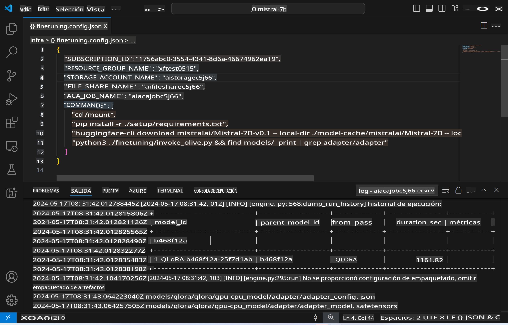
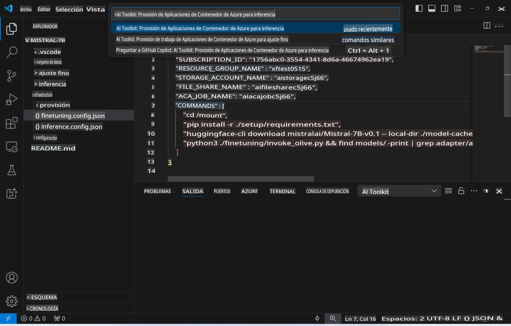
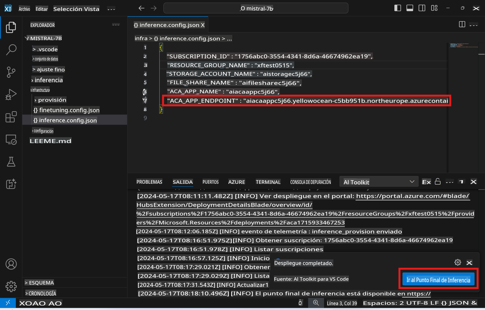

# Inferencia Remota con el modelo ajustado

Después de que los adaptadores sean entrenados en el entorno remoto, utiliza una simple aplicación de Gradio para interactuar con el modelo.



### Provisión de Recursos de Azure
Necesitas configurar los Recursos de Azure para la inferencia remota ejecutando `AI Toolkit: Provision Azure Container Apps for inference` desde el paleta de comandos. Durante esta configuración, se te pedirá que selecciones tu Suscripción de Azure y el grupo de recursos.  

   
Por defecto, la suscripción y el grupo de recursos para la inferencia deben coincidir con los utilizados para el ajuste fino. La inferencia utilizará el mismo Entorno de Aplicación de Contenedor de Azure y accederá al modelo y al adaptador de modelo almacenados en Azure Files, que fueron generados durante el paso de ajuste fino.

## Uso del AI Toolkit

### Despliegue para Inferencia  
Si deseas revisar el código de inferencia o recargar el modelo de inferencia, ejecuta el comando `AI Toolkit: Deploy for inference`. Esto sincronizará tu último código con ACA y reiniciará la réplica.


Después de la finalización exitosa del despliegue, el modelo está listo para ser evaluado utilizando este endpoint.

### Acceso a la API de Inferencia

Puedes acceder a la API de inferencia haciendo clic en el botón "*Go to Inference Endpoint*" que se muestra en la notificación de VSCode. Alternativamente, el endpoint de la API web se puede encontrar bajo `ACA_APP_ENDPOINT` en `./infra/inference.config.json` y en el panel de salida.



> **Note:** El endpoint de inferencia puede tardar unos minutos en estar completamente operativo.

## Componentes de Inferencia Incluidos en la Plantilla

| Carpeta | Contenido |
| ------ |--------- |
| `infra` | Contiene todas las configuraciones necesarias para operaciones remotas. |
| `infra/provision/inference.parameters.json` | Contiene parámetros para las plantillas bicep, utilizadas para la provisión de recursos de Azure para inferencia. |
| `infra/provision/inference.bicep` | Contiene plantillas para la provisión de recursos de Azure para inferencia. |
| `infra/inference.config.json` | El archivo de configuración, generado por el comando `AI Toolkit: Provision Azure Container Apps for inference`. Se usa como entrada para otros paletas de comandos remotos. |

### Uso del AI Toolkit para configurar la Provisión de Recursos de Azure
Configura el [AI Toolkit](https://marketplace.visualstudio.com/items?itemName=ms-windows-ai-studio.windows-ai-studio)

Comando `Provision Azure Container Apps for inference`.

Puedes encontrar los parámetros de configuración en el archivo `./infra/provision/inference.parameters.json`. Aquí están los detalles:
| Parámetro | Descripción |
| --------- |------------ |
| `defaultCommands` | Estos son los comandos para iniciar una API web. |
| `maximumInstanceCount` | Este parámetro establece la capacidad máxima de instancias de GPU. |
| `location` | Esta es la ubicación donde se provisionan los recursos de Azure. El valor predeterminado es el mismo que la ubicación del grupo de recursos elegido. |
| `storageAccountName`, `fileShareName` `acaEnvironmentName`, `acaEnvironmentStorageName`, `acaAppName`,  `acaLogAnalyticsName` | Estos parámetros se utilizan para nombrar los recursos de Azure para la provisión. Por defecto, serán los mismos que el nombre del recurso de ajuste fino. Puedes ingresar un nuevo nombre de recurso no utilizado para crear tus propios recursos con nombre personalizado, o puedes ingresar el nombre de un recurso de Azure ya existente si prefieres usar ese. Para más detalles, consulta la sección [Uso de Recursos de Azure Existentes](../../../../md/03.Inference). |

### Uso de Recursos de Azure Existentes

Por defecto, la provisión de inferencia utiliza el mismo Entorno de Aplicación de Contenedor de Azure, Cuenta de Almacenamiento, Azure File Share y Azure Log Analytics que se utilizaron para el ajuste fino. Se crea una Aplicación de Contenedor de Azure separada únicamente para la API de inferencia.

Si has personalizado los recursos de Azure durante el paso de ajuste fino o deseas usar tus propios recursos de Azure existentes para inferencia, especifica sus nombres en el archivo `./infra/inference.parameters.json`. Luego, ejecuta el comando `AI Toolkit: Provision Azure Container Apps for inference` desde el paleta de comandos. Esto actualizará cualquier recurso especificado y creará cualquier recurso que falte.

Por ejemplo, si tienes un entorno de contenedor de Azure existente, tu `./infra/finetuning.parameters.json` debería verse así:

```json
{
    "$schema": "https://schema.management.azure.com/schemas/2019-04-01/deploymentParameters.json#",
    "contentVersion": "1.0.0.0",
    "parameters": {
      ...
      "acaEnvironmentName": {
        "value": "<your-aca-env-name>"
      },
      "acaEnvironmentStorageName": {
        "value": null
      },
      ...
    }
  }
```

### Provisión Manual  
Si prefieres configurar manualmente los recursos de Azure, puedes utilizar los archivos bicep proporcionados en las carpetas `./infra/provision`. Si ya has configurado y configurado todos los recursos de Azure sin usar el paleta de comandos del AI Toolkit, simplemente ingresa los nombres de los recursos en el archivo `inference.config.json`.

Por ejemplo:

```json
{
  "SUBSCRIPTION_ID": "<your-subscription-id>",
  "RESOURCE_GROUP_NAME": "<your-resource-group-name>",
  "STORAGE_ACCOUNT_NAME": "<your-storage-account-name>",
  "FILE_SHARE_NAME": "<your-file-share-name>",
  "ACA_APP_NAME": "<your-aca-name>",
  "ACA_APP_ENDPOINT": "<your-aca-endpoint>"
}
```

Aviso legal: La traducción fue realizada a partir del original por un modelo de IA y puede no ser perfecta. Por favor, revise el resultado y haga las correcciones necesarias.