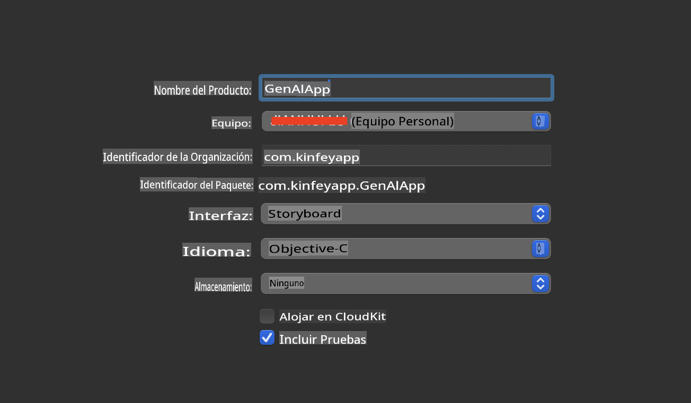
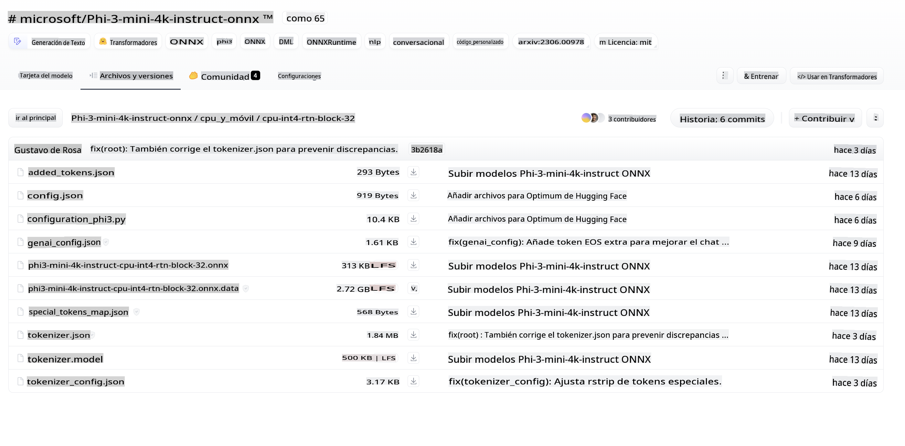
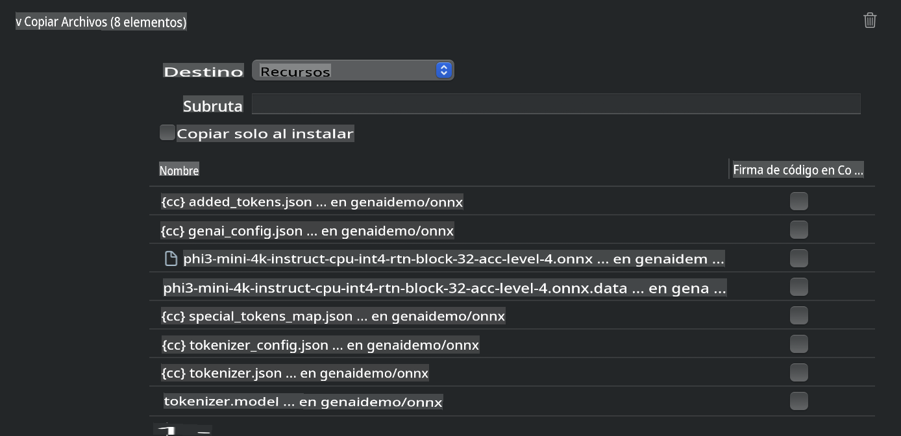
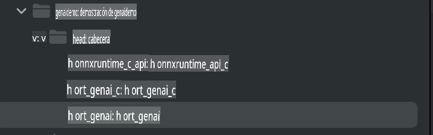
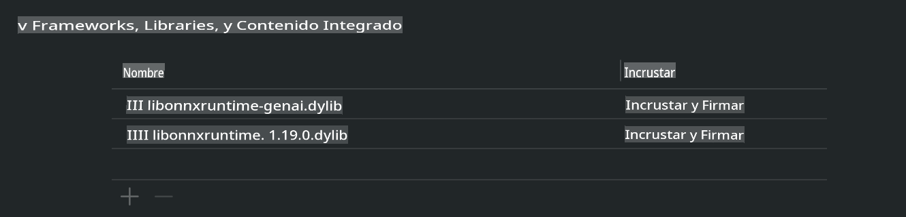
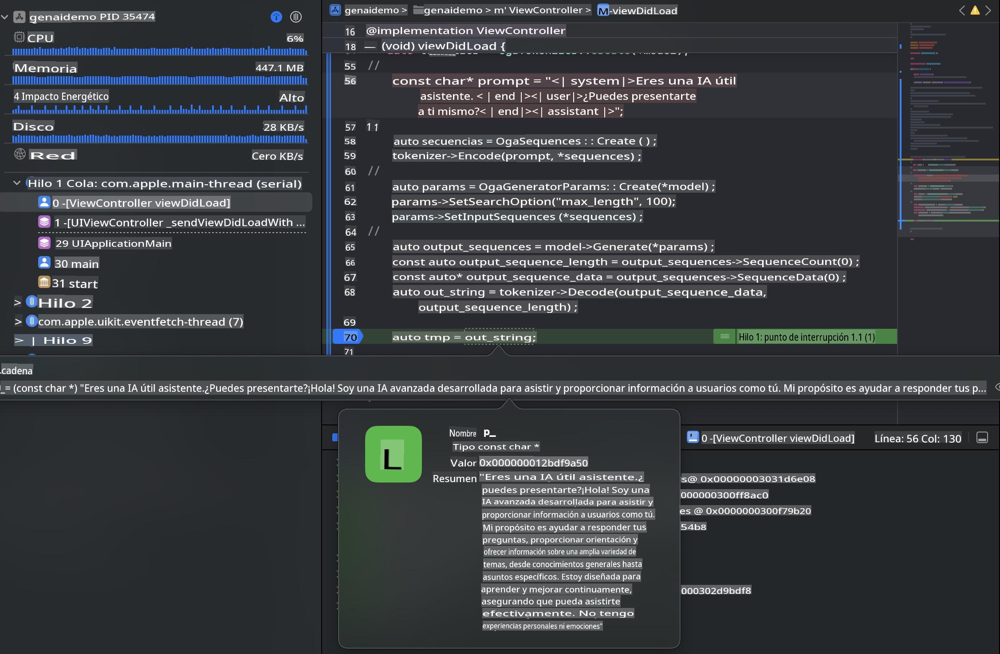

# **Inferencia de Phi-3 en iOS**

Phi-3-mini es una nueva serie de modelos de Microsoft que permite el despliegue de Modelos de Lenguaje de Gran Escala (LLMs) en dispositivos de borde y dispositivos IoT. Phi-3-mini está disponible en despliegues para iOS, Android y dispositivos de borde, lo que permite la implementación de IA generativa en BYOD. El siguiente ejemplo despliega Phi-3-mini basado en iOS.

## **1. Preparación**

a. macOS 14+

b. Xcode 15+

c. iOS SDK 17.x (iPhone 14 A16 o superior)

d. Instalar Python 3.10+ (se recomienda Conda)

e. Instalar la librería de Python - python-flatbuffers

f. Instalar CMake

### Semantic Kernel e Inferencia:
Semantic Kernel es un marco de aplicaciones que te permite crear aplicaciones compatibles con Azure OpenAI Service, modelos de OpenAI e incluso modelos locales. Acceder a servicios locales a través de Semantic Kernel te permite conectarte fácilmente a tu propio servidor de modelos Phi-3-mini.

### Llamando a Modelos Cuantizados con Ollama o LlamaEdge:
Muchos usuarios prefieren utilizar modelos cuantizados para ejecutar los modelos localmente. [Ollama](https://ollama.com) y [LlamaEdge](https://llamaedge.com) permiten a los usuarios individuales llamar a diferentes modelos cuantizados:

**Ollama**
Puedes ejecutar directamente ollama run phi3 o configurarlo sin conexión. Crea un archivo Modelfile con la ruta a tu archivo gguf. Código de ejemplo para ejecutar el modelo cuantizado Phi-3-mini:

```
FROM {Add your gguf file path}
TEMPLATE \"\"\"<|user|> {{.Prompt}}<|end|> <|assistant|>\"\"\"
PARAMETER stop <|end|>
PARAMETER num_ctx 4096
```

**LlamaEdge**
Si deseas usar gguf en la nube y en dispositivos de borde simultáneamente, LlamaEdge puede ser tu opción.

## **2. Compilando ONNX Runtime para iOS**

```bash

git clone https://github.com/microsoft/onnxruntime.git

cd onnxruntime

./build.sh --build_shared_lib --ios --skip_tests --parallel --build_dir ./build_ios --ios --apple_sysroot iphoneos --osx_arch arm64 --apple_deploy_target 17.5 --cmake_generator Xcode --config Release

cd ../

```

**Aviso**

a. Antes de compilar, debes asegurarte de que Xcode esté configurado correctamente y ajustarlo en el terminal.

```bash

sudo xcode-select -switch /Applications/Xcode.app/Contents/Developer 

```

b. ONNX Runtime necesita ser compilado en diferentes plataformas. Para iOS, puedes compilar en arm64 / x86_64.

c. Se recomienda utilizar directamente la última versión del SDK de iOS para la compilación. Por supuesto, también puedes bajar la versión para ser compatible con SDKs anteriores.


## **3. Compilando IA Generativa con ONNX Runtime para iOS**

**Nota**: Dado que la IA Generativa con ONNX Runtime está en vista previa, ten en cuenta los cambios.

```bash

git clone https://github.com/microsoft/onnxruntime-genai
 
cd onnxruntime-genai
 
mkdir ort
 
cd ort
 
mkdir include
 
mkdir lib
 
cd ../
 
cp ../onnxruntime/include/onnxruntime/core/session/onnxruntime_c_api.h ort/include
 
cp ../onnxruntime/build_ios/Release/Release-iphoneos/libonnxruntime*.dylib* ort/lib
 
export OPENCV_SKIP_XCODEBUILD_FORCE_TRYCOMPILE_DEBUG=1
 
python3 build.py --parallel --build_dir ./build_ios --ios --ios_sysroot iphoneos --ios_arch arm64 --ios_deployment_target 17.5 --cmake_generator Xcode --cmake_extra_defines CMAKE_XCODE_ATTRIBUTE_CODE_SIGNING_ALLOWED=NO

```

## **4. Crear una aplicación en Xcode**

Elegí Objective-C como el método de desarrollo de la aplicación, porque al usar IA Generativa con la API C++ de ONNX Runtime, Objective-C es mejor compatible. Por supuesto, también puedes completar llamadas relacionadas a través de Swift bridging.



## **5. Copiar el modelo INT4 cuantizado de ONNX al proyecto de la aplicación**

Necesitamos importar el modelo de cuantización INT4 en formato ONNX, que debe descargarse primero.



Después de descargarlo, necesitas agregarlo al directorio de Resources del proyecto en Xcode.



## **6. Agregar la API C++ en los ViewControllers**

***Aviso***:

  a. Agrega el archivo de encabezado C++ correspondiente al proyecto.

  

  b. Agrega `onnxruntime-gen ai dylib` en Xcode.

  

  c. Usa directamente el código en los ejemplos de C para probar en estos ejemplos. También puedes agregar más para ejecutar (como ChatUI).

  d. Como necesitas llamar a C++, cambia `ViewController.m` a `ViewController.mm`.

```objc

    NSString *llmPath = [[NSBundle mainBundle] resourcePath];
    char const *modelPath = llmPath.cString;

    auto model =  OgaModel::Create(modelPath);

    auto tokenizer = OgaTokenizer::Create(*model);

    const char* prompt = "<|system|>You are a helpful AI assistant.<|end|><|user|>Can you introduce yourself?<|end|><|assistant|>";

    auto sequences = OgaSequences::Create();
    tokenizer->Encode(prompt, *sequences);

    auto params = OgaGeneratorParams::Create(*model);
    params->SetSearchOption("max_length", 100);
    params->SetInputSequences(*sequences);

    auto output_sequences = model->Generate(*params);
    const auto output_sequence_length = output_sequences->SequenceCount(0);
    const auto* output_sequence_data = output_sequences->SequenceData(0);
    auto out_string = tokenizer->Decode(output_sequence_data, output_sequence_length);
    
    auto tmp = out_string;

```

## **7. Los resultados en ejecución**



**Código de Ejemplo:** [https://github.com/Azure-Samples/Phi-3MiniSamples/tree/main/ios](https://github.com/Azure-Samples/Phi-3MiniSamples/tree/main/ios)

Aviso legal: La traducción fue realizada a partir del original por un modelo de IA y puede no ser perfecta. Por favor, revise el resultado y haga las correcciones necesarias.
